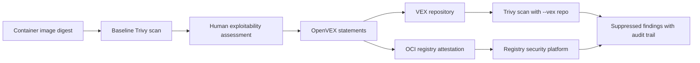

> VEX(OpenVEX)는 취약점 스캔 결과를 줄이는 도구가 아니다.  
> 운영 조직이 이 CVE를 왜 무시해도 되는지 기계가 읽을 수 있게 서명하고, 나중에 감사할 수 있게 남기는 방식이다.

Trivy로 컨테이너 이미지를 스캔하면 CVE 목록이 쏟아진다. 문제는 숫자 자체가 아니다. 실행 경로에 닿지 않는 취약점, 번들된 JAR 안에 있지만 배포 환경에서는 호출되지 않는 코드, 베이스 이미지 교체만으로 처리하기 어려운 라이브러리가 한 화면에 섞인다.

이 판단은 보통 스프레드시트, Jira 댓글, 보안 예외 문서에 남는다. 스캐너는 그 맥락을 읽지 못한다. CI는 계속 실패하고, 개발자는 같은 취약점을 반복해서 예외 처리한다.

VEX(Vulnerability Exploitability eXchange)는 이 지점을 겨냥한다. 취약점이 존재한다는 사실과, 그 취약점이 해당 제품에서 실제로 악용 가능한지에 대한 판단을 분리한다. OpenVEX는 이 판단을 JSON 문서로 만들고, Trivy 같은 스캐너가 그 문서를 읽어 결과를 억제하도록 한다.

## 취약점 스캐너 노이즈를 줄이는 순간, 거버넌스 문제가 시작된다

선정 글감의 데모는 단순하다. `pingidentity/pingaccess:8.3.4-edge` 이미지를 Trivy v0.71.0으로 스캔한다. 결과는 70건이다. 심각도는 CRITICAL 2건, HIGH 18건, MEDIUM 42건, LOW 8건이며, 고유 CVE/GHSA ID는 51개다. Alpine OS 레이어에서는 취약점이 나오지 않았고, 결과는 번들된 Java JAR와 git-lfs 쪽에 몰려 있다.

그다음 `vexctl` v0.4.1로 OpenVEX v0.2.0 문서를 만든다. 각 CVE의 상태를 `not_affected`로 두고, 근거는 `vulnerable_code_not_in_execute_path`로 둔다. Trivy에 `--vex` 옵션으로 이 문서를 넘기면 70건이 0건으로 줄어든다. 결과가 사라진 것은 아니다. `ExperimentalModifiedFindings` 아래에 `ignored`로 남는다.

이 차이가 중요하다.

삭제는 위험하다. 억제는 관리할 수 있다.

VEX를 쓰는 조직은 취약점 결과를 숨기는 조직이 아니라, 취약점 예외를 스캐너가 이해하는 형식으로 승격하는 조직이어야 한다. 이 경계가 무너지면 VEX는 보안 자동화가 아니라 자동 묵살 장치가 된다. 선정 글감도 데모에서는 모든 CVE를 기계적으로 `not_affected`로 표시하지만, 실제 환경에서는 그 평가 자체가 핵심이라고 선을 긋는다.

## OpenVEX에서 가장 비싼 필드는 status가 아니라 product다

VEX 문서에서 먼저 눈에 들어오는 값은 `status`다. `not_affected`라고 적으면 스캐너 결과가 줄어들기 때문이다. 실무 리스크는 그보다 앞에 있는 `product`에서 터진다.

데모는 제품 식별자로 OCI 패키지 URL(purl)을 사용한다.

```text
pkg:oci/pingaccess@sha256:51689e8ccf1ec6bef28c855a2f2fafdd3556f753609adad2e258580e3bc9397c
```

태그가 아니라 digest에 묶었다. 이 선택은 타협하기 어렵다. 컨테이너 태그는 움직인다. 같은 `8.3.4-edge` 태그가 나중에 다른 이미지 digest를 가리킬 수 있다. VEX 문장은 특정 산출물에 대한 판단이므로, 움직이는 이름에 붙이면 안 된다.

여기서 운영 조건이 정해진다. VEX를 도입하려면 이미지 빌드, 서명, 스캔, 배포가 digest 중심으로 흘러야 한다. 배포 매니페스트가 태그만 들고 있고, SBOM이나 스캔 결과가 digest와 연결되지 않으며, 예외 승인도 태그 단위로만 남는 조직은 VEX를 붙여도 정확한 억제를 기대하기 어렵다.

선정 글감의 세 번째 함정도 이 문제를 보여준다. 원본 이미지 digest에 대해 만든 VEX는 로컬에서 다시 만든 파생 이미지에 적용되지 않았다. 파생 이미지는 다른 산출물이다. 베이스 이미지 취약점 판단을 그대로 물려받는다는 기대는 Trivy의 매칭 모델과 맞지 않는다.

베이스 이미지에서 온 CVE라도, 파생 이미지는 별도 산출물로 다뤄야 한다.

## VEX 저장소와 OCI attestation은 같은 문서를 다른 경로로 배포한다

데모는 OpenVEX 문서를 두 가지 소비 방식으로 연결한다. 하나는 Trivy의 VEX repository다. 다른 하나는 Wiz 같은 플랫폼이 읽는 OCI registry attestation이다.

VEX repository는 정적 파일 서버에 가깝다. `/.well-known/vex-repository.json` 매니페스트가 있고, `v0.1/vex-data.tar.gz` 안에 index와 문서가 들어 있다. Trivy는 `~/.trivy/vex/repository.yaml`에 등록된 저장소를 다운로드하고, `--vex repo`로 스캔할 때 중앙 문서를 적용한다. 조직 안의 여러 스캐너가 같은 판단을 공유할 수 있다.

OCI attestation은 레지스트리에 붙는다. 같은 OpenVEX 문서를 `docker scout attestation add`나 `cosign attest --type openvex` 같은 방식으로 이미지에 연결한다. Wiz는 이 경로의 OpenVEX를 자동으로 읽는다는 설명이 나온다. 파일이나 VEX repository가 아니라 registry attestation을 소비한다는 점이 다르다.

둘은 경쟁 관계가 아니다. 소비자가 다르다.



아키텍처 판단은 여기서 나온다. CI 안에서 빠르게 재현 가능한 억제가 필요하면 VEX repository가 단순하다. 레지스트리와 보안 플랫폼이 이미 attestation 중심으로 묶여 있다면 OCI attestation이 더 자연스럽다. 둘을 모두 쓸 수도 있지만, 문서의 원본과 승인 흐름은 하나여야 한다. 같은 CVE에 대해 repository와 attestation이 다른 판단을 내리면 보안팀은 자동화보다 불일치 조사에 시간을 쓰게 된다.

## Trivy VEX 매칭은 조용히 실패할 수 있다

선정 글감에서 가장 실무적인 대목은 성공 경로가 아니라 실패 경로다. VEX repository index에서 OCI purl을 다룰 때 Trivy는 `repository_url` qualifier를 패키지 정체성의 일부로 유지한다. 문서상으로는 version과 qualifier를 뺀 purl처럼 보일 수 있지만, 실제 매칭에는 다음 형태가 필요했다.

```json
{
  "id": "pkg:oci/pingaccess?repository_url=index.docker.io%2Fpingidentity%2Fpingaccess",
  "location": "pkg/oci/pingaccess/vex.json",
  "format": "openvex"
}
```

문제는 실패 방식이다. 저장소 다운로드는 성공한다. 스캔도 돈다. 억제만 0건이다. 운영자가 보기에는 VEX가 작동하지 않는 것처럼 보이지만, 실제 원인은 index 식별자 매칭이다.

이런 실패는 자동화 파이프라인에서 위험하다. 명시적 에러가 아니라 조용한 미적용이기 때문이다. VEX 도입 체크는 문서 생성 여부에서 멈추면 안 된다. 최소한 다음 검증이 필요하다.

- 기준 이미지 digest에 대해 baseline 스캔 결과 수를 기록한다.
- 동일 digest에 VEX 적용 후 suppressed count가 기대값과 맞는지 확인한다.
- VEX repository 다운로드 성공과 실제 매칭 성공을 따로 검사한다.
- 파생 이미지에는 억제가 적용되지 않는다는 실패 케이스를 테스트에 포함한다.
- `--show-suppressed` 결과를 저장해 어떤 CVE가 어떤 근거로 억제됐는지 남긴다.

이 정도 검증 없이 VEX를 붙이면, 보안팀은 억제되지 않은 노이즈를 계속 보고 개발팀은 억제된 줄 착각한다. 두 경우 모두 문제가 된다.

## 이미지 안에 VEX 파일을 넣는 방식은 배포일 뿐 소비가 아니다

데모는 VEX 문서를 이미지 안에 복사하는 방식도 시험한다. `/usr/share/vex/` 같은 경로에 OpenVEX 파일을 넣은 파생 이미지를 만들 수 있다. 그러나 Trivy는 이미지 파일시스템 안의 VEX를 자동 발견하지 않았다. 일반 스캔은 여전히 70건을 보고했다.

이 대목은 공급망 보안에서 흔한 착각을 잘 보여준다. 아티팩트 안에 메타데이터가 있다고 해서 도구가 그것을 신뢰하거나 소비하는 것은 아니다. 소비자는 명시적으로 파일을 받거나, repository를 조회하거나, OCI attestation처럼 자신이 지원하는 위치에서 문서를 찾아야 한다.

따라서 VEX 배포 설계는 저장 위치보다 소비 경로를 먼저 정해야 한다. Trivy가 읽을 것인가. 레지스트리 보안 플랫폼이 읽을 것인가. 둘 다 읽을 것인가. CI에서 읽을 것인가, 운영 중 스캔에서 읽을 것인가. 이 질문에 답하지 않은 상태에서 VEX 파일만 만들어두면 감사 자료는 생겨도 자동화 효과는 없다.

## VEX를 도입해도 되는 팀과 아직 안 되는 팀

VEX는 취약점 관리의 성숙도를 올리는 도구다. 낮은 성숙도를 대신 채워주지 않는다.

도입해도 되는 팀은 세 가지 조건을 갖춘다. 첫째, 배포 산출물을 digest로 추적한다. 둘째, CVE별 exploitability 판단을 사람이 승인하고 근거를 남긴다. 셋째, 스캐너 결과에서 reported와 suppressed를 분리해 저장한다.

아직 이 조건이 없으면 VEX보다 먼저 해야 할 일이 있다. 이미지 태그 고정 관행을 바꾸고, SBOM과 스캔 결과를 빌드 산출물에 연결하고, 예외 승인 기준을 문서화해야 한다. VEX는 그 위에 얹는 자동화다.

작은 팀에서는 VEX repository, keyless signing, attestation, scanner 설정까지 묶는 순간 운영 표면이 늘어난다. 취약점 수가 적고, 예외가 드물고, 릴리스 주기가 짧다면 베이스 이미지 업데이트와 직접 패치가 더 싸다. VEX는 패치를 미루기 위한 명분이 아니라, 패치할 수 없는 취약점과 실제 영향 없는 취약점을 구분하기 위한 장치다.

기준은 단순하다. 같은 CVE 예외를 여러 번 설명하고 있다면 VEX를 검토할 때다. 한 번 설명하고 끝나는 예외라면 JSON 표준보다 좋은 이슈 댓글이 더 낫다.

처음의 긴장으로 돌아가면 답은 명확하다. 취약점 스캔 결과를 줄이고 싶은 욕구는 위험하다. 하지만 검증된 예외를 매번 사람이 다시 설명하게 두는 것도 위험하다. VEX는 그 사이에 있다. 자동으로 무시하는 기술이 아니라, 무시해도 되는 이유를 자동화가 읽게 만드는 계약이다.

이 계약을 digest에 묶고, 서명하고, 재스캔으로 검증하고, 억제 결과를 보관할 수 있을 때만 VEX는 보안 부채를 줄인다. 그 조건이 빠지면 같은 JSON이 보안 부채를 가린다.

## 참고 자료

- [선정 글감] [From vexctl scripts to a governed VEX platform: building vex-ui with Next.js, keyless signing, and a Trivy-consumable repo](https://dev.to/darkedges/from-vexctl-scripts-to-a-governed-vex-platform-building-vex-ui-with-nextjs-keyless-signing-and-1jkm) — DEV Community