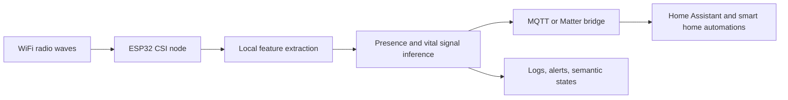

RuView가 던진 불편함은 “카메라가 없다”는 말의 빈칸에 있다. GitHub Trending #4에 오른 이 Rust 프로젝트는 WiFi sensing으로 사람의 존재, 움직임, 호흡, 심박, 낙상 위험을 읽겠다고 말한다. 화면도 렌즈도 없다. 대신 집 안의 전파가 센서가 된다.

그 설명은 눈길을 끈다. 동시에 불편하다. 카메라는 보이면 피할 수 있다. WiFi는 보이지 않고, 꺼져 있는지도 알기 어렵다.

## WiFi sensing이 사생활 보호라는 말은 반만 맞다

RuView의 주장은 선명하다. 일반 WiFi 신호를 공간 지능(spatial intelligence) 센서로 바꾸고, ESP32 기반 노드가 채널 상태 정보(Channel State Information, CSI)를 읽어 방 안의 사람과 활동을 추론한다. 프로젝트 설명에는 벽 너머 감지, 어두운 공간 감지, 웨어러블 없는 호흡·심박 측정, 카메라 없는 낙상 감지가 함께 들어 있다.

확인된 사실은 여기까지다. GitHub Trending에 오른 공개 저장소이고, 제공된 기준으로 별 78,562개, 하루 증가 1,129개를 기록했다. Rust 프로젝트이며, Home Assistant, Apple Home, Google Home, Amazon Alexa, SmartThings 같은 스마트홈 생태계 연결을 전면에 내세운다.

성능 주장은 따로 검증해야 한다. 저장소 설명은 v2 인코더가 label-free held-out temporal-triplet accuracy 82.3%를 냈고, 과거의 100% presence 수치는 단일 클래스 녹화 기준이라 철회했다고 밝힌다. 이 철회는 과장 수치를 그대로 두는 프로젝트보다 나은 신호다. 다만 82.3%라는 숫자도 실제 집, 다인 가구, 반려동물, 공유 주거, 벽 재질, 공유기 위치가 섞인 환경의 보장값은 아니다.

RuView가 카메라보다 덜 침습적이라는 말은 맞다. 얼굴 이미지를 저장하지 않고, 픽셀을 만들지 않는다.

그러나 감시가 사라지는 것은 아니다. 감시의 형태가 영상에서 추론으로 바뀐다.

## 논쟁은 성능보다 권한에서 시작된다

개발자 커뮤니티가 이런 프로젝트에 반응하는 이유는 단순한 신기함이 아니다. 9달러 ESP32 보드, 로컬 처리, 클라우드 불필요, MQTT 한 줄 연결 같은 표현은 직접 만들어보고 싶은 욕구를 자극한다. Home Assistant에 붙이고, Matter Bridge로 페어링하고, Siri·Google Assistant·Alexa가 방별 존재와 활력 징후를 말하게 만든다는 흐름은 실험실 기술보다 생활 공간의 자동화에 가깝게 보인다.

저장소는 노드당 21개 엔티티를 제공한다고 설명한다. 11개 raw signal과 10개 semantic state가 포함되며, 예시에는 someone-sleeping, possible-distress, bathroom-occupied, fall-risk-elevated, bed-exit, no-movement, elderly-inactivity-anomaly가 들어 있다.

문제는 여기서 바뀐다. 센서가 사람을 감지하는지가 아니라, 누가 그 추론을 볼 권한을 갖는지가 쟁점이 된다. bathroom-occupied와 bed-exit은 단순한 편의 기능이 아니다. 생활 패턴 데이터다. possible-distress와 elderly-inactivity-anomaly는 돌봄 기능일 수 있지만, 가족 구성원이나 임대 공간, 직장, 숙박 시설에서는 권한 남용으로 이어질 수 있다.

카메라 없는 센서는 거부감이 낮다. 거부감이 낮은 센서는 더 쉽게 설치된다. 쉽게 설치되는 센서는 동의 절차를 건너뛸 가능성도 높다.

RuView는 흥미로운 제품 후보이기 전에 정책 질문이다. 카메라 규제와 고지 문구는 렌즈를 전제로 설계된 경우가 많다. RF 기반 감지는 눈에 띄는 촬영 장치가 없고, 영상 파일도 없다. 그렇다고 개인정보 리스크가 낮다고 단정할 수 없다. 사람의 존재, 수면, 심박, 욕실 사용, 낙상 위험은 영상보다 덜 민감한 데이터가 아니라 다른 방식으로 민감한 데이터다.

## RuView 아키텍처에서 봐야 할 것은 로컬 처리의 착시다

RuView는 클라우드 없이 edge hardware에서 실행된다고 말한다. ESP32 mesh가 CSI를 수집하고, Cognitum Seed는 persistent memory, cryptographic attestation, AI integration을 맡는 구조다. Ed25519 witness chain, kNN, vector store 같은 표현도 붙어 있다. 운영자 입장에서는 좋은 방향이다. 원본 데이터가 외부 서버로 나가지 않는 설계는 기본적으로 유리하다.

그렇다고 로컬이면 끝이라는 판단은 틀렸다. 로컬 처리 시스템은 네트워크 전송 리스크를 줄인다. 대신 설치자 권한, 자동화 오작동, 로그 보관, 가족 구성원 동의, 게스트 고지, 센서 보정 책임을 남긴다.



이 다이어그램에서 가장 위험한 구간은 모델이 아니다. D에서 E로 넘어가는 지점이다. presence가 room-active로 바뀌고, no-movement가 elderly-inactivity-anomaly로 바뀌는 순간 데이터는 측정값에서 판단으로 넘어간다. 그 판단이 자동화에 연결되면 조명이 켜지는 수준을 넘어 알림, 출입, 돌봄, 보안, 보험, 근태 같은 판단 재료가 될 수 있다.

저장소의 빠른 시작 예시는 이 차이를 잘 보여준다.

```bash
docker pull ruvnet/wifi-densepose:latest
docker run -p 3000:3000 ruvnet/wifi-densepose:latest
```

이 경로는 simulated data 평가용이다. 실제 presence, vital signs, through-wall sensing은 CSI-capable hardware가 필요하다고 저장소도 명시한다. 소비자 WiFi 노트북은 RSSI-only presence detection 수준이라고 되어 있다. Docker 화면이 뜬다고 해서 벽 너머 호흡 측정이 재현된 것은 아니다. 이 구분을 흐리면 데모는 제품처럼 보이고, 제품은 검증 없이 생활 공간에 들어간다.

## 과장으로만 몰아가면 놓치는 실제 가치

RuView를 허풍으로만 처리하는 판단도 충분하지 않다. 카메라가 불가능하거나 부적절한 공간은 있다. 침실, 욕실 근처, 고령자 돌봄, 야간 낙상 감지, 시설 내 익명 점유율 측정 같은 영역에서는 영상이 답이 아닐 때가 많다. RF 기반 센싱은 그 틈을 겨냥한다.

프로젝트가 밝힌 한계도 있다. through-wall sensing은 최대 약 5m이고 signal-dependent다. ESP32-S3나 연구용 NIC 같은 CSI-capable hardware가 필요하다. 환경별 calibration도 요구된다. 실무에서 이 조건은 작은 글씨가 아니라 도입 여부를 가르는 본문이다.

판단은 이렇게 내려야 한다. RuView류의 WiFi sensing은 카메라 대체제가 아니라 새로운 센서 범주다. 카메라보다 덜 보이는 만큼, 더 엄격한 고지와 권한 설계가 필요하다. 영상 저장 금지만으로는 부족하다. semantic state의 생성, 보관, 공유, 자동화 연결을 따로 통제해야 한다.

도입을 검토한다면 먼저 세 가지를 정해야 한다.

- 원시 CSI, 추출 feature, semantic state 중 무엇을 저장할지
- 방별 presence와 vital sign을 누가 볼 수 있는지
- possible-distress, fall-risk-elevated 같은 추론이 틀렸을 때 어떤 자동화가 실행되는지

이 질문에 답하지 못하면 센서는 아직 설치할 준비가 안 된 것이다.

## 카메라가 없다는 말 뒤에 동의가 있어야 한다

첫 문장의 긴장은 여기로 돌아온다. 카메라가 없으면 덜 불편할 수 있다. 하지만 보이지 않는 센서가 동의 없는 센서가 되는 순간, 사생활 침해는 더 조용해진다.

RuView가 보여준 사건성은 별 숫자에 있지 않다. 집 안의 WiFi를 공간 센서로 바꾸는 아이디어가 개발자에게는 실험 욕구를, 사용자에게는 감시 불안을 동시에 만든다는 데 있다. 이 기술이 실제로 쓸모 있으려면 성능 벤치마크보다 먼저 사회적 인터페이스가 필요하다. 켜져 있음을 알리는 표시, 방 단위 권한, guest mode, 자동화 로그, 민감 상태 비활성화가 기본값이 되어야 한다.

카메라 없는 집은 더 사적인 집이 될 수 있다. 보이지 않는 센서가 늘어난 집은 덜 사적인 집이 될 수도 있다. RuView가 던진 질문은 이 차이를 설치 전에 드러내고 동의를 받는 일이다.

## 참고 자료

- [선정 글감] [#4 ruvnet/RuView](https://github.com/ruvnet/RuView) — GitHub Trending