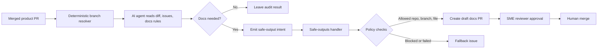

> 한 줄 요약: AI 에이전트와 GitHub Agentic Workflows를 프로덕션 가까이에 두려면 프롬프트보다 권한 경계, 승인 흐름, 감사 가능한 산출물이 먼저다. 잘 만든 에이전트 자동화는 사람을 빼는 시스템이 아니라 위험한 행동을 좁은 경로 안에 묶어두는 시스템에 가깝다.

## 왜 지금 이슈인가

AI 에이전트 자동화 논의가 코드 생성에서 운영 작업으로 넘어가고 있다. 이제 질문은 에이전트가 코드를 얼마나 잘 쓰느냐에 그치지 않는다. 로그를 읽고, 이슈를 판단하고, 풀 리퀘스트를 만들고, 때로는 배포 롤백까지 제안할 수 있느냐가 함께 따라온다.

GitHub Agentic Workflows를 이용한 cross-repo 문서 자동화 사례는 이 흐름을 잘 보여준다. 제품 저장소에서 기능 PR이 머지되면 에이전트가 변경 diff와 연결된 이슈를 읽고, 문서화가 필요한지 판단한 뒤 별도 문서 저장소에 draft PR을 만든다. Aspire 팀은 2026년 5월 3일부터 6월 2일까지 396번의 워크플로 실행에서 82개의 문서 PR을 만들었고, 문서 PR의 median merge time은 44.8시간이었다고 밝혔다.

겉으로는 문서 자동화 사례다. 실무자가 봐야 할 부분은 문서 자체보다, 서로 다른 저장소와 권한, 리뷰 체인을 AI 에이전트가 어떻게 오갈 수 있느냐에 있다.

여기서 문제가 생긴다. 에이전트가 읽는 입력은 항상 믿을 수 있는 자료가 아니다. 공개 이슈, PR 본문, 커밋 메시지, 로그, 사용자 문의, 장애 알림에는 공격자가 심어둔 지시문이 들어갈 수 있다. GitLost 사례처럼 공개 저장소의 이슈로 에이전트를 속여 비공개 저장소 정보를 유출시키는 간접 프롬프트 인젝션(Indirect Prompt Injection)이 가능한 이유도 여기에 있다.

이 주제는 생산성 도구보다 운영 권한을 가진 자동화 시스템을 어떻게 설계할 것인가에 가깝다.

## 커뮤니티에서 갈리는 지점

개발자 커뮤니티에서 AI 에이전트를 두고 갈리는 지점은 꽤 선명하다. 한쪽은 사람이 반복하던 잡무를 에이전트가 줄여줄 수 있다고 본다. 다른 쪽은 에이전트가 읽는 모든 텍스트가 잠재적 명령어가 되는 순간, 기존 자동화보다 더 위험한 실행 표면이 열린다고 본다.

둘 다 맞다.

문서 자동화 사례에서 에이전트가 만든 가치는 분명하다. 기능 PR 작성자가 다음 작업으로 넘어간 뒤 문서 작성자가 뒤늦게 변경 사항을 역추적하는 비용이 줄어든다. 기능을 승인한 엔지니어가 문서 PR의 SME(Subject Matter Expert) 리뷰어가 되므로, 지식이 흩어지기 전에 검증이 붙는다.

Vercel Agent 사례도 비슷한 방향을 가리킨다. 에이전트가 배포, 로그, 메트릭을 조사해 원인을 찾고 조치를 제안한다. 다만 기본은 read-only이며 production 변경은 승인 없이는 하지 않는 구조다. 운영 에이전트가 유용해지는 지점과 위험해지는 지점이 같은 곳에 붙어 있는 셈이다.

DEV Community의 agentic coding workflow 글은 이 논의를 개발 프로세스 쪽에서 보완한다. 즉흥적인 채팅 흐름이 아니라 요구사항, 아키텍처, 구현, 체크, 리뷰, PR 생성 같은 단계별 산출물을 남기는 방식이 필요하다는 주장이다. 에이전트를 믿느냐보다, 에이전트가 지나간 자리를 나중에 사람이 검토할 수 있느냐가 중요하다.

반대편에는 GitLost 같은 보안 사례가 있다. 에이전트가 공개 이슈를 읽고 내부 저장소에 접근할 수 있다면, 공격자는 코드 실행 권한이 없어도 텍스트만으로 데이터 흐름을 바꿀 수 있다. 기존 CI/CD 보안은 토큰, 브랜치 보호, 시크릿 노출을 중심으로 설계됐다. 에이전트 시대에는 비신뢰 텍스트가 권한 있는 행동으로 이어지는 경로까지 봐야 한다.

논쟁의 축은 AI가 똑똑한지가 아니다.

| 쟁점 | 기대 | 우려 |
|---|---|---|
| 문서화 | 기능 변경 직후 문서 PR 생성 | 잘못된 문서 판단, 내부 변경 과대 해석 |
| 코드 리뷰 | 반복 리뷰와 위험 변경 감지 | 모델 판단을 CI처럼 오해 |
| 운영 조사 | 로그, 메트릭, 배포 이력 연결 | 잘못된 원인 추정과 과감한 조치 |
| 권한 위임 | 반복 작업 자동 처리 | 프롬프트 인젝션과 권한 확산 |
| 산출물 | PR, 이슈, 코멘트로 감사 가능 | 산출물이 남아도 입력 오염은 별도 문제 |

이런 상황에서는 에이전트의 성능보다 실패 모드가 먼저 논의된다. 틀린 답변은 사람이 고칠 수 있지만, 잘못된 권한으로 실행된 작업은 롤백과 사고 대응을 부른다.

## 아키텍처 관점에서 볼 점

AI 에이전트 자동화를 시스템으로 보면 세 구간을 나눠야 한다.

첫째, 에이전트가 읽는 구간이다. PR diff, 이슈, 로그, 문서, 배포 이벤트처럼 많은 입력이 들어온다. 이 구간은 넓어질수록 유용하지만, 오염될 가능성도 커진다.

둘째, 에이전트가 판단하는 구간이다. 문서화 필요 여부, 원인 후보, 수정 제안, 리뷰 코멘트 등이 여기서 나온다. 이 구간은 확률적이다. 같은 입력에도 모델, 프롬프트, 컨텍스트에 따라 결과가 달라질 수 있다.

셋째, 실제 시스템에 쓰는 구간이다. PR 생성, 이슈 작성, 라벨 변경, 배포 롤백, 병합 같은 행동이 여기에 해당한다. 이 구간은 좁고 검증 가능해야 한다.

GitHub Agentic Workflows의 흥미로운 설계는 에이전트가 직접 GitHub에 쓰지 않는다는 점이다. 에이전트는 의도를 JSON 형태로 내고, 별도 safe-outputs handler가 허용된 작업만 실행한다. GitHub App도 워크플로별로 저장소와 권한을 좁혀 설치한다.

이 다이어그램에서 중요한 지점은 C보다 G와 H다. 모델이 문서를 잘 쓰는 것도 필요하지만, 운영 리스크는 safe-output handler에서 줄어든다.

선정 사례의 frontmatter 정책에는 몇 가지 실무적인 장치가 들어 있다.

- GitHub App 설치 범위를 제품 저장소와 문서 저장소로 제한
- target repo를 문서 저장소로 고정
- base branch를 main 또는 release/*로 제한
- PR은 draft로만 생성
- AGENTS.md, manifest, security config 같은 파일은 protected-files로 차단
- 실패 시 조용히 누락하지 않고 이슈로 fallback

이런 설계가 없으면 에이전트는 기존 자동화보다 위험해질 수 있다. 기존 GitHub Actions는 YAML에 적힌 명령을 실행한다. 에이전트 워크플로는 외부 텍스트를 읽고 다음 행동을 구성한다. 입력 표면이 커진 만큼, 출력 표면은 더 좁아야 한다.

Vercel의 GitHub Tools changelog도 같은 방향을 취한다. write tool은 기본적으로 approval을 요구하고, tool preset으로 code-review, issue-triage, repo-explorer, ci-ops, maintainer 같은 범위를 나눈다. 대용량 read tool은 모델에 들어가는 내용을 줄이고, 채널에는 전체 payload를 남기는 방식도 언급된다.

여기서 얻을 수 있는 원칙은 단순하다. 에이전트에게 모든 권한을 주고 착하게 행동하길 기대하지 않는다. 넓게 읽게 하되 좁게 쓰게 만든다. 쓰기 전에는 정책과 사람을 지나가게 한다.

## 실무에서 볼 점

AI 에이전트 자동화를 도입할 때 첫 질문은 이 작업을 자동화할 수 있는가가 아니다. 이 작업이 실패했을 때 어디까지 망가질 수 있는가다.

문서 PR 생성은 비교적 좋은 출발점이다. 실패해도 draft PR이 잘못 열리는 수준이고, SME 리뷰어가 검증한다. Aspire 사례에서도 초기에는 docs-worthy 판단이 너무 넓어 내부 CI 변경이나 로깅 리팩터링에도 PR이 만들어졌고, 69개 중 9개가 닫혔다고 한다. 이후 user-facing change 정의를 좁히고 CI, 내부 helper, tests-only 같은 negative example을 추가해 개선했다.

이 패턴은 코드 리뷰, 이슈 triage, 릴리스 노트, 운영 조사에도 적용할 수 있다. 다만 production write가 붙는 순간 기준이 달라진다. 롤백, 설정 변경, feature flag 조작, 데이터 마이그레이션 실행은 문서 PR 생성과 같은 위험군이 아니다.

도입 전에는 최소한 아래 조건을 확인해야 한다.

| 확인할 것 | 질문 |
|---|---|
| 입력 신뢰도 | 에이전트가 공개 입력과 내부 입력을 함께 읽는가? |
| 권한 범위 | 토큰이 저장소, 조직, 환경 단위로 얼마나 좁혀져 있는가? |
| 출력 형식 | 에이전트가 직접 실행하는가, 의도를 내고 handler가 검증하는가? |
| 승인 단계 | write action에 사람 승인이나 정책 gate가 있는가? |
| 감사 가능성 | 판단 근거, 입력, 산출물, 승인자가 나중에 추적되는가? |
| 실패 처리 | 실패가 조용히 묻히는가, 이슈나 알림으로 남는가? |
| 보호 파일 | 보안 설정, 의존성 manifest, agent instruction 파일을 건드릴 수 있는가? |

현업에서 비슷한 자동화를 붙이다 보면 처음에는 모델 품질에 시선이 쏠린다. 문장을 더 자연스럽게 쓰는지, 리뷰 코멘트가 그럴듯한지, 원인 분석이 빠른지 같은 지표가 눈에 잘 보이기 때문이다. 하지만 운영에 붙는 순간 더 큰 차이는 권한 모델과 재시도 설계에서 난다.

예를 들어 문서 자동화에서는 milestone을 release branch로 매핑하는 결정적 로직이 큰 역할을 한다. 에이전트에게 어느 브랜치에 PR을 열지 추론하게 두지 않고, 기존 프로세스의 metadata로 target branch를 정한다. 모델이 잘하는 일과 쉘 스크립트가 잘하는 일을 섞지 않은 셈이다.

이 구분이 중요하다. 모델은 변경의 의미를 읽고 초안을 만드는 데 강하다. 반면 branch routing, allow-list 검증, protected file 차단, token scope 제한은 결정적 코드와 플랫폼 정책이 맡아야 한다.

보안 관점에서는 프롬프트 인젝션을 단순한 프롬프트 문제로 다루면 부족하다. 공격자는 에이전트에게 이상한 말을 시키는 데서 멈추지 않는다. 에이전트가 접근 가능한 도구와 데이터 흐름을 노린다. 방어도 프롬프트 문장 하나가 아니라 아키텍처로 해야 한다.

실패하기 쉬운 지점은 네 가지다.

- 읽기 권한이 넓은 에이전트에게 쓰기 권한까지 넓게 준다.
- PR, 이슈, 로그처럼 외부 입력을 내부 지시와 같은 우선순위로 처리한다.
- 모델의 판단 결과를 CI 성공처럼 취급한다.
- 승인 UI는 있지만 승인자가 무엇을 승인하는지 검토할 근거가 부족하다.

반대로 성공 가능성이 높은 조건도 있다.

- 자동화 결과가 PR, 이슈, 코멘트처럼 되돌릴 수 있는 산출물이다.
- write action은 기본 차단이고, 필요한 경우에만 승인된다.
- 에이전트가 만질 수 없는 파일과 리소스가 명확하다.
- 실행 결과가 metrics, audit log, reviewer 기록으로 남는다.
- negative example을 계속 추가할 수 있는 피드백 루프가 있다.

AI 에이전트는 좋은 테스트 하네스(Test Harness)와도 닮아 있다. 테스트 하네스가 시스템을 직접 믿지 않고 입력, 실행, 검증, 리포트를 분리하듯, 에이전트 운영도 읽기, 추론, 의도 생성, 정책 검증, 실행을 분리해야 한다. 이 구조가 없으면 자동화는 빠르지만 취약한 지름길이 된다.

## 정리

AI 에이전트 자동화의 실무 판단 기준은 생산성 데모가 아니라 피해 범위(blast radius)다. 어떤 입력을 읽고, 어떤 도구를 호출할 수 있고, 어떤 쓰기 작업이 사람과 정책을 거치는지 봐야 한다.

GitHub Agentic Workflows의 cross-repo 문서 자동화는 참고할 만한 방향을 보여준다. 에이전트가 제품 변경을 읽고 문서 PR을 만들지만, 쓰기는 safe-output contract와 좁은 GitHub App 권한을 통과한다. Vercel Agent와 GitHub Tools의 approval-first 설계도 같은 원칙 위에 있다. GitLost는 그 원칙이 없을 때 어떤 공격면이 열리는지 보여주는 반대 사례다.

당장 확인할 것은 하나다. 지금 팀의 AI 에이전트나 자동화가 사용하는 토큰을 꺼내서, 공개 입력을 읽은 뒤 바로 실행할 수 있는 write action 목록을 적어보면 된다. 그 목록이 길수록 문제는 프롬프트가 아니라 아키텍처다.

## 참고 자료

- [선정 글감] [Automating cross-repo documentation with GitHub Agentic Workflows](https://github.blog/ai-and-ml/github-copilot/automating-cross-repo-documentation-with-github-agentic-workflows/) (GitHub Blog Engineering)
- [관련] [GitLost: We Tricked GitHub's AI Agent into Leaking Private Repos](https://noma.security/blog/gitlost-how-we-tricked-githubs-ai-agent-into-leaking-private-repos/) (Noma Security)
- [관련] [Vercel Agent: An agent you can let near production](https://vercel.com/blog/vercel-agent) (Vercel Blog)
- [관련] [Give your eve agent GitHub tools](https://vercel.com/changelog/github-tools-eve) (Vercel Changelog)
- [관련] [From Prompts to Pipelines: How I Use Agentic Coding as an Engineering Workflow](https://dev.to/po8rewq/from-prompts-to-pipelines-how-i-use-agentic-coding-as-an-engineering-workflow-52fh) (DEV Community)