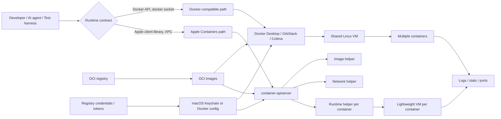

> 한 줄 요약: 로컬 컨테이너 런타임 선택은 Docker Desktop과 Apple Containers 중 무엇이 마음에 드느냐의 문제가 아니다. 테스트 자동화, AI 에이전트 격리, 보안 경계, 운영 재현성을 어디에 둘지 정하는 문제다. OCI 이미지는 같아도 Docker API 호환성은 같지 않다.

## 왜 지금 이슈인가

같은 OCI 이미지가 뜬다. 그런데 어떤 테스트 하네스는 실패하고, 어떤 `docker-compose.yml` 옵션은 무시되며, 어떤 AI 에이전트는 호스트 파일시스템에 너무 가까이 붙는다.

Davit이 Hacker News에서 377 points와 97 comments를 받은 이유는 단순히 Apple Containers용 UI가 나와서가 아니다. Davit은 Apple의 `container` 데몬과 XPC로 직접 통신하고, Docker Desktop 없이 Apple silicon Mac에서 Linux 컨테이너를 실행하는 흐름을 GUI로 감싼다.

논쟁은 주로 다음 지점에서 붙는다.

- Docker Desktop이 부담스러운 개발자에게 Apple Containers가 대안이 될 수 있는가
- Docker API에 묶인 테스트 자동화, DevContainer, CI 스크립트는 어떻게 되는가
- AI 에이전트를 VM이나 컨테이너 안에 가두는 방식이 로컬 개발의 기본값이 될 수 있는가

Apple의 `container` 공식 문서는 이 런타임이 표준 OCI 이미지를 소비하고 생성한다고 설명한다. 동시에 macOS에서 흔한 공유 Linux VM 방식과 달리, 컨테이너마다 경량 VM을 띄우는 구조를 택한다.

이 차이는 작지 않다. 이미지는 호환될 수 있지만 제어면(Control Plane)은 호환되지 않을 수 있다. 로컬 개발 환경에서 제어면은 테스트, 빌드, 배포 전 검증, AI 에이전트의 작업 범위를 모두 건드린다.

## 커뮤니티에서 갈리는 지점

### Apple Containers는 Docker Desktop 대체재일까?

Davit의 FAQ는 꽤 솔직하다. `docker run`, 간단한 compose 파일, Dockerfile 빌드, 이미지 pull/run 정도라면 Davit이 현재도 많은 부분을 덮을 수 있다. 하지만 Davit은 Docker 데몬이 아니고, Docker socket도 없고, Docker CLI/API 호환 계층도 아니다.

이 차이 하나로 평가가 갈린다.

| 관점 | Apple Containers + Davit | Docker Desktop / OrbStack 계열 |
| --- | --- | --- |
| 실행 모델 | 컨테이너마다 경량 VM | 대체로 공유 VM 기반 |
| 이미지 | OCI 이미지 사용 | OCI 이미지 사용 |
| 제어 API | Apple `container` 데몬, XPC | Docker API, Docker socket |
| 도구 호환성 | 아직 좁음 | 넓음 |
| 격리 | 컨테이너 간 VM 경계가 강함 | 공유 VM 안에서 효율이 좋음 |
| 도입 리스크 | 자동화와 compose 호환성 확인 필요 | 리소스, 라이선스, 계정, 제품 정책 확인 필요 |

커뮤니티 댓글에서도 메모리 논쟁은 단순하지 않다. Apple 방식은 실행 중인 컨테이너가 없을 때 부담이 작다는 장점이 있다. 반대로 컨테이너마다 VM이 생기면 여러 컨테이너를 동시에 띄울 때 커널 오버헤드가 늘 수 있다.

Apple 문서도 메모리 반환 제한을 언급한다. 컨테이너 VM 안에서 해제된 메모리 페이지가 곧바로 macOS 호스트로 돌아오지 않을 수 있고, 메모리 집약적인 컨테이너를 많이 띄우면 재시작이 필요할 수 있다는 내용이다.

따라서 “가벼운가”라는 질문만으로는 부족하다. 내 워크로드가 공유 VM에 유리한지, 컨테이너별 VM 격리에 유리한지를 따져야 한다.

### 테스트 자동화는 왜 바로 깨질 수 있나?

Testcontainers 문서는 Docker API 호환 컨테이너 런타임이 필요하다고 못박는다. Docker Desktop은 자동 탐지되지만, Colima나 Podman 같은 대안 런타임은 `DOCKER_HOST`, `TESTCONTAINERS_HOST_OVERRIDE`, `TESTCONTAINERS_DOCKER_SOCKET_OVERRIDE` 같은 환경변수 조정이 필요할 수 있다.

Davit 쪽 설명도 같은 선을 긋는다. `/var/run/docker.sock`을 기대하는 도구, Docker API를 호출하는 테스트, CI 스크립트에서 `docker` 명령을 직접 호출하는 흐름은 아직 대체하기 어렵다.

이건 작은 호환성 문제가 아니다. 현대 백엔드 테스트는 Postgres, Redis, Kafka, LocalStack, 브라우저, 메시지 큐를 테스트마다 컨테이너로 띄우는 경우가 많다. 이 하네스가 Docker API를 기준으로 작성되어 있으면, Apple Containers에서 이미지가 잘 실행되는 것과 별개로 테스트는 시작도 못 할 수 있다.

### AI 에이전트 격리는 왜 같이 논의되나?

HN 댓글에서 흥미로운 방향은 에이전트를 VM 안에 가두고, 바깥의 하네스가 지시만 보내는 모델이었다. 호스트에는 Codex나 Claude를 설치하지 않고, VM 안의 사용자와 파일시스템, 네트워크 정책을 나눠 dev agent, QA agent 같은 역할을 분리하자는 생각이다.

이건 먼 미래 얘기가 아니다. AI 에이전트가 로컬 저장소, SSH 키, 클라우드 토큰, 브라우저 세션, 사내 문서에 접근할 수 있는 환경에서는 실행 격리 자체가 제품 기능이 된다.

다만 격리만으로는 부족하다. Vercel의 에이전트 설계 글은 코드만으로는 왜 그런 판단을 했는지 에이전트가 알 수 없다고 말한다. 그래서 제품 판단, 규칙, 리뷰 루프를 저장소 안에 기술하고 에이전트가 읽게 만든다.

인프라도 같다. 에이전트에게 컨테이너를 쓰게 하려면 런타임 계약을 저장소 안에 남겨야 한다. 어떤 런타임을 기준으로 하는지, Docker API가 필요한지, 어떤 경로를 mount할 수 있는지, 네트워크는 어디까지 허용되는지, 어떤 secrets는 절대 전달하지 않는지 문서와 검증으로 묶어야 한다.

## 아키텍처 관점에서 볼 점

로컬 컨테이너 런타임을 볼 때는 레이어를 나눠야 한다.

- 이미지 포맷: OCI 이미지가 호환되는가
- 제어면: Docker API인가, Apple `container` API인가
- 실행 격리: 공유 VM인가, 컨테이너별 VM인가
- 워크플로 계약: compose, Testcontainers, DevContainer, CI, AI agent harness가 무엇을 전제하는가
- 관측성: 로그와 CPU/memory 수치가 어디까지 보이는가

Davit은 Apple Containers를 감싸는 UI다. 컨테이너 시작/중지, 로그 스트리밍, CPU와 메모리 차트, 파일 브라우징, registry login, compose import, Dockerfile build를 제공한다. 앱 자체가 컨테이너 엔진을 새로 만드는 구조가 아니라 Apple의 데몬과 직접 말한다는 점이 핵심이다.



이 그림에서 위험한 지점은 이미지가 아니다. 많은 팀이 이미지가 호환되면 런타임도 호환된다고 생각한다.

실제 장애는 제어면에서 난다. Testcontainers가 Docker API를 찾지 못한다. compose의 `restart:`나 `healthcheck:` 같은 필드가 Apple Containers 쪽 오케스트레이션에 그대로 반영되지 않는다. DevContainer가 기대하는 Docker socket이 없다. CI에서 쓰던 `docker compose up -d`가 로컬에서는 다른 의미를 갖는다.

Davit은 compose import 시 지원하지 않는 항목을 경고한다고 설명한다. 조용히 무시하는 것보다 위험을 드러내는 쪽이 운영상 낫다.

다만 GUI가 경고를 보여준다는 것과 팀의 자동화가 안전하다는 것은 별개다. 저장소 안에 어떤 compose 필드를 허용하는지, 어떤 런타임에서는 어떤 테스트를 skip하거나 fallback할지 명시해야 한다.

## 실무에서 볼 점

### Apple Containers 도입 전에 무엇을 확인해야 할까?

첫 번째 확인 대상은 코드가 아니라 스크립트다.

리포지터리에서 아래 문자열을 찾으면 런타임 교체 리스크가 보인다.

```text
/var/run/docker.sock
DOCKER_HOST
docker compose
docker-compose
testcontainers
devcontainer
healthcheck:
restart:
network_mode:
docker build
docker cp
```

이 문자열이 많을수록 Docker API나 Docker CLI에 기대는 부분이 많다는 뜻이다. Apple Containers가 나쁘다는 뜻은 아니다. 대체 범위가 이미지 실행을 넘어 제어면까지 확장된다는 뜻이다.

두 번째는 compose 사용 범위다. 단일 웹 앱과 데이터베이스 하나를 띄우는 수준이면 Davit의 compose import로도 충분할 수 있다. 반대로 healthcheck 기반 startup ordering, restart policy, build context, 여러 네트워크, sidecar, mock service가 얽혀 있다면 수동 확인이 필요하다.

세 번째는 테스트 하네스다. Testcontainers 기반 테스트가 핵심 품질 게이트라면 Docker API 호환 런타임을 유지하거나, 테스트만 별도 런타임에서 실행하는 분리가 더 현실적이다.

### 보안과 데이터 리스크는 어디서 생기나?

컨테이너별 VM은 격리 측면에서 매력적이다. Apple 문서는 각 컨테이너가 VM 수준의 격리 속성을 갖고, 호스트 데이터를 mount할 때 필요한 데이터만 각 VM에 붙일 수 있다고 설명한다.

하지만 로컬 개발에서 사고는 대개 격리 부족과 편의 기능 사이에서 난다.

Davit은 실행 중인 컨테이너의 파일시스템을 탐색하고, 파일을 다운로드, 업로드, 삭제할 수 있다. 이 기능은 디버깅에는 편하다. 동시에 잘못된 mount, 잘못된 권한, 에이전트 자동화와 만나면 호스트 데이터 유출 경로가 될 수 있다.

Registry login도 마찬가지다. Davit은 Docker Hub, ghcr.io, quay.io 등 registry credential을 검증하고 macOS login keychain에 저장하며, Docker credential helper도 활용할 수 있다고 설명한다. macOS 통합 측면에서는 자연스러운 흐름이지만, 팀 정책상 어떤 토큰을 로컬 keychain에 둘 수 있는지, 어떤 토큰은 CI 전용이어야 하는지 구분해야 한다.

AI 에이전트를 붙이면 기준은 더 엄격해져야 한다.

- 에이전트가 볼 수 있는 mount 경로를 최소화한다
- registry push 권한과 pull 권한을 분리한다
- 개인 SSH key를 컨테이너에 넘기지 않는다
- 외부 네트워크 접근을 작업별로 제한한다
- 컨테이너 내부 파일 브라우징과 업로드 기능을 자동화에 바로 연결하지 않는다

격리는 기능이 아니라 계약이다. 계약이 문서, 스크립트, 권한, 리뷰 규칙으로 남지 않으면 다음 사람이 편의를 위해 경계를 뚫는다.

### 관측성은 로컬 디버깅과 운영 관측성을 구분해야 한다

Davit은 컨테이너별 CPU, memory, IP, logs, ports를 보여준다. 2초 간격 샘플링의 live chart도 제공한다. 로컬에서 어떤 컨테이너가 뜨고 죽는지 보기에는 충분히 유용하다.

그렇다고 운영 관측성(Observability)을 대체하지는 않는다. 로컬 UI의 CPU/memory chart는 분산 추적(Distributed Tracing), 로그 상관관계, SLO burn rate, Kubernetes 이벤트와 다른 층위다.

오히려 실무에서는 로컬 관측성이 좋아질수록 착시를 조심해야 한다. 개발자 Mac에서 잘 보이는 상태가 CI, staging, Kubernetes 클러스터에서도 같은 방식으로 보인다고 믿으면 안 된다.

로컬 런타임을 바꿀 때는 최소한 아래 항목을 나눠 봐야 한다.

| 구분 | 확인할 질문 |
| --- | --- |
| 로컬 디버깅 | 로그, 포트, 파일, 리소스 사용량을 개발자가 빠르게 볼 수 있는가 |
| 자동 테스트 | 테스트 하네스가 런타임을 자동으로 찾고 실패를 재현하는가 |
| 운영 재현성 | Kubernetes나 배포 환경과 네트워크, 권한, startup ordering 차이를 알고 있는가 |

### 어떤 팀에 맞고, 어떤 팀에는 아직 이른가?

Apple Containers와 Davit이 잘 맞는 조건은 꽤 분명하다.

- Apple silicon Mac 중심으로 개발한다
- Docker API에 강하게 묶인 자동화가 적다
- 로컬에서 컨테이너를 켜고 끄는 작업이 주로 수동 또는 단순 스크립트다
- OCI 이미지 기반 워크플로가 이미 정리되어 있다
- AI 에이전트나 실험 코드를 호스트와 더 분리하고 싶다
- Docker Desktop의 제품 정책, 계정, 리소스 사용량을 줄이고 싶다

반대로 아래 조건이면 신중해야 한다.

- Testcontainers가 핵심 테스트 게이트다
- DevContainer, Docker socket, Docker Compose 확장 기능에 크게 의존한다
- 여러 서비스의 healthcheck와 restart policy로 로컬 스택을 맞춘다
- CI와 로컬이 같은 `docker` 명령을 공유해야 한다
- 팀원이 macOS, Linux, Windows에 섞여 있다
- Kubernetes 배포 전 검증을 로컬 compose에 크게 기대고 있다

현업에서 비슷한 고민을 하다 보면 새 도구의 체감 속도보다 전환 실패 비용이 더 크게 남는다. 누군가의 Mac에서는 빠르고 깔끔한데, PR 검증이나 온보딩 문서가 따라오지 않으면 팀 전체 생산성은 떨어진다.

Vercel의 에이전트 글이 시사하는 바도 여기와 맞닿아 있다. 에이전트가 따라야 할 판단을 저장소에 넣듯이, 로컬 런타임의 판단도 저장소에 넣어야 한다.

예를 들면 이런 식이다.

```text
docs/runtime-contract.md

- 기본 로컬 런타임: Docker-compatible runtime
- Apple Containers 허용 범위: 수동 실행, 단일 서비스 디버깅, agent sandbox 실험
- Testcontainers: Docker API compatible runtime 필요
- Compose 필수 필드: ports, environment, volumes, healthcheck
- 금지: 개인 SSH key mount, write 가능한 HOME 전체 mount
- 예외: agent 작업용 VM은 별도 사용자와 제한된 workspace만 mount
```

이 문서가 있으면 런타임 선택이 개인 취향에서 팀 계약으로 바뀐다. AI 에이전트도 그 계약을 읽고 작업할 수 있다.

## 정리

Davit은 Apple Containers용 UI 하나로 끝나는 이야기가 아니다. 로컬 컨테이너 런타임이 Docker API 중심 생태계에서 OCI 이미지 중심, 네이티브 격리 중심, 에이전트 격리 중심으로 갈라지는 흐름과 맞닿아 있다.

선택 기준은 속도나 메모리 하나가 아니다. 다음 질문에 답할 수 있어야 한다.

- 우리 자동화는 Docker API를 요구하는가
- compose 파일의 어떤 필드가 실제 계약인가
- AI 에이전트는 어떤 파일과 네트워크에 접근해도 되는가
- 로컬 디버깅과 CI 검증을 같은 런타임에 묶어야 하는가
- 컨테이너별 VM 격리가 우리 리스크를 실제로 줄이는가

지금 할 일은 리포지터리에서 Docker API 전제를 검색하고, 런타임 계약 문서를 만드는 것이다. 그 결과가 짧으면 Apple Containers 같은 선택지를 실험해볼 여지가 있다. 길고 복잡하면 Docker 호환 런타임을 유지하되, 에이전트 격리만 별도 VM이나 제한된 컨테이너로 분리하는 편이 낫다.

## 참고 자료

- [선정 글감] [Show HN: Davit, a Apple Containers UI](https://news.ycombinator.com/item?id=48821848) — Hacker News
- [관련] [Davit - a native macOS UI for Apple containers](https://davit.app) — Davit
- [관련] [apple/container technical overview](https://github.com/apple/container/blob/main/docs/technical-overview.md) — GitHub
- [관련] [General Container runtime requirements](https://java.testcontainers.org/supported_docker_environment/) — Testcontainers for Java
- [관련] [Teaching agents product design at Vercel](https://vercel.com/blog/teaching-agents-product-design-at-vercel) — Vercel Blog