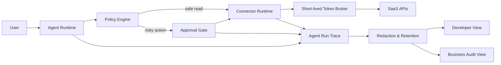

> 한 줄 요약: AI 에이전트에 SaaS 접근 권한을 붙일 때 중요한 건 긴 컨텍스트나 많은 토큰이 아니라, 토큰·권한·로그·승인을 실행 시점에 제한하는 런타임 경계다.

## 왜 지금 이슈인가

AI 에이전트가 GitHub, Slack, Gmail, Linear 같은 SaaS를 호출하는 순간, 문제는 모델 성능보다 권한 설계에 가까워진다. 데모에서는 환경 변수에 토큰을 넣고 도구 호출을 연결하면 돌아간다. 하지만 제품에서 같은 방식을 쓰면 운영 리스크가 바로 생긴다.

선정 글감인 OpenConnector 글은 이 지점을 다룬다. 에이전트가 API를 부를 수 있느냐보다 중요한 질문은 따로 있다. 어느 사용자의 계정으로 실행되는지, 어떤 스코프가 허용됐는지, 위험한 액션이 걸러지는지, 실행 로그에 민감한 입력과 응답이 남는지, 사용자가 연결을 끊거나 토큰을 회전했을 때 무엇이 멈추는지다.

개발자 커뮤니티에서 이 주제가 계속 언급되는 이유도 여기에 있다. 에이전트가 읽기 전용 검색 도우미에 머물 때는 실패 비용이 작다. 그런데 PR을 열고, 배포를 롤백하고, 설정을 바꾸고, 고객 데이터가 있는 SaaS를 조회하기 시작하면 모델의 실수는 플랫폼의 권한 사고가 된다.

Vercel Agent의 공개 베타도 같은 방향을 보여준다. 대시보드 안에서 배포, 로그, 메트릭, 프로젝트 설정, 사용량, 저장소 정보를 바탕으로 장애를 조사하고, 승인된 경우 PR 생성·롤백·설정 변경까지 수행한다. 이 기능이 제품으로 성립하려면 읽기 전용 기본값, 사용자 권한 경계, 승인 흐름, 샌드박스 검증, 행위 귀속이 함께 필요하다.

Anthropic의 Claude 격리 글도 같은 문제를 다른 표현으로 설명한다. 위험은 실패 가능성과 실패했을 때의 피해 범위로 나뉜다. 모델이 좋아져 실패 가능성이 내려가더라도, 에이전트에게 붙는 권한이 커지면 피해 범위는 커진다. 그래서 질문은 에이전트를 막을지 말지가 아니라, 어느 경계 안에서 실패하게 만들지에 가깝다.

## 커뮤니티에서 갈리는 지점

첫 번째 갈림길은 사용자 승인만으로 충분한가다.

사람에게 매번 확인을 받으면 안전해 보인다. 하지만 Anthropic은 Claude Code의 권한 프롬프트에서 사용자가 약 93%를 승인했다는 텔레메트리를 언급한다. 승인 창이 많아질수록 사용자는 내용을 검토하기보다 흐름을 통과시키는 데 익숙해진다.

그래서 인간 승인(Human-in-the-loop)은 마지막 안전장치일 수는 있어도 기본 격리 모델이 되기는 어렵다. 실무에서는 승인 버튼보다 승인 전에 액션을 제한하는 정책이 더 안정적이다.

두 번째 갈림길은 토큰을 어디에 둘 것인가다.

| 접근 | 장점 | 리스크 |
|---|---|---|
| 환경 변수에 장기 토큰 저장 | 구현이 빠르고 데모가 쉽다 | 토큰 유출, 계정 혼동, 회전 실패, 로그 노출 |
| 사용자 OAuth 토큰 직접 전달 | 사용자별 권한 추적 가능 | 에이전트와 사용자의 권한이 섞이기 쉽다 |
| 런타임 커넥터가 단기 토큰 발급 | 스코프·회전·폐기 제어 가능 | 커넥터 계층 운영 복잡도 증가 |
| 에이전트별 독립 아이덴티티 | 행위 귀속과 폐기가 쉬움 | 인증·인가 모델을 새로 정리해야 함 |

Vercel Connect가 Chat SDK 봇의 자격 증명을 관리하고, 각 API 요청에 신선한 단기 토큰을 쓰도록 한 것도 이 흐름과 맞닿아 있다. Slack, GitHub, Linear 같은 어댑터에 커넥터 UID를 연결하고, 아웃바운드 호출은 `getToken` 기반의 함수형 토큰 필드를 사용한다. 인바운드 트리거는 OIDC 토큰 검증으로 처리한다. 토큰을 애플리케이션 코드가 오래 들고 있지 않게 만드는 설계다.

세 번째 갈림길은 에이전트를 사용자처럼 볼 것인가, 별도 주체로 볼 것인가다.

Better Auth 인수 발표에서 나온 Agent Auth 방향은 에이전트가 자기 아이덴티티와 제한 가능한 권한을 가져야 한다는 쪽이다. 지금은 많은 서비스에서 에이전트가 사용자의 권한을 빌려 움직인다. 이 경우 외부 SaaS 입장에서는 사용자가 직접 한 일인지, 에이전트가 한 일인지 구분하기 어렵다. 특정 에이전트만 끄거나, 특정 하위 에이전트의 권한만 회수하는 것도 까다롭다.

커뮤니티의 논쟁은 결국 생산성과 통제의 충돌이다. 에이전트에게 더 많은 맥락과 권한을 주면 문제 해결 능력은 올라간다. 동시에 잘못된 호출 한 번이 데이터 노출, 설정 변경, 비용 폭증, 잘못된 고객 응대로 이어질 가능성도 커진다.

## 아키텍처 관점에서 볼 점

AI 에이전트 SaaS 접근 아키텍처에서 가장 피해야 할 형태는 모델과 외부 API 사이에 권한 경계가 없는 직결 구조다. 모델이 도구 이름과 입력을 만들고, 런타임이 그대로 장기 토큰으로 API를 호출하는 방식은 단순하지만 제품 환경에서는 취약하다.

필요한 경계는 네 가지다.

- 아이덴티티 경계: 사용자, 에이전트, 승인자를 분리한다.
- 권한 경계: 스코프, 리소스, 액션, 시간 제한을 나눈다.
- 실행 경계: 위험 액션은 정책 엔진과 승인 단계를 통과하게 한다.
- 관측 경계: 실행 로그는 추적 가능하되 민감정보는 최소화한다.

이 구조에서 커넥터 런타임은 단순한 SDK 래퍼가 아니다. 계정 연결 상태, 스코프, 토큰 회전, 연결 해제, API 스키마 정규화, 로그 마스킹을 맡는 실행 경계다.

OpenConnector가 제기한 MCP, HTTP, SDK, CLI, 문서 사이의 스키마 일관성 문제도 여기서 의미가 생긴다. 같은 GitHub 이슈 생성 액션이라도 MCP 도구, REST 엔드포인트, SDK 함수, CLI 명령이 서로 다른 입력 구조를 갖고 있으면 정책 검증이 어려워진다. 안전한 액션인지 판단하려면 호출 형태가 달라도 의미 단위는 같아야 한다.

관측성도 단순 로그 수집이 아니다. Vercel의 eve Agent Runs는 각 세션의 트리거, 실행 시간, 토큰 사용량을 보여주고, 턴·모델 호출·도구 호출을 단계별로 볼 수 있게 한다. 개발자 모드에서는 도구명, 입출력 JSON, 단계별 토큰 수를 볼 수 있고, 비즈니스 모드에서는 JSON을 숨기고 사람이 읽을 수 있는 요약을 제공한다. 같은 실행 데이터라도 보는 사람에 따라 노출 수준을 달리하는 방식이다.

다만 관측성은 조심해서 설계해야 한다. 에이전트 실행을 추적하려고 입력과 응답을 그대로 저장하면, 로그 저장소가 새 민감정보 저장소가 된다. Vercel이 실행 데이터 암호화와 보존 기간을 언급하는 이유도 여기에 있다. 실행 추적은 장애 분석과 감사를 위해 필요하지만, 무제한 보관되면 보안 리스크가 된다.

## 실무에서 볼 점

도입 전에 먼저 확인할 것은 에이전트가 실패해도 되는 범위다. 어떤 액션은 실패해도 재시도하면 된다. 어떤 액션은 한 번만 잘못 실행돼도 고객 데이터, 비용, 배포 안정성에 영향을 준다.

실제로는 액션을 세 등급으로 나누는 편이 낫다.

| 등급 | 예시 | 권장 경계 |
|---|---|---|
| 읽기 | 로그 조회, 이슈 검색, 문서 검색 | 사용자 권한 내 허용, 민감정보 마스킹 |
| 제안 | PR 작성, 설정 변경안 생성 | 샌드박스 검증, 명시적 리뷰 |
| 실행 | 롤백, 권한 변경, 외부 발송 | scoped plan, 승인자 기록, 되돌리기 절차 |

Vercel Agent가 읽기 전용을 기본값으로 두고, 높은 권한이 필요한 작업에 대해 범위가 정해진 계획과 승인을 요구하는 방식은 이 분류와 맞닿아 있다. 중요한 것은 승인 여부만 남기는 게 아니다. 누가 요청했고 누가 승인했으며 어떤 에이전트가 어떤 권한으로 실행했는지를 남겨야 한다.

다음으로 볼 것은 연결 해제와 토큰 회전이다. 많은 팀이 에이전트 데모를 만들 때 연결 성공만 테스트한다. 하지만 제품에서는 사용자가 SaaS 연결을 끊었을 때 대기 중인 실행이 멈추는지, 회전된 토큰이 즉시 반영되는지, 여러 계정을 가진 사용자가 계정을 바꿨을 때 과거 컨텍스트가 섞이지 않는지가 더 중요하다.

실패하기 쉬운 지점은 다음과 같다.

- 봇 토큰 하나로 여러 사용자의 작업을 대신 수행한다.
- 실행 로그에 원본 API 응답과 사용자 입력을 그대로 저장한다.
- 승인 전 미리 API를 호출해 부작용을 만든다.
- 도구 스키마가 채널마다 달라 정책 검증이 우회된다.
- 에이전트가 만든 PR, 롤백, 설정 변경의 책임 주체가 감사 로그에 남지 않는다.
- 보존 기간이 정해지지 않아 에이전트 실행 로그가 별도 데이터 레이크처럼 쌓인다.

대안도 있다. 모든 팀이 별도 커넥터 런타임을 직접 운영할 필요는 없다. 내부 도구 몇 개를 읽기 전용으로 붙이는 단계라면 기존 OAuth와 짧은 보존 로그만으로도 충분할 수 있다. 반대로 고객 계정의 SaaS를 대신 조작하거나, 여러 외부 도구에 쓰기 권한을 부여하거나, 에이전트가 운영 액션을 수행한다면 커넥터·정책·감사 계층을 분리하는 비용을 감수해야 한다.

도입 조건은 꽤 명확하다.

- 에이전트별 또는 세션별 권한을 구분할 수 있는가
- 장기 토큰 없이 단기 토큰을 발급하고 회수할 수 있는가
- 위험 액션을 실행 전 정책으로 걸러낼 수 있는가
- 승인 피로를 줄이도록 액션 등급이 나뉘어 있는가
- 실행 로그에서 민감정보를 제거하거나 제한 노출할 수 있는가
- 장애 조사에 필요한 추적 정보와 보안상 줄여야 할 정보를 분리했는가
- 연결 해제, 토큰 회전, 계정 전환이 테스트 케이스에 들어가 있는가

현업에서 비슷한 고민을 하다 보면 처음에는 모델 프롬프트와 도구 설명을 다듬는 데 시간이 많이 간다. 그런데 사고 가능성은 프롬프트 문장보다 권한 경계에서 더 자주 결정된다. 모델이 잘못된 도구를 고르지 않게 하는 것도 필요하지만, 잘못 골라도 실행되지 않게 만드는 구조가 더 오래 버틴다.

## 정리

AI 에이전트의 SaaS 접근은 모델에게 도구를 많이 주는 문제가 아니다. 누가, 어떤 권한으로, 어떤 범위에서, 어떤 기록을 남기며 실행했는지 설계하는 플랫폼 문제다.

OpenConnector가 던진 질문은 단순하다. 토큰을 더 넣을 것인가, 실행 경계를 만들 것인가. Vercel Connect, Vercel Agent, eve Observability, Better Auth의 Agent Auth, Anthropic의 격리 설계는 서로 다른 층에서 같은 문제를 다룬다. 에이전트가 유용해질수록 권한은 넓어지고, 권한이 넓어질수록 런타임 경계가 제품 인프라에 가까워진다.

당장 확인할 것은 하나다. 지금 만든 에이전트가 사용하는 토큰을 끊었을 때, 실행 중인 작업·대기 중인 작업·로그·감사 기록이 어떤 상태가 되는지 테스트해보자. 그 답이 흐리면 아직 데모에 가깝다.

## 참고 자료

- [선정 글감] [OpenConnector: SaaS access for agents needs a runtime boundary, not more raw tokens](https://dev.to/euk_ela_a3e7ed01aa3f7314e/openconnector-saas-access-for-agents-needs-a-runtime-boundary-not-more-raw-tokens-k5m) — DEV Community
- [관련] [How we contain Claude across products](https://www.anthropic.com/engineering/how-we-contain-claude) — Anthropic Engineering
- [관련] [An expanded Vercel Agent: chat, investigations, and approved actions, now in public beta](https://vercel.com/changelog/an-expanded-vercel-agent-chat-investigations-and-approved-actions-now-in-public-beta) — Vercel Blog
- [관련] [Trace and debug eve agent sessions with Vercel Observability](https://vercel.com/changelog/eve-agent-observability) — Vercel Blog
- [관련] [Chat SDK now supports Vercel Connect](https://vercel.com/changelog/chat-sdk-vercel-connect) — Vercel Blog
- [관련] [Vercel acquires Better Auth to accelerate open source auth](https://vercel.com/blog/vercel-acquires-better-auth) — Vercel Blog