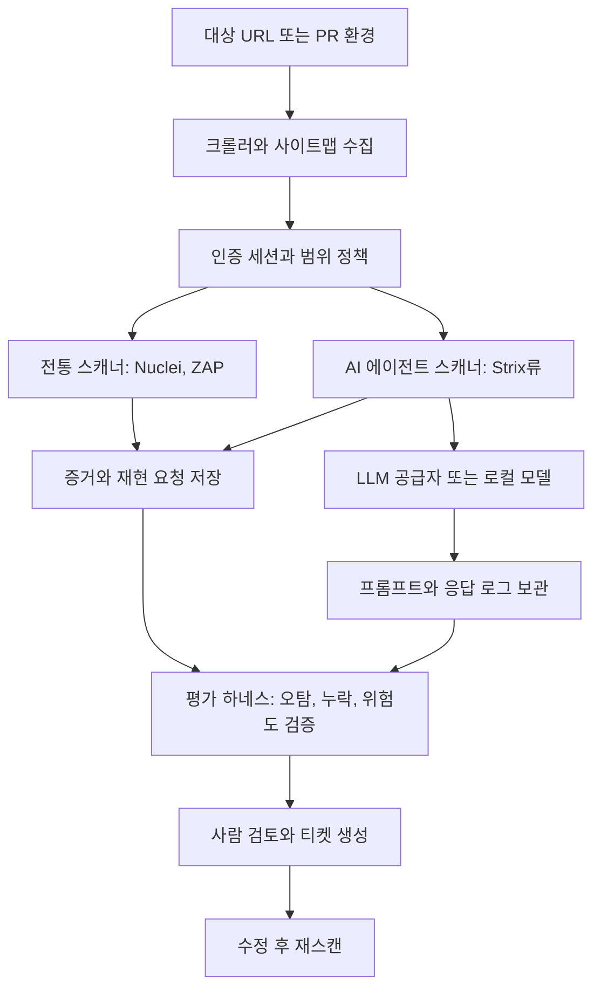

> 한 줄 요약: AI 에이전트 보안 테스트는 Strix 같은 자동화 도구 하나로 끝나지 않는다. 프롬프트 인젝션, 권한 경계, 평가 체계, 기존 DAST 도구와의 역할 분리를 함께 정해야 한다.

## 왜 지금 이슈인가

AI 에이전트 보안, 자동화 침투 테스트, 프롬프트 인젝션은 따로 떨어진 주제가 아니다. 테스트 자동화에 LLM(Large Language Model)이 들어오면서 취약점 탐지와 보고서 작성은 빨라졌지만, 테스트 도구 자체도 새로운 공격 표면이 됐다.

Strix는 이 변화를 잘 보여주는 사례다. URL을 넣으면 웹 애플리케이션을 크롤링하고, XSS(Cross-Site Scripting), SQLi(SQL Injection), SSRF(Server-Side Request Forgery) 같은 흔한 취약점을 시험한 뒤, LLM으로 PoC(Proof of Concept)와 수정 제안을 만든다. 선정 글감의 DVWA(Damn Vulnerable Web Application) 테스트에서는 20개 엔드포인트 중 18개를 찾고, 의도된 취약점 5개 중 4개를 잡았다. 대신 오탐 2개와 누락 1개가 있었다.

숫자만 보면 가볍게 붙여볼 만한 도구처럼 보인다. 문제는 실무의 보안 테스트가 단순히 취약점 후보를 더 빨리 많이 찾는 일이 아니라는 점이다.

AI가 요청을 만들고, 응답을 해석하고, 보고서 문장까지 생성하는 순간 이런 질문이 따라온다.

- 이 결과를 어느 정도 신뢰할 수 있는가?
- 테스트 도구가 접근한 쿠키, 토큰, 내부 URL은 어디까지 흘러가는가?
- LLM이 읽는 페이지에 악성 지시문이 숨어 있으면 어떻게 되는가?
- CI/CD(Continuous Integration/Continuous Delivery)에 넣었을 때 오탐과 장애 비용은 누가 감당하는가?

GitLost 사례는 이 긴장을 더 분명하게 보여준다. Noma Security는 GitHub의 Agentic Workflows에서 공개 저장소 이슈에 심은 악성 지시가 AI 에이전트를 통해 같은 조직의 비공개 저장소 데이터 유출로 이어질 수 있음을 보였다. 핵심은 에이전트가 읽는 입력이 모두 신뢰할 수 있는 텍스트가 아니라는 점이다.

보안 테스트를 자동화하려고 AI 에이전트를 도입했는데, 그 에이전트가 공격자의 문장을 실행 계획처럼 받아들이면 방어 도구가 침투 경로가 된다.

## 커뮤니티에서 갈리는 지점

커뮤니티에서 의견이 갈리는 이유는 단순하다. AI 보안 도구는 쓸모가 없어서 논쟁적인 게 아니다. 쓸모가 있는 만큼 위험한 위치에 들어가기 쉽기 때문이다.

한쪽에서는 Strix 같은 도구를 빠른 1차 점검 도구로 본다. 독립 개발자나 작은 팀이 매번 Burp Suite, OWASP ZAP, Nuclei, Sn1per를 조합해 돌리기 어렵다면, URL 하나로 취약점 후보와 수정 방향을 받는 경험은 꽤 유용하다. 특히 보안 전담자가 없는 팀에서는 낮은 진입 장벽 자체가 가치가 된다.

반대쪽 우려는 더 운영에 가깝다. 선정 글감에서도 Strix는 SPA(Single Page Application)에 약하다고 지적된다. requests와 BeautifulSoup 기반 크롤러는 JavaScript를 실행하지 않기 때문에 React, Vue 같은 프런트엔드 라우팅 뒤의 API를 놓치기 쉽다. 쿠키 처리도 복수 쿠키에서 문제가 있었고, 기본 병렬성이 WAF(Web Application Firewall)의 차단을 부를 수 있다는 지적도 있었다.

즉, Strix의 약점은 모델 성능만의 문제가 아니다. 크롤러, 세션 처리, 레이트 리밋, 인증 흐름, 보고서 평가까지 이어지는 전체 하네스(Test Harness)의 문제다.

Nuclei와의 비교도 여기서 갈린다. Nuclei는 커뮤니티 템플릿 기반으로 넓은 취약점 패턴을 안정적으로 재현하는 쪽에 강하다. 반면 Strix는 템플릿이 없어도 LLM으로 PoC와 수정 제안을 만들 수 있다는 장점이 있다. 두 도구의 차이는 자동화 방식의 차이에 가깝다.

| 관점 | 템플릿 기반 도구 | AI 에이전트 기반 도구 |
|---|---|---|
| 강점 | 재현성, 비교적 안정적인 탐지 조건 | 빠른 해석, PoC와 설명 생성 |
| 약점 | 새 패턴 대응에 템플릿 필요 | 환각, 오탐, 입력 오염 |
| 운영 포인트 | 템플릿 품질과 업데이트 | 권한, 프롬프트, 평가, 로그 |
| 적합한 위치 | CI 보안 게이트, 반복 점검 | 초기 탐색, 보조 분석, 리포트 초안 |

Stack Overflow Blog의 AI 앱 논의도 같은 맥락으로 읽을 수 있다. 좋은 AI 애플리케이션은 데모가 아니라 평가(Evaluation) 체계와 피드백 루프를 가진 시스템에 가깝다. 보안 테스트라면 더 그렇다. 탐지 결과가 그럴듯한 문장인지보다, 같은 조건에서 재현되는지, 사람 검토 전에 위험도를 어떻게 낮추는지, 실패했을 때 어떤 기록이 남는지가 더 중요한 기준이 된다.

## 아키텍처 관점에서 볼 점

AI 보안 테스트 도구를 단일 스캐너로 보면 과소평가하거나 과신하기 쉽다. 여러 단계의 파이프라인으로 보는 편이 현실적이다.

이 구조에서 먼저 볼 것은 입력 경계다. AI 에이전트는 HTML, 이슈 본문, README, 에러 메시지, API 응답처럼 다양한 텍스트를 읽는다. GitLost 사례처럼 신뢰할 수 없는 텍스트에 숨은 지시가 에이전트의 행동으로 이어질 수 있다면, 스캐너는 읽기 도구가 아니라 권한을 가진 실행 주체가 된다.

두 번째는 권한 경계다. 보안 테스트 도구는 쿠키, 세션, API 키, 사내 도메인 정보를 받기 쉽다. Strix처럼 `OPENAI_API_KEY`를 쓰거나 Ollama 같은 로컬 모델을 선택할 수 있는 구조라면, 팀은 비용뿐 아니라 데이터 이동 경로도 함께 판단해야 한다. 외부 LLM에 요청과 응답 일부가 전달되는지, 민감한 파라미터가 마스킹되는지, 리포트가 어디에 저장되는지 확인해야 한다.

세 번째는 장애 격리다. 스캐너가 기본 병렬성으로 대상 서비스를 강하게 때리면 취약점 탐지가 아니라 장애 테스트가 된다. 선정 글감에서는 기본 동시성 16이 WAF 차단을 부를 수 있어 레이트 리밋을 낮추는 우회가 언급됐다. CI에 붙일수록 이 문제는 커진다. 개발 브랜치마다 스캐너가 돌고, 프리뷰 환경이 제한된 리소스를 공유한다면, 보안 자동화가 배포 파이프라인 전체를 느리게 만들 수 있다.

네 번째는 평가 데이터다. Stack Overflow Blog에서 말한 AI 앱 평가 관점은 보안 자동화에도 바로 적용된다. 단순히 발견 개수만 세면 안 된다. 최소한 다음 항목은 별도로 기록해야 한다.

- 재현 가능한 요청과 응답
- 탐지 근거가 된 파라미터와 페이로드
- 오탐으로 판정된 이유
- 누락된 취약점 유형
- 모델, 프롬프트, 도구 버전
- 인증 상태와 테스트 범위

보안 테스트에서 문장이 매끄러운 리포트는 최종 산출물이 아니다. 재현 가능한 증거가 산출물이다.

## 실무에서 볼 점

AI 기반 침투 테스트 도구를 도입할 때 가장 위험한 문장은 기존 보안 도구를 대체한다는 말이다. 지금 더 현실적인 위치는 보조 레이어다.

실제로는 이런 식으로 단계를 나누는 편이 낫다.

| 단계 | 목표 | 추천 조합 |
|---|---|---|
| 로컬 개발 | 낮은 비용의 빠른 점검 | Strix류 도구 + 로컬 모델 |
| PR 검증 | 반복 가능한 보안 게이트 | Nuclei, ZAP baseline, 제한된 AI 리포트 |
| 릴리스 전 | 깊은 검증과 감사 흔적 | ZAP active scan, 수동 테스트, 티켓 기반 추적 |

Strix의 장점은 개발자가 취약점 종류와 수정 방향을 빠르게 이해하는 데 있다. SQL Injection 후보를 찾고 prepared statement 예시를 보여주는 식의 피드백은 학습과 초기 수정에 유용하다. 반대로 Blind SQLi처럼 시간 기반 페이로드가 필요한 문제, 복잡한 권한 상승, 업무 로직 결함은 자동 크롤러와 LLM 리포트만으로 잡기 어렵다.

운영 리스크는 더 직접적으로 봐야 한다.

- 생산 환경 직접 스캔은 기본적으로 피한다.
- 테스트 계정 권한을 최소화한다.
- 쿠키와 토큰은 만료 시간이 짧은 전용 값을 쓴다.
- 외부 LLM 사용 시 요청 본문과 응답 로그의 민감정보를 마스킹한다.
- 레이트 리밋과 제외 경로를 기본값으로 둔다.
- 오탐을 티켓으로 자동 발행하기 전에 검증 단계를 둔다.

특히 AI 에이전트는 결과를 설득력 있게 쓸 수 있다. 그래서 더 위험하다. 모호한 근거가 잘 쓰인 문장으로 포장되면, 개발자는 실제 위험보다 문장 완성도에 끌릴 수 있다. 보안 리포트에는 자연어 설명보다 curl 재현 명령, 원본 응답 일부, CWE(Common Weakness Enumeration), 영향 범위, 수정 후 재검증 결과가 먼저 와야 한다.

GitLost가 던지는 교훈도 도입 조건에 들어가야 한다. 에이전트가 외부 입력을 읽고 내부 자원에 접근한다면, 프롬프트 인젝션 방어를 별도 기능으로 취급하면 안 된다. 권한 분리, 도구 호출 제한, 저장소 범위 제한, 비공개 데이터 접근 차단이 기본 설계에 들어가야 한다.

가능한 대안은 세 가지다.

첫째, 전통 도구 중심으로 유지하고 AI는 리포트 정리만 맡긴다. 가장 보수적이지만 재현성과 감사에는 유리하다.

둘째, Strix 같은 AI 스캐너를 개발 환경에만 붙인다. 개발자 피드백은 빨라지지만, 운영 보안 판단에는 별도 검증이 필요하다.

셋째, AI 에이전트를 CI 보안 파이프라인에 넣되 샌드박스와 평가 하네스를 강하게 둔다. 자동화 범위는 넓어지지만, 권한 설계와 로그 관리 비용이 따라온다.

현업에서 비슷한 고민을 하다 보면 도구 선택보다 먼저 정해야 하는 것이 있다. 이 스캔 결과가 배포를 막을 수 있는가, 아니면 참고 신호인가. 이 기준이 없으면 오탐은 배포 병목이 되고, 누락은 잘못된 안심으로 바뀐다.

## 정리

AI 에이전트 보안 테스트의 핵심은 더 똑똑한 스캐너를 고르는 일이 아니다. 신뢰할 수 없는 입력을 읽는 에이전트에게 어디까지 권한을 줄지, 그 결과를 어떤 평가 하네스로 검증할지 정하는 일이다.

Strix는 빠른 탐색과 학습용 보안 자동화에는 쓸 만하다. 하지만 Nuclei, OWASP ZAP, 수동 테스트를 대체하는 생산급 판단 엔진으로 두기에는 크롤링, 오탐, 프롬프트 인젝션, 데이터 노출 리스크를 더 다뤄야 한다.

당장 확인할 것은 하나다. 지금 팀의 보안 스캐너나 AI 에이전트가 읽는 입력과 접근 가능한 비밀값 목록을 나란히 적어보는 것이다. 그 둘이 같은 실행 경계 안에 있다면, 도구 도입보다 권한 분리가 먼저다.

## 참고 자료

- [선정 글감] [Strix 测评：开源AI渗透测试工具，7.5k Stars但别急着上生产](https://dev.to/ferryman1980/strix-ce-ping-kai-yuan-aishen-tou-ce-shi-gong-ju-75k-starsdan-bie-ji-zhao-shang-sheng-chan-2ja3) — DEV Community
- [관련] [GitLost: We Tricked GitHub's AI Agent into Leaking Private Repos](https://noma.security/blog/gitlost-how-we-tricked-githubs-ai-agent-into-leaking-private-repos/) — Noma Security
- [관련] [The good, the bad, and the AI apps](https://stackoverflow.blog/2026/07/03/the-good-the-bad-and-the-ai-apps/) — Stack Overflow Blog