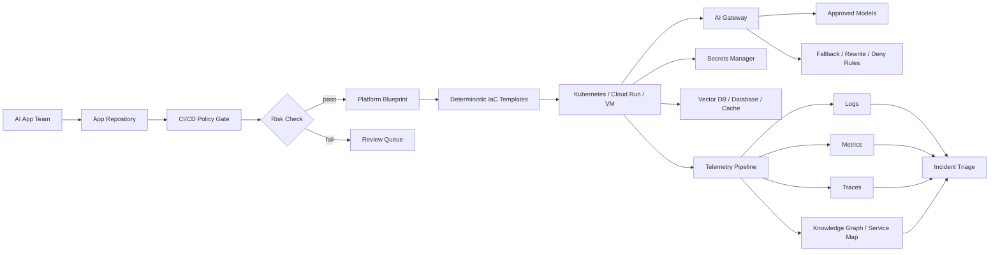

> 한 줄 요약: AI 애플리케이션 운영에서 어려운 지점은 모델을 고르는 데서 끝나지 않는다. DevOps, MLOps, 보안 게이트웨이, 관측성, IaC 거버넌스를 어디에 둘지 정해야 한다. 앱 팀의 속도가 빨라질수록 플랫폼 경계가 흐리면 운영팀은 늦고 위험한 시점에 호출된다.

## 왜 지금 이슈인가

AI 애플리케이션 운영과 DevOps 병목은 같이 봐야 한다. 문제는 AI 앱이 많이 만들어진다는 사실보다, 배포 기준을 누가 정하고 장애를 누가 책임지는지 흐려진다는 데 있다.

원문 글은 이 갈등을 직설적으로 짚는다. 비즈니스 팀이나 제품 팀이 로우코드 도구, 사전 학습 모델, 개인 클라우드 계정, 무료 티어로 AI 앱을 빠르게 만들고, 나중에 보안, 로그, 에러 처리, 확장성 문제가 터지면 DevOps와 엔지니어링 팀이 뒤처리를 맡게 된다는 이야기다.

커뮤니티에서 이 주제가 자주 언급되는 이유는 익숙한 패턴이 반복되기 때문이다. 처음에는 프로토타입이었다. 다음에는 내부 도구가 됐다. 그러다 어느 순간 고객 데이터나 운영 워크플로를 건드린다. 그때부터는 누가 만들었는지보다 누가 책임질 수 있는지가 더 중요해진다.

AI 코딩 에이전트와 로우코드 도구는 애플리케이션 생성 비용을 낮춘다. 다만 운영 가능한 시스템으로 만드는 비용까지 사라지지는 않는다. Stack Overflow Blog가 다룬 관점처럼 프로덕션 장애는 코드 한 줄보다 시스템 간 상호작용에서 더 자주 드러난다. AI 앱은 그 상호작용 지점을 더 늘린다.

## 커뮤니티에서 갈리는 지점

### AI 앱을 빨리 만들게 할 것인가, 배포 문턱을 높일 것인가?

한쪽은 AI 앱 개발 속도를 막지 말자고 말한다. 내부 업무 자동화, 고객 응대 보조, 검색형 지식베이스, 리포트 생성 도구는 작은 팀에서도 빠르게 만들 수 있어야 한다. 모든 실험에 Kubernetes, Terraform, 보안 리뷰, 관측성 표준을 요구하면 시도 자체가 줄어든다.

다른 쪽은 운영 경계를 늦게 세울수록 비용이 커진다고 본다. 하드코딩된 API 키, 민감정보가 남는 로그, 모델 버전 미관리, 임시 스토리지, 공개된 엔드포인트는 처음에는 사소해 보인다. 하지만 배포 후 사용자가 생기면 고치기 어려운 계약이 된다.

실무에서는 속도와 통제를 둘 중 하나로 고르기보다, 실험 단계와 운영 단계의 문턱을 다르게 설계하는 편이 맞다.

| 단계 | 허용할 수 있는 것 | 막아야 하는 것 |
|---|---|---|
| 개인 실험 | 샌드박스, 더미 데이터, 짧은 TTL 리소스 | 실데이터, 개인 클라우드 계정 상시 운영 |
| 팀 파일럿 | 제한된 사용자, 표준 로그, 비용 한도 | 인증 없는 공유 링크, 수동 배포 |
| 운영 서비스 | IaC, 비밀 관리, 감사 로그, SLO | 소유자 불명 앱, 모델 버전 미기록 |

### AI가 인프라를 생성해도 될까?

관련 글인 DeployCraft AI 사례는 참고할 만하다. 이 글은 LLM이 Kubernetes YAML이나 Docker Compose를 직접 쓰게 하지 않고, 설정값을 규칙 엔진으로 통과시킨 뒤 템플릿으로 산출물을 만든다고 설명한다. AI는 설명과 조언을 맡고, 인프라 파일 생성은 결정론적인 경로에 둔다.

이 구분은 실무에서 꽤 유용하다. LLM이 매번 다른 YAML을 만들면 리뷰가 어려워진다. 반대로 입력 스키마, 규칙 엔진, 템플릿을 고정하면 같은 조건에서 같은 결과가 나온다. AI는 아키텍처 후보와 이유를 설명하고, 배포 산출물은 플랫폼 코드가 만든다.

Vercel AI Gateway의 라우팅 규칙도 비슷한 방향을 보여준다. 모델 장애나 폐기 상황에서 애플리케이션 코드를 다시 배포하지 않고 게이트웨이 레벨에서 rewrite 또는 deny 규칙을 적용한다. 모델 선택을 앱 내부 곳곳에 두지 않고 중앙 통제면에 올리는 방식이다.

AI 운영에서는 바뀌어도 되는 부분과 바뀌면 안 되는 부분을 나누는 일이 먼저다.

## 아키텍처 관점에서 볼 점

### AI 애플리케이션 운영 아키텍처는 어디에 경계선을 그어야 할까?

AI 앱은 일반 웹앱보다 의존성이 넓다. 프롬프트, 모델, 벡터 데이터베이스(Vector Database), 캐시, 파일 저장소, 외부 API, GPU 리소스, 관측성 파이프라인이 함께 움직인다.

그래서 운영 경계를 애플리케이션 저장소 하나에만 둘 수는 없다. 최소한 네 개의 통제면이 필요하다.

- 배포 통제면: CI/CD, IaC, 환경 분리, 롤백
- 모델 통제면: 모델 허용 목록, fallback, 라우팅, 비용 제한
- 데이터 통제면: PII 탐지, 로그 마스킹, 보존 기간, 접근 권한
- 관측성 통제면: 로그, 메트릭, 트레이스, 프로파일, 의존성 그래프

이를 한 장으로 그리면 이런 구조가 된다.

이 구조에서 DevOps 팀은 모든 앱을 손으로 배포하는 팀이 아니다. 플랫폼이 허용하는 경로를 만들고 관리한다. 앱 팀은 그 경로 안에서 빠르게 움직이고, 위험한 변경은 게이트에서 멈춘다.

Grafana Cloud의 풀스택 관측성 사례는 장애 조사 관점에서 이 문제를 다룬다. 서비스, 파드(Pod), 노드(Node), 네임스페이스(Namespace), 클러스터, 데이터베이스, 클라우드 계정을 지식 그래프(Knowledge Graph)로 연결해 로그, 메트릭, 트레이스, 프로파일을 이어 본다는 접근이다. AI 앱이 많아질수록 어디서부터 봐야 할지 모르는 장애가 늘어난다. 그래서 신호를 한 화면에 모으는 것보다 관계를 모델링하는 쪽이 더 유효하다.

HashiCorp의 Azure 인프라 글은 다른 층을 짚는다. 포털에서 임시로 만든 리소스, PoC에서 운영으로 넘어온 리소스, 장애 중 수동 수정된 리소스, 인수한 팀의 구독처럼 Terraform 밖에 있는 인프라 드리프트(Drift)가 커진다는 이야기다. AI 앱이 늘면 이 드리프트는 더 빨리 쌓인다. 생성 속도가 빨라진 만큼 발견과 수렴도 자동화해야 한다.

### Kubernetes가 답일까, 관리형 런타임이 답일까?

Kubernetes는 AI 앱 운영에서 매력적인 선택지다. GPU 노드풀, 네임스페이스 격리, 네트워크 정책, 시크릿 연동, 오토스케일링, 서비스 메시, 관측성 에이전트를 표준화하기 좋다.

하지만 모든 AI 앱을 Kubernetes에 올리는 것도 과하다. 내부 챗봇 하나를 운영하려고 클러스터 권한, Helm 차트, HPA, Ingress, 서비스 계정을 모두 다루게 하면 앱 팀은 우회로를 찾는다.

실무 기준은 런타임보다 운영 요구사항에서 출발하는 편이 낫다.

| 조건 | 더 단순한 런타임 | Kubernetes 검토 |
|---|---|---|
| 트래픽 | 낮고 예측 가능 | 변동 크고 스케일 필요 |
| 데이터 | 비민감 더미 또는 공개 데이터 | 개인정보, 고객 데이터, 규제 데이터 |
| 의존성 | 단일 API 호출 중심 | DB, 벡터 DB, 큐, GPU, 캐시 조합 |
| 장애 영향 | 개인 생산성 저하 | 고객 영향, 매출 영향, 규제 영향 |
| 운영 주체 | 앱 팀 직접 관리 | 플랫폼 팀 표준 운영 |

문제는 Kubernetes 자체보다, 운영 기준 없이 런타임을 고르는 습관이다. Cloud Run 같은 관리형 런타임이든 Kubernetes든 최소 기준은 같아야 한다. 비밀은 코드에 없어야 하고, 로그에는 민감정보가 남지 않아야 하며, 모델과 프롬프트 변경은 추적되어야 한다.

## 실무에서 볼 점

### AI DevOps 도입 전에 확인할 조건

AI 앱을 운영 경로에 올리기 전에 먼저 봐야 할 것은 기술 스택 목록이 아니다. 소유권과 중단 조건이다.

- 서비스 소유자가 명확한가?
- 장애 시 누가 첫 응답자인가?
- 모델 장애 시 fallback이 있는가?
- 프롬프트와 모델 버전 변경 이력이 남는가?
- 개인 식별 정보(PII)가 프롬프트, 응답, 로그에 남는가?
- 비용 상한과 호출량 제한이 있는가?
- 데이터 삭제 요청을 처리할 수 있는가?
- IaC 밖에서 만들어진 리소스를 탐지할 수 있는가?

이 질문에 답하지 못하면 앱은 아직 운영 서비스가 아니다. 데모이거나 파일럿이다. 둘을 섞으면 운영팀이 뒤늦게 위험을 떠안는다.

### 실패하기 쉬운 지점

첫 번째는 정책을 문서로만 두는 것이다. 위키에 AI 앱 배포 가이드를 써도 배포 경로가 열려 있으면 사람들은 바쁜 순간에 우회한다. 정책은 CI/CD, 클라우드 계정, 게이트웨이, 비밀 관리 도구 안에 들어가야 한다.

두 번째는 DevOps가 모든 리뷰를 손으로 하게 만드는 것이다. 보안 검토를 강화한다면서 티켓 승인만 늘리면 병목은 더 커진다. 반복 가능한 검사는 자동화하고, 사람이 봐야 하는 것은 데이터 민감도, 외부 공개 여부, 규제 영향, 예외 승인 정도로 좁혀야 한다.

세 번째는 관측성을 로그 수집으로 착각하는 것이다. AI 앱 장애는 단순 에러 로그보다 느린 응답, 특정 모델만 실패, 벡터 검색 품질 저하, 토큰 비용 급증, rate limit, 캐시 오염처럼 나타난다. 로그, 메트릭, 트레이스가 서비스와 인프라 관계로 연결되어야 원인을 좁힐 수 있다.

네 번째는 모델 라우팅을 앱 코드에 박아두는 것이다. 모델명이 코드 곳곳에 흩어지면 공급자 장애, 가격 변경, 모델 폐기 때마다 배포가 필요하다. Vercel AI Gateway의 routing rules 같은 접근은 이 위험을 줄인다. 모든 팀이 같은 제품을 써야 한다는 뜻은 아니다. 모델 선택과 차단을 중앙 정책으로 다룰 통제면이 필요하다는 뜻이다.

### AI 에이전트와 인프라 자동화의 안전한 역할 분담

AI 에이전트에게 맡길 수 있는 일과 맡기면 곤란한 일을 나누면 운영 설계가 선명해진다.

| 영역 | AI에 맡기기 좋은 일 | 결정론적 시스템에 둘 일 |
|---|---|---|
| 아키텍처 | 선택지 설명, 위험 목록화 | 배포 토폴로지 확정 |
| IaC | 템플릿 선택 보조 | Terraform, Helm, YAML 생성 |
| 보안 | 누락 가능성 제안 | 정책 검사, 시크릿 스캔, 차단 |
| 장애 대응 | 원인 후보 정리 | 알림 라우팅, 권한 변경, 롤백 실행 |
| 비용 | 비용 요인 설명 | 예산 한도, quota, 강제 종료 |

DeployCraft AI 사례는 여기서 원칙 하나로 정리할 수 있다. LLM은 설명자와 조언자로 두고, 실제 인프라 변경은 스키마와 규칙 엔진과 템플릿을 통과하게 한다. 이렇게 하면 AI를 쓰면서도 재현성과 감사 가능성을 잃지 않는다.

## 정리

AI 앱 운영의 병목은 DevOps 인력이 부족해서만 생기지 않는다. 앱을 만드는 경로는 빨라졌는데, 운영 가능한 서비스로 승격시키는 경로는 그대로라서 생긴다.

지금 확인할 일은 단순하다. 조직 안의 AI 앱 하나를 골라 모델, 데이터, 배포, 비밀, 로그, 비용, 장애 소유자를 한 줄씩 적어보면 된다. 빈칸이 많다면 그 앱은 기능보다 운영 부채에 가깝다.

## 참고 자료

- [선정 글감] AI Application Development Overburdens DevOps Teams: Bridging the Knowledge Gap for Sustainable Operations - DEV Community  
  https://dev.to/maricode/ai-application-development-overburdens-devops-teams-bridging-the-knowledge-gap-for-sustainable-2kd0
- [관련] I Built an AI That Designs MLOps Infrastructure (Without Letting AI Generate YAML) - DEV Community  
  https://dev.to/upshivam786/i-built-an-ai-that-designs-mlops-infrastructure-without-letting-ai-generate-yaml-5akh
- [관련] Routing rules now available on AI Gateway - Vercel Blog  
  https://vercel.com/changelog/ai-gateway-routing-rules
- [관련] Full-stack observability in Grafana Cloud: How to investigate issues across services and infrastructure - Grafana Blog  
  https://grafana.com/blog/full-stack-observability-in-grafana-cloud-how-to-investigate-issues-across-services-and-infrastructure/
- [관련] Code isn’t the only thing causing your production failures - Stack Overflow Blog  
  https://stackoverflow.blog/2026/06/25/code-isnt-causing-your-production-failures/
- [관련] Discover, govern, and scale Azure infrastructure in the AI era - HashiCorp Blog  
  https://www.hashicorp.com/blog/discover-govern-and-scale-azure-infrastructure-in-the-ai-era