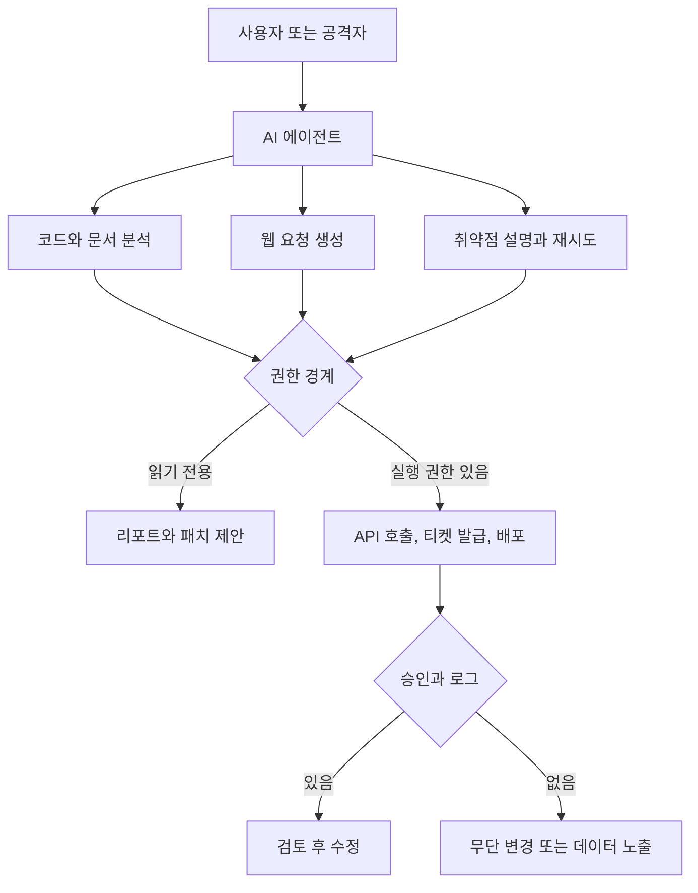

> 한 줄 요약: AI 사이버보안 논쟁의 핵심은 모델이 해킹을 얼마나 잘하느냐보다, 기술 능력이 없는 사람도 실행 능력을 빌릴 수 있게 된다는 데 있다. 해법도 모델 차단보다는 권한, 로그, 승인, 책임 구조를 다시 설계하는 쪽에 가깝다.

## 무슨 일이 있었나

2026년 7월 9일, Bruce Schneier는 Five Eyes 국가 보안기관의 AI 사이버 위험 경고를 다루며 기술 능력과 실행 능력의 분리를 이야기했다. Five Eyes는 미국, 영국, 캐나다, 호주, 뉴질랜드를 가리킨다. Schneier가 소개한 공동성명은 2026년 7월 초 발표된 것으로 설명된다.

경고의 범위는 챗봇 하나에 그치지 않는다. 코드 분석, 취약점 탐색, 자동화 에이전트, 로컬 오픈 모델, 여러 모델을 묶어 쓰는 작업 흐름까지 포함한다.

확인된 사실과 아직 해석이 필요한 부분을 나누면 이렇다.

| 구분 | 내용 |
|---|---|
| 중심 쟁점 | AI가 해킹 기술 자체를 새로 만든 것이 아니라, 기술과 실행 능력의 간격을 더 벌린다는 주장 |
| 당사자 | Five Eyes 국가 보안기관, AI 모델 제공사, 보안 연구자, 정부·기업 시스템 운영자, 오픈 모델 커뮤니티 |
| 시점 | Schneier 글은 2026년 7월 9일 공개, Anthropic의 앨버타 사례는 2026년 7월 6일 공개, WIRED 사례는 2026년 4월 취약점 발견 보도를 바탕으로 함 |
| 확인된 변화 | AI가 코드 리뷰, 취약점 분석, 보안 대응 자동화에 실제로 쓰이고 있음 |
| 아직 추정인 부분 | 로컬 오픈 모델이 대규모 자율 공격을 얼마나 빠르게 일반화할지, 모델 규제나 가드레일이 어느 정도 효과를 낼지 |

Schneier의 글에서 핵심은 단순하다. 예전에는 시스템을 공격하려면 네트워크, 운영체제, 프로토콜, 익스플로잇을 알아야 했다. 도구가 보급되면서 그 장벽은 이미 낮아졌고, AI는 그 간격을 더 벌린다.

방어 쪽에서도 비슷한 흐름이 보인다. Anthropic은 2026년 7월 6일, 캐나다 앨버타 주정부가 2025년부터 Claude Code와 Opus, Sonnet 모델을 이용해 정부 시스템의 취약점을 찾고 고쳤다고 밝혔다. 앨버타 주정부 기술혁신부는 27개 부처의 약 1,280개 애플리케이션과 3,400개 코드 저장소를 다루며, 20시간 동안 4억 6,600만 줄의 코드를 스캔했다고 설명했다.

다만 이 사례는 Anthropic이 공개한 고객 사례다. 독립 감사 보고서처럼 읽기보다는, 큰 조직이 AI를 방어 자동화에 쓰기 시작했다는 근거 정도로 보는 편이 맞다.

반대 방향의 사례도 있다. WIRED 보도에 따르면 보안 연구자 Ian Carroll은 2026년 4월 Claude Opus 4.7을 사용해 Front Gate Tickets의 취약점을 찾았다. Front Gate Tickets는 Live Nation Entertainment 산하 티켓팅 서비스로, Lollapalooza, Bonnaroo, South by Southwest, Austin City Limits 같은 미국 주요 음악 페스티벌의 티켓을 처리한다고 보도됐다.

WIRED가 전한 내용은 꽤 불편하다. Carroll은 해당 취약점으로 고객 또는 직원 기록에 접근할 수 있고, 임의의 이벤트 티켓을 발급할 수 있었다고 말했다. 그는 이를 악용하지 않고 제보했으며, Front Gate는 취약점을 패치했다고 WIRED에 밝혔다.

같은 능력이 정부 시스템 점검에도 쓰이고, 티켓팅 플랫폼의 치명적인 권한 오류를 찾는 데도 쓰인다. 그래서 이 이슈는 AI가 위험하다는 말로만 정리하기 어렵다. 방어자에게 필요한 능력을 공격자에게만 금지할 수 있는가라는 질문이 남는다.

## 왜 사람들이 반응했나

커뮤니티가 예민하게 반응한 지점은 해킹 자동화 자체만이 아니다. 자동화된 공격 도구는 예전부터 있었다. 달라진 것은 누가 그 도구를 다룰 수 있느냐다.

예전의 스크립트 키디(script kiddie)는 남이 만든 도구를 실행하는 사람에 가까웠다. AI 에이전트는 여기서 한 칸 더 나아간다. 사용자가 취약점의 원리를 몰라도 모델이 코드 흐름을 읽고, 의심 지점을 좁히고, 요청을 고쳐가며 다음 행동을 제안할 수 있다.

### AI 해킹 논쟁은 보안과 검열 논쟁으로 번진다

대형 AI 회사들은 안전장치(guardrail), 사용 정책, 모니터링, 악용 탐지를 내세운다. API 기반 상용 모델에서는 반복적인 악성 프롬프트, 대량 요청, 자동화된 공격 패턴을 탐지할 여지가 있다.

로컬 오픈 모델은 사정이 다르다. 한 번 배포된 모델은 개인 장비에서 실행될 수 있고, 중간 사업자가 항상 끼어 있지도 않다.

Reddit LocalLLaMA의 GLM-5.2 관련 글은 이 긴장을 잘 보여준다. 일부 커뮤니티 이용자는 언론의 공포 프레임이 오픈 모델 검열이나 배포 제한의 근거로 쓰일 수 있다고 우려했다. 이 반응이 전체 오픈 모델 커뮤니티를 대표한다고 보기는 어렵지만, 규제 논의가 어디에서 불신을 만드는지는 보여준다.

여기서 논쟁은 보안과 자유의 단순한 충돌이 아니다. 모델이 배포된 뒤 통제 가능성이 급격히 떨어지는 구조를 어떻게 다룰지의 문제다.

### 위험은 모델 성능보다 연결된 권한에서 커진다

AI 모델이 답변만 하는 도구라면 피해는 제한적일 수 있다. 위험은 모델이 코드 저장소, CI/CD, 클라우드 콘솔, 이슈 트래커, 내부 문서, 티켓 발급 시스템과 연결될 때 커진다.

Front Gate Tickets 사례가 불편한 이유도 여기에 있다. 티켓 발급 취약점은 단순 웹 버그처럼 보일 수 있지만, 실제 피해 범위는 금전, 고객 정보, 이벤트 운영, 플랫폼 신뢰로 이어진다. AI는 취약점을 만든 원인이라기보다 취약점 탐색과 실행의 속도를 높인 촉매에 가깝다.

같은 흐름에서도 한쪽은 보안 리뷰가 되고, 다른 한쪽은 공격 체인이 된다. 차이는 모델 성능만으로 생기지 않는다. 접근 권한, 감사 로그, 승인 절차, 실행 환경이 함께 갈라놓는다.

### 공격 비용이 더 빨리 내려간다

방어자는 시스템 전체를 봐야 한다. 오래된 코드, 문서화되지 않은 서비스, 퇴사자가 만든 배치 작업, 권한이 과하게 열린 관리자 페이지까지 챙겨야 한다. 공격자는 하나의 틈만 찾으면 된다.

AI가 공격자의 탐색 비용을 낮추면 이 비대칭은 더 커진다. 그래서 Five Eyes의 조언이 새롭지 않다는 평가도 나온다. 패치 관리, 취약점 탐지, 이상 행위 모니터링, 사고 대응 자동화는 보안팀이 이미 말해온 항목이다.

다만 새롭지 않다고 해서 가볍게 볼 일은 아니다. 이번 논쟁은 미뤄둔 기본기를 더는 미루기 어렵다는 신호에 가깝다.

### AI만 막으면 문제가 사라질까

AI가 해킹 지식을 알려주지 않도록 만들자는 주장은 직관적이다. 하지만 Schneier가 지적하듯 방어 지식과 공격 지식은 출발점이 같다. 취약점을 고치려면 취약점을 이해해야 한다.

보안에서도 인가 우회, 입력 검증 실패, 세션 관리 오류를 설명하지 못하는 모델은 실무 방어 도구로 쓰기 어렵다. 지식을 완전히 차단하는 방식은 오래 버티기 어렵다.

현실적인 쟁점은 지식을 없애는 것이 아니다. 실행 권한과 피해 확산 경로를 어디서 끊을지에 있다.

## 내가 보는 핵심

이번 AI 사이버보안 논쟁에서 자주 빠지는 관점이 있다. 모델이 얼마나 위험한지 묻기 전에, 우리가 얼마나 많은 시스템을 모델에게 맡길 준비가 되어 있는지 물어야 한다.

실제로 AI 도구 도입은 대개 생산성 논리로 시작된다. 오래된 저장소를 빠르게 읽고, 반복되는 취약점 패턴을 찾고, 패치 초안을 만들어주는 기능은 매력적이다. 앨버타 주정부 사례처럼 코드 규모가 큰 조직에서는 사람이 먼저 전부 훑기 어려운 영역을 기계가 스캔하는 방식이 현실적인 선택지가 된다.

하지만 같은 도구가 운영 권한과 붙는 순간 성격이 바뀐다. 코드 리뷰 보조자는 위험이 낮다. 자동 PR 생성은 위험이 중간 정도다. 배포 권한, 티켓 발급 권한, 고객 데이터 조회 권한까지 연결되면 이야기가 달라진다.

그래서 이 이슈의 관건은 AI 안전장치의 유무보다 권한 경계에 있다.

AI가 실수하거나 악용될 수 있다는 전제에서 설계해야 한다. 모델이 좋은 의도를 가졌는지 판단하는 방식으로는 부족하다. 모델이 할 수 있는 일을 줄이고, 사람이 승인해야 하는 지점을 분명히 두고, 사후에 추적 가능한 로그를 남기는 구조가 필요하다.

출발점은 이런 구분이다.

| AI 사용 범위 | 위험도 | 필요한 통제 |
|---|---:|---|
| 공개 코드 설명 | 낮음 | 민감 정보 제거 |
| 내부 코드 취약점 탐색 | 중간 | 저장소 접근 범위 제한, 결과 검토 |
| 패치 자동 생성 | 중간 | 테스트, 리뷰, 승인 |
| 운영 시스템 호출 | 높음 | 최소 권한, 세션 격리, 감사 로그 |
| 고객 데이터 조회·수정 | 매우 높음 | 사람 승인, 정책 엔진, 강한 추적성 |

문제는 AI 사용 여부가 아니다. 어느 지점부터 실행 권한을 주는지가 갈림길이다.

폐쇄 모델과 오픈 모델의 대립도 이 표 안에서 봐야 한다. 폐쇄 모델은 통제와 감사를 제공할 수 있지만, 특정 사업자에게 프롬프트, 로그, 정책 집행 권한이 집중된다. 오픈 모델은 독립성과 검증 가능성을 주지만 배포 이후 사용을 제한하기 어렵다.

둘 중 하나가 정답이라고 말하기는 어렵다. 조직의 데이터 민감도, 규제 환경, 운영 역량, 보안 검토 능력에 따라 선택이 달라진다. 다만 어떤 선택을 하든 모델을 신뢰 경계 안쪽에 넣는 순간, 기존 보안 모델도 같이 바뀌어야 한다.

## 앞으로 볼 기준

다음 AI 보안 뉴스를 볼 때는 모델 이름보다 먼저 범위를 봐야 한다. 어떤 모델이 취약점을 찾았는지보다, 어떤 권한으로 어디까지 접근했는지가 더 큰 정보다.

체크포인트는 다섯 가지다.

- 모델이 단순 조언만 했는가, 실제 시스템 호출까지 했는가
- 접근한 데이터가 공개 코드인가, 내부 저장소인가, 고객 정보인가
- 결과가 사람 검토를 거쳤는가, 자동 실행되었는가
- 실패하거나 악용됐을 때 로그와 책임 경로가 남는가
- 같은 능력을 방어에도 충분히 쓰고 있는가

정부와 공공기관의 AI 보안 도입은 더 세밀하게 봐야 한다. 앨버타 사례처럼 낡고 큰 시스템을 빠르게 점검하는 효과는 분명히 있다. 동시에 공공 시스템은 복지, 의료, 세금, 재난 대응처럼 시민의 민감한 데이터와 연결된다. 빠르게 찾는 능력만큼, 잘못 고치지 않는 절차도 필요하다.

플랫폼 기업도 마찬가지다. Front Gate Tickets 사례는 티켓팅이라는 익숙한 서비스에서도 권한 오류 하나가 경제적 피해와 개인정보 리스크로 번질 수 있음을 보여준다. AI가 붙으면 이런 취약점의 발견 속도가 빨라진다. 좋은 연구자가 먼저 찾으면 패치가 되고, 나쁜 사용자가 먼저 찾으면 사고가 된다.

처음의 긴장은 여기로 돌아온다. AI가 해킹을 가능하게 만든 것이 아니라, 이미 가능했던 일을 더 많은 사람에게 더 싸고 빠르게 열어준다. 그러면 질문도 바뀐다.

AI를 허용할 것인가가 아니라, AI가 들어와도 무너지지 않는 시스템인가. 앞으로의 보안 논쟁은 이 질문에 답하는 조직과 그렇지 못한 조직을 가르는 쪽으로 갈 가능성이 크다.

## 참고 자료

- [선정 글감] [Cybersecurity and the Gap Between Skill and Ability](https://www.schneier.com/blog/archives/2026/07/cybersecurity-and-the-gap-between-skill-and-ability.html) — Schneier on Security
- [관련] [Government of Alberta uses Claude to find and fix cybersecurity vulnerabilities across government systems](https://www.anthropic.com/news/alberta-government-claude-cybersecurity) — Anthropic News
- [관련] [Claude Helped a Hacker Find a Way to Issue Tickets to Almost Every US Music Festival](https://www.wired.com/story/claude-helped-a-hacker-find-a-way-to-issue-tickets-to-almost-every-us-music-festival/) — WIRED Security
- [관련] [GLM-5.2 fearmongering in the press](https://www.reddit.com/r/LocalLLaMA/comments/1urhzox/glm52_fearmongering_in_the_press/) — Reddit LocalLLaMA