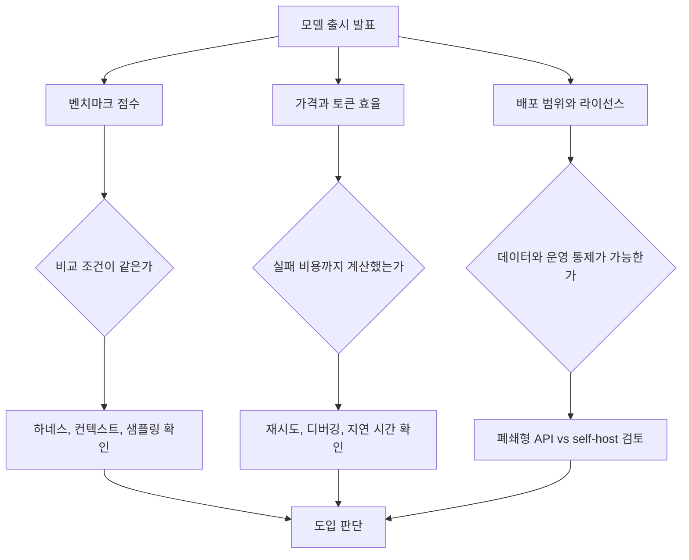

> 한 줄 요약: Grok 4.5 논쟁의 핵심은 누가 1등이냐보다, 폐쇄형 프런티어 모델과 오픈 모델의 격차를 어떤 기준으로 믿을 수 있느냐에 있다. xAI의 출시 차트에 GLM-5.2가 근접한 점수로 등장하면서, 커뮤니티는 성능 숫자보다 벤치마크 해석과 배포 방식의 차이를 더 크게 보기 시작했다.

## 무슨 일이 있었나

2026년 7월 8일, xAI는 Grok 4.5를 공개했다. 발표 페이지에서 Grok 4.5는 코딩, 에이전트 작업, 지식 업무를 겨냥한 모델로 소개됐고, Cursor와 함께 학습됐다는 설명도 붙었다.

가격은 공개 자료 기준 입력 100만 토큰당 2달러, 출력 100만 토큰당 6달러로 제시됐다. 가중치는 공개되지 않은 폐쇄형 모델이며, 유럽연합에서는 7월 중순까지 제공되지 않는다는 조건도 함께 언급됐다.

LocalLLaMA 커뮤니티에서 말이 나온 지점은 따로 있었다. xAI의 자체 차트에 GLM-5.2가 등장했는데, SWE Bench Pro 기준 Grok 4.5가 64.7%, GLM-5.2가 62.1%로 표시됐기 때문이다. 차이는 2.6%포인트다.

확인된 사실과 해석은 나눠야 한다.

- 확인된 사실: xAI 발표 자료는 Grok 4.5의 여러 코딩 벤치마크 점수를 공개했고, 그중 SWE Bench Pro 차트에 GLM-5.2를 비교 대상으로 넣었다.
- 확인된 사실: xAI 자료에서 Grok 4.5는 SWE Bench Pro 64.7%, GLM-5.2는 62.1%로 표시됐다.
- 확인된 사실: 같은 발표는 Grok 4.5가 SWE Bench Pro 작업당 약 1.6만 출력 토큰을 사용했고, Opus 4.8은 약 6.7만 출력 토큰을 사용했다고 주장했다.
- 해석이 필요한 부분: 이 차이가 실제 현업 코딩 능력 차이인지, 특정 하네스(Harness), 샘플링, 컨텍스트, 비용 구조에서 나온 결과인지는 별도 검증이 필요하다.

여기에 OpenAI가 같은 날 공개한 SWE-Bench Pro 감사 글이 겹쳤다. OpenAI는 SWE-Bench Pro에서 약 30%의 태스크가 깨져 있다고 추정했고, 벤치마크 결함이 모델 능력과 안전 판단을 왜곡할 수 있다고 지적했다.

하루 안에 두 가지 메시지가 동시에 나온 셈이다. 한쪽에서는 새 모델의 강점을 벤치마크로 설명했고, 다른 쪽에서는 그 벤치마크 자체를 조심해서 봐야 한다고 말했다.

## 왜 사람들이 반응했나

커뮤니티 반응은 단순한 오픈 모델 응원으로만 보기 어렵다. 불편함은 크게 세 가지로 나뉜다.

첫째, 폐쇄형 모델의 우위가 예전만큼 직관적이지 않다. GLM-5.2가 MIT 라이선스로 self-host 가능한 모델이라는 점 때문에, 2.6%포인트 차이는 숫자 이상의 의미를 가진다.

기업은 절대 점수만 보고 모델을 고르지 않는다. 데이터 반출, 감사 가능성, 장애 대응, 비용 예측, 커스터마이징 가능성이 같이 들어온다. 닫힌 모델이 조금 더 높은 점수를 내더라도, 조직에 따라서는 직접 운영 가능한 모델이 더 설득력 있을 수 있다.

둘째, 벤치마크 비교가 점점 어려워지고 있다. xAI 자료에서도 DeepSWE 1.0과 DeepSWE 1.1의 실행 조건이 다르게 읽힌다. 한쪽은 각 제공자의 하네스 기준이고, 다른 쪽은 Datacurve가 mini-swe-agent 하네스로 실행한 결과다.

같은 모델 이름, 같은 벤치마크 계열처럼 보여도 실행 환경이 바뀌면 결과는 달라진다. 에이전트형 코딩 평가에서는 모델 자체보다 프롬프트, 도구 사용 방식, 토큰 예산, 재시도 정책, 테스트 실행 전략이 성능에 크게 끼어든다.

셋째, 토큰 효율이라는 경쟁축이 더 분명해졌다. Grok 4.5 발표는 단순 점수보다 작업당 출력 토큰 수를 전면에 세웠다. SWE Bench Pro에서 Opus 4.8 대비 4.2배 적은 출력 토큰을 썼다는 주장은 비용과 지연 시간을 보는 팀에게 꽤 민감한 포인트다.

다만 여기에도 함정이 있다. 토큰을 적게 쓰는 모델이 항상 좋은 모델은 아니다. 문제를 짧게 풀어서 성공했다면 효율이지만, 실패 케이스에서 탐색을 덜 한 결과라면 운영 리스크가 된다.

보조 레퍼런스로 올라온 GLM-5.2 실험들도 이 논쟁을 더 현실적으로 만든다. 한 사용자는 753B MoE 모델을 4비트 양자화해 4대의 DGX Spark에서 Terminal-Bench 2.1을 돌렸고, 70.8%를 얻었다고 공유했다. 공식 full model 수치 81.0%와 비교하면 약 10%포인트 낮지만, 작성자도 그 차이에 양자화, 100K 컨텍스트 제한, 토큰 예산, 샘플링 차이가 모두 섞였다고 선을 그었다.

또 다른 사용자는 GLM-5.2 계열의 140GB IQ2_XXS REAP 양자화 버전을 만들고 테스트 참여자를 찾았다. 이 글에서 중요한 부분은 점수 자체보다, 커뮤니티가 대형 모델을 실제 장비 제약 안으로 끌어내리려 한다는 점이다.

그 과정은 매끈하지 않다. 수십 시간 실행, 엔진 크래시, 노드가 멈추는 상황이 따라온다. 그래도 커뮤니티가 반응하는 이유는 분명하다. 이제 모델 성능 논쟁은 논문 표를 보는 일에서, 누가 어떤 비용과 장비로 어디까지 재현할 수 있느냐의 문제로 옮겨가고 있다.

## 내가 보는 핵심

이번 이슈에서 가장 조심해야 할 해석은 GLM-5.2가 Grok 4.5와 거의 같다는 결론이다. 2.6%포인트 차이는 흥미로운 신호지만, 그것만으로 모델 선택을 끝내기에는 부족하다.

반대로 Grok 4.5가 더 높으니 폐쇄형 모델을 쓰면 된다는 결론도 너무 빠르다. SWE-Bench Pro 자체에 결함이 있다는 OpenAI의 지적까지 놓고 보면, 숫자는 출발점이지 결론이 아니다.

실제로 이런 상황에서는 질문을 바꿔야 한다.

- 우리 코드베이스에서 실패를 얼마나 자주 감지할 수 있는가
- 모델이 낸 패치를 테스트와 리뷰로 걸러낼 수 있는가
- 에이전트가 쓰는 토큰과 시간 비용이 예산 안에 들어오는가
- 민감한 코드와 로그를 외부 API로 보내도 되는가
- self-host 모델을 운영할 만큼 GPU, 배포, 모니터링 역량이 있는가

현업에서 비슷한 고민을 하다 보면, 모델 순위표보다 실패 복구 방식이 더 오래 발목을 잡는다. 코딩 에이전트가 한 번에 정답을 내는 경우보다, 틀린 방향으로 길게 추론하거나 테스트를 통과해도 유지보수하기 어려운 패치를 만드는 경우가 더 현실적인 문제다.

그래서 이번 논쟁의 원칙은 이렇게 정리할 수 있다. 코딩 모델 평가는 점수, 비용, 통제권을 같이 봐야 한다.

점수만 보면 폐쇄형 프런티어 모델이 매력적이다. 비용만 보면 토큰 효율이 좋은 모델이 좋아 보인다. 통제권만 보면 오픈 모델이 편하다. 하지만 실제 도입에서는 이 셋을 함께 따져야 한다.

| 판단 기준 | 폐쇄형 API 모델 | 오픈 모델 self-host |
|---|---|---|
| 초기 도입 | 빠르다 | 인프라 준비가 필요하다 |
| 데이터 통제 | 제공자 정책에 의존 | 내부 통제 가능성이 크다 |
| 비용 구조 | 토큰 기반으로 단순 | GPU, 전력, 운영 인력이 포함된다 |
| 재현성 | 내부 동작 확인이 어렵다 | 설정을 고정하면 추적하기 쉽다 |
| 성능 개선 | 제공자 업데이트 의존 | 양자화, 하네스, 프롬프트 실험 가능 |

특히 SWE-Bench Pro 같은 코딩 벤치마크는 실제 업무와 닮아 보이기 때문에 더 위험하다. 그럴듯한 평가일수록 조직 안에서는 숫자가 빠르게 의사결정 언어가 된다. 하지만 태스크 30%가 깨졌을 수 있다는 문제 제기는, 그 숫자를 그대로 구매 근거로 쓰면 안 된다는 경고에 가깝다.

## 앞으로 볼 기준

다음 모델 출시 뉴스를 볼 때는 1등 모델 이름보다 아래 항목을 먼저 확인하는 편이 낫다.

- 같은 벤치마크라도 하네스가 동일한가
- 컨텍스트 길이, 토큰 예산, 샘플링 조건이 공개됐는가
- 실패한 태스크의 유형이 분석됐는가
- 비용 비교가 입력·출력 토큰을 모두 포함하는가
- 속도 수치가 실제 에이전트 루프 지연 시간과 연결되는가
- 오픈 모델 비교 대상이 같은 정밀도와 같은 실행 조건에서 돌았는가
- 라이선스가 상업적 사용, 수정, 재배포를 허용하는가
- EU 같은 지역별 제공 제한이 제품 일정에 영향을 주는가

Grok 4.5 발표가 던진 질문은 새 모델이 얼마나 강한가에 머물지 않는다. 더 까다로운 질문은 이쪽이다. 우리가 믿고 있는 모델 순위표가 실제 의사결정에 쓸 만큼 튼튼한가.

GLM-5.2가 xAI의 차트 안에서 Grok 4.5와 가까운 위치에 놓인 장면은 상징적이다. 오픈 모델이 폐쇄형 모델을 곧바로 대체한다는 뜻은 아니다. 다만 이제는 모델 선택을 브랜드와 최고점만으로 설명하기 어려워졌다는 신호다.

앞으로 코딩 AI를 고를 때는 벤치마크 숫자를 지우지 말되, 그 숫자 옆에 실행 조건과 운영 조건을 반드시 붙여야 한다. 그래야 2.6%포인트 차이가 성능 격차인지, 비용의 차이인지, 통제권의 가격인지 제대로 보인다.

## 참고 자료

- [선정 글감] [Grok 4.5 released - GLM-5.2 shows up in xAI's own charts, 2.6 pts behind on SWE Bench Pro](https://www.reddit.com/r/LocalLLaMA/comments/1ur71hq/grok_45_released_glm52_shows_up_in_xais_own/) — Reddit LocalLLaMA
- [관련] [Grok 4.5](https://x.ai/news/grok-4-5) — xAI
- [관련] [Separating signal from noise in coding evaluations](https://openai.com/index/separating-signal-from-noise-coding-evaluations) — OpenAI Blog
- [관련] [4-bit GLM-5.2 (753B MoE) on 4× DGX Spark](https://www.reddit.com/r/LocalLLaMA/comments/1ur41ou/4bit_glm52_753b_moe_on_4_dgx_spark_708_on/) — Reddit LocalLLaMA
- [관련] [I created a 140 GB IQ2_XXS REAP quant of GLM 5.2 for coding](https://www.reddit.com/r/LocalLLaMA/comments/1ur08mq/i_created_a_140_gb_iq2_xxs_reap_quant_of_glm_52/) — Reddit LocalLLaMA