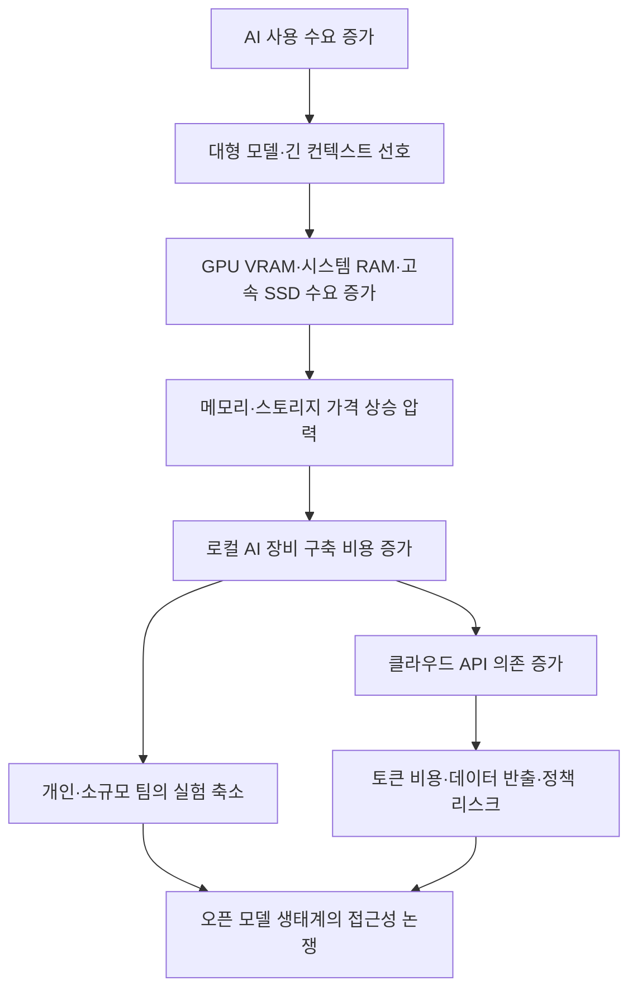

> 한 줄 요약: AI 실행 비용은 모델 성능만으로 결정되지 않는다. 메모리 가격과 공급망도 함께 봐야 한다. LocalLLaMA에서 삼성 반도체 이익 보도에 강한 반응이 붙은 이유도 여기에 있다. 개인과 작은 팀이 오픈 모델을 돌리는 비용 구조가 이미 하드웨어 시장에 묶여 있기 때문이다.

## 무슨 일이 있었나

Reddit LocalLLaMA에 올라온 글 하나가 직설적인 제목으로 반응을 모았다. 글은 Tom's Hardware 보도를 공유하며, 삼성 반도체 부문이 메모리와 스토리지 가격 상승 덕분에 2026년에 과거 40년 이익을 합친 것보다 더 큰 이익을 낼 수 있다는 내용을 전했다.

제공된 요약 기준으로 확인할 수 있는 범위는 여기까지다.

| 구분 | 내용 |
|---|---|
| 당사자 | 삼성 반도체 부문, 메모리·스토리지 구매자, AI 인프라 사용자 |
| 시점 | 2026년 실적 전망과 분기 이익 증가 보도 |
| 확인된 보도 내용 | 삼성 반도체 부문 이익이 크게 늘었고, 분기 이익이 19배 증가했다는 보도 |
| 커뮤니티 반응 | LocalLLaMA 사용자가 메모리 가격 상승을 개인 AI 실행 비용 문제와 연결 |
| 아직 추정인 해석 | 이익 증가의 세부 원인이 전부 AI 수요 때문인지, 지역별·제품별 가격 영향이 얼마나 되는지는 별도 확인 필요 |

이 이슈는 삼성 한 회사의 실적만으로 끝나지 않는다. LocalLLaMA 커뮤니티가 반응한 지점도 실적 발표 자체보다는 그 뒤의 비용 구조에 가깝다. 오픈 모델을 집에서 돌리려는 사람, 폐쇄망 환경을 준비하는 팀, 초대형 모델을 양자화(Quantization)해서 실험하는 사용자 모두 비슷한 질문을 마주한다.

메모리와 VRAM 비용을 누가 감당할 것인가.

## 왜 사람들이 반응했나

### AI 하드웨어 가격은 왜 불편한가?

LLM을 로컬에서 돌리는 사람에게 메모리는 옵션이 아니라 실행 조건이다. 모델 가중치, 컨텍스트 길이, 키-값 캐시(KV Cache), 배치 크기까지 모두 메모리를 쓴다. GPU가 빠르더라도 VRAM이 부족하면 모델을 올릴 수 없고, 시스템 RAM으로 넘기면 속도는 크게 떨어진다.

선정 글감의 반응이 거칠었던 이유는 여기에 있다. 사람들은 삼성의 이익 자체에만 화를 낸 것이 아니다. 이미 비싸진 메모리 때문에 로컬 AI의 진입 장벽이 올라갔는데, 그 배경에서 공급자 이익이 크게 늘었다는 보도가 나오자 비용 부담이 더 또렷해진 것이다.

LocalLLaMA의 다른 글도 비슷한 분위기를 보여준다. 한 사용자는 러시아에서 글로벌 인터넷이 차단될 수 있다는 최악의 상황을 가정하고, 완전 오프라인으로 LLM을 돌릴 장비를 준비하고 싶다고 썼다. 전제는 극단적으로 보일 수 있지만, 질문 자체는 현실적이다.

인터넷이 안정적으로 열려 있고 API 결제가 문제없이 되는 환경에서는 클라우드 모델을 쓰면 된다. 하지만 네트워크, 결제, 제재, 회사 보안 정책, 데이터 반출 금지 중 하나라도 걸리면 로컬 모델은 취미가 아니라 대안이 된다.

### 오픈 모델은 무료인데 왜 여전히 비싼가?

오픈 모델(Open Model)은 라이선스나 가중치 접근 비용을 낮춘다. 그렇다고 실행 비용까지 사라지는 것은 아니다. 비용이 다른 곳으로 옮겨갈 뿐이다.

API를 쓰면 토큰 단위로 돈을 낸다. 로컬 모델을 쓰면 GPU, VRAM, RAM, SSD, 전력, 냉각, 장애 대응 비용을 먼저 낸다. 커뮤니티가 체감하는 부담은 여기서 갈린다.

Computerphile의 AI 토큰 비용 설명도 이 맥락과 맞닿아 있다. 에이전트형 AI는 단순해 보이는 작업에서도 파일을 읽고, 탐색하고, 다시 추론하고, 검증하면서 많은 토큰을 쓸 수 있다는 내용이다. 클라우드에서는 그 비용이 청구서로 온다. 로컬에서는 같은 부담이 메모리와 연산 장비로 온다.

비용은 사라지지 않는다. 청구되는 위치가 달라질 뿐이다.

### 커뮤니티가 기대한 것은 싸고 독립적인 AI였다

LocalLLaMA 같은 커뮤니티의 관심은 단순한 절약에만 있지 않다. 핵심은 통제권이다. 모델을 내 장비에서 돌리면 데이터가 외부로 나가지 않고, 서비스 약관 변경에 덜 흔들리며, 특정 API가 막혀도 작업을 계속할 수 있다.

그런데 하드웨어 가격이 오르면 이 기대가 흔들린다. 오픈 모델은 내려받을 수 있지만, 제대로 돌릴 수 있는 사람은 줄어든다. 이때 생기는 감정은 "무료라고 했는데 왜 이렇게 비싼가"에 가깝다.

140GB짜리 GLM 5.2 양자화 모델을 공유하며 테스터를 찾는 글도 같은 장면을 보여준다. 양자화는 모델을 더 낮은 정밀도로 줄여 실행 가능성을 높인다. 하지만 140GB라는 숫자만 봐도 알 수 있다. 줄였는데도 여전히 크다.

또 다른 글에서는 GLM-5.2 753B MoE 모델을 4비트로 줄여 4대의 DGX Spark에서 돌리고, Terminal-Bench 2.1에서 공식 수치보다 낮지만 의미 있는 성능을 냈다고 설명한다. 이 사례는 흥미롭지만 동시에 냉정하다. 엔진이 두 번 크래시했고, 한 설정은 네 노드를 모두 멈춰 세웠으며, 실행에 72.5시간이 걸렸다.

개인 AI의 미래가 노트북 한 대에서 끝날 것처럼 말하는 이야기와 실제 커뮤니티 실험 사이에는 꽤 큰 간격이 있다.

## 내가 보는 핵심

### 메모리 가격 논쟁은 AI 접근성의 비용표다

이번 반응을 단순히 "삼성이 돈을 많이 벌었다"로 읽으면 핵심을 놓친다. 더 정확한 질문은 이것이다.

AI를 누구나 쓸 수 있다는 말은 어떤 비용을 생략하고 있는가.

클라우드 AI는 초기에 편하다. 카드 등록하고 API 키를 넣으면 된다. 대신 가격 정책, 사용량 폭증, 데이터 처리 조건, 지역별 접근 제한에 묶인다. 로컬 AI는 더 독립적이다. 대신 메모리와 전력, 운영 난이도를 사용자가 떠안는다.

둘 중 하나가 절대적으로 낫다는 이야기가 아니다. LocalLLaMA 반응이 보여주는 것은 독립성에도 시장 가격이 붙는다는 점이다.

현업에서 비슷한 고민을 하다 보면, 처음에는 모델 정확도와 응답 속도를 비교한다. 조금 지나면 질문이 바뀐다. 이 데이터를 외부로 보낼 수 있는가, 장애가 나면 누가 복구하는가, 한 달 뒤 가격표가 바뀌어도 계속 쓸 수 있는가, 장비를 샀는데 모델 요구사항이 더 커지면 어떻게 할 것인가.

모델 선택은 기술 선택이지만, 운영 단계에서는 구매 정책과 리스크 관리가 된다.

### 오픈 모델 생태계의 약점은 모델 공개가 아니라 실행 가능성이다

오픈 모델 논의에서는 라이선스와 벤치마크가 앞에 선다. 물론 둘 다 필요하다. 하지만 사용자 입장에서 더 직접적인 조건은 실행 가능성이다.

실행 가능성은 다음 네 가지로 갈린다.

| 기준 | 질문 |
|---|---|
| 메모리 | 원하는 모델과 컨텍스트를 올릴 수 있는가 |
| 속도 | 실제 업무 흐름을 끊지 않을 정도로 응답하는가 |
| 안정성 | 긴 작업 중 크래시와 재시작을 감당할 수 있는가 |
| 비용 | 장비 구매와 전력, 교체 주기를 설명할 수 있는가 |

보조 레퍼런스의 초대형 GLM 실험은 이 기준을 잘 보여준다. 4비트 양자화와 100K 컨텍스트, 여러 DGX Spark를 묶은 구성은 기술적으로 인상적이다. 하지만 그 자체로 대중화의 증거는 아니다. 오히려 어느 정도의 장비와 시간이 있어야 대형 모델 실험이 가능한지를 보여준다.

양자화 모델 공유 글도 마찬가지다. 504B 모델을 더 작게 만든 실험은 커뮤니티의 생산성을 보여준다. 동시에 작은 팀이나 개인이 따라가기에는 여전히 부담스러운 자원 요구량도 드러낸다.

그래서 메모리 가격 상승은 단순 부품 가격 문제가 아니다. 오픈 모델의 접근성을 직접 흔드는 변수다.

### 반대로, 공급자를 악당으로만 보면 판단이 흐려진다

여기서 한 번 멈춰야 한다. 반도체 회사의 이익 증가를 곧바로 착취로만 해석하면 너무 단순하다. 메모리 공급망에는 설비 투자, 경기 사이클, 재고 조정, HBM 같은 고부가 제품 수요, 데이터센터 증설이 함께 얽혀 있다. AI 수요가 가격을 밀어 올렸다고 해도, 그것이 모든 제품과 지역에 같은 방식으로 반영됐다고 단정할 수는 없다.

커뮤니티의 불편함은 이해할 수 있다. 하지만 실무 판단은 감정만으로 하면 안 된다.

봐야 할 것은 공급자 비난이 아니라 의존성이다. 특정 클라우드 API에 묶이는 것도 의존이고, 특정 GPU 세대와 메모리 가격에 묶이는 것도 의존이다. 둘 다 벤더 리스크(Vendor Risk)다. 차이는 계약서에 드러나느냐, 부품 견적서에 드러나느냐 정도다.

## 앞으로 볼 기준

### AI 인프라 뉴스를 볼 때 무엇을 확인해야 하나?

다음에 비슷한 뉴스를 보면 회사 이름보다 먼저 비용이 어디로 이동하는지 봐야 한다.

- 메모리 가격 상승이 HBM 같은 데이터센터 제품 중심인지, 일반 DDR·SSD·소비자 GPU까지 번지는지
- 로컬 모델 실행에 필요한 최소 메모리 요구량이 낮아지는지, 오히려 컨텍스트 확장으로 계속 커지는지
- 양자화와 MoE(Mixture of Experts)가 실제 사용자 비용을 줄이는지, 실험 환경에서만 의미 있는지
- 클라우드 API 가격이 내려가는지, 에이전트 사용량 증가로 총비용은 올라가는지
- 데이터 반출 금지, 인터넷 차단, 결제 제한 같은 비가격 리스크가 있는지
- 장비 구매 후 6개월, 1년 뒤에도 같은 모델군을 돌릴 수 있는지

특히 개인이나 작은 팀이라면 가격만 보지 말고 실패 비용도 같이 봐야 한다. 로컬 장비는 한 번 사면 끝이 아니라, 모델 변화에 계속 노출된다. 클라우드는 초기 부담이 낮지만, 사용량이 폭증하거나 정책이 바뀌면 통제권이 줄어든다.

### 로컬 AI vs 클라우드 AI 차이점은 비용의 위치다

로컬 AI와 클라우드 AI의 차이를 성능 대 성능으로만 보면 답이 잘 나오지 않는다. 더 실용적인 비교는 비용과 위험의 위치다.

| 선택지 | 장점 | 부담 |
|---|---|---|
| 클라우드 API | 빠른 시작, 최신 모델 접근, 운영 부담 낮음 | 토큰 비용, 데이터 반출, 정책 변경, 계정·지역 제한 |
| 로컬 LLM | 데이터 통제, 오프라인 가능, 정책 독립성 | 장비 구매, 메모리 가격, 전력, 튜닝, 장애 대응 |
| 혼합 방식 | 민감 데이터는 로컬, 일반 작업은 API | 라우팅 정책, 평가 기준, 운영 복잡도 |

이번 Reddit 반응은 세 번째 선택지가 더 현실적이라는 신호이기도 하다. 모든 것을 로컬로 돌리겠다는 계획은 매력적이지만 비싸다. 모든 것을 API에 맡기는 방식은 편하지만 취약하다. 민감도와 비용, 응답 품질에 따라 작업을 나누는 쪽이 오래 버티기 쉽다.

처음의 불편함으로 돌아가 보자. 사람들이 삼성 실적 보도에 반응한 이유는 남의 회사가 돈을 많이 벌어서만이 아니다. 자신들이 기대했던 독립적인 AI의 가격표가 생각보다 빨리 올라가고 있다는 감각 때문이다.

AI 인프라를 볼 때 이제 모델 이름만 보면 부족하다. 누가 메모리를 공급하는지, 누가 토큰 비용을 정하는지, 누가 네트워크와 결제를 막을 수 있는지까지 봐야 한다. 자유롭게 쓸 수 있는 AI는 모델 공개만으로 완성되지 않는다. 실제로 실행할 수 있는 비용과 안정적인 공급망이 같이 있어야 한다.

## 참고 자료

- [선정 글감] [Now brothers we know why we are so fucked up](https://www.reddit.com/r/LocalLLaMA/comments/1urh2mg/now_brothers_we_know_why_we_are_so_fucked_up/) - Reddit LocalLLaMA
- [관련] [Need help building a rig / estimating performance for big LLMs to run when fully offline](https://www.reddit.com/r/LocalLLaMA/comments/1urhq2y/need_help_building_a_rig_estimating_performance/) - Reddit LocalLLaMA
- [관련] [I created a 140 GB IQ2_XXS REAP quant of GLM 5.2 for coding. Looking for testers.](https://www.reddit.com/r/LocalLLaMA/comments/1ur08mq/i_created_a_140_gb_iq2_xxs_reap_quant_of_glm_52/) - Reddit LocalLLaMA
- [관련] [4-bit GLM-5.2 (753B MoE) on 4× DGX Spark: 70.8% on Terminal-Bench 2.1 vs 81.0% for the full model](https://www.reddit.com/r/LocalLLaMA/comments/1ur41ou/4bit_glm52_753b_moe_on/) - Reddit LocalLLaMA
- [관련] [Why AI Tokens are so Expensive - Computerphile](https://www.youtube.com/watch?v=-0HRzXk8vlk) - YouTube Computerphile