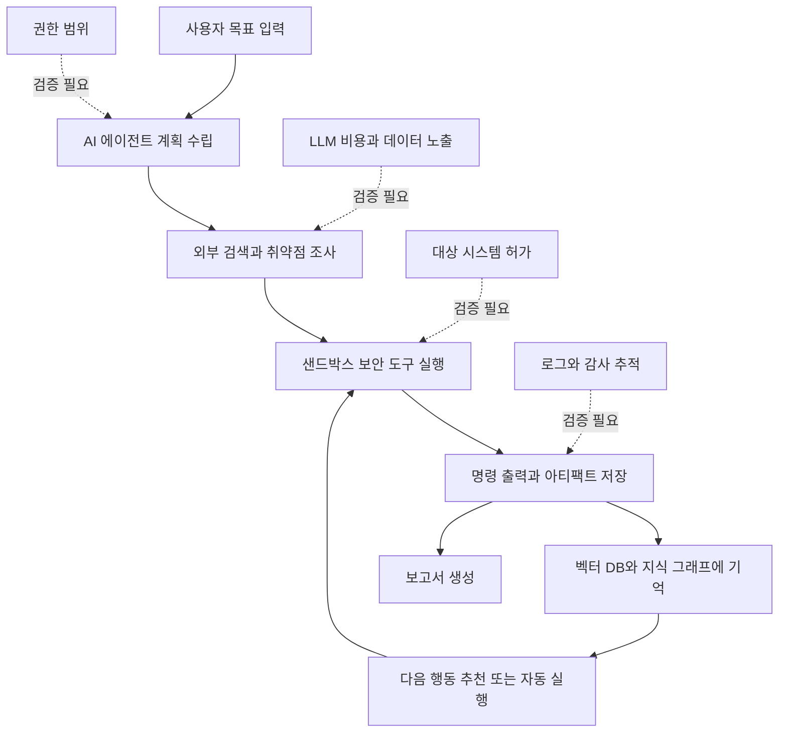

> 한 줄 요약: AI 침투 테스트 자동화 도구 PentAGI가 GitHub Trending에 오른 일은 단순한 보안 도구 출시보다, 공격 수행 권한을 AI 에이전트에게 어디까지 넘겨도 되는가라는 운영 리스크에 가깝다.

## 무슨 일이 있었나

2026년 7월 9일 기준, `vxcontrol/pentagi`는 GitHub Trending에서 #8로 노출된 Go 기반 프로젝트다. 저장소 설명에는 복잡한 침투 테스트 작업을 수행할 수 있는 완전 자율 AI 에이전트 시스템이라고 적혀 있다.

확인된 범위는 다음과 같다.

| 항목 | 확인된 내용 |
| --- | --- |
| 프로젝트 | PentAGI |
| 저장소 | `vxcontrol/pentagi` |
| 성격 | 자율 또는 보조형 침투 테스트 플랫폼 |
| 언어 | Go |
| 공개 지표 | stars 19,024, today 454 stars |
| 주요 구성 | Docker 샌드박스, LLM provider 연동, 보안 도구 20개 이상, PostgreSQL + pgvector, Graphiti/Neo4j, Grafana/Prometheus, Langfuse |
| 지원 LLM | OpenAI, Anthropic, Gemini, Bedrock, Ollama, DeepSeek, GLM, Kimi, Qwen, Custom 등 |

저장소 설명만 보면 무엇을 하려는 도구인지는 비교적 분명하다. AI 에이전트가 대상 분석, 검색, 도구 실행, 결과 저장, 보고서 생성을 이어간다. `nmap`, `metasploit`, `sqlmap` 같은 도구를 샌드박스 안에서 실행하고, 장기 기억과 지식 그래프를 붙여 다음 작업에 활용한다.

다만 프로젝트 문서에도 현재 한계가 적혀 있다. PentAGI는 지금 기준으로 CALDERA류의 침해 및 공격 시뮬레이션(Breach and Attack Simulation, BAS)이나 미리 정의된 공격 캠페인 실행 제품이 아니다. 에이전트가 작성한 BAS식 공격 스크립트는 현재 구현된 기능이라기보다 개념 또는 향후 작업으로 봐야 한다.

여기서 확인된 사실과 해석을 나눌 필요가 있다.

- 확인된 사실: PentAGI는 자율 침투 테스트 흐름, 다중 에이전트, 샌드박스 실행, 관측성, 보고서 생성을 내세운다.
- 확인된 사실: GitHub Trending에 올랐고 star 증가도 붙었다.
- 추정 가능한 해석: 개발자와 보안 커뮤니티가 반응한 이유는 기능 자체보다 AI가 공격 도구 실행 루프 안으로 들어왔다는 점이다.
- 아직 확인할 수 없는 것: 실제 취약점 탐지 정확도, 오탐률, 승인 없는 대상에 대한 남용 가능성, 운영 환경에서의 비용과 실패율.

## 왜 사람들이 반응했나

### AI 침투 테스트 자동화는 왜 불편한가?

침투 테스트(Penetration Testing)는 원래 권한과 맥락이 강하게 따라붙는 일이다. 같은 `nmap` 명령도 사내 승인 범위 안에서는 진단이고, 외부 시스템에 무단으로 쓰면 공격 행위가 된다.

PentAGI 같은 도구가 불편한 이유는 AI가 보안 도구를 안다는 데 있지 않다. 이미 LLM은 명령어 설명, 취약점 요약, 보고서 초안 작성에 쓰이고 있다. 사람들이 예민하게 보는 부분은 계획, 검색, 실행, 기억, 보고가 하나의 루프로 연결된다는 점이다.

이 구조에서는 작은 판단 오류가 반복될 수 있다. 한 번 잘못 고른 대상, 한 번 잘못 해석한 스캔 결과, 한 번 부적절하게 생성된 exploit 실행 계획이 다음 단계의 근거가 된다. 자동화가 편해지는 만큼, 잘못된 자동화도 더 빨리 진행된다.

### 커뮤니티가 기대하는 부분도 분명하다

반응이 모두 우려 쪽만은 아니다. 보안 업무에는 반복 작업이 많다. 스캔 결과 정리, CVE 검색, 취약 서비스 버전 확인, 보고서 초안 작성, 재현 절차 문서화는 사람이 직접 하면 시간이 많이 든다.

PentAGI가 내세우는 장점도 이 지점에 맞춰져 있다.

- 여러 보안 도구를 한 환경에서 묶는다.
- 실행 결과를 PostgreSQL과 pgvector에 남긴다.
- Graphiti와 Neo4j로 관계를 추적한다.
- Grafana, Prometheus, Langfuse 같은 관측 도구와 연결한다.
- REST, GraphQL API로 외부 자동화에 붙일 수 있다.
- 자체 호스팅(Self-Hosted)으로 데이터 통제권을 앞세운다.

현업에서 비슷한 고민을 하다 보면 보안팀의 병목은 도구 부족보다 흐름 단절인 경우가 많다. 스캐너 결과는 따로 있고, 티켓은 따로 있고, 재현 명령은 개인 노트에 남고, 보고서는 문서 도구에서 다시 작성된다. AI 에이전트 플랫폼은 이 단절을 줄이겠다는 약속으로 읽힌다.

### 오해가 생기기 쉬운 지점

가장 큰 오해는 자율이라는 단어다. 자율 침투 테스트라고 하면 사람 없이 공격 시나리오를 완성하고, 실행하고, 검증까지 끝내는 이미지를 떠올리기 쉽다. 하지만 저장소 설명에는 현재 능력의 경계가 비교적 분명히 적혀 있다.

현재 PentAGI는 자율 및 보조형 침투 테스트 플랫폼이지, 사전에 정의된 공격 캠페인을 수행하는 BAS 제품이라고 보기 어렵다. JSON flow-report export도 현재 문서화된 지원 출력 형식으로 제시되지 않는다.

이 차이는 작지 않다. 보안 도구를 평가할 때 구현된 기능과 데모에서 가능해 보이는 기능을 섞어버리면 도입 판단이 흐려진다. 특히 AI 보안 제품은 화면상으로 그럴듯한 계획과 보고서를 보여주기 쉽기 때문에, 실제 실행 가능한 범위를 문서 기준으로 확인해야 한다.

## 내가 보는 핵심

### 자동화의 핵심 리스크는 성능보다 권한이다

이 이슈의 핵심은 AI가 침투 테스트를 얼마나 잘하느냐보다, AI에게 어떤 권한을 주고 어떤 로그를 남길 것인가다.

보안 자동화는 일반 업무 자동화보다 실패 비용이 다르다. 잘못된 이메일 초안은 사람이 고치면 되지만, 잘못된 스캔이나 공격 도구 실행은 대상 시스템 장애, 로그 오염, 법적 분쟁으로 이어질 수 있다. 특히 외부 검색, LLM 호출, 샌드박스 명령 실행, 장기 기억 저장이 함께 있으면 데이터 경계도 복잡해진다.

확인해야 할 리스크는 네 갈래다.

| 리스크 | 봐야 할 질문 |
| --- | --- |
| 권한 | 에이전트가 실행할 수 있는 명령과 대상 범위가 어떻게 제한되는가 |
| 데이터 | 스캔 결과, 취약 정보, 인증 정보가 LLM provider나 로그 시스템으로 흘러가는가 |
| 운영 | 실행 실패, 무한 루프, 비용 폭주, 장시간 작업을 어떻게 끊는가 |
| 책임 | 어떤 판단을 사람이 승인했고 어떤 행동을 에이전트가 자동 수행했는가 |

특히 자체 호스팅이라는 말만으로 데이터 리스크가 사라지지는 않는다. LLM provider를 외부로 쓰면 프롬프트와 컨텍스트가 외부 API로 나갈 수 있다. 검색 API를 붙이면 조사 대상과 키워드가 외부 서비스에 남을 수 있다. Langfuse 같은 관측 도구를 붙이면 프롬프트, 응답, 중간 추론 일부가 분석 저장소에 남을 수 있다.

문제는 각각의 선택이 나쁘다는 게 아니다. 선택지가 많아진 만큼 보안 경계도 여러 개 생긴다.

### 샌드박스는 필요조건이지 충분조건이 아니다

PentAGI는 Docker 기반 격리를 강조한다. 보안 도구 실행 플랫폼에서는 필요한 설계다. 다만 샌드박스가 있다고 해서 운영 리스크 전체가 사라지지는 않는다.

샌드박스는 주로 실행 환경을 격리한다. 하지만 침투 테스트에서 더 민감한 것은 대상 범위와 행동 의도다. 컨테이너 안에서 실행된 명령이라도 승인되지 않은 IP 대역을 향하면 문제가 된다. 컨테이너 안에 저장된 결과라도 민감한 토큰이나 내부 구조가 포함될 수 있다.

그래서 이런 도구를 볼 때는 샌드박스 유무보다 정책 집행 지점을 봐야 한다.

- 실행 전 승인 단계가 있는가
- 대상 allowlist를 강제할 수 있는가
- 고위험 명령을 차단하거나 수동 승인으로 돌릴 수 있는가
- 모든 명령과 출력이 감사 가능한 형태로 남는가
- LLM이 제안한 계획과 실제 실행 명령을 분리해서 볼 수 있는가
- 외부 provider로 보내는 컨텍스트를 줄이거나 마스킹할 수 있는가

AI 에이전트 보안 도구는 모델 성능보다 가드레일(Guardrail) 품질에서 신뢰가 갈린다. 여기서 말하는 가드레일은 UI 경고문이 아니라 강제되는 시스템 정책이어야 한다.

### GitHub Trending이 보여준 것은 수요다

GitHub Trending과 star 수는 품질 보증서가 아니다. 19,024 stars와 하루 454 stars라는 숫자는 관심의 크기를 보여줄 뿐, 운영 안정성이나 법적 안전성을 증명하지 않는다.

그럼에도 이 신호는 가볍게 볼 수 없다. 보안 실무자와 개발자가 이런 도구에 반응한다는 것은 침투 테스트 자동화에 대한 욕구가 실제로 있다는 뜻이다. 반복 작업을 줄이고, 여러 도구를 하나의 흐름으로 묶고, LLM을 단순 Q&A가 아니라 작업 실행자에 가깝게 쓰고 싶다는 수요다.

바로 그 수요 때문에 더 조심해야 한다. 편해 보이는 도구일수록 권한 설계가 뒤로 밀리기 쉽다. 데모가 잘 될수록 도입 검토에서 가장 지루한 질문들이 생략된다.

## 앞으로 볼 기준

### 다음 AI 보안 도구 뉴스를 볼 때 무엇을 확인할까?

PentAGI 같은 프로젝트를 볼 때는 멋진 에이전트 구조보다 아래 질문을 먼저 던지는 편이 낫다.

- 이 도구는 진단 보조 도구인가, 실행 자동화 도구인가?
- 사람이 승인해야 하는 단계와 자동 실행되는 단계가 문서에 나뉘어 있는가?
- 대상 시스템 범위를 기술적으로 제한할 수 있는가?
- LLM provider, 검색 API, 관측 도구로 어떤 데이터가 나가는가?
- 명령 실행 로그와 원문 출력이 나중에 감사 가능한가?
- 장기 기억에 저장되는 데이터의 삭제와 보존 정책이 있는가?
- 실패했을 때 중단, 재시도, 롤백 기준이 있는가?
- BAS, adversary emulation, autonomous pentesting 같은 용어를 실제 구현 범위와 구분하고 있는가?

도입을 검토한다면 처음부터 실서비스 대역을 붙이면 안 된다. 격리된 랩 환경에서 허가된 대상만 넣고, 에이전트가 어떤 명령을 생성하는지 먼저 봐야 한다. 보고서 품질보다 실행 로그를 먼저 읽는 편이 맞다. 좋은 보고서는 나중 문제이고, 나쁜 명령은 바로 문제가 된다.

AI 침투 테스트 자동화는 당분간 계속 나올 주제다. 보안 도구는 이미 검색, 요약, 계획, 실행, 보고를 한 흐름으로 묶는 방향으로 움직이고 있다. PentAGI가 받은 관심은 그 흐름이 개발자 커뮤니티의 호기심을 넘어 실무적 욕구와 만났다는 신호에 가깝다.

다만 이 분야에서 가장 위험한 문장은 알아서 해준다는 말이다. 알아서 한다는 말은 누가 허가했는지, 어디까지 했는지, 왜 그렇게 판단했는지를 흐리게 만든다. 다음에 비슷한 AI 보안 도구가 화제가 된다면 기능 목록보다 실행 권한 표를 먼저 찾게 될 것이다. 그 표가 없으면 아직 도구가 아니라 위험한 데모에 가까울 수 있다.

## 참고 자료

- [선정 글감] [#8 vxcontrol/pentagi](https://github.com/vxcontrol/pentagi) (GitHub Trending)