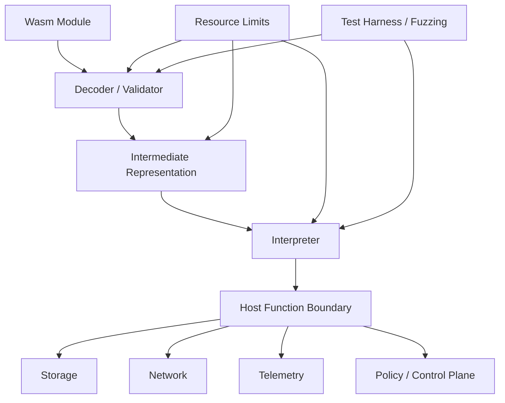

> 한 줄 요약: WebAssembly를 인프라 확장 포인트로 볼 때 먼저 물어야 할 것은 "어디서나 실행되는가"가 아니라 "실패와 자원 사용을 어디까지 예측할 수 있는가"다. SpaceWASM은 우주선이라는 극단적인 조건에서 Wasm 런타임 설계가 얼마나 엄격해져야 하는지 보여준다.

## 왜 지금 이슈인가

WebAssembly(Wasm)는 브라우저 밖으로 나온 뒤 플러그인, 엣지 컴퓨팅, 서버리스, 데이터베이스 확장, 보안 샌드박스, AI 에이전트 실행 환경에서 계속 거론된다. 개발자 커뮤니티에서 Wasm 이야기가 반복되는 이유도 대체로 비슷하다. 네이티브 코드보다 격리하기 쉽고, 컨테이너보다 가볍고, 언어 선택 폭도 넓다는 기대 때문이다.

SpaceWASM은 이 익숙한 기대를 조금 다른 쪽으로 돌린다. NASA/JPL이 공개한 이 프로젝트는 우주선 안에서 Wasm 바이너리를 해석하기 위한 구현체다. 눈에 띄는 건 우주라는 배경보다 설계 제약이다.

SpaceWASM은 Wasm 1.0 사양을 그대로 실행하는 범용 런타임을 목표로 하지 않는다. 고정 메모리, 스트리밍 디코딩, 제한된 동적 할당, 미리 측정 가능한 자원 사용량을 앞에 둔다. 실행 성능보다 먼저 따지는 것은 실행 가능한 범위다.

현업에서도 비슷한 고민은 훨씬 평범한 곳에서 나온다. Kubernetes 클러스터 안에서 사용자 정의 정책을 Wasm으로 실행한다면, 데이터베이스 내부에 Wasm 확장을 붙인다면, AI 에이전트가 만든 코드를 제한된 샌드박스에서 돌린다면 질문은 같다.

이 코드로 무엇을 할 수 있느냐보다, 어디까지 망가질 수 있느냐를 먼저 봐야 한다.

## 커뮤니티에서 갈리는 지점

Wasm을 인프라 레이어에 넣자는 쪽은 보통 이런 장점을 말한다.

- 배포 단위가 작고 시작이 빠르다
- 언어와 호스트 환경을 분리할 수 있다
- 샌드박스 경계가 프로세스보다 세밀하다

반대쪽의 우려도 뚜렷하다.

- 런타임이 하나 더 늘어난다
- 디버깅과 관측성(Observability)이 어려워진다
- 호스트 함수 경계가 사실상 새로운 시스템 API가 된다
- 메모리, CPU, I/O 제한이 구현체마다 다르게 동작한다

SpaceWASM이 흥미로운 이유는 찬반 어느 쪽에도 편하게 기대지 않기 때문이다. Wasm이 안전하다고 선언하지 않는다. 대신 안전하게 만들려면 무엇을 포기해야 하는지 보여준다.

예를 들어 SpaceWASM은 표준 Rust 할당자만으로는 요구 조건을 만족하지 못한다고 보고, 자체 자료구조와 할당 모델을 둔다. 모든 할당은 고정 크기 페이지 단위로 일어나고, 해제가 할당보다 앞설 수 없으며, 페이지 내부 하위 영역은 실행 중 커지거나 줄어들지 않는다. 할당 실패도 패닉으로 이어지면 안 된다.

이건 클라우드 서비스에서 흔히 보는 탄력적 자원 모델과 정반대다. 일반적인 서버 인프라는 부족하면 더 할당하고, 느려지면 스케일아웃하고, 터지면 재시작하는 쪽으로 설계된다. 하지만 어떤 시스템에서는 재시작 자체가 장애 전파다. 우주선만 그런 게 아니다. 결제 승인 경로, 제어 시스템, 실시간 데이터 파이프라인, 보안 정책 엔진도 비슷한 압력을 받는다.

커뮤니티에서 Wasm을 두고 갈리는 지점은 이 문장으로 줄일 수 있다.

> Wasm은 가벼운 컨테이너인가, 아니면 제한 가능한 실행 형식인가?

가벼운 컨테이너로만 보면 런타임 선택과 성능 비교가 대화의 중심이 된다. 제한 가능한 실행 형식으로 보면 검증, 호스트 함수, 메모리 상한, 장애 격리, 테스트 하네스가 앞에 온다.

SpaceWASM은 후자에 가깝다. 그래서 이 프로젝트를 우주선용 특수 구현으로만 읽으면 아깝다. 실무에서 가져갈 질문은 훨씬 넓다.

## 아키텍처 관점에서 볼 점

Wasm 기반 확장 아키텍처는 보통 아래처럼 보인다. 비즈니스 시스템 안에 작은 실행 엔진을 넣고, 외부에서 가져온 모듈을 제한된 인터페이스로 실행한다.

이 구조에서 가장 위험한 부분은 Wasm 모듈 자체가 아니다. 실제 권한은 호스트 함수(Host Function) 경계에 있다. Wasm 모듈이 파일을 읽거나 네트워크를 호출하거나 텔레메트리를 남길 수 있다면, 그 동작은 결국 임베더(Embedder)가 제공한 함수로 흘러간다.

SpaceWASM 문서도 임베딩을 별도 개념으로 다룬다. 모듈이 가져올 함수 집합은 보통 고정돼야 하고, Wasm 모듈과 임베더 양쪽에서 컴파일 시점에 명시하는 편이 낫다. 이 제약은 불편하지만, 운영 관점에서는 장점이 된다.

동적으로 아무 함수나 붙일 수 있는 구조는 처음에는 확장성이 좋아 보인다. 그러나 장애가 나면 어떤 모듈이 어떤 호스트 API를 호출했는지, 호출이 재시도 가능한지, 시간 제한은 어디서 걸리는지 추적해야 한다. 관측성 없는 확장성은 장애 분석 비용으로 돌아온다.

SpaceWASM의 또 다른 특징은 스트리밍 디코딩이다. 많은 Wasm 인터프리터는 바이너리 전체를 한 번에 넘겨받는 모델을 전제한다. 서버에서는 큰 문제가 아닐 수 있다. 메모리 영역을 재사용하면 되고, 부족하면 프로세스 제한을 조정할 수도 있다.

하지만 고정된 메모리 영역만 사용할 수 있는 환경에서는 바이너리 전체를 한 덩어리로 올리는 방식이 곧 설계 실패가 된다. SpaceWASM은 Wasm 바이너리를 청크 단위로 읽고, 단일 패스로 디코딩과 검증을 수행한다. 피크 메모리 사용량을 줄이기 위한 선택이다.

이 지점은 Kubernetes나 엣지 인프라에도 그대로 이어진다. 클러스터 안에서는 개별 Pod의 메모리 제한을 걸 수 있지만, 런타임 내부 피크 메모리까지 자동으로 설명해주지는 않는다. 특히 admission policy, proxy filter, database UDF처럼 요청 경로 안에서 Wasm을 실행한다면 평균 메모리보다 피크 메모리가 더 무섭다.

한 번씩만 튀는 피크가 전체 노드 압박, OOMKill, 요청 지연으로 이어질 수 있기 때문이다.

### Wasm 런타임을 볼 때 확인할 질문

| 질문 | 왜 봐야 하나 |
|---|---|
| 모듈 검증은 언제 일어나는가 | 배포 시점 실패와 요청 시점 실패의 비용이 다르다 |
| 메모리 상한은 측정 가능한가 | 제한만 있고 예측이 안 되면 운영 기준이 흔들린다 |
| 호스트 함수 목록은 고정 가능한가 | 권한 경계와 감사 범위가 달라진다 |
| 실행 중 할당 실패는 어떻게 처리되는가 | 패닉, 트랩, 오류 반환은 복구 전략이 다르다 |
| 테스트 하네스가 사양 기반인가 | 런타임 버그가 보안 경계 붕괴로 이어질 수 있다 |
| 퍼징(Fuzzing)을 돌릴 수 있는가 | 입력 공간이 넓은 바이너리 포맷에서는 방어선이 된다 |

SpaceWASM은 Coremark 벤치마크로 성능 회귀를 추적하고, Wasm 1.0 MVP 스펙 테스트를 통합 테스트에 사용하며, libFuzzer와 wasm-smith 기반 퍼징 인프라도 포함한다. 여기서 중요한 건 테스트가 많다는 말이 아니다. 실행 환경을 제품 기능이 아니라 검증 대상 시스템으로 본다는 점이다.

Wasm을 보안 샌드박스로 쓰려면 이 태도가 필요하다. 런타임은 애플리케이션 코드 아래에 있는 인프라가 아니라, 공격 표면의 일부다.

## 실무에서 볼 점

Wasm 도입을 검토할 때 가장 흔한 함정은 컨테이너보다 가볍다는 말에서 출발하는 것이다. 가벼움은 장점이지만, 운영 기준을 대신하지 못한다.

실제로 이런 상황에서는 먼저 실행 위치를 구분해야 한다.

- 요청 경로 안에서 실행되는가
- 배치나 비동기 워커에서 실행되는가
- 사용자 제공 코드를 실행하는가
- 내부 팀이 작성한 신뢰 가능한 모듈만 실행하는가
- 실패 시 기본 허용인지 기본 차단인지

보안 정책 엔진이라면 실패 기본값이 시스템 전체 의미를 바꾼다. 정책 Wasm 모듈이 시간 초과되었을 때 요청을 허용하면 보안 우회가 되고, 차단하면 장애가 곧 서비스 중단이 된다. 둘 중 하나가 정답이 아니라, 어느 쪽을 택했는지 시스템이 알아야 한다.

AI 에이전트 실행 환경에서도 비슷하다. 에이전트가 생성한 코드를 Wasm 샌드박스에서 돌리면 언뜻 안전해 보인다. 하지만 네트워크, 파일, 시크릿, 시간, 난수, 로그 출력 같은 호스트 기능을 어떻게 제한하는지에 따라 위험은 다시 열린다. Wasm 자체가 권한 모델을 완성해주지는 않는다.

데이터베이스 확장도 마찬가지다. Wasm UDF가 쿼리 엔진 안에서 돈다면 격리 비용은 낮아질 수 있다. 대신 쿼리 지연, 메모리 제한, 트랜잭션 취소, 관측성 태그, 롤백 전략을 데이터베이스 운영 모델 안에 넣어야 한다. 런타임이 가볍다는 이유만으로 DB 내부 실행을 쉽게 허용하면 장애 분석은 더 어려워진다.

현업에서 비슷한 고민을 하다 보면 기술 선택보다 운영 계약이 먼저 비어 있는 경우가 많다. 누가 모듈을 빌드하는지, 누가 서명하는지, 어떤 테스트를 통과해야 배포되는지, 런타임 버전은 누가 올리는지, 모듈별 자원 사용량은 어디에 기록되는지부터 정해야 한다.

### 도입 조건

Wasm을 인프라 확장 포인트로 쓰려면 최소한 아래 조건은 있어야 한다.

| 조건 | 확인 방법 |
|---|---|
| 모듈 공급망 통제 | 빌드 provenance, 서명, 해시 고정 |
| 런타임 자원 제한 | 메모리, 연산량, 시간 제한을 배포 전 측정 |
| 호스트 API 최소화 | 필요한 함수만 노출하고 권한을 분리 |
| 관측성 연결 | 모듈 이름, 버전, 호출 횟수, 실패 유형을 로그와 메트릭에 포함 |
| 장애 정책 | timeout, trap, allocation failure마다 처리 방식 정의 |
| 재현 가능한 테스트 | 스펙 테스트, 회귀 테스트, 퍼징, 실제 입력 샘플 기반 테스트 |

이 중 하나라도 없으면 Wasm을 쓰지 말라는 뜻은 아니다. 다만 그 빈칸이 어디인지 알고 들어가야 한다. 특히 보안 경계로 홍보되는 구성에서는 테스트와 관측성이 빠진 순간 설명하기 어려운 위험이 된다.

### 대안과 트레이드오프

Wasm이 항상 가장 좋은 선택은 아니다.

컨테이너는 무겁지만 운영 모델이 성숙하다. 이미지 스캔, 런타임 격리, 네트워크 정책, 로그 수집, 롤링 업데이트까지 이미 많은 조직이 다룰 줄 안다. 실행 단위가 조금 커도 팀이 이해하는 도구를 쓰는 편이 더 나을 때가 있다.

Lua, JavaScript, Python 같은 임베디드 스크립팅도 여전히 강하다. 빠른 확장성과 개발자 경험이 필요하고, 보안 경계가 내부 신뢰 모델 안에 있다면 Wasm보다 단순할 수 있다.

네이티브 플러그인은 성능과 호스트 통합이 좋다. 대신 ABI, 크래시 격리, 배포 호환성, 보안 검토 부담이 커진다. 장애가 프로세스 전체로 번질 수 있다는 점도 봐야 한다.

Wasm의 자리는 그 사이 어딘가다. 컨테이너보다 작은 격리 단위가 필요하고, 스크립트보다 엄격한 실행 경계가 필요하며, 네이티브 플러그인보다 안전한 실패 모델이 필요할 때 설득력이 생긴다.

다만 SpaceWASM이 보여주듯 그 설득력은 공짜가 아니다. 제한된 기능, 고정된 인터페이스, 사전 측정, 별도 테스트 하네스, 런타임 운영 책임을 받아들여야 한다.

## 정리

SpaceWASM을 우주선용 Wasm 인터프리터로만 보면 흥미로운 특수 사례다. 하지만 인프라 설계 관점에서 보면 꽤 직접적인 질문을 던진다.

우리는 Wasm을 도입하면서 정말 실행 경계를 설계하고 있는가, 아니면 더 작은 플러그인 포맷을 하나 더 들여오는가.

당장 확인해볼 것은 하나다. 지금 검토 중인 Wasm 사용처가 있다면 모듈이 호출할 수 있는 호스트 함수 목록을 적어보자. 그 목록이 권한 모델, 장애 모델, 감사 범위다. 거기서 설명이 막히면 런타임 선택보다 아키텍처 계약부터 다시 잡아야 한다.

## 참고 자료

- [선정 글감] [SpaceWASM: NASA/JPL's Wasm interpreter for spacecraft sequencing](https://github.com/nasa/spacewasm) (Lobsters)