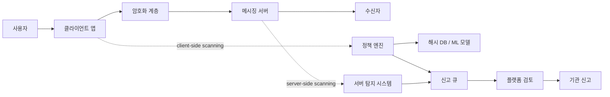

> 한 줄 요약: Chat Control 논쟁은 아동 보호와 프라이버시의 구호 싸움으로만 보기 어렵다. private message scanning을 어느 계층에 넣는 순간 보안 모델과 운영 책임이 어떻게 달라지는지가 더 중요하다. Kubernetes나 관측성 도구를 도입할 때처럼, 메시지 스캔도 도입 목적보다 실패 모드부터 봐야 한다.

## 왜 지금 이슈인가

EU 의회가 2026년 7월 7일 Chat Control 1.0을 되살리기 위한 긴급 절차를 331 대 304, 기권 11표로 통과시켰다. 본투표는 2026년 7월 9일로 잡혔다. 이 절차가 통과되면서 통상적인 위원회 검토를 건너뛰고 여름 휴회 직전 본회의에서 다시 표결할 수 있게 됐다.

기술 커뮤니티에서 이 사안이 계속 언급되는 이유는 분명하다. 법률 뉴스처럼 보이지만, 실제로는 메시징 시스템의 보안 경계(Security Boundary)를 어디에 둘 것인지 묻는 아키텍처 문제이기 때문이다.

Chat Control 1.0은 Regulation (EU) 2021/1232로 불린 임시 예외 규정이었다. ePrivacy Directive의 예외를 열어, 일부 서비스 제공자가 아동 성착취물(CSAM) 탐지를 위해 개인 메시지와 이메일을 자발적으로 스캔할 수 있게 했다. 이 규정은 2026년 4월 4일 만료됐고, 지금 논쟁은 만료된 예외를 거의 같은 내용으로 되살릴 수 있는지에 걸려 있다.

헷갈리기 쉬운 점이 있다. Chat Control 1.0과 Chat Control 2.0은 같은 이름으로 묶여 말해지지만 별개의 파일이다.

| 구분 | Chat Control 1.0 | Chat Control 2.0 |
|---|---|---|
| 성격 | 만료된 임시 예외 규정의 부활 | 영구적인 CSAM 탐지·보고 규정 제안 |
| 현재 쟁점 | 자발적 스캔을 다시 허용할지 | 플랫폼에 어느 정도의 탐지 의무를 둘지 |
| 암호화 영향 | E2EE 자체를 직접 깨지는 않지만 client-side scanning 가능성이 논쟁 | 사적 통신 스캔 의무화 또는 강한 유인 구조가 핵심 쟁점 |
| 운영 관점 | 기존 보고 파이프라인의 법적 근거 복원 | 장기적인 플랫폼 책임 모델 재설계 |

개발자들이 민감하게 반응하는 이유는 이 구조가 낯설지 않기 때문이다. 관측성(Observability)을 넣겠다며 모든 payload를 로그로 남기면 사고가 난다. 보안 에이전트를 넣겠다며 모든 노드 권한을 열어두면 공격면이 커진다. 메시지 스캔도 같다. 좋은 목적을 가진 탐지 로직이라도 시스템 경계 안쪽으로 들어오는 순간 별도의 위협 모델이 된다.

## 커뮤니티에서 갈리는 지점

찬성 쪽 논리는 규제 공백이다. 임시 예외가 만료되면서 플랫폼이 CSAM 탐지를 계속할 법적 근거가 약해졌고, 그 결과 신고와 수사가 줄어들 수 있다는 주장이다. Heise 보도에 따르면 EU 집행위원 4명은 의회 표결 직전 서한을 보내, 스캔이 없으면 가해자가 처벌받지 않고 대부분의 학대 자료가 발견되지 않을 수 있다고 압박했다.

반대 쪽은 목적보다 수단을 본다. 특정 용도의 탐지 예외를 허용하면, 사적 통신을 의심 없이 대량 스캔하는 일이 정상 운영 절차가 된다. 특히 의회가 이미 2026년 3월과 4월에 연장에 동의하지 않았는데, 긴급 절차로 같은 안을 되살리는 방식은 기술보다 거버넌스 리스크를 키운다.

기술적으로 가장 큰 갈림길은 서버 측 스캔(Server-side Scanning)과 클라이언트 측 스캔(Client-side Scanning)이다.

서버 측 스캔은 암호화되지 않은 서비스에서 기존 구조와 비교적 잘 맞는다. 메일 서버나 클라우드 메시징 서버가 첨부파일, 이미지 해시, 신고 데이터를 분석한다. 개인정보 침해 위험은 여전히 있지만, 적어도 시스템 경계는 서버에 있다.

클라이언트 측 스캔은 다르다. 메시지가 종단간 암호화(End-to-End Encryption)되기 전에 사용자 기기에서 내용을 검사한다. 이 방식은 암호화 프로토콜 자체를 깨지 않는다고 설명될 수 있다. 하지만 사용자가 기대하는 보안 모델은 달라진다. 기기가 더 이상 사용자만을 위한 종단점이 아니라 정책 집행 지점(Policy Enforcement Point)이 된다.

이 차이는 말장난이 아니다. E2EE의 약속은 네트워크와 서버를 믿지 않아도 된다는 데 있다. 그런데 전송 전에 클라이언트에서 스캔한다면, 신뢰해야 할 대상이 서버에서 앱 업데이트 채널, 모델 배포 시스템, 해시 데이터베이스, 정책 엔진, 신고 파이프라인까지 넓어진다.

커뮤니티의 우려도 여기서 나온다.

- 탐지 모델의 오탐(False Positive)이 개인에게 어떤 피해를 주는가
- 해시 데이터베이스나 AI 모델을 누가, 어떻게 검증하는가
- 스캔 범위가 CSAM에서 다른 불법 콘텐츠로 확장될 수 있는가
- 암호화 메신저가 국가·지역별로 다른 정책 엔진을 넣게 되는가
- 신고 데이터가 수사기관, 플랫폼, 외주 검수 시스템 사이에서 어떻게 이동하는가

아동 보호라는 목표에 반대하기 어렵기 때문에 논쟁은 쉽게 도덕적 압박으로 흐른다. 하지만 실무 설계에서는 목표가 선하다는 사실이 실패 모드를 지워주지 않는다. 보안 시스템은 오용과 확장을 함께 검토해야 한다.

## 아키텍처 관점에서 볼 점

Chat Control을 아키텍처로 보면 질문은 한 줄로 압축된다.

사용자 메시지는 어느 지점에서 평문이 되며, 그 평문을 누가 볼 수 있는가?

아래는 서버 측 스캔과 클라이언트 측 스캔이 보안 경계를 어떻게 바꾸는지 단순화한 흐름이다.

이 다이어그램에서 봐야 할 지점은 스캔 위치가 바뀔 때 함께 늘어나는 의존성이다.

클라이언트 측 스캔을 넣으면 메시징 앱은 더 이상 암호화 클라이언트만이 아니다. 정책 엔진, 모델 업데이트, 로컬 판정, 신고 큐, 예외 처리 UI를 포함한 보안 제품이 된다. 그러면 다음 운영 문제가 생긴다.

첫째, 업데이트 채널이 정책 배포 채널이 된다. 앱 업데이트나 원격 설정(Remote Config)으로 스캔 대상, 모델, 해시 목록이 바뀔 수 있다면, 그 배포 경로 자체가 고위험 자산이다. Kubernetes에서 admission controller가 클러스터 생성 권한을 사실상 통제하는 것과 비슷하다. 작아 보이는 컴포넌트가 전체 신뢰 경로를 잡는다.

둘째, 관측성 데이터가 민감 데이터가 된다. 탐지율, 오탐율, 신고 건수, 모델 버전별 결과를 운영하려면 로그와 메트릭이 필요하다. 그런데 이 메타데이터는 어떤 사용자가 어떤 시점에 어떤 콘텐츠로 의심을 받았는지 드러낼 수 있다. 관측성 파이프라인이 개인정보 파이프라인으로 바뀌는 셈이다.

셋째, 장애 격리(Fault Isolation)가 어렵다. 탐지 모델이 잘못 배포되거나 해시 DB가 오염되면 특정 지역, 특정 버전, 특정 기기군에서 대량 오탐이 발생할 수 있다. 서버 장애는 롤백하면 되지만, 이미 신고된 사용자 데이터와 기관 전달 이력은 쉽게 되돌릴 수 없다.

넷째, 보안 기능이 공격 표면이 된다. 공격자는 메시지 서버만 노리지 않는다. 정책 파일, 모델 서명, 해시 목록, 신고 API, 검토 대시보드, 내부 권한 체계를 노릴 수 있다. 특히 해시 기반 탐지는 데이터베이스 무결성이 깨지면 무고한 콘텐츠를 위험 신호로 만들 수 있다.

다섯째, 지역별 규정 차이가 제품을 쪼갠다. EU, 영국, 미국, 한국이 서로 다른 스캔 의무와 신고 절차를 요구하면 메시징 앱은 국가별 정책 매트릭스를 갖게 된다. 이 구조는 단순한 feature flag가 아니다. 보안 보장 자체가 지역별로 달라질 수 있다.

현업에서 비슷한 고민을 하다 보면, 논쟁은 기능을 넣을지 말지에서 끝나지 않는다. 누가 운영 권한을 갖는지, 예외 처리는 어디서 하는지, 장애 시 어떤 데이터를 남기는지가 더 오래 간다. 메시지 스캔도 같은 종류의 문제다.

## 실무에서 볼 점

이 사안을 플랫폼 팀이나 보안 팀 관점에서 읽으면, 도입 조건은 꽤 구체적이어야 한다.

첫째, 스캔 범위를 데이터 유형별로 분리해야 한다. 이미지 해시 매칭, 텍스트 분류, 링크 평판, 사용자 신고는 서로 다른 위험을 갖는다. 모두를 콘텐츠 스캔으로 묶으면 설계 판단이 흐려진다.

| 탐지 방식 | 장점 | 주요 리스크 |
|---|---|---|
| 알려진 이미지 해시 매칭 | 설명 가능성이 상대적으로 높음 | 해시 DB 무결성, 우회 가능성, 오탐 처리 |
| ML 기반 이미지·텍스트 분류 | 신규 자료 탐지 가능성 | 높은 오탐, 모델 편향, 설명 어려움 |
| 사용자 신고 기반 | 사적 통신 대량 스캔을 피할 수 있음 | 신고 지연, 악의적 신고 |
| 메타데이터 분석 | 콘텐츠 접근을 줄일 수 있음 | 관계망 감시, 목적 외 사용 |

둘째, 자발적 스캔이라는 표현을 곧이곧대로 받아들이면 안 된다. 법적으로 의무가 아니어도, 플랫폼이 위험 완화 의무와 책임 압박을 받으면 사실상의 의무가 될 수 있다. 보안 인증에서 권고 항목이 납품 조건이 되는 것과 비슷하다. 문서상 optional이어도 시장과 규제는 mandatory처럼 작동할 수 있다.

셋째, 오탐 대응은 제품 기능이 아니라 권리 구제 절차다. 사용자가 잘못 신고됐을 때 어떤 통지를 받는지, 이의 제기할 수 있는지, 데이터가 이미 기관에 넘어갔다면 정정 흐름이 있는지 확인해야 한다. 탐지 정확도만 높인다고 문제가 사라지지 않는다.

넷째, 암호화 제품은 보안 문구를 다시 써야 한다. E2EE를 유지한다고 말하면서 클라이언트에서 전송 전 스캔을 수행한다면, 사용자가 이해하는 프라이버시 보장과 실제 구현 사이에 간극이 생긴다. 프로토콜은 안전해도 제품은 덜 안전할 수 있다.

다섯째, 대안은 스캔 찬반의 이분법보다 넓다.

- 기본값은 사용자 신고와 피해자 지원 채널을 강화한다.
- 공개·반공개 공간은 서버 측 탐지를 더 엄격히 적용한다.
- 사적 E2EE 통신은 targeted warrant, 계정 행위 분석, 악성 배포 네트워크 차단처럼 범위를 좁힌 수단을 우선 검토한다.
- 탐지 모델과 신고 통계는 독립 감사와 투명성 보고서로 검증한다.
- 클라이언트 측 스캔이 필요하다고 주장하려면, 정책 업데이트와 해시 DB의 독립 검증 구조를 먼저 제시해야 한다.

실무 판단의 기준은 하나다. 탐지율을 얻기 위해 어떤 신뢰 경계를 새로 만들고 있는가.

운영팀이라면 다음 질문을 체크리스트로 삼을 만하다.

- 스캔 대상은 콘텐츠, 메타데이터, 첨부파일 중 무엇인가
- 평문 접근은 어느 계층에서 발생하는가
- 탐지 모델과 해시 DB는 누가 서명하고 배포하는가
- 오탐 신고가 발생했을 때 롤백 가능한 데이터는 어디까지인가
- 로그와 메트릭에 민감 정보가 섞이지 않는가
- 국가별 정책 차이가 암호화 보장을 훼손하지 않는가
- 외부 감사자가 재현 가능한 방식으로 검증할 수 있는가

이 질문에 답하지 못한 채로 스캔부터 넣으면, 보안 기능이 아니라 통제하기 어려운 데이터 처리 시스템이 된다.

## 정리

Chat Control 논쟁은 법안 하나의 찬반보다 넓다. 메시징 서비스가 사용자 기기와 서버 사이에 어떤 신뢰 계약을 맺고 있는지, 그리고 그 계약을 규제가 어디까지 바꿀 수 있는지를 묻는다.

아동 보호는 기술 업계가 회피할 수 없는 문제다. 동시에 사적 통신 전체를 의심 없는 스캔 대상으로 만드는 설계는, 한 번 들어오면 다른 목적과 다른 지역 규제로 확장되기 쉽다. 좋은 보안 설계는 선한 목적을 믿는 데서 출발하지 않는다. 실패했을 때 피해가 어디까지 번지는지 먼저 본다.

당장 확인해볼 것은 하나다. 사용하는 메신저나 협업 도구의 보안 백서에서 E2EE라는 문구만 보지 말고, 클라이언트 측 분석, abuse detection, safety scanning, telemetry 항목이 평문 데이터에 접근하는지 찾아보자. 암호화는 프로토콜 이름이 아니라 데이터 흐름으로 검증해야 한다.

## 참고 자료

- [선정 글감] [Chat Control passed first round in EU Parliament](https://www.heise.de/en/news/Showdown-in-Strasbourg-The-unexpected-return-of-Chat-Control-1-0-11356680.html): Heise / Hacker News Best
- [관련] [Chat Control 1.0 and 2.0 Explained](https://fightchatcontrol.eu/chat-control-overview): Fight Chat Control / Hacker News Best
- [관련] [EU now one step away from reviving private message scanning rules](https://cyberinsider.com/eu-now-one-step-away-from-reviving-private-message-scanning-rules/): CyberInsider / Hacker News Best