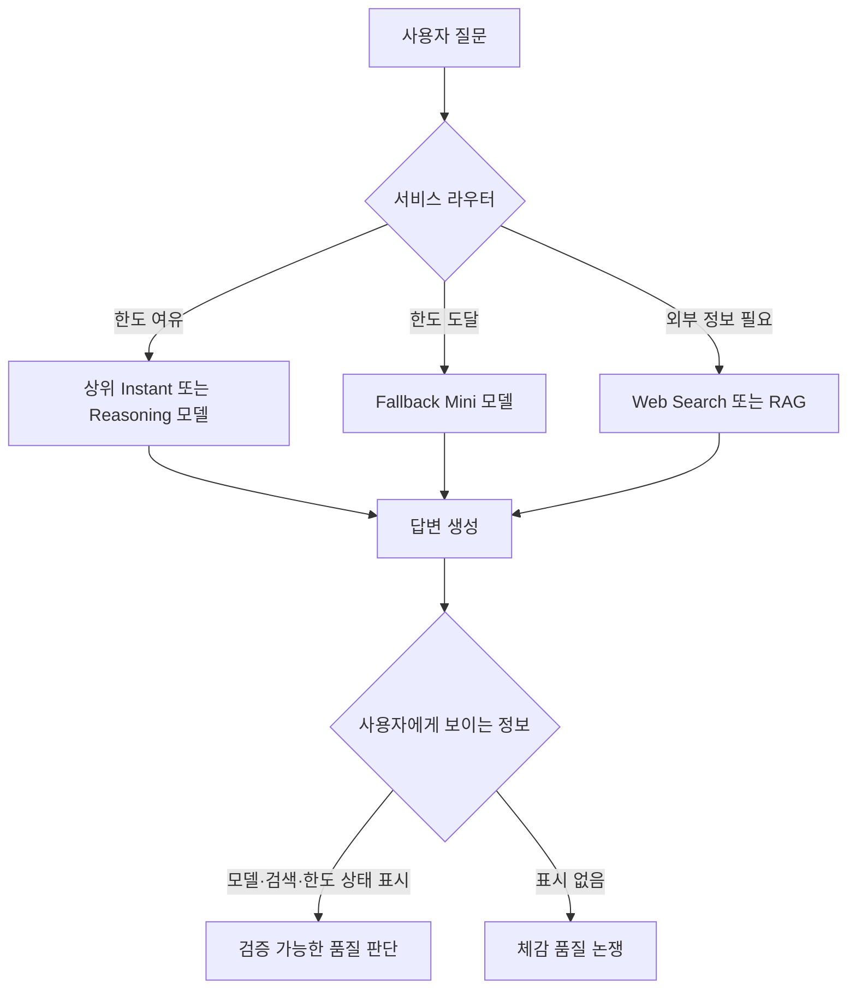

> 한 줄 요약: ChatGPT 무료 모델과 로컬 LLM 비교 논쟁은 무료 품질이 좋으냐 나쁘냐로 끝낼 일이 아니다. 사용자가 어느 순간부터 어떤 모델, 어떤 검색, 어떤 한도 정책 아래에서 답을 받는지 알기 어렵다는 데 문제가 있다.

## 무슨 일이 있었나

2026년 7월 9일 기준, Reddit r/LocalLLaMA에서 ChatGPT 무료 모델의 체감 품질을 두고 거친 반응이 나왔다. 해당 글 작성자는 32GB VRAM GPU를 산 뒤 Gemma 4 31B 5-bit 모델을 써봤고, 몇 번 메시지를 보낸 뒤의 무료 ChatGPT 답변보다 훨씬 낫게 느꼈다고 주장했다.

이 주장은 사실과 해석을 나눠 읽어야 한다.

| 구분 | 확인된 사실 | 아직 확인되지 않은 해석 |
|---|---|---|
| Reddit 글 | 사용자가 로컬 31B급 모델과 무료 ChatGPT의 체감을 비교했다 | 무료 ChatGPT가 실제로 200억 파라미터 미만 모델이라는 말은 확인되지 않았다 |
| OpenAI 정책 | Free 플랜은 GPT-5.5 Instant에 접근할 수 있지만 메시지, 업로드, 메모리, 컨텍스트에 제한이 있다 | 특정 답변 품질 저하가 어떤 내부 모델 때문인지는 사용자가 알 수 없다 |
| 2026년 7월 6일 릴리스 노트 | GPT-5.5 Instant 또는 Auto 한도에 도달하면 GPT-5.5 Instant Mini가 fallback 모델로 쓰이고, 모델 선택기에는 보이지 않는다고 적혀 있다 | 커뮤니티가 말한 품질 차이가 이 fallback 때문인지는 단정할 수 없다 |
| 관련 LocalLLaMA 글들 | RAG, 양자화(Quantization), 27B급 모델의 소프트웨어 설계 한계를 두고 다른 논쟁도 이어졌다 | 로컬 모델이 항상 클라우드 모델보다 낫다는 결론은 아니다 |

정책 범위는 헷갈리기 쉬운 부분이다. OpenAI의 7월 6일 공지는 ChatGPT 안의 GPT-5.5 Instant Mini fallback에 관한 것이며, API나 Codex에는 영향이 없다고 적혀 있다. 가격 페이지 기준으로 Free 플랜은 GPT-5.5 Instant를 사용할 수 있지만 GPT-5.5 Thinking과 GPT-5.5 Pro는 제공되지 않는다. 검색(Search)은 Free 플랜에도 제공되지만, 응답 시간과 대역폭은 제한될 수 있다.

비슷한 시점에 관련 글도 올라왔다. 어떤 사용자는 Google AI Overview가 실제로 어느 정도 크기의 모델로 운영될 수 있는지 물었다. 또 다른 글은 같은 모델도 낮은 양자화로 갈수록 결과물의 섬세함이 떨어지는 모습을 비교했다. 로컬 모델 정확도 테스트 글에서는 RAG(Retrieval-Augmented Generation)를 붙였을 때 성능이 꽤 나아졌다고 했다. 다만 그 역시 작성자의 실험 조건 안에서 읽어야 한다.

## 왜 사람들이 반응했나

### ChatGPT 무료 모델 품질 저하가 왜 불편한가?

사람들이 화낸 지점은 무료라서 성능이 낮다는 사실 자체가 아니다. 무료 서비스에 한도가 있다는 건 대부분 받아들인다. 불편함은 답변을 받는 순간 사용자가 어떤 상태인지 모른다는 데서 나온다.

처음 몇 번은 괜찮던 답변이 어느 순간 짧아지고, 검색 결과를 얕게 붙이고, 복잡한 요구사항을 놓치기 시작하면 사용자는 품질 저하를 모델의 성격 변화처럼 느낀다. 그런데 실제 원인은 여러 갈래일 수 있다.

- 상위 모델 한도 도달
- fallback 모델 전환
- 검색 결과 품질 문제
- 컨텍스트 창 부족
- 시스템 부하에 따른 지연과 응답 단순화
- 사용자의 프롬프트가 길어지며 생긴 정보 손실

OpenAI가 fallback 모델을 설명했다고 해서 커뮤니티의 의심이 바로 사라지지는 않는다. 모델 선택기에 보이지 않는 fallback이라는 표현 자체가 사용자의 체감과 맞닿아 있기 때문이다. 사용자는 요금제가 아니라 답변의 실패 방식을 본다.

### 로컬 LLM vs ChatGPT 무료 모델, 진짜 비교 기준은?

처음 Reddit 글의 강한 표현과 달리, 파라미터 수만으로 승패를 말하기는 어렵다. 31B 로컬 모델이 어떤 질문에서는 무료 ChatGPT보다 낫게 보일 수 있다. 동시에 같은 31B 모델도 양자화 수준, 컨텍스트 길이, 프롬프트, RAG, 도구 호출 여부에 따라 결과가 달라진다.

Döner Bench 비교 글은 과학적 벤치마크라기보다 커뮤니티식 체감 실험에 가깝다. 그래도 한 가지는 잘 보여준다. 같은 모델이라도 낮은 비트 양자화로 내려가면 움직임이나 디테일, 완성도가 흔들릴 수 있다. 사용자가 말하는 품질은 모델 이름 하나로 결정되지 않는다.

정확도 테스트 글도 비슷한 방향을 가리킨다. 작성자는 Node, LangChain.js, TypeScript, transformers.js, Vue 문서를 내려받아 문제를 만들고 로컬 모델을 비교했다. 작성자의 결론은 RAG 없이 답하게 하면 기대보다 약하지만, 관련 문서를 잘 찾아 넣으면 꽤 좋아진다는 쪽이었다. thinking을 켠다고 무조건 크게 좋아진 것도 아니고, 시간 비용이 컸다고 했다.

Qwen3.6-27B가 소프트웨어 아키텍처를 이해하지 못한다는 글은 다른 한계를 건드린다. 코드 한 파일을 그럴듯하게 만드는 능력과, 10만 줄 규모 프로젝트에서 책임 분리, 테스트 자동화, 유지보수 가능한 경계를 지키는 능력은 다르다. 로컬 모델이 ChatGPT 무료 답변보다 날카로워 보이는 순간이 있어도, 그것이 곧 제품 개발 전체를 맡겨도 된다는 뜻은 아니다.

### 검색이 붙은 작은 모델은 해결책일까?

처음 글에서 눈에 띈 표현은 online search enabled였다. 작은 모델에 검색을 붙이면 답이 좋아질 수 있다. 하지만 검색은 모델 지능을 갑자기 끌어올리는 장치가 아니다.

검색이 붙은 답변은 대략 세 층으로 갈린다.

현업에서 비슷한 고민을 하다 보면 검색이 붙은 모델에는 장점과 위험이 같이 들어온다. 최신 정보를 가져올 수 있지만, 외부 페이지의 품질과 프롬프트 인젝션(Prompt Injection) 위험도 함께 들어온다. OpenAI가 2026년 6월 Lockdown Mode를 모든 로그인 사용자에게 제공하면서 웹 브라우징, deep research, agent mode, 파일 다운로드 같은 네트워크 기능을 제한할 수 있게 한 것도 같은 맥락이다. 검색과 도구 호출은 편의 기능인 동시에 데이터 유출과 오작동의 통로가 될 수 있다.

## 내가 보는 핵심

이번 논쟁에서 가장 약한 주장은 무료 ChatGPT가 분명히 200억 파라미터 미만일 것이라는 단정이다. 답변이 나빠졌다는 체감만으로 내부 모델 크기를 역산할 수는 없다. 대형 서비스는 라우터, 캐시, 안전 필터, 검색, 한도, 지역, 부하 상태가 함께 움직인다.

다만 문제 제기는 남는다. 모델 라우팅이 사실상 사용자 계약의 일부가 됐다는 점이다.

예전에는 AI 제품을 고를 때 모델 이름만 보면 됐다. 이제는 다르다. 같은 ChatGPT라도 Free, Go, Plus, Pro에 따라 모델 접근, reasoning, 컨텍스트, 메모리, 검색, deep research, Codex 사용량이 갈린다. 같은 Free 안에서도 한도에 도달하면 fallback 모델이 들어갈 수 있다. 사용자는 여전히 하나의 채팅창을 보고 있지만, 뒤에서는 다른 비용 구조가 움직인다.

이런 구조에서 무료 모델이 나쁘다고만 말하면 절반만 본 것이다. 더 봐야 할 질문은 따로 있다.

- 지금 답변은 어떤 모델 계열에서 나왔나?
- 한도 초과로 fallback이 들어갔나?
- 검색 결과가 답변에 얼마나 섞였나?
- 검색 출처가 신뢰 가능한가?
- 컨텍스트가 잘렸나?
- 답변 품질이 나쁜 것인가, 작업에 맞는 제품 계층을 잘못 고른 것인가?

로컬 LLM은 이 문제에 대한 반응으로 매력적이다. 사용자는 모델 파일, 양자화 수준, 하드웨어, RAG 파이프라인을 직접 볼 수 있다. 적어도 어느 순간 갑자기 보이지 않는 fallback으로 내려갔는지 의심하지 않아도 된다.

대신 로컬은 다른 비용을 요구한다. GPU 비용, 전력, 업데이트, 보안 패치, 문서 인덱싱, 평가 세트, 프롬프트 관리, 도구 연결을 직접 떠안아야 한다. 32GB VRAM 카드 하나로 얻는 것은 자유뿐 아니라 운영 책임이다.

| 선택지 | 얻는 것 | 잃는 것 |
|---|---|---|
| ChatGPT Free | 설치 없는 접근, 검색, 기본 도구 | 한도, fallback 불투명성, 제한된 reasoning |
| ChatGPT 유료 플랜 | 더 높은 한도, Thinking/Pro 접근, 더 넓은 기능 | 공급자 정책 의존, 비용, 여전히 내부 라우팅은 제한적으로만 보임 |
| 로컬 27B~31B 모델 | 모델 통제권, 데이터 로컬 처리, 예측 가능한 환경 | GPU 비용, RAG 구축, 평가와 운영 부담 |
| 하이브리드 구성 | 민감한 작업은 로컬, 고난도 작업은 클라우드 | 시스템 복잡도, 라우팅 기준 설계 필요 |

이 논쟁은 무료 사용자를 깎아내리는 이야기가 아니다. AI 플랫폼이 검색창처럼 쓰이는 순간, 모델 품질의 변동이 사용자 신뢰 문제로 바뀐다는 점을 드러낸다.

## 앞으로 볼 기준

다음번 ChatGPT 무료 모델 품질 논쟁이나 로컬 LLM 비교 글을 볼 때는 모델 이름보다 상태 표시를 먼저 봐야 한다.

- 한도 도달 여부가 사용자에게 보이는가?
- fallback 모델이 쓰이면 화면에 표시되는가?
- 모델 선택기에 없는 내부 전환이 있는가?
- 검색을 사용했다면 출처와 검색 시점이 보이는가?
- RAG를 썼다면 어떤 문서가 들어갔는가?
- 양자화 수준, 컨텍스트 길이, temperature 같은 실행 조건이 공개됐는가?
- 코딩 작업이면 단일 파일 생성인지, 기존 코드베이스 변경인지 구분했는가?
- 보안 설정에서 웹 접근, 앱 연결, 파일 다운로드를 통제할 수 있는가?

제품을 만드는 쪽이라면 더 직접적이다. AI 기능을 사용자에게 제공할 때 단순히 powered by 모델명만 붙여서는 부족하다. 최소한 모델 등급, 검색 사용 여부, fallback 상태, 한도 리셋 시점, 참조 문서 정도는 보여줘야 한다. 그렇지 않으면 사용자는 품질 저하를 버그, 검열, 비용 절감, 속임수 중 하나로 해석하게 된다.

커뮤니티의 거친 표현을 그대로 믿을 필요는 없다. 무료 ChatGPT가 정말 200억 파라미터 미만인지, OpenAI가 비용 때문에 품질을 의도적으로 낮췄는지는 확인되지 않았다. 다만 사용자가 그런 의심을 하게 된 구조는 실제다.

답변이 갑자기 멍청해 보일 때, 물어볼 것은 이 모델이 얼마나 큰가 하나가 아니다. 지금 내 질문은 어떤 라우터를 지나왔고, 어떤 한도에 걸렸고, 어떤 검색 결과를 먹고, 어떤 보안 경계 안에서 답하고 있는가. 그 질문에 답하지 못하는 AI 제품은 같은 논쟁을 피하기 어렵다.

## 참고 자료

- [선정 글감] [The standard free ChatGPT LLM you get after a few messages HAS to be some sub-20b model with online search enabled, no other way to explain how awful it is](https://www.reddit.com/r/LocalLLaMA/comments/1uqz1d4/the_standard_free_chatgpt_llm_you_get_after_a_few/) (Reddit LocalLLaMA)
- [관련] [Can you trust local models to answer accurately?](https://www.reddit.com/r/LocalLLaMA/comments/1uqpxgp/can_you_trust_local_models_to_answer_accurately/) (Reddit LocalLLaMA)
- [관련] [Döner Bench round 2: Quant compare](https://www.reddit.com/r/LocalLLaMA/comments/1uqs7ws/döner_bench_round_2_quant_compare/) (Reddit LocalLLaMA)
- [관련] [Qwen3.6-27b does not understand software architechure.](https://www.reddit.com/r/LocalLLaMA/comments/1uqzjdy/qwen3627b_does_not_understand_software/) (Reddit LocalLLaMA)
- [관련] [How big of a model do you guys think google overview model is?](https://www.reddit.com/r/LocalLLaMA/comments/1uqze9g/how_big_of_a_model_do_you_guys_think_google/) (Reddit LocalLLaMA)
- [관련] [ChatGPT Release Notes](https://help.openai.com/en/articles/6825453-chatgpt-release-notes) (OpenAI Help Center)
- [관련] [ChatGPT Pricing](https://chatgpt.com/pricing/) (OpenAI)