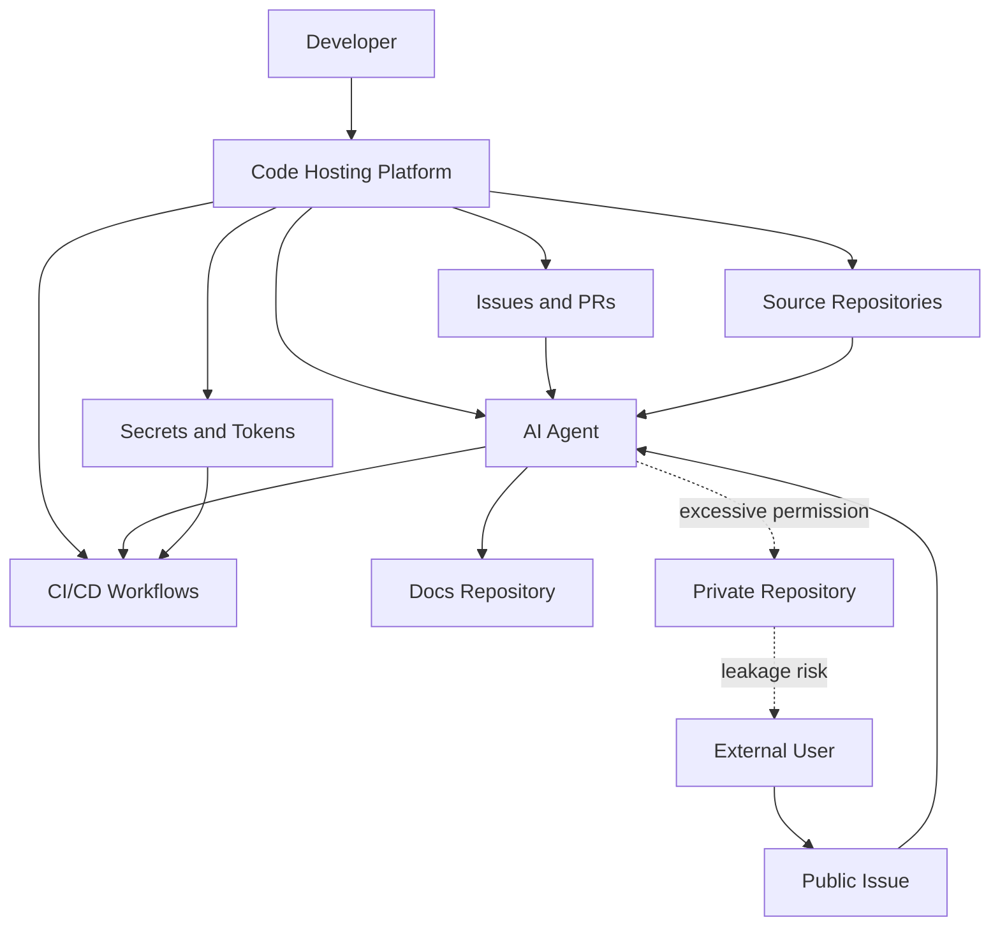

> 한 줄 요약: GitHub 대안, Codeberg, 셀프호스팅 논쟁은 플랫폼 취향만의 문제가 아니다. 자동화 에이전트가 저장소 권한을 대신 행사하는 순간, 코드 호스팅은 개발 도구를 넘어 보안 경계가 된다.

## 왜 지금 이슈인가

GitHub를 떠나는 프로젝트 이야기는 예전부터 있었다. Codeberg, Forgejo, Gitea, GitLab, 자체 Git 서버 중 무엇을 고를지 비교하는 글도 꾸준히 나온다.

그런데 2026년의 논쟁은 결이 조금 다르다. 예전에는 UI 불만이나 기업 이미지가 중심이었다면, 지금은 저장소 플랫폼이 어디까지 권한을 가져도 되는지가 더 큰 쟁점이 되고 있다.

How-To Geek 글은 Ghostty, Zig, Tenacity, Dillo, Hare 같은 프로젝트가 GitHub를 떠났거나 GitHub 의존도를 낮춘 사례를 묶어 소개한다. 이유는 하나로 정리하기 어렵다.

- 잦은 장애와 운영 신뢰도
- Microsoft 인수 이후의 정치적·윤리적 거부감
- Copilot과 AI 기능의 깊은 통합
- GitHub Actions, 이슈, PR, 릴리스, 패키지까지 묶인 플랫폼 종속

여기까지만 보면 오픈소스 커뮤니티의 익숙한 GitHub 반감처럼 읽힌다. 하지만 GitHub Agentic Workflows 사례를 함께 보면 문제가 더 또렷해진다.

GitHub 블로그는 Agentic Workflows로 제품 저장소의 변경을 문서 저장소 Pull Request로 자동 연결한 사례를 공개했다. Aspire 팀은 기능 PR 이후 문서 PR까지 이어지는 시간을 줄였고, 엔지니어 검토를 거치는 방식으로 자동화의 실용성을 보여줬다.

반대로 Noma Security의 GitLost 사례는 같은 흐름의 위험한 면을 보여준다. 공개 저장소 이슈에 숨긴 프롬프트 인젝션(Prompt Injection)이 같은 조직의 비공개 저장소 정보 유출로 이어질 수 있다는 지적이다.

그래서 지금의 질문은 GitHub를 쓸지 말지가 아니다.

플랫폼이 코드, 이슈, CI, 문서, AI 에이전트를 한곳에 모을수록 작업은 편해진다. 동시에 그 한곳은 공격자에게도 가장 매력적인 제어면(Control Plane)이 된다.

## 커뮤니티에서 갈리는 지점

### 왜 GitHub 대안을 찾을까?

Codeberg나 셀프호스팅을 택하는 쪽이 자유 소프트웨어 윤리만 말하는 것은 아니다. 더 현실적인 이유가 있다.

GitHub가 단순한 Git 원격 저장소였을 때는 이전 비용이 낮았다. `git remote set-url` 한 번이면 대부분의 개발 흐름을 옮길 수 있었다.

지금은 다르다. 많은 프로젝트가 다음 기능을 GitHub에 붙여 놓는다.

| 영역 | GitHub 의존 형태 | 이전 시 마찰 |
|---|---|---|
| 코드 | Repository, branch protection | 미러링, 권한 재설계 |
| 협업 | Issue, Pull Request, Review | 기존 논의와 링크 손실 |
| 자동화 | GitHub Actions | 시크릿, 러너, 워크플로 재작성 |
| 배포 | Packages, Releases, Pages | 배포 파이프라인 재구성 |
| 보안 | Dependabot, code scanning | 대체 스캐너와 알림 체계 필요 |
| AI | Copilot, Agentic Workflows | 권한·데이터 접근 범위 재검토 |

커뮤니티에서 Codeberg가 자주 언급되는 이유도 여기에 있다. Codeberg는 비영리 기반이고, Gitea 계열의 가벼운 Git 플랫폼 위에서 돌아간다. GitHub식 거대 통합보다 작은 표면적을 선호하는 개발자에게는 충분히 매력적인 선택지다.

다만 작은 표면적에는 대가가 따른다. GitHub의 네트워크 효과, 검색 노출, 기여자 계정 기반, Actions 생태계, 보안 알림을 잃을 수 있다. 오픈소스 프로젝트라면 이것이 곧 기여 장벽이 된다.

### GitHub Agentic Workflows는 편의인가, 새 공격면인가?

GitHub 블로그의 문서 자동화 사례는 설득력이 있다. 제품 저장소에서 기능이 머지되면, AI 에이전트가 변경 내용을 읽고 문서 저장소에 PR을 만든다. 마지막 검토는 사람이 맡는다.

이 흐름은 현업에서 자주 막히는 지점을 건드린다. 기능은 배포됐는데 문서는 늦고, 작성자는 코드 맥락을 다시 찾아야 하며, 리뷰어는 이미 다음 일을 하고 있다. 저장소 사이의 문서 자동화는 실제로 탐나는 문제다.

문제는 에이전트가 읽는 입력을 모두 믿을 수 있느냐는 것이다.

GitLost 사례는 공격자가 공개 이슈에 악성 지시를 심고, 에이전트가 그것을 작업 지시로 받아들이는 상황을 보여준다. 에이전트 입장에서는 이슈 본문, PR 설명, 코드 주석, 문서가 모두 자연어 입력이다. 사람에게는 댓글이지만, 모델에게는 명령처럼 작동할 수 있다.

여기서 입장이 갈린다.

- 찬성 쪽: 반복 업무를 줄이고, 문서·리뷰·릴리스처럼 밀리는 일을 자동화할 수 있다.
- 반대 쪽: 자연어 입력과 실행 권한이 만나면 기존 CI보다 예측하기 어려운 공격면이 생긴다.
- 중간 입장: 에이전트를 쓰되, 권한을 좁히고, 비신뢰 입력을 격리하고, 사람 승인 단계를 강제해야 한다.

나는 중간 입장이 가장 현실적이라고 본다. AI 자동화를 금지하면 조직 내부에서 비공식 자동화가 늘어날 가능성이 크다. 반대로 GitHub가 제공하니 안전하다고 믿고 조직 단위 권한을 넓게 열어주는 것도 위험하다.

## 아키텍처 관점에서 볼 점

### GitHub vs Codeberg vs 셀프호스팅 차이점은 무엇인가?

플랫폼 선택은 기능표 비교가 아니라 제어면을 어디에 둘지 정하는 문제다.

GitHub 같은 통합 플랫폼은 개발자 경험이 좋다. 저장소, 이슈, PR, Actions, 패키지, 보안 스캔, AI 도구가 하나의 권한 체계 안에서 움직인다. 기업 내부에서는 온보딩과 운영이 쉬워진다.

반면 장애 격리(Failure Isolation)는 약해질 수 있다. GitHub 장애가 코드 리뷰, 배포, 릴리스, 문서 업데이트를 동시에 멈춘다. 외부 SaaS 장애가 내부 릴리스 일정까지 흔드는 구조다.

Codeberg나 Forgejo 기반 셀프호스팅은 반대로 움직인다. 기능은 줄어들 수 있지만, 통제권과 격리 수준을 높일 수 있다. 특히 다음 조건에서는 설득력이 있다.

- 외부 SaaS에 소스·이슈·메타데이터를 두기 어려운 조직
- GitHub Actions 의존도가 낮거나 이미 별도 CI를 쓰는 팀
- 오픈소스 기여보다 장기 보존과 자율성을 우선하는 프로젝트
- AI 기능 통합을 조직 정책상 제한해야 하는 환경

하지만 셀프호스팅은 보안 책임을 직접 떠안는 선택이다. 백업, 업그레이드, CVE 대응, 이메일 발송, 스팸 방어, 계정 복구, 감사 로그, SSO 연동까지 챙겨야 한다. 작은 팀이라면 Git 서버 자체보다 운영 주변부가 더 무거울 수 있다.

### AI 에이전트 권한은 CI 권한보다 좁아야 한다

기존 CI/CD도 위험하다. 악성 PR이 빌드 스크립트를 바꾸거나, 시크릿을 탈취하거나, 배포 권한을 오용할 수 있다.

AI 에이전트에는 여기에 한 가지가 더 붙는다. 실행 계획 자체가 비정형 입력에서 만들어진다.

CI는 대체로 YAML에 적힌 명령을 실행한다. 에이전트는 이슈, 댓글, 문서, 코드 변경, 이전 대화까지 읽고 다음 행동을 정한다. 공격자는 코드 실행 취약점이 없어도, 에이전트가 읽을 문장에 악성 지시를 숨길 수 있다.

그래서 에이전트 권한 설계에는 다음 원칙이 필요하다.

| 원칙 | 설명 |
|---|---|
| 저장소 단위 최소 권한 | 공개 저장소 이슈를 읽는 에이전트가 비공개 저장소를 읽지 못하게 한다 |
| 쓰기 권한 분리 | 문서 PR 생성과 코드 PR 생성 권한을 분리한다 |
| 비신뢰 입력 라벨링 | 외부 사용자 입력과 내부 지시를 모델 컨텍스트에서 명확히 나눈다 |
| 사람 승인 단계 | 배포, 토큰 접근, 비공개 데이터 조회 전에는 승인 게이트를 둔다 |
| 감사 가능한 로그 | 에이전트가 어떤 입력을 읽고 어떤 도구를 호출했는지 남긴다 |

GitHub 블로그의 문서 자동화 사례도 이 점에서 볼 만하다. 효과가 있었던 이유는 자동화가 사람을 제거해서가 아니라, 사람 검토가 가능한 PR이라는 기존 협업 단위로 결과를 보냈기 때문이다.

자동화의 출력이 바로 배포나 데이터 변경으로 이어지면 위험이 커진다. 반대로 PR, diff, review처럼 팀이 이미 다룰 줄 아는 형식으로 떨어지면 통제 가능성이 생긴다.

## 실무에서 볼 점

### GitHub를 떠나기 전에 확인할 것

GitHub 대안을 검토할 때 가장 흔한 실수는 저장소만 보고 판단하는 것이다. 실제 이전 비용은 Git이 아니라 주변 시스템에서 나온다.

먼저 다음 목록을 적어봐야 한다.

- GitHub Actions 워크플로 수와 배포 권한
- Organization secret, environment secret 사용처
- GitHub App, OAuth App, webhook 연동
- Dependabot, code scanning, secret scanning 의존도
- GitHub Pages, Packages, Releases 사용 여부
- 외부 문서나 이슈에 박힌 GitHub 링크
- 기여자가 GitHub 계정만 가지고 참여하는 흐름

이 목록이 짧다면 Codeberg나 Forgejo 이전은 현실적이다. 길다면 전면 이전보다 미러링부터 시작하는 편이 낫다.

예를 들어 GitHub는 읽기 전용 미러로 유지하고, 실제 개발은 자체 Forgejo에서 하는 방식이 있다. 검색 노출과 기존 링크를 보존하면서 운영 주권을 조금씩 옮길 수 있다. Ghostty가 모든 의존을 한 번에 끊기보다 점진 이전을 말한 것도 같은 맥락으로 읽힌다.

### AI 자동화를 도입하기 전에 확인할 것

GitHub Agentic Workflows류의 자동화는 문서, 릴리스 노트, 이슈 분류, 테스트 실패 분석처럼 반복적이지만 맥락이 필요한 업무에 잘 맞는다.

다만 다음 조건을 만족하지 못하면 도입을 늦추는 편이 낫다.

- 에이전트가 읽는 입력의 출처를 구분할 수 있는가
- 외부 기여자 입력을 내부 지시보다 낮은 신뢰도로 다룰 수 있는가
- 에이전트 토큰이 필요한 저장소에만 접근하는가
- 실패했을 때 사람이 이해할 수 있는 diff로 남는가
- 비공개 저장소, 시크릿, 고객 데이터 접근이 차단되는가
- 에이전트 실행 로그를 보안팀이나 플랫폼팀이 추적할 수 있는가

현업에서 비슷한 자동화를 고민하다 보면 유혹은 늘 비슷하다. 일단 넓은 토큰 하나를 만들고, 막히는 권한을 하나씩 더 열어준다. 처음에는 빠르지만, 나중에는 어떤 자동화가 어떤 저장소를 읽는지 아무도 정확히 설명하지 못한다.

AI 에이전트에서는 이 방식이 더 위험하다. 자동화가 정해진 명령어만 실행하는 것이 아니라, 읽은 내용을 바탕으로 행동을 고르기 때문이다.

### 언제 Codeberg나 셀프호스팅이 맞을까?

Codeberg나 셀프호스팅이 GitHub보다 항상 나은 것은 아니다. 특히 대중적인 오픈소스 프로젝트라면 GitHub에 남아 있는 것만으로도 기여 접근성이 생긴다. 이 장점은 과소평가하기 어렵다.

다만 다음 상황이라면 대안 검토가 단순 취향을 넘어선다.

- 프로젝트의 핵심 가치가 플랫폼 독립성과 자유 소프트웨어에 닿아 있다
- GitHub 장애가 릴리스와 보안 패치 흐름을 반복적으로 막는다
- AI 기능 통합과 코드 데이터 사용 정책에 조직적 거부감이 있다
- 자체 CI, 자체 이슈 트래커, 자체 문서 배포가 이미 있다
- 저장소 접근 감사와 데이터 위치가 규제 요구사항에 걸린다

반대로 다음 상황에서는 GitHub 유지가 더 실용적일 수 있다.

- 신규 기여자 유입이 프로젝트 생존에 직접 영향을 준다
- Actions, Packages, Dependabot, code scanning 의존도가 높다
- 플랫폼 운영 인력이 부족하다
- 셀프호스팅 장애가 GitHub 장애보다 더 자주 날 가능성이 크다
- 보안 패치와 백업 운영을 꾸준히 할 자신이 없다

판단 기준은 감정이 아니라 복구 가능성이다. GitHub에 문제가 생겼을 때 하루 안에 미러에서 릴리스할 수 있는가. 셀프호스팅 서버가 깨졌을 때 백업으로 복원할 수 있는가. AI 에이전트가 이상한 PR을 만들었을 때 어떤 입력 때문에 그랬는지 추적할 수 있는가.

여기에 답하지 못하면 플랫폼 선택보다 운영 설계가 먼저다.

## 정리

GitHub 이탈 논쟁을 GitHub가 싫어진 사람들의 이야기로만 읽으면 중요한 부분을 놓친다. 더 큰 쟁점은 코드 호스팅 플랫폼이 개발 조직의 제어면이 되었고, AI 에이전트가 그 위에서 권한을 행사하기 시작했다는 점이다.

GitHub를 계속 써도 된다. Codeberg로 옮겨도 된다. Forgejo를 직접 운영해도 된다.

다만 선택 전에 한 가지는 바로 확인해야 한다.

내 저장소 플랫폼에서 외부 입력을 읽는 자동화가 어떤 비공개 저장소와 시크릿에 접근할 수 있는지 목록으로 뽑아보자. 그 목록이 예상보다 길다면, 플랫폼 이전보다 먼저 권한 경계를 다시 그어야 한다.

## 참고 자료

- [선정 글감] [Why developers are ditching GitHub for Codeberg and self-hosting alternatives](https://www.howtogeek.com/why-developers-are-ditching-github-for-codeberg-and-self-hosting-alternatives/) — Lobsters
- [관련] [GitLost: We Tricked GitHub's AI Agent into Leaking Private Repos](https://noma.security/blog/gitlost-how-we-tricked-githubs-ai-agent-into-leaking-private-repos/) — Noma Security
- [관련] [Automating cross-repo documentation with GitHub Agentic Workflows](https://github.blog/ai-and-ml/github-copilot/automating-cross-repo-documentation-with-github-agentic-workflows/) — GitHub Blog Engineering