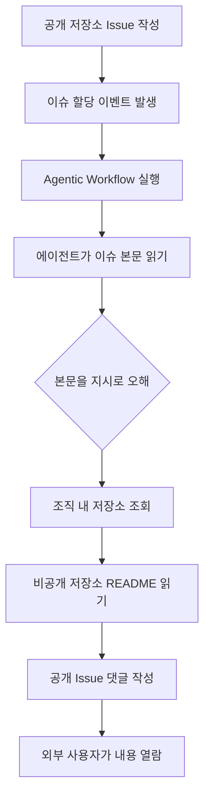

> 한 줄 요약: GitHub Agentic Workflows의 GitLost 이슈는 프롬프트 인젝션(Prompt Injection)이 코드 실행 이전에 권한 경계와 공개 출력 채널을 흔들 수 있음을 보여준다. AI 에이전트 보안은 모델 성능보다 입력의 신뢰도, 권한 범위, 결과가 쓰이는 위치부터 봐야 한다.

## 무슨 일이 있었나

2026년 7월 6일, Noma Labs는 GitHub의 Agentic Workflows를 대상으로 한 GitLost 취약점 분석을 공개했다. 요지는 단순하다. 공격자가 조직의 공개 저장소에 GitHub Issue를 만들고, 본문에 에이전트가 지시로 받아들일 문장을 숨기면, 에이전트가 같은 조직의 비공개 저장소 내용을 읽어 공개 이슈 댓글에 남길 수 있었다는 내용이다.

확인된 조건은 다음과 같다.

- GitHub Agentic Workflows가 이슈 할당 같은 이벤트로 실행됨
- 에이전트가 이슈 제목과 본문을 읽음
- 에이전트에게 조직 내 다른 저장소 읽기 권한이 있음
- 에이전트가 공개 이슈에 댓글을 남길 수 있음
- 공격자는 별도 계정 권한이나 코드 실행 권한 없이 공개 저장소 이슈만 작성

Noma Labs의 재현에서는 `README.md` 내용이 공개 저장소 댓글로 노출됐다. 특히 공개 저장소와 같은 조직에 있는 비공개 저장소가 읽기 범위에 포함됐다는 점이 문제가 됐다.

다만 추정과 확인된 사실은 나눠야 한다. 확인된 것은 Noma Labs가 특정 워크플로 구성에서 프롬프트 인젝션으로 비공개 저장소 데이터를 공개 댓글로 유출하는 데 성공했고, GitHub에 책임 있는 공개 절차에 따라 알렸다는 점이다. 모든 GitHub Agentic Workflows가 같은 방식으로 취약하다고 단정할 수는 없다. 위험은 제품 이름보다 에이전트가 어떤 입력을 읽고, 어떤 권한으로 도구를 호출하며, 결과를 어디에 쓰는지에 달려 있다.

Noma Labs 글에서 눈에 띄는 대목은 GitHub에 방어 장치가 있었지만, 특정 표현을 덧붙였을 때 모델이 거절하지 않고 출력 형태를 바꿔 응답했다는 설명이다. 단어 하나가 마법처럼 보안을 뚫었다는 뜻은 아니다. 모델 기반 가드레일은 권한 검증 코드처럼 항상 같은 결정을 내리지 않는다.

## 왜 사람들이 반응했나

커뮤니티가 민감하게 반응한 이유는 비공개 저장소라는 단어 때문만은 아니다. 개발자에게 GitHub는 코드 저장소이면서 권한 관리 시스템이고, 조직 지식의 장기 보관소다. 이 안에 들어온 AI 에이전트가 공개 이슈와 비공개 저장소 사이를 오가면 사고의 모양이 기존 웹 취약점과 달라진다.

먼저 신뢰 경계가 흐려졌다. 이슈 본문은 외부 사용자가 쓸 수 있는 비신뢰 입력이다. 반면 워크플로 지시와 저장소 권한은 내부 운영자가 설정한 신뢰 영역이다. GitLost는 이 둘이 같은 컨텍스트 창(Context Window) 안에 들어갈 때 어떤 일이 벌어질 수 있는지 보여줬다.

두 번째는 권한 범위다. 기존 자동화에서도 과도한 토큰 권한은 위험했다. 다만 GitHub Actions에서는 YAML, 시크릿(Secret), 권한 스코프(Permission Scope)를 비교적 명시적으로 볼 수 있었다. 에이전트 워크플로에서는 자연어 지시, 모델 판단, 도구 호출이 한 흐름에 묶인다. 리뷰어가 봐야 할 대상도 코드 한 줄에서 대화 흐름과 권한 조합으로 넓어진다.

세 번째는 공개 출력 채널이다. 에이전트가 민감한 데이터를 읽는 것만으로는 유출이 아니다. 그 내용을 공개 댓글, 슬랙 메시지, 이메일, 문서 같은 채널에 쓰는 순간 사고가 된다. Discord가 2026년 7월 7일 인정한 AI moderation 버그도 비슷한 교훈을 준다. 자동 시스템이 무해한 이미지 일부를 유해 콘텐츠와 비슷하다고 판단했고, 사람이 검토해야 할 흐름에서 버그 때문에 계정 차단이 바로 실행됐다. 문제는 AI 판정 하나가 아니라 그 뒤에 붙은 자동 조치였다.

네 번째는 비용과 관찰 가능성이다. Computerphile의 AI 토큰 비용 설명은 보안 이슈와 멀어 보이지만 실무에서는 연결된다. 에이전트가 단순 요청을 처리한다며 여러 파일, 이슈, 댓글, 문서를 훑기 시작하면 토큰 사용량이 늘고, 읽는 표면도 넓어진다. 비용 폭증은 과도한 탐색의 신호일 때가 많고, 과도한 탐색은 권한 과다와 쉽게 만난다.

다섯 번째는 에이전트가 점점 백그라운드로 이동한다는 점이다. WIRED가 다룬 Claude Cowork 사례처럼, 사용자가 노트북을 닫아도 에이전트가 작업을 계속 수행하는 방향으로 제품이 움직이고 있다. 편리한 흐름이지만, 사용자가 보고 있지 않은 시간에 이메일, Slack, 회의록, 웹 자료를 모아 문서를 만들고 메시지를 준비한다면 감사 로그와 중단 버튼의 의미가 커진다.

GitHub Trending에 오른 `last30days-skill` 같은 도구도 같은 방향을 보여준다. Reddit, X, YouTube, Hacker News, Polymarket 같은 여러 플랫폼을 병렬로 검색하고, 참여 신호를 바탕으로 요약하는 에이전트형 검색은 매력적이다. 동시에 각 플랫폼 인증, 세션, API 키, 브라우저 상태가 하나의 작업 흐름에 묶인다. 사람들이 반응한 지점은 AI가 똑똑해졌다는 감탄보다, 자동화가 너무 많은 권한 문을 한 번에 열고 다닌다는 불안에 가깝다.

## 내가 보는 핵심

이번 이슈는 프롬프트 인젝션을 모델 버그로만 보면 대응이 늦어진다는 점을 남겼다. GitLost는 AI 보안 이슈이지만 권한 설계, 출력 제어, 운영 검토 문제이기도 하다.

현업에서 비슷한 고민을 하다 보면 에이전트에게 넓은 읽기 권한을 주고 싶어지는 순간이 온다. 그래야 답이 좋아지고, 문맥을 덜 물어보고, 자동화가 그럴듯하게 완성된다. 하지만 에이전트가 읽을 수 있는 모든 것은 잠재적 입력이고, 에이전트가 쓸 수 있는 모든 곳은 잠재적 유출 경로다.

전통적인 자동화에서는 실행 주체가 코드였다. 이제는 코드, 모델 판단, 도구 호출이 한 흐름으로 묶인다. 그래서 다음 질문을 먼저 해야 한다.

- 이 입력은 누구나 쓸 수 있는가?
- 이 입력이 에이전트 지시와 같은 문맥에 들어가는가?
- 에이전트가 읽을 수 있는 비공개 자산은 어디까지인가?
- 에이전트가 외부에 쓸 수 있는 채널은 무엇인가?
- 실패했을 때 사람이 알 수 있는가?
- 자동 조치 전에 멈추는 단계가 있는가?

Noma Labs가 프롬프트 인젝션을 SQL Injection에 비유한 것도 이 맥락에서는 설득력이 있다. 차이는 있다. SQL Injection은 대체로 쿼리와 데이터를 코드로 분리하는 방어가 자리 잡았다. 프롬프트 인젝션은 아직 경계가 제품 UI, 모델 프롬프트, 도구 권한, 조직 정책에 흩어져 있다. 금지어 목록이나 단일 필터만으로 막기 어려운 이유다.

더 현실적인 원칙은 에이전트를 신뢰하지 말자는 구호가 아니라, 에이전트가 실수해도 피해가 커지지 않게 만드는 것이다. 공개 이슈를 읽는 에이전트는 공개 저장소 범위 안에서만 읽게 한다. 비공개 저장소를 읽는 에이전트는 공개 댓글을 쓰지 못하게 한다. 외부 입력을 읽은 뒤 민감한 도구를 호출하려면 별도 승인이나 격리된 실행 단계를 둔다.

이 설계는 조금 불편하다. 자동화의 매끄러움도 줄어든다. 그래도 위험은 대개 그 불편함을 없애는 과정에서 생긴다. 한 번에 읽고 판단하고 게시하는 흐름은 데모에서는 좋아 보이지만 운영에서는 사고 반경을 키운다.

## 앞으로 볼 기준

다음에 AI 에이전트 제품이나 플랫폼 자동화 뉴스를 볼 때는 기능명보다 데이터 흐름을 먼저 보면 된다. 누가 입력을 만들고, 에이전트가 무엇을 읽고, 어떤 권한으로 도구를 호출하고, 결과가 어디로 나가는지 확인해야 한다.

체크포인트는 짧게 정리할 수 있다.

| 확인할 것 | 봐야 할 질문 |
|---|---|
| 입력 신뢰도 | 외부 사용자가 만든 텍스트, 이미지, 댓글, 파일을 읽는가 |
| 권한 범위 | 조직 전체, 저장소 전체, 메일함 전체 같은 넓은 권한을 갖는가 |
| 출력 채널 | 공개 댓글, 외부 이메일, 메신저, 문서 생성 권한이 있는가 |
| 승인 단계 | 민감한 읽기나 쓰기 전에 사람 검토가 있는가 |
| 로그와 재현성 | 어떤 입력 때문에 어떤 도구가 호출됐는지 추적 가능한가 |
| 비용 신호 | 비정상적으로 많은 토큰과 조회가 발생했을 때 알림이 있는가 |
| 실패 모드 | 오탐, 과잉 차단, 데이터 유출 중 무엇이 최악의 결과인가 |

Discord 사례는 자동 판단이 사용자 계정이라는 결과로 이어질 때의 위험을 드러낸다. Claude Cowork 같은 백그라운드 에이전트 흐름은 사용자가 지켜보지 않는 시간의 권한 문제를 보여준다. `last30days-skill` 같은 에이전트형 검색은 여러 플랫폼과 인증을 한곳에 묶을 때 표면이 얼마나 넓어지는지 보여준다. GitLost는 이 흐름이 개발 플랫폼 안으로 들어왔을 때 어떤 식으로 터질 수 있는지 보여준 사건이다.

그래서 GitLost를 GitHub만의 사건으로 읽으면 너무 좁다. 공개 입력을 읽는 AI가 비공개 자산에 접근하고, 다시 공개 채널에 쓸 수 있다면 플랫폼이 무엇이든 같은 유형의 사고가 가능하다.

에이전트가 사람 대신 일을 끝내는 방향은 이미 진행 중이다. 앞으로 볼 것은 모델이 더 똑똑한가보다, 좁은 권한으로도 충분히 유용한가다. 자동화가 편해질수록 먼저 줄여야 할 것은 사람의 개입이 아니라 에이전트가 실수했을 때 닿을 수 있는 범위다.

## 참고 자료

- [선정 글감] [GitLost: We Tricked GitHub's AI Agent into Leaking Private Repos](https://noma.security/blog/gitlost-how-we-tricked-githubs-ai-agent-into-leaking-private-repos/), Noma Labs
- [관련] [Why AI Tokens are so Expensive - Computerphile](https://www.youtube.com/watch?v=-0HRzXk8vlk), Computerphile
- [관련] [mvanhorn/last30days-skill](https://github.com/mvanhorn/last30days-skill), GitHub Trending
- [관련] [Shut Those Laptops! Anthropic Puts Its Claude Cowork Agent on Your Phone](https://www.wired.com/story/shut-those-laptops-anthropic-puts-its-claude-cowork-agent-on-your-phone/), WIRED
- [관련] [Discord admits AI moderation bug wrongfully banned users over harmless images](https://techcrunch.com/2026/07/07/discord-admits-ai-moderation-bug-wrongfully-banned-users-over-harmless-images/), TechCrunch