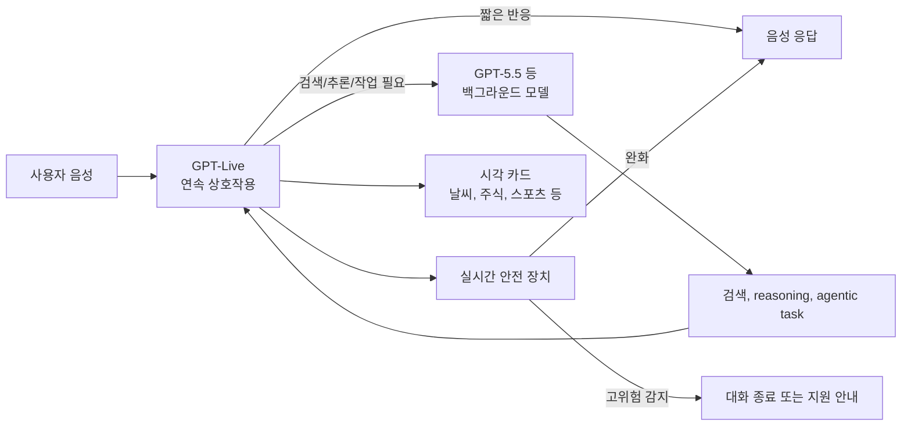

> 한 줄 요약: GPT-Live는 ChatGPT Voice를 더 자연스럽게 만드는 음성 모델 출시가 아니다. 풀 듀플렉스 대화, 백그라운드 모델 위임, 실시간 안전 개입을 하나의 인터페이스에 묶은 변화다. 사람들이 반응한 지점도 성능보다 권한과 신뢰의 경계에 가깝다.

## 무슨 일이 있었나

2026년 7월 8일, OpenAI는 GPT-Live를 공개했다. 발표 범위는 ChatGPT Voice 경험이며, GPT-Live-1과 GPT-Live-1 mini 두 모델이 전 세계 ChatGPT 사용자에게 순차 제공된다고 설명했다.

확인된 내용은 다음과 같다.

- GPT-Live는 풀 듀플렉스(Full-duplex) 구조로, 듣기와 말하기를 동시에 처리한다.
- 검색, 추론, 에이전트 작업이 필요하면 GPT-Live가 GPT-5.5 같은 별도 모델에 작업을 넘긴다.
- ChatGPT Voice는 GPT-Live 기반으로 바뀐다. mini 모델은 기본 경험에 들어가고, 유료 사용자는 더 큰 GPT-Live-1을 쓸 수 있다.

TechCrunch는 기존 Advanced Voice Mode가 GPT-Live-1 mini로 대체된다는 점을 짚었다. 새 음성 모드는 사용자의 말을 끊는 문제와 답변의 지능 부족 문제를 줄이는 방향으로 설계됐다고도 설명했다. OpenAI는 API 제공도 예고했지만, 발표 시점 기준 API는 아직 예정 단계다.

아직은 지켜봐야 할 부분도 있다. GPT-Live가 실제 일상 사용에서 얼마나 덜 끊고, 얼마나 덜 오작동하며, 긴 대화에서 얼마나 안정적인지는 공개 데모와 내부 평가만으로 단정하기 어렵다. Hacker News에서 300점, 220개 댓글이 붙은 이유도 이 지점과 맞닿아 있다. 사람들은 새 음성 모델의 자연스러움보다, 항상 듣고 말하는 AI가 컴퓨팅 인터페이스가 될 때 생기는 운영 리스크를 먼저 떠올렸다.

## 왜 사람들이 반응했나

### GPT-Live가 왜 단순 음성 품질 문제가 아닌가

기존 음성 AI의 불편함은 대체로 턴 기반 대화에서 나왔다. 사용자가 잠깐 멈추면 말이 끝났다고 오해하고, 배경 소음이 있으면 끼어들고, 답변이 늦으면 대화 흐름이 깨진다.

GPT-Live는 이 문제를 줄이기 위해 메시지 단위가 아니라 연속 입력을 처리한다. 모델은 매 순간 말할지, 들을지, 기다릴지, 끼어들지, 도구를 호출할지를 판단한다. 여기까지만 보면 사용성 개선처럼 보인다.

개발자 커뮤니티가 민감하게 본 부분은 바로 그 연속성이다. 텍스트 챗봇은 사용자가 전송 버튼을 누르는 순간 경계가 생긴다. 음성 인터페이스에서는 그 경계가 흐려진다. 사용자가 생각하느라 멈춘 것인지, 대화가 끝난 것인지, 혼잣말인지, 주변 사람의 말인지 시스템이 판단해야 한다.

이 판단은 제품 경험을 좋게 만들 수 있지만, 권한 문제도 복잡하게 만든다. 듣고 있어야 자연스러워지고, 자연스러워질수록 사용자는 덜 의식적으로 말하게 된다.

### 신뢰 문제: “잘 듣는다”와 “계속 듣는다” 사이

OpenAI는 GPT-Live가 사용자의 말을 더 잘 기다리고, 배경 소음에 덜 흔들리며, 사용자가 조용히 있으라고 하면 조용히 있을 수 있다고 설명한다. 기존 음성 모드에서 자주 지적된 불편함을 겨냥한 개선이다.

그런데 현업에서 비슷한 인터페이스를 설계하다 보면, 잘 듣는 기능은 곧 수집 범위 질문으로 이어진다. 언제부터 입력으로 볼 것인가. 어느 시점까지 버퍼에 남는가. 안전 필터는 음성 스트림의 어느 구간을 보는가. 위임된 모델에는 원음이 가는가, 전사 텍스트만 가는가.

발표문만으로 모든 데이터 경로가 드러나지는 않는다. 그래서 이 이슈는 성능 발표이면서 동시에 투명성 요구로 이어진다. 사용자는 자연스러운 대화를 원하지만, 기업과 개발자는 감사 가능한 경계를 원한다.

### 비용 문제: 음성은 토큰보다 운영 단위가 까다롭다

OpenAI는 매주 1억 5천만 명 이상이 Voice와 Dictation 같은 기능으로 ChatGPT와 대화한다고 밝혔다. 이 규모에서 풀 듀플렉스 음성은 단순히 모델 하나를 더 빠르게 만드는 문제가 아니다.

연속 음성 입력은 대기 시간, 스트리밍 처리, 노이즈 처리, 중간 발화, 안전 판단, 백그라운드 작업을 함께 다룬다. 사용자가 질문을 던지고 답을 기다리는 동안 GPT-Live는 대화 흐름을 유지하면서 별도 모델에 일을 맡길 수 있다. 사용성은 좋아지지만 비용과 장애 지점은 늘어난다.

예를 들어 검색이 필요한 질문이라면 흐름은 갈라진다. GPT-Live는 사용자와 짧은 상호작용을 이어가고, 뒤에서는 GPT-5.5가 검색이나 추론을 수행한다. 이때 백그라운드 작업이 늦어지거나 실패하면 음성 대화는 어떤 상태로 남아야 할까. 침묵해야 할까, 중간 설명을 해야 할까, 다시 질문해야 할까.

텍스트 UI라면 로딩 표시 하나로 버틸 수 있다. 음성 UI에서는 침묵도 메시지다.

### 안전 문제: 실시간 개입은 UX이자 통제 장치다

OpenAI는 GPT-Live에 음성 전용 안전 평가와 합성 오디오 기반 평가를 추가했다고 밝혔다. 대상 영역에는 자해, 정신증과 조증, AI에 대한 정서적 의존, 폭력, 성적 콘텐츠가 포함된다. 고위험 상황에서는 안전 메시지나 지원 정보를 띄우거나, 음성 대화를 종료할 수도 있다고 설명했다.

이 대목에서는 커뮤니티 반응이 갈릴 수밖에 없다. 한쪽에서는 음성 AI가 정서적으로 훨씬 강한 인터페이스이므로 실시간 보호 장치가 필요하다고 본다. 다른 쪽에서는 모델이 대화 중단이나 부모 알림 같은 조치를 수행할 때의 기준과 오류 가능성을 걱정한다.

특히 청소년 보호 기능은 더 민감하다. OpenAI는 부모가 teen 사용자의 Voice 사용 여부를 제어할 수 있고, 연결된 부모에게 고위험 자해 또는 자살 의심 상황을 알릴 수 있다고 밝혔다. 의도는 보호지만, 실제 운영에서는 오탐, 맥락 해석, 지역별 법규, 가족 관계의 안전성 같은 문제가 따라온다.

음성 AI의 안전은 필터링만으로 끝나지 않는다. 누가 판단하고, 누가 통보받고, 사용자는 그 사실을 언제 알 수 있는지가 함께 설계돼야 한다.

## 내가 보는 핵심

### 음성 AI 리스크는 모델보다 경계 설계에서 나온다

GPT-Live의 핵심 변화는 자연스러운 말투가 아니다. 컴퓨터와 상호작용하는 기본 단위가 클릭이나 입력문에서 대화 흐름으로 이동한다는 점이다.

이 변화가 커질수록 제품은 더 편해진다. 동시에 시스템은 사용자의 의도, 침묵, 감정, 주변 맥락을 더 많이 추론해야 한다. 여기서 문제가 생긴다. 모델 성능이 좋아져도 추론의 대상이 늘어나면 실패의 종류도 늘어난다.

텍스트 챗봇의 실패는 틀린 답변으로 보이는 경우가 많다. 음성 에이전트의 실패는 끼어들기, 침묵, 과한 친밀감, 부적절한 위로, 민감 정보 노출, 작업 위임 실패처럼 나타난다. 사용자는 이것을 단순한 버그가 아니라 무례함이나 불안함으로 느낄 수 있다.

### 풀 듀플렉스는 인터페이스가 아니라 운영 정책이다

풀 듀플렉스는 기술적으로 듣기와 말하기를 동시에 처리하는 구조다. 제품 관점에서는 대화의 주도권을 나눠 갖는 방식이다.

사용자가 말하는 도중 AI가 맞장구를 칠 수 있다. 사용자가 멈췄을 때 기다릴 수 있다. 사용자가 끼어들면 즉시 반응할 수 있다. 이런 기능은 사람 같은 대화를 만든다.

하지만 같은 기능이 민감한 상황에서는 리스크가 된다. 의료 상담, 법률 상담, 고객센터, 교육, 청소년 대화, 직장 회의 보조처럼 맥락의 무게가 큰 곳에서는 맞장구 하나도 사용자 판단에 영향을 줄 수 있다. 특히 모델이 정서적 지지를 제공하는 경우, 사용자는 답변의 정확성보다 목소리의 확신에 설득될 수 있다.

그래서 GPT-Live 같은 제품을 볼 때는 음성 품질보다 다음 질문을 먼저 봐야 한다.

| 질문 | 봐야 할 이유 |
| --- | --- |
| 음성 원본과 전사 텍스트가 어디까지 저장되는가 | 개인정보와 감사 범위가 달라진다 |
| 백그라운드 모델 위임 시 어떤 데이터가 넘어가는가 | 검색, 추론, 에이전트 작업의 책임 경계가 생긴다 |
| 안전 개입이 어떤 기준으로 발동되는가 | 오탐과 과잉 개입의 비용이 크다 |
| 사용자가 듣기 상태를 명확히 알 수 있는가 | 상시 청취 불안을 줄이는 핵심 UI다 |
| 기업 API에서 로그, 보존, 지역 제한을 제어할 수 있는가 | 도입 가능 여부가 여기서 갈린다 |

### 개발자에게 불편한 지점은 API 출시 이후 더 커진다

OpenAI는 GPT-Live API 제공을 예고했다. 소비자용 ChatGPT Voice에서는 OpenAI가 제품 경험과 안전 정책을 직접 통제한다. API가 열리면 이야기가 달라진다.

개발자는 이 모델을 고객센터, 교육 앱, 회의 도우미, 실시간 통역, 영업 보조, 헬스케어 주변 서비스에 붙이고 싶어질 것이다. 이때 GPT-Live의 장점은 곧 통합 난도가 된다.

음성 스트림을 누가 보관할지, 상담 도중 도구 호출이 실패하면 어떻게 복구할지, 사용자가 모델의 말을 끊었을 때 이미 실행 중인 작업을 취소할지, 위험 신호가 감지됐을 때 서비스 사업자와 모델 제공자 중 누가 책임질지 정해야 한다.

이런 기준 없이 자연스러움만 보고 붙이면, 나중에 로그와 책임 소재를 맞추기 어렵다. 특히 한국어 서비스에서는 개인정보보호법, 통신 녹음 고지, 미성년자 보호, 고객센터 품질 관리 같은 현실 조건도 함께 봐야 한다.

## 앞으로 볼 기준

### GPT-Live 뉴스를 볼 때 무엇을 확인해야 하나

첫째, 모델 성능표보다 상호작용 경계를 봐야 한다. GPT-Live가 GPQA, BrowseComp, 내부 음성 통신 상담 평가에서 Advanced Voice Mode보다 나은 결과를 냈다는 설명은 참고할 만하다. 다만 실제 서비스 리스크는 벤치마크보다 대화 중단, 오탐, 로그 보존, 도구 호출 실패에서 더 자주 드러난다.

둘째, 기본값을 봐야 한다. TechCrunch 보도처럼 기존 Advanced Voice Mode가 GPT-Live-1 mini로 대체된다면, 이 변화는 선택 기능이 아니라 기본 경험의 변화다. 사용자가 명시적으로 새 인터페이스를 고른 것인지, 업데이트로 자연스럽게 이동한 것인지는 신뢰에 영향을 준다.

셋째, 시각 응답과 음성 응답이 결합되는 방식을 봐야 한다. OpenAI는 날씨, 주식, 스포츠 같은 주제에서 음성 대화 중 시각 카드를 보여줄 수 있다고 밝혔다. 편리한 기능이지만, 대화형 에이전트가 화면까지 사용하기 시작한다는 뜻이기도 하다. 음성으로 설득하고 화면으로 선택지를 보여주는 흐름은 커머스, 금융, 예약 서비스에서 강한 영향을 만들 수 있다.

넷째, 감정적 의존 측정과 사후 모니터링의 구체성을 봐야 한다. OpenAI는 정서적 의존에 대한 장기 측정과 출시 후 모니터링을 언급했다. 방향은 맞지만, 외부에서 확인할 수 있는 지표와 사용자 제어권이 없다면 신뢰를 쌓기 어렵다.

### 실무 도입 전에 필요한 체크포인트

GPT-Live류 음성 AI를 제품에 붙인다면 기능 목록보다 운영 문서를 먼저 만들어야 한다.

- 사용자가 언제 녹음 또는 스트리밍 중인지 즉시 알 수 있어야 한다.
- 음성 원본, 전사 텍스트, 모델 응답, 도구 호출 로그의 보존 기간을 분리해야 한다.
- 민감 대화에서는 자동 위임되는 모델과 도구 목록을 제한해야 한다.
- 사용자가 대화 중 작업 취소를 말했을 때 이미 실행된 작업과 대기 중인 작업을 구분해야 한다.
- 청소년, 의료, 금융, 법률처럼 고위험 영역은 기본 차단 또는 별도 동의가 필요하다.
- 음성 응답 실패 시 텍스트 fallback을 제공해야 한다.
- 안전 개입이 발생한 경우 사용자에게 설명 가능한 기록을 남겨야 한다.

이 체크포인트는 기능 출시를 늦추자는 말이 아니다. 음성 인터페이스는 실패했을 때 사용자가 느끼는 침범감이 크다. 그래서 출시 전에 실패 모드를 제품 언어로 정해두어야 한다.

GPT-Live가 던진 질문은 AI가 사람처럼 말할 수 있느냐가 아니다. 사람이 덜 의식하며 말하게 되는 순간, 시스템은 어디까지 들어도 되는가. 그리고 그 판단을 사용자가 얼마나 이해하고 통제할 수 있는가.

음성 AI가 컴퓨팅의 다음 인터페이스가 된다면, 먼저 좋아져야 할 것은 목소리의 자연스러움이 아니라 경계의 선명함이다.

## 참고 자료

- [선정 글감] [GPT-Live — Hacker News Best](https://openai.com/index/introducing-gpt-live/)
- [관련] [OpenAI releases new voice models for more natural live conversations — TechCrunch](https://techcrunch.com/2026/07/08/openai-releases-new-voice-models-for-more-natural-live-conversations/)
- [관련] [Introducing GPT-Live — OpenAI Blog](https://openai.com/index/introducing-gpt-live)