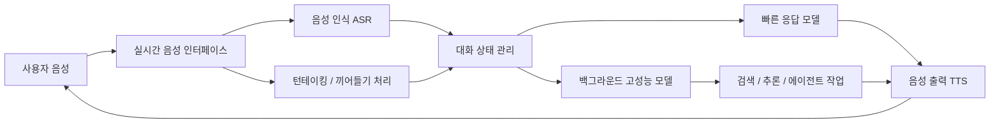

> 한 줄 요약: GPT-Live와 새 ChatGPT Voice에서 더 크게 볼 점은 목소리의 자연스러움보다 인터페이스의 범위다. 듣기, 말하기, 기다리기, 다른 모델로 작업 넘기기까지 실시간 대화 화면 안으로 들어오기 시작했다.

## 무슨 일이 있었나

2026년 7월 8일, OpenAI는 ChatGPT Voice에 쓰는 새 음성 모델 GPT-Live-1과 GPT-Live-1 mini를 공개했다. TechCrunch 보도에 따르면 OpenAI는 기존 Advanced Voice Mode를 GPT-Live-1 mini로 기본 교체하고, 유료 사용자는 더 큰 GPT-Live-1을 쓸 수 있게 한다.

가장 눈에 띄는 변화는 풀 듀플렉스(Full-duplex) 구조다. 사용자가 말하는 동안 모델도 듣고, 모델이 말하는 중간에도 사용자가 끼어들 수 있다. 전화 통화에 가까운 턴테이킹(Turn-taking)을 만들겠다는 방향이다.

OpenAI 글은 GPT-Live가 대화 중 "mhmm", "yeah" 같은 짧은 반응을 하거나, 사용자가 생각하는 동안 조용히 기다릴 수 있다고 설명한다. 질문이 웹 검색, 깊은 추론, 장기 작업을 요구하면 뒤에서 GPT-5.5 같은 최신 텍스트 모델에 일을 넘기고, 음성 대화는 끊지 않는다는 설명도 붙었다.

확인된 사실과 해석은 나눠서 봐야 한다.

| 구분 | 내용 |
| --- | --- |
| 확인된 사실 | GPT-Live-1, GPT-Live-1 mini 공개 |
| 확인된 사실 | ChatGPT Voice에 순차 적용, Advanced Voice Mode 기본 교체 |
| 확인된 사실 | 풀 듀플렉스 대화, 끼어들기, 침묵 유지, 백그라운드 모델 위임 지원 |
| 확인된 사실 | OpenAI는 API 제공도 예고했지만 시점은 아직 확정하지 않음 |
| 확인된 사실 | OpenAI는 청소년 응답, 자해 관련 대화 등에 안전장치를 언급 |
| 관찰된 한계 | TechCrunch 데모에서 힌디어 실시간 번역은 억양과 문체가 자연스럽지 않았음 |
| 추정에 가까운 해석 | 음성이 복잡한 업무의 주 인터페이스가 될 수 있다는 전망 |
| 아직 미확인 | AI 이어버드 같은 하드웨어 출시 여부 |

이 이슈가 음성 기능 업데이트로만 보이지 않는 이유는 경쟁 구도 때문이다. Hugging Face와 Cerebras도 2026년 7월 1일 공개한 실시간 음성 AI 글에서 지연시간(Latency)을 사용자 경험의 병목으로 짚었다. 음성 인식(ASR), 언어 모델, 음성 합성(TTS)을 이어 붙이는 개방형 모듈식 구조도 함께 제시했다.

OpenAI는 ChatGPT 안에서 통합 경험을 밀고, Hugging Face와 Cerebras 쪽은 교체 가능한 오픈 스택을 앞세운다. 커뮤니티 반응도 이 지점에서 갈린다. 목소리가 얼마나 자연스럽냐보다, 누가 대화의 흐름과 작업 실행 권한을 쥐느냐가 더 큰 쟁점이 된다.

## 왜 사람들이 반응했나

### ChatGPT Voice는 왜 불편함과 기대를 동시에 만들었나

음성 AI는 데모가 좋으면 기대가 빨리 붙는다. 손이 바쁠 때 말로 검색하고, 번역하고, 코드를 설명시키고, 일정이나 문서를 처리하는 장면은 이해하기 쉽다. OpenAI가 언급한 30~40분 산책 중 대화 같은 사용 사례도 같은 흐름에 있다.

문제는 사람처럼 반응하는 인터페이스가 불편함도 만든다는 점이다. 짧은 맞장구, 침묵, 끼어들기 대응은 쓰기 편하게 만들지만, 사용자가 어디까지 기계와 대화하고 있는지 흐리게 만든다. OpenAI가 AI companion을 목표로 하지 않는다고 선을 그은 것도 이 긴장을 의식한 표현으로 보인다.

특히 음성은 텍스트보다 감정적 신호가 강하다. 같은 답변이라도 화면의 문장과 귀에 들리는 목소리는 다르게 받아들여진다. 그래서 안전장치도 단순 필터 문제가 아니다. 어떤 톤으로 거절하는지, 미성년자에게 어떻게 말하는지, 자해 같은 민감한 주제에서 어디까지 듣고 어디서 개입하는지가 제품 신뢰의 일부가 된다.

### 풀 듀플렉스 AI가 바꾸는 것은 기능이 아니라 권한이다

풀 듀플렉스는 듣기와 말하기를 동시에 처리하는 통신 방식이다. 사람 사이 대화에서는 당연하지만, AI 시스템에서는 꽤 큰 제품 변화다. 기존 음성 비서는 사용자가 말하고, 멈추고, 서버가 처리하고, 답하는 순서에 가까웠다.

GPT-Live가 약속하는 경험은 다르다. 사용자가 말을 고쳐도 따라오고, 중간에 끊어도 반응하고, 답을 준비하는 동안 대화를 유지한다. 이때 AI는 명령을 기다리는 입력창보다 대화의 리듬을 함께 조절하는 인터페이스에 가까워진다.

현업에서 비슷한 기능을 붙인다고 생각하면 바로 어려운 질문이 생긴다.

- 사용자가 말한 내용 중 어디까지를 저장할 것인가
- 끼어들기는 취소인가, 정정인가, 새 명령인가
- 백그라운드 모델에 넘긴 작업은 사용자가 명시적으로 승인했는가
- 대화 중 나온 민감 정보가 검색, 추론, 에이전트 작업으로 흘러가도 되는가
- 잘못 알아들은 음성 명령이 실제 작업 실행으로 이어질 때 누가 막는가

텍스트 기반 챗봇에서는 사용자가 엔터를 치는 순간이 비교적 명확한 경계였다. 음성에서는 그 경계가 흐려진다. 이 흐림 덕분에 대화가 자연스러워지지만, 리스크도 여기서 시작된다.

### 커뮤니티 반응이 큰 이유: 지연시간과 통제권

Hacker News에 올라온 OpenAI GPT-Live 글은 600점대 반응과 400개 넘는 댓글을 모았다. 새 모델 이름 하나 때문만은 아니다. 개발자 커뮤니티는 음성 AI를 볼 때 데모의 인상보다 지연시간, 비용, 실패 모드, 로컬 실행 가능성을 먼저 본다.

Hugging Face와 Cerebras의 글도 같은 문제를 짚는다. 음성 AI에서 평균 응답 시간이 괜찮아도 P95 지연시간이 몇 초로 튀면 대화 경험은 깨진다. 사용자는 평균을 느끼지 않는다. 말을 멈춘 뒤 이상하게 긴 침묵, 늦게 튀어나오는 답변, 이미 다음 말을 시작했는데 따라오는 이전 응답을 느낀다.

Reddit LocalLLaMA 쪽에서 audio.cpp 같은 로컬 음성 처리 프로젝트가 관심을 받는 것도 이 맥락이다. 빠른 ASR, 스트리밍 처리, C++/GGML 기반 실행은 거대 플랫폼과 다른 요구를 보여준다. 모든 대화를 클라우드 모델에 맡기지 않고, 일부는 로컬에서 처리하거나 직접 바꾸고 싶다는 요구다.

이 갈림길은 꽤 실무적이다.

| 선택지 | 장점 | 부담 |
| --- | --- | --- |
| 통합형 클라우드 음성 모델 | 품질, 배포 속도, 최신 모델 접근 | 비용, 종속성, 데이터 이동, 정책 변경 리스크 |
| 오픈 모듈식 음성 스택 | 교체 가능성, 내부 통제, 실험 자유도 | 운영 복잡도, 품질 편차, 지연시간 튜닝 |
| 로컬/엣지 음성 처리 | 프라이버시, 지연시간, 오프라인 가능성 | 하드웨어 제약, 모델 관리, 기능 한계 |

그래서 이번 이슈를 OpenAI와 오픈소스의 단순 대결로만 보기 어렵다. 제품이 어떤 대화를 맡을 것인지, 그 대화가 어떤 데이터를 포함하는지, 실패했을 때 어디서 끊을 것인지의 문제다.

## 내가 보는 핵심

### 자연스러운 AI 음성보다 더 봐야 할 것은 작업 경계다

이번 발표에서 가장 실용적인 질문은 "얼마나 사람 같아졌나"가 아니다. "이 음성 인터페이스가 언제 단순 대화에서 작업 실행으로 넘어가는가"다.

OpenAI는 GPT-Live가 필요할 때 백그라운드에서 최신 모델에 검색, 추론, 더 복잡한 일을 맡길 수 있다고 설명한다. 제품으로는 매력적이다. 사용자는 기다리는 동안 대화가 끊기지 않고, 모델은 더 강한 추론 능력을 쓸 수 있다.

하지만 아키텍처 관점에서는 경계가 하나 더 생긴다. 음성 레이어, 대화 상태, 텍스트 모델, 검색, 에이전트 작업이 분리되어 있고, 사용자는 내부 라우팅을 보지 못한다. 편리함은 내부 복잡도를 감추는 방식으로 온다.

이런 상황에서는 감사 로그(Audit Log)와 승인 단계가 제품의 주요 기능이 된다. 사용자가 "그거 예약해줘"라고 말했을 때, "그거"가 무엇인지, 예약이 검색인지 결제 직전인지, 외부 서비스 호출인지가 명확해야 한다. 음성 인터페이스가 자연스러울수록 확인 질문은 더 어색해진다. 그렇다고 그 어색함을 지우면 사고를 막을 경계도 같이 사라진다.

### 실시간 번역은 데모보다 언어별 품질 범위가 더 중요하다

TechCrunch는 데모 중 힌디어 실시간 번역이 무거운 미국식 억양과 다소 문어적인 표현을 보였다고 적었다. 작아 보이는 지점이지만, 실제 사용에서는 크게 작용한다.

OpenAI는 새 모드가 대부분의 주요 구어 언어에 최적화됐다고 했지만 구체적인 언어 목록은 제시하지 않았다. 제품 팀과 도입 기업이 확인해야 할 것은 "지원한다"가 아니라 "어떤 품질로 지원하느냐"다.

한국어도 마찬가지다. 음성 AI가 한국어를 지원한다고 해서 회의, 상담, 교육, 의료, 법률 안내에 바로 쓸 수 있는 것은 아니다. 억양, 높임말, 말 끊기, 사투리, 숫자와 고유명사 인식, 영어 약어가 섞인 문장 처리까지 따로 봐야 한다.

특히 실시간 번역은 틀렸을 때 사용자가 즉시 알아차리지 못할 수 있다. 텍스트 번역은 화면에 남아 다시 볼 수 있지만, 음성 번역은 대화 흐름 속에서 지나간다. 음성 번역 제품을 평균 정확도만으로 평가하면 부족한 이유다.

확인 기준은 더 구체적이어야 한다.

- 사용 언어별 P50, P95 지연시간
- 소음 환경에서 인식률
- 도메인 용어와 고유명사 처리
- 존댓말과 반말의 안정성
- 잘못 번역했을 때 정정하는 UX
- 원문 음성과 번역 결과의 보관 정책
- 사용자가 대화 기록을 삭제할 수 있는 범위

### 커뮤니티가 원하는 것은 더 똑똑한 목소리만이 아니다

Hugging Face와 Cerebras의 오픈 음성 스택은 OpenAI와 다른 방향에서 같은 문제를 찌른다. 완성된 음성 경험 하나를 제공하기보다 각 계층을 바꿀 수 있는 구조를 강조한다. ASR은 Nvidia Parakeet, 언어 모델은 Gemma 4, TTS는 Qwen3TTS처럼 조합할 수 있다는 점을 앞세운다.

이 접근이 모든 팀에 맞지는 않는다. 운영해야 할 부품이 많고, 모델 간 인터페이스도 직접 관리해야 한다. 그래도 내부 데이터가 민감하거나, 특정 언어와 도메인에 맞춰 조정해야 하거나, 클라우드 API 비용을 예측하기 어려운 팀에는 현실적인 선택지가 된다.

반대로 OpenAI식 통합 경험은 빠르게 제품화하기 좋다. 음성 품질, 대화 흐름, 모델 위임이 한 번에 제공되면 개발자는 훨씬 적은 작업으로 기능을 붙일 수 있다. 다만 플랫폼 정책, 가격, 모델 교체, 데이터 처리 방식이 바뀔 때 영향을 크게 받는다.

이번 발표를 보고 "음성 AI를 써야 하나"라고 묻기보다, 먼저 "우리 제품에서 음성은 입력 수단인가, 업무 실행 인터페이스인가"를 나눠야 한다. 단순 받아쓰기와 장기 에이전트 작업은 같은 위험 범주가 아니다.

## 앞으로 볼 기준

### ChatGPT Voice와 GPT-Live 다음 뉴스를 볼 때 확인할 것

앞으로 비슷한 음성 AI 발표를 볼 때는 데모 영상의 자연스러움보다 다음 항목을 먼저 보는 편이 낫다.

| 체크포인트 | 물어볼 질문 |
| --- | --- |
| 대화 경계 | 사용자의 발화가 언제 확정 입력으로 처리되는가 |
| 작업 승인 | 외부 검색, 예약, 결제, 코드 실행 전에 확인 단계가 있는가 |
| 모델 라우팅 | 음성 모델이 어떤 경우에 더 큰 모델이나 외부 도구로 넘기는가 |
| 데이터 보관 | 원본 음성, 전사 텍스트, 요약, 로그가 각각 얼마나 남는가 |
| 언어 품질 | 한국어처럼 실제 사용 언어에서 지연시간과 오류율이 공개되는가 |
| 실패 처리 | 끼어들기, 침묵, 오인식, 중복 응답을 어떻게 복구하는가 |
| 비용 구조 | 긴 대화와 백그라운드 추론이 과금에 어떻게 반영되는가 |
| 대체 가능성 | 특정 공급자 모델을 교체할 수 있는 구조인가 |

GPT-Live가 보여준 방향은 분명하다. AI 음성 인터페이스는 "질문하면 답하는 기능"에서 "계속 듣고, 필요하면 말하고, 뒤에서 일을 처리하는 층"으로 이동하고 있다. 편리한 만큼 사용자의 의도와 시스템의 실행 사이에 더 많은 추정이 끼어든다.

제품을 만드는 입장에서는 음성이 붙는 순간 UX만 바뀌지 않는다. 로그 설계, 권한 모델, 장애 처리, 민감 정보 정책, 언어별 품질 기준도 같이 바뀐다. 자연스러운 대화는 마지막에 보이는 표면이고, 그 아래에는 꽤 단단한 운영 기준이 필요하다.

이번 발표의 긴장은 여기 있다. 사람처럼 말하는 AI가 가까워질수록, 제품은 사람에게 다시 묻는 방식을 더 신중하게 설계해야 한다. 사용자가 끼어들 수 있다는 것은 좋은 일이다. 시스템도 함부로 앞서가면 안 된다.

## 참고 자료

- [선정 글감] [OpenAI releases new voice models for more natural live conversations](https://techcrunch.com/2026/07/08/openai-releases-new-voice-models-for-more-natural-live-conversations/) : TechCrunch
- [관련] [Introducing GPT-Live](https://openai.com/index/introducing-gpt-live) : OpenAI Blog
- [관련] [GPT-Live discussion](https://news.ycombinator.com/item?id=48834405) : Hacker News
- [관련] [Hugging Face and Cerebras bring Gemma 4 to real-time voice AI](https://huggingface.co/blog/cerebras-gemma4-voice-ai) : Hugging Face Blog
- [관련] [[audio.cpp] What Does the Fox Say: 4 ASR models in native C++/GGML](https://www.reddit.com/r/LocalLLaMA/comments/1urd4ln/audiocpp_what_does_the_fox_say_4_asr_models/) : Reddit LocalLLaMA