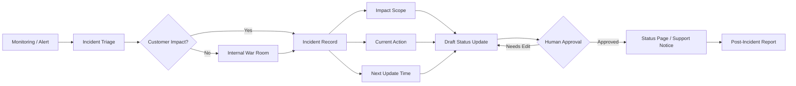

> 한 줄 요약: 장애 커뮤니케이션, 상태 페이지, 관측성은 공지 문구 문제가 아니라 운영 시스템의 일부다. 빠른 업데이트를 자동화할수록 잘못된 확신, 책임 회피, 보안 노출까지 함께 설계해야 한다.

## 왜 지금 이슈인가

장애가 나면 사용자는 대시보드가 느린지, 결제가 실패했는지, API가 멈췄는지만 본다. 내부에서는 데이터베이스 마이그레이션, 커넥션 풀, 배포 롤백, 알림 임계값을 이야기하지만, 밖에서는 아무 말도 없는 것처럼 보일 수 있다.

선정 글감은 20분짜리 데이터베이스 마이그레이션 장애보다 35분 동안 상태 페이지를 갱신하지 않은 일이 더 큰 평판 손상으로 이어졌다고 말한다. 이 사례가 개발자 커뮤니티에서 화제가 될 만한 이유는 단순하다. 장애 자체는 피하기 어렵지만, 침묵은 선택처럼 보이기 때문이다.

특히 SaaS, API 플랫폼, B2B 인프라 제품에서 상태 페이지는 고객 지원의 부속물이 아니다. 고객의 온콜, 배치 작업, 장애 전파 판단, 임원 보고가 그 페이지를 기준으로 움직인다. 상태 페이지가 늦거나 모호하면 각 고객 조직 안에서 별도의 추측이 돌기 시작한다.

## 커뮤니티에서 갈리는 지점

상태 페이지를 자주 업데이트해야 한다는 데에는 큰 이견이 없다. 갈리는 지점은 얼마나 빨리, 얼마나 자세히, 얼마나 자동화할 것인가다.

선정 글감은 P1 고객 영향 장애는 감지 후 5분 안에 첫 공지를 내고, 이후 15분마다 업데이트하라는 식의 강한 기준을 제안한다. 새 정보가 없어도 다음 업데이트 시간을 말하라는 원칙도 함께 제시한다. 운영 관점에서는 납득할 만하다. 침묵보다 제한된 확실성이 낫기 때문이다.

하지만 이 기준을 그대로 가져오면 다른 문제가 생긴다.

- 너무 빠른 공지는 원인 추정을 사실처럼 보이게 만들 수 있다.
- 너무 자세한 공지는 보안 사고나 내부 구조를 노출할 수 있다.
- 템플릿 기반 공지는 고객에게 복사한 문장처럼 읽힐 수 있다.
- AI 생성 공지는 검증되지 않은 ETA를 자연스러운 문장으로 포장할 수 있다.

좋은 상태 페이지는 문장을 빨리 만드는 데서 끝나지 않는다. 진실의 범위를 좁혀야 한다. 지금 사용자가 실제로 겪는 증상, 영향을 받는 기능, 영향을 받지 않는 범위, 다음 갱신 시각을 나눠서 말해야 한다.

선정 글감의 좋은 예시는 이 구분을 잘 보여준다. 느린 대시보드 로딩이라는 사용자 증상, 원인 식별과 수정 배포라는 현재 조치, 20분 내 복구 예상, API와 핵심 기능은 영향 없다는 범위를 한 문장 안에 넣는다. 반대로 장애 중에 자주 쓰는 “문제가 발생했습니다”, “확인 중입니다”, “곧 정상화됩니다” 같은 문장은 고객이 판단할 수 있는 정보를 거의 주지 않는다.

## 아키텍처 관점에서 볼 점

장애 커뮤니케이션은 사람이 슬랙에서 문장을 다듬는 절차만으로 안정적으로 굴러가지 않는다. 시스템 상태, 인시던트 상태, 승인 흐름, 외부 공지가 느슨하게 이어져 있으면 바쁜 순간에 가장 먼저 깨진다.

상태 페이지를 운영 시스템으로 보면 대략 이런 흐름이 필요하다.

이 다이어그램에서 봐야 할 점은 상태 페이지가 모니터링 도구와 바로 붙어서 자동으로 말하지 않는다는 것이다. 알림은 시작점일 뿐이고, 고객 영향 여부를 판단하는 단계가 따로 있어야 한다.

예를 들어 CPU 사용률 95%는 내부적으로 심각해 보여도 고객 영향이 없을 수 있다. 반대로 특정 테넌트의 로그인 실패율만 튀는 문제는 전체 지표에서는 작아 보여도 해당 고객에게는 P1이다. 상태 페이지의 단위는 서버가 아니라 사용자 영향이어야 한다.

템플릿 시스템도 같은 관점에서 봐야 한다. 선정 글감은 investigating, identified, monitoring, resolved 같은 상태별 템플릿을 제시한다. 실무적으로 유용하지만, 템플릿 변수의 품질이 낮으면 오히려 위험하다.

| 필드 | 좋은 입력 | 위험한 입력 |
|---|---|---|
| symptom | 일부 사용자의 대시보드 로딩 지연 | 서비스 이슈 |
| user_impact | 저장된 리포트 조회 지연 | 불편 |
| scope_statement | API 호출과 결제 기능은 영향 없음 | 대부분 정상 |
| eta | 다음 업데이트는 15분 뒤 제공 | 곧 복구 예정 |
| root_cause_plain | 설정 변경으로 연결 수용량 감소 | DB 문제 |

여기서 root cause는 특히 조심해야 한다. 원인이 확정되지 않았는데 데이터베이스 문제라고 쓰면 고객은 데이터 손상, 유출, 복구 불능까지 상상할 수 있다. 내부 워룸에서는 DB connection pool exhausted라고 말해도 되지만, 외부 공지에서는 일부 요청이 처리 지연을 겪고 있다고 쓰는 편이 낫다.

관측성(Observability)과도 연결된다. 좋은 상태 업데이트를 쓰려면 로그, 메트릭, 트레이스가 깔끔하게 모여 있는 것만으로는 부족하다. 다음 질문에 답할 수 있어야 한다.

- 어느 기능이 영향을 받는가?
- 몇 퍼센트의 요청 또는 사용자가 영향을 받는가?
- 특정 리전, 테넌트, 플랜, API 엔드포인트로 제한되는가?
- 데이터 손실, 중복 처리, 지연 처리 중 무엇이 가능한가?
- 우회 경로나 안전한 재시도 방법이 있는가?

이 질문에 답하지 못하면 상태 페이지는 감정 표현으로 밀려난다. “죄송합니다”, “조사 중입니다”, “최선을 다하고 있습니다” 같은 문장은 예의는 갖추지만 운영 판단에는 도움이 덜 된다.

## 실무에서 볼 점

도입 전에 먼저 정해야 할 것은 도구가 아니라 기준이다. Statuspage, Cachet, Better Stack, 자체 페이지, 슬랙 봇, AI Ops 도구 중 무엇을 쓰느냐보다 어떤 상황을 외부 장애로 볼 것인지가 먼저다.

현업에서 비슷한 고민을 하다 보면 가장 자주 막히는 지점은 심각도 정의다. 엔지니어는 에러율과 지연 시간을 보고, 고객 지원은 문의량을 보고, 영업 조직은 특정 대형 고객의 영향을 본다. 이 셋이 다른 언어를 쓰면 상태 페이지는 늦어진다.

실무 체크리스트는 짧아야 한다.

- P1, P2, P3의 고객 영향 기준을 문장으로 정의한다.
- 첫 공지 SLA와 후속 공지 간격을 미리 정한다.
- 외부에 말해도 되는 원인 범위를 보안팀과 합의한다.
- 상태 업데이트 작성자와 승인자를 분리한다.
- ETA는 확정, 추정, 다음 업데이트 시각으로 구분한다.
- 장애 종료 후 공개 리포트 조건을 정한다.

선정 글감은 P1/P2에 대해 48시간 안에 공개 사후 보고서를 내라고 제안한다. 이 기준은 모든 조직에 맞지는 않는다. 규제 산업, 보안 사고 가능성, 법무 검토가 필요한 제품에서는 더 느릴 수 있다. 대신 언제까지 어떤 범위의 보고서를 내겠다는 약속은 필요하다.

AI로 상태 업데이트를 생성하는 아이디어도 여기서 갈린다. 초안 작성에는 쓸 수 있다. 알림, 인시던트 기록, 영향 범위, 이전 업데이트를 모아 사용자가 이해할 문장으로 바꾸는 작업은 자동화할 가치가 있다.

다만 최종 발행까지 자동화하는 순간 리스크가 커진다. AI는 알 수 없음과 확인됨을 같은 톤으로 말할 수 있고, 내부 로그에 있는 민감한 식별자나 인프라 구조를 외부 문장으로 노출할 수 있다. 특히 보안 사고 가능성이 배제되지 않은 초기 단계에서는 자동 생성보다 승인 흐름이 더 중요하다.

더 현실적인 접근은 자동 발행이 아니라 제한된 초안 생성이다.

- 입력 데이터는 인시던트 레코드의 허용 필드로 제한한다.
- 원인 필드는 confirmed 상태가 되기 전에는 외부 문장에 쓰지 않는다.
- 고객 영향 범위와 영향 없음 범위를 별도 필드로 관리한다.
- 다음 업데이트 시각은 사람이 고르는 값으로 둔다.
- 발행 전 보안 노출, 책임 전가, 과도한 ETA를 검사한다.

장애 커뮤니케이션의 트레이드오프는 분명하다. 빠를수록 신뢰를 지킬 가능성이 커지지만 틀릴 가능성도 커진다. 자세할수록 고객 판단은 쉬워지지만 공격자와 경쟁사에게도 정보가 간다. 자동화할수록 누락은 줄지만 잘못된 확신이 빠르게 퍼질 수 있다.

상태 페이지 운영의 목표는 멋진 문장을 쓰는 것이 아니다. 고객이 지금 해야 할 행동을 정할 만큼의 정보를, 확인된 범위 안에서, 다음 갱신 약속과 함께 주는 것이다.

## 정리

장애 커뮤니케이션은 신뢰를 회복하는 글쓰기 기술이 아니라 신뢰를 잃지 않기 위한 운영 설계다. 상태 페이지는 마케팅 채널도, 사과문 게시판도 아니다. 고객이 자신의 시스템을 보호하기 위해 읽는 운영 인터페이스다.

당장 확인할 것은 하나다. 다음 장애 때 첫 15분 안에 외부에 쓸 수 있는 문장이 실제로 나오는지 점검해보면 된다. 모니터링 알림은 있는데 고객 영향 범위, 다음 업데이트 시각, 영향 없는 기능을 적을 곳이 없다면 아직 상태 페이지가 아니라 빈 게시판에 가깝다.

## 참고 자료

- [선정 글감] [Incident Communication: The Status Page That Builds Trust](https://dev.to/samson_tanimawo/incident-communication-the-status-page-that-builds-trust-2doj), DEV Community