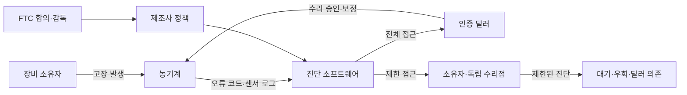

> 한 줄 요약: 존디어(John Deere) 수리권 합의는 트랙터 수리 문제처럼 보이지만, 실제 쟁점은 소프트웨어가 장비 소유권을 어디까지 제한할 수 있느냐다. 하드웨어를 샀어도 진단 도구와 펌웨어 접근권이 막히면, 소유자는 운영 리스크를 회사 정책에 맡기게 된다.

## 무슨 일이 있었나

2026년 7월 8일, 미국 연방거래위원회(FTC)와 애리조나, 일리노이, 미시간, 미네소타, 위스콘신 주 법무장관들은 농기계 제조사 Deere & Co., 즉 존디어와 수리권(right to repair) 합의에 도달했다.

AP 보도에 따르면 이번 합의는 존디어가 농민과 독립 수리점에도 진단, 수리 도구를 제공하도록 요구한다. 기존에는 존디어 인증 딜러가 쓰는 서비스 소프트웨어 전체 버전이 장비 소유자나 독립 수리점에 충분히 제공되지 않았다는 것이 FTC 측 주장이다.

확인된 사실은 이렇다.

- FTC와 5개 주 법무장관은 2025년 1월 존디어를 상대로 반독점 소송을 냈다.
- 대상은 트랙터 등 농업 장비 수리 시장에서 진단, 수리 도구 접근을 제한했다는 주장이다.
- 이번 합의 명령은 일리노이 연방법원 Iain D. Johnston 판사의 승인을 앞두고 있다.
- 존디어는 5개 주에 반독점 집행 비용으로 총 100만 달러를 지급한다.
- 존디어는 향후 10년 동안 준수 감독을 받는다.
- 장비 소유자나 독립 수리점을 이용했다는 이유로 딜러가 보복하는 행위도 금지된다.
- 2026년 4월에는 농민들과 별도로 9,900만 달러 규모 집단소송 합의도 있었다.

아직 추정에 가까운 부분도 있다.

이 합의가 현장에서 수리 대기 시간과 비용을 얼마나 줄일지는 알 수 없다. 진단 도구가 제공된다고 해서 모든 수리가 곧바로 독립 수리점에서 가능해지는 것도 아니다. 소프트웨어 접근 범위, 부품 공급, 보증 조건, 안전 관련 제한을 어떻게 운영할지가 남아 있다.

존디어는 이번 소송이 근거 없다고 주장해 왔고, 자사의 서비스 도구 배포 방식이 반경쟁적이라는 주장에도 동의하지 않았다. 합의 발표 뒤에는 더 유연한 수리 선택지를 제공하는 방향이라고 밝혔다.

쟁점은 더 또렷해졌다. 회사는 혁신과 안전, 품질 관리를 말한다. 사용자는 내가 산 장비를 내가 고칠 수 있어야 한다고 말한다. 둘 다 완전히 틀린 말은 아니지만, 실제 권한은 진단 소프트웨어를 누가 쥐고 있느냐에서 갈린다.

## 왜 사람들이 반응했나

Hacker News에서 이 소식은 387점을 받고 77개 댓글이 달렸다. 농기계 뉴스라서만은 아니다. 개발자 커뮤니티가 반응한 이유는 익숙한 패턴이 보였기 때문이다.

하드웨어 가격은 사용자가 낸다. 고장은 사용자의 현장에서 난다. 멈춘 시간의 비용도 사용자가 감당한다. 그런데 수리 판단과 진단 권한은 제조사 생태계 안에 묶인다.

이 구조는 스마트폰, 노트북, 자동차, 클라우드 플랫폼, SaaS 데이터 이전 문제와 닮아 있다.

사용자가 불편해한 지점은 크게 다섯 가지다.

| 쟁점 | 사용자 입장 | 제조사 입장 |
|---|---|---|
| 소유권 | 산 물건은 고칠 수 있어야 한다 | 복잡한 장비는 통제된 수리가 필요하다 |
| 비용 | 인증 딜러 의존은 가격 협상력을 낮춘다 | 품질과 안전을 유지해야 한다 |
| 시간 | 농번기 장비 정지는 곧 손실이다 | 잘못된 수리는 더 큰 사고를 부를 수 있다 |
| 데이터 | 진단 로그와 오류 코드 접근이 제한된다 | 보안과 지식재산 보호가 필요하다 |
| 시장 | 독립 수리점이 경쟁해야 가격이 내려간다 | 공인 네트워크가 책임을 진다 |

특히 농기계는 고장 시간이 곧 생산 손실로 이어진다. 스마트폰 액정 수리처럼 며칠 미뤄도 되는 문제가 아니다. 트랙터가 특정 시점에 멈추면 파종, 수확, 운송 일정 전체가 흔들린다.

수리권은 여기서 소비자 권리 담론을 지나 운영 리스크 문제가 된다.

개발자 입장에서 더 흥미로운 부분은 소프트웨어가 물리 장비의 권한 구조를 바꾼다는 점이다. 과거에는 렌치와 부품, 매뉴얼이 있으면 어느 정도 수리가 가능했다. 지금은 오류 코드, 진단 장비, 펌웨어 잠금, 인증 절차, 원격 검증이 수리 가능 여부를 결정한다.

장비의 실제 제어면(control plane)이 하드웨어 밖에 있는 셈이다.

커뮤니티가 민감하게 반응한 지점은 여기다. 수리권을 막는 장벽이 물리적인 특수 공구가 아니라 소프트웨어 권한이라면, 같은 논리가 다른 제품에도 쉽게 옮겨 간다.

차량 정비, 의료기기, 산업 장비, 스마트홈 기기, 클라우드 기반 개발 도구도 비슷한 질문을 만난다.

내가 비용을 내고 도입한 시스템인데, 장애가 났을 때 어디까지 직접 확인하고 복구할 수 있는가?

## 내가 보는 핵심

이번 이슈의 핵심은 존디어를 선악으로 나누는 데 있지 않다. 더 큰 질문은 소프트웨어로 잠긴 장비에서 소유권이 어떤 형태로 남느냐다.

현업에서 비슷한 고민을 하다 보면, 처음에는 벤더 락인(vendor lock-in)을 기능 비교나 가격 협상 문제로만 본다. 그런데 장애가 한 번 나면 관점이 바뀐다. 진짜 문제는 평상시 비용보다 비상시 권한이다.

농기계 수리권도 같은 구조다.

정상 상태에서는 인증 딜러 체계가 편할 수 있다. 제조사가 검증한 도구, 교육받은 기술자, 표준화된 절차는 품질을 높인다. 복잡한 장비에서 아무나 펌웨어를 건드리게 하는 것이 항상 좋은 선택도 아니다.

하지만 장애가 난 순간, 권한이 너무 한쪽에 몰려 있으면 사용자는 선택지를 잃는다.

- 오류 원인을 직접 확인할 수 없는가
- 독립 수리점이 같은 진단 정보를 볼 수 없는가
- 수리 뒤 장비를 정상 상태로 되돌리는 보정 절차가 막혀 있는가
- 인증 딜러를 쓰지 않았다는 이유로 보증이나 서비스에서 불이익을 받는가
- 정책이 바뀌었을 때 기존 장비 소유자는 어디까지 보호받는가

이 질문들은 농민만의 문제가 아니다. 플랫폼을 쓰는 조직도 같은 구조 안에 있다.

예를 들어 클라우드 장애가 났는데 내부 로그와 메트릭으로 원인을 좁힐 수 없다면, 사용자는 티켓 답변을 기다릴 수밖에 없다. SaaS에서 데이터 내보내기(export)는 되지만 권한, 감사 로그, 워크플로 상태가 함께 빠져나오지 않는다면 이전 가능성은 형식만 남는다. 보안 제품이 탐지 결과는 보여주지만 룰과 원천 이벤트를 충분히 설명하지 않으면 운영팀은 공급사의 판단을 그대로 받아들여야 한다.

수리권이라는 말은 물건을 고칠 권리에서 출발하지만, 실제로는 시스템을 이해하고 복구할 권리에 가깝다.

제조사의 우려도 무시하면 안 된다. 농기계는 거대한 기계이고 안전 문제가 있다. 배출가스 제어, 엔진 보정, 자율주행 보조 기능 같은 영역은 잘못 손대면 사고나 규제 위반으로 이어질 수 있다. 소프트웨어 접근을 전면 개방하라는 요구는 현실적이지 않다.

그래서 이번 합의의 의미는 모든 잠금을 없애라는 데 있지 않다. 진단과 합리적 수리를 가능하게 하는 접근권은 경쟁 시장 안에 있어야 한다는 쪽에 가깝다.

권한을 나누는 방식은 여러 층으로 설계할 수 있다.

| 접근 영역 | 개방 필요성 | 제한이 필요한 이유 |
|---|---:|---|
| 오류 코드 조회 | 높음 | 낮음 |
| 정비 매뉴얼 | 높음 | 낮음 |
| 부품 교체 후 보정 | 높음 | 중간 |
| 안전 관련 펌웨어 변경 | 제한적 | 높음 |
| 배출가스 제어 우회 | 낮음 | 매우 높음 |
| 원격 인증과 라이선스 정책 | 투명성 필요 | 중간 |

좋은 정책은 이 층위를 구분한다. 나쁜 정책은 안전과 보안을 이유로 모든 접근을 한꺼번에 막는다.

그 차이를 보지 못하면 수리권 논쟁은 쉽게 구호 싸움이 된다. 한쪽은 자유를 말하고, 다른 쪽은 안전을 말한다. 하지만 실무적으로 필요한 질문은 더 구체적이다.

어떤 데이터는 누구에게 보여줘야 하는가. 어떤 작업은 로그와 책임 추적을 조건으로 허용할 수 있는가. 어떤 변경은 규제 때문에 막아야 하는가. 그리고 그 기준을 제조사가 혼자 정해도 되는가.

## 앞으로 볼 기준

앞으로 비슷한 뉴스를 볼 때는 수리권이라는 단어만 보지 말고, 실제 권한이 어디까지 열리는지 봐야 한다.

첫째, 진단 도구의 범위다. 단순 오류 코드 조회만 허용하는지, 인증 딜러가 쓰는 수준의 원인 분석과 테스트 기능까지 포함하는지 확인해야 한다. 읽기 권한만 있고 조치 권한이 없으면 수리 시장의 경쟁은 제한적일 수 있다.

둘째, 독립 수리점의 지위다. 개인 소유자에게만 제한적으로 제공되는지, 독립 정비업체가 상업적으로 쓸 수 있는지에 따라 시장 효과가 달라진다. 이번 합의가 독립 수리점도 명시했다는 점은 그래서 의미가 있다.

셋째, 보복 금지 조항이다. 사용자가 독립 수리점을 이용했다는 이유로 서비스, 보증, 부품 공급, 소프트웨어 업데이트에서 불이익을 받는다면 접근권은 종이 위 권리에 그친다.

넷째, 감독 기간과 집행 방식이다. 이번 건은 10년간 준수 감독이 붙었다. 이런 조항이 없으면 제조사는 도구를 제공하되 가격, 절차, 계정 승인, 호환성 조건으로 접근을 다시 어렵게 만들 수 있다.

다섯째, 안전과 보안 예외의 경계다. 예외는 필요하지만 너무 넓으면 본문 전체를 삼킨다. 배출가스 우회나 안전 기능 무력화는 막아야 한다. 그러나 그 이유로 일반적인 진단과 부품 교체까지 막는다면 균형이 무너진다.

이 기준은 농기계 밖에서도 쓸 수 있다.

새 장비나 플랫폼을 도입할 때는 기능표보다 장애 시나리오를 먼저 물어보는 편이 낫다.

- 장애가 났을 때 원시 로그(raw log)에 접근할 수 있는가
- 진단 결과를 벤더 설명 없이 검증할 수 있는가
- 독립 전문가나 내부 운영자가 복구 절차를 수행할 수 있는가
- 데이터와 설정을 내보낼 수 있는가
- 계정, 라이선스, 원격 인증이 끊겼을 때 기본 기능은 유지되는가
- 정책 변경이 기존 구매자에게 어떤 영향을 주는가

수리권 논쟁이 계속 커지는 이유는 사람들이 갑자기 수리를 좋아하게 돼서가 아니다. 비싼 물건과 복잡한 시스템을 샀는데, 결정적인 순간에 자신이 운영자가 아니라 대기자가 된다는 감각 때문이다.

존디어 합의는 그 감각을 법과 시장이 어떻게 다룰지 보여주는 사례다. 판사의 승인과 실제 이행 방식이 남아 있지만, 지금까지의 흐름은 한쪽으로 움직이고 있다. 소프트웨어가 물리 장비의 열쇠가 될수록, 그 열쇠를 누가 어떤 조건으로 나눠 갖는지가 제품의 신뢰를 가른다.

다음에 어떤 회사가 안전, 품질, 혁신을 이유로 접근 제한을 설명한다면 그 말을 곧바로 의심할 필요는 없다. 대신 한 가지를 물어야 한다. 고장이 났을 때 사용자는 문제를 해결할 권한을 갖는가, 아니면 허락을 기다리는가.

## 참고 자료

- [선정 글감] [John Deere owners will get the right to repair equipment under FTC settlement](https://apnews.com/article/john-deere-right-to-repair-agriculture-equipment-cb7514ffedb95c130a976af661f2bc02): AP News / Hacker News Best