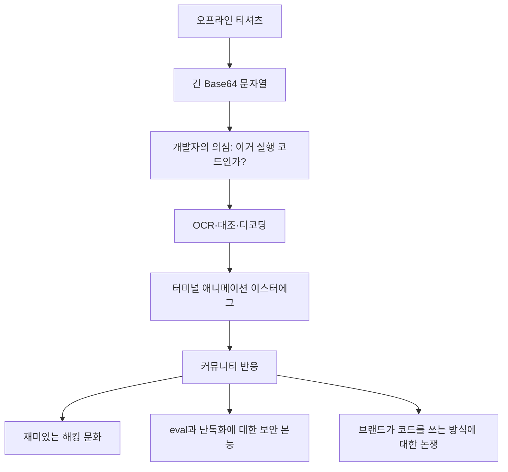

> 한 줄 요약: 유니클로 매장에서 팔린 아카마이 티셔츠의 난독화된 Bash 스크립트는 위험한 코드가 아니라 평화 캠페인용 이스터에그였다. 사람들이 반응한 이유는 코드 내용보다, 소비자 상품에 실행 가능한 코드처럼 보이는 문자열이 들어갔을 때 신뢰와 호기심, 보안 감각이 한꺼번에 작동했기 때문이다.

## 무슨 일이 있었나

유니클로와 아카마이가 함께 만든 Peace for All 캠페인 티셔츠 뒷면에 Base64로 인코딩된 Bash 스크립트가 인쇄됐다. 겉으로 보면 긴 알파벳과 숫자 문자열이고, 자세히 보면 `#!/bin/bash`로 시작하는 셸 스크립트 구조와 `base64 --decode`, `eval`을 떠올리게 하는 구성이 보인다.

이 글감이 Hacker News에서 퍼진 계기는 한 개발자의 복원 작업이었다. 그는 실제 티셔츠의 코드를 OCR로 옮기고, 여러 도구의 결과를 대조한 뒤 Base64 디코딩 결과를 공개했다. 해당 게시물은 Hacker News에서 815포인트와 148개 댓글을 기록했다.

확인된 사실은 다음과 같다.

- 티셔츠는 유니클로 매장에서 판매된 아카마이 디자인의 Peace for All 캠페인 상품이다.
- 뒷면 문자열은 Base64로 인코딩된 Bash 스크립트다.
- 디코딩된 스크립트는 터미널에 `PEACE FOR ALL` 메시지를 사인파 형태로 출력하는 이스터에그다.
- 스크립트에는 일본어 축하 메시지와 하트 문자도 포함되어 있다.
- 작성자는 OCR 과정에서 Android의 Circle to Search, Tesseract, Claude를 함께 사용해 전사 오류를 줄였다고 설명했다.

해석에 가까운 부분도 있다. 글쓴이는 폰트가 Consolas에 가깝다고 보았고, 유니클로 디자인 제작 환경이 Windows였을 가능성을 언급했다. 아카마이의 홍보 문구에서 Linux를 인터넷의 오픈소스 언어처럼 표현한 대목도 기술적으로는 엄밀하지 않다. 다만 이 부분은 제품 설명의 표현 문제이지, 실제 코드의 동작을 바꾸는 사실은 아니다.

원문에서 복원된 스크립트의 중심부는 이런 형태다.

```bash
#!/bin/bash

text="♥PEACE♥FOR♥ALL♥PEACE♥FOR♥ALL♥"
cols=$(tput cols)
lines=$(tput lines)

tput civis
trap "tput cnorm; exit" SIGINT

for (( t=0; ; t+=1 )); do
  char="${text:t % ${#text}:1}"
  angle=$(echo "($t) * 0.2" | bc -l)
  sine_value=$(echo "s($angle)" | bc -l)
  x=$(echo "($cols / 2) + ($cols / 4) * $sine_value" | bc -l)
  echo -ne "\033[38;5;12m"$(tput cup $t $x)"$char\033[0m"
  echo ""
done
```

코드만 보면 악성 동작은 없다. 터미널 크기를 읽고, 커서를 숨기고, `CTRL+C`를 누르면 커서를 되돌린 뒤 종료한다. 이후 색상과 좌표를 바꾸며 메시지를 반복 출력한다.

문제는 결과가 아니라 표면이다. `eval`, Base64, 난독화, 소비자 상품, 대형 CDN 기업, 오프라인 매장이라는 단어가 한 화면에 같이 놓이면 개발자 커뮤니티는 일단 멈춰 선다.



## 왜 사람들이 반응했나

이 사건은 대형 보안 사고가 아니다. 개인정보 유출도 아니고, 공급망 공격도 아니다. 그런데도 개발자 커뮤니티가 반응한 이유는 일상적인 물건이 코드의 문법을 하고 나타났기 때문이다.

먼저 호기심이 생긴다. 티셔츠에 적힌 문자가 단순 장식인지, 실제로 실행 가능한 코드인지 확인하고 싶어진다. 특히 Base64는 개발자에게 익숙한 형식이다. 의미 없는 그래픽처럼 보여도, 제대로 복원하면 뭔가 나올 것 같은 신호를 준다.

불편함도 따라온다. `eval`과 Base64 조합은 보안 교육에서 자주 경고되는 패턴이다. 실제 운영 환경에서 Base64로 숨긴 문자열을 디코딩해 바로 실행하는 코드는 악성 스크립트, 난독화된 설치 명령, 취약한 배포 자동화와 닮았다. 티셔츠 위의 코드는 해롭지 않은 장난이지만, 문법이 불러오는 기억은 그렇지 않다.

신뢰의 문제도 있다. 아카마이는 CDN, 보안, 인터넷 인프라를 떠올리게 하는 회사다. 그런 회사가 소비자 캠페인에 난독화된 실행 코드 형식을 썼다는 점은 재미있으면서도 묘하다. 보안 회사가 보안 커뮤니티에서 경계하는 형식을 농담으로 쓴 셈이다.

그래서 커뮤니티의 반응은 단순히 예쁘다거나 위험하다는 쪽으로만 갈리지 않는다. 이런 질문이 겹친다.

| 쟁점 | 사람들이 건드린 질문 |
|---|---|
| 신뢰 | 브랜드가 코드 문법을 장식으로 써도 되는가 |
| 권한 | 소비자가 이해하지 못하는 문자열을 실행해 보도록 유도하는가 |
| 비용 | 재미를 위해 복원과 검증 비용을 커뮤니티에 넘긴 것은 아닌가 |
| 사용성 | Base64는 오류 보정이 없어 OCR 전사 난도가 높다 |
| 보안 감각 | 이스터에그와 악성 패턴의 표면이 너무 닮아 있지 않은가 |

현업에서도 비슷한 일이 있다. 의도보다 모양이 먼저 해석되는 경우다. 내부적으로는 유쾌한 장치였더라도, 외부 사용자는 맥락 없이 표면을 본다. 특히 보안과 개발자 커뮤니티는 이상한 문자열, 난독화, 자동 실행 패턴을 보면 먼저 의심하도록 훈련되어 있다.

그 의심은 냉소가 아니다. 시스템을 지키는 습관이다.

## 내가 보는 핵심

이 사건의 핵심은 티셔츠에 Bash가 들어갔다는 사실이 아니다. 코드가 문화 상품으로 나올 때, 실행 가능해 보인다는 느낌 자체가 메시지가 된다는 점이다.

일반 소비자에게 긴 알파벳 블록은 디자인이다. 개발자에게는 입력값이다. 보안 담당자에게는 잠재적 행위다. 같은 그래픽을 보고도 서로 다른 객체로 받아들인다.

그래서 이런 캠페인은 두 가지 층위를 함께 봐야 한다.

하나는 문화적 층위다. 인터넷 초창기, 오픈소스, 터미널, 해커 문화, 이스터에그 같은 상징을 가져와 브랜드 메시지로 쓰는 일은 충분히 매력적이다. 실제로 이번 사례도 악의보다 애정에 가깝다. Peace for All이라는 문구를 터미널 애니메이션으로 보여주는 방식은 개발자에게 작은 보상처럼 작동한다.

다른 하나는 운영적 층위다. 실행 가능한 코드처럼 보이는 것을 공개 제품에 넣는 순간, 누군가는 실행해 본다. 누군가는 OCR로 복원한다. 누군가는 다른 버전의 티셔츠와 비교한다. 누군가는 이 문자열이 원본 그대로인지, 중간에 잘렸는지, 위험한 명령이 있는지 확인한다.

원문에서도 흥미로운 비교가 나온다. 같은 라인의 다른 티셔츠에는 잘린 코드처럼 보이는 디자인이 있었고, 글쓴이는 해당 코드는 컴파일될 수 없다고 지적했다. 이 차이는 작지 않다. 실행 가능한 코드와 코드처럼 보이는 장식 사이에는 커뮤니티가 떠안는 신뢰 비용이 다르다.

제품 디자인에서 코드가 장식으로 쓰일 때 흔한 실수는, 코드가 이미지처럼만 소비된다고 가정하는 것이다. 하지만 개발자에게 코드는 읽히고, 복사되고, 실행되고, 검증된다. 더 나아가 코드가 어떤 회사의 이름과 함께 나오면 그 회사의 기술적 태도까지 읽힌다.

이번 사례가 비교적 좋게 끝난 이유는 결과물이 무해했기 때문이다. 복원된 스크립트에는 주석도 있고, 축하 메시지도 있고, 종료 시 커서를 되돌리는 처리도 있다. 의도된 이스터에그라는 설명과 실제 동작이 크게 어긋나지 않는다.

그래도 남는 감각이 있다. 보안적으로 위험한 패턴을 패러디하려면, 그 패턴을 알아보는 사람들의 경계심까지 디자인에 넣어야 한다.

Base64 자체가 나쁜 것은 아니다. Bash도 나쁜 것이 아니다. `eval`처럼 보이는 구성도 맥락에 따라 다르다. 하지만 이 셋이 소비자 상품에 붙으면 이야기가 달라진다. 그때부터는 코드의 의미뿐 아니라, 사용자가 어떤 행동을 하도록 암시하는지도 판단 대상이 된다.

## 앞으로 볼 기준

다음에 비슷한 사례를 보면 바로 위험하다고 단정할 필요는 없다. 다만 귀엽고 영리한 이스터에그인지, 검증 비용을 사용자에게 넘긴 장치인지는 따져볼 수 있다.

첫 기준은 범위다. 코드가 실제 실행을 전제로 하는가, 아니면 읽히기만 하는가. 실행을 암시한다면 어떤 환경에서 어떤 권한으로 실행되는지 확인해야 한다. 로컬 터미널에서 도는 장난감 코드와 브라우저, 앱, 설치 스크립트, CI 파이프라인에서 도는 코드는 위험 범위가 다르다.

다음은 가시성이다. 사용자가 디코딩 전에도 의도를 알 수 있는가. Base64나 난독화는 발견의 재미를 주지만, 동시에 검증 부담을 만든다. 특히 브랜드 캠페인에서는 숨김 자체가 메시지가 될 수 있다. 숨겼다면, 왜 숨겼는지 납득할 만해야 한다.

복원 가능성도 봐야 한다. 이번 사례처럼 Base64는 한 글자만 틀려도 결과가 깨질 수 있다. 티셔츠, 포스터, 영상, 이미지처럼 OCR에 의존하는 매체에서는 코드가 쉽게 손상된다. 손상된 코드가 실행 불가능한 정도로 끝나면 다행이지만, 사용자가 임의로 고쳐 실행하는 순간 예측하기 어려운 행동이 생긴다.

당사자가 누구인지도 중요하다. 보안과 인프라 기업이 코드 농담을 할 때와 패션 브랜드가 코드 패턴을 차용할 때 커뮤니티의 기대치는 다르다. 기술을 잘 아는 주체라면 더 정확한 언어와 더 안전한 제스처를 기대받는다.

마지막으로 커뮤니티 반응의 방향을 봐야 한다. 사람들이 웃고 끝나는지, 원본 검증과 위험 분석으로 이동하는지에 따라 이야기가 달라진다. 후자로 이동했다면 이미 단순한 디자인을 넘어 신뢰의 문제로 들어간 것이다.

이 사건은 작은 장난처럼 보이지만, 소프트웨어가 문화가 된 뒤에 생기는 새로운 표면을 보여준다. 코드는 더 이상 IDE 안에만 있지 않다. 티셔츠, 광고, 포스터, 채용 페이지, 제품 패키지에 나타난다. 그리고 코드처럼 보이는 순간, 누군가는 그것을 코드로 대한다.

좋은 이스터에그는 발견한 사람을 기쁘게 한다. 더 좋은 이스터에그는 발견한 사람이 의심한 시간까지 보상한다. 이번 티셔츠가 커뮤니티에서 오래 회자된 이유도 거기에 있다. 의심할 만한 모양이었고, 끝까지 확인했더니 해롭지 않았고, 그 과정이 인터넷 인프라 회사의 캠페인 메시지와 묘하게 맞물렸다.

다음번에 브랜드가 코드를 디자인으로 쓴다면 질문은 간단하다. 이 문자열을 누군가 진짜로 실행해도 괜찮은가. 그 답을 준비하지 못했다면, 아직 디자인이 아니라 미처 닫히지 않은 인터페이스다.

## 참고 자료

- [선정 글감] [Decoding the obfuscated bash script on a Uniqlo t-shirt](https://tris.sherliker.net/blog/obfuscated-self-evaluating-bash-script-by-cdn-akamai-being-supplied-to-consumers-via-retail-stores/): Hacker News Best