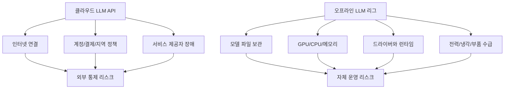

> 한 줄 요약: 오프라인 LLM 구축은 성능 실험만의 문제가 아니다. 인터넷 차단, API 의존, 데이터 반출, 전력 비용을 함께 계산해야 하는 운영 문제다.

## 무슨 일이 있었나

2026년 7월 9일 기준 Reddit LocalLLaMA에 한 사용자가 러시아에서 글로벌 인터넷 접속이 끊길 가능성에 대비해 완전 오프라인 AI 리그를 만들고 싶다는 글을 올렸다. 작성자는 2× Intel Xeon 2683v4, 256GB DDR4 ECC RAM, 구형 듀얼 소켓 보드 구성을 제시하며 대형 LLM을 로컬에서 돌릴 때 어느 정도 성능을 기대할 수 있는지 물었다.

확인된 사실은 여기까지다. 이 글만으로 러시아의 글로벌 인터넷이 곧 완전히 차단된다고 말할 수는 없다. 다만 커뮤니티가 반응한 이유는 예측의 정확도보다 질문의 방향에 있다.

그동안 로컬 LLM 논의는 보통 몇 토큰/초(TPS)가 나오느냐, 어떤 양자화(Quantization)가 낫느냐, Mac과 GPU 서버 중 무엇이 싸냐로 흘렀다. 이번 질문은 같은 숫자를 운영 문제로 바꿔 물었다.

- 인터넷이 끊겨도 쓸 수 있는가
- 모델 파일과 런타임을 보존할 수 있는가
- 전력과 부품 수급까지 감당할 수 있는가
- 클라우드 API를 못 쓰는 상황에서 어느 수준의 품질을 받아들일 것인가

같은 날 올라온 다른 글들도 이 맥락을 넓혔다. GLM-5.2 753B MoE를 4× DGX Spark에서 4비트로 돌린 사례는 Terminal-Bench 2.1에서 70.8%를 기록했다고 밝혔다. 공식 full-precision 수치 81.0%와는 조건이 다르다. 작성자도 100K 컨텍스트 제한, 토큰 예산, 샘플링 차이를 한계로 적었다.

또 다른 GLM-5.2 로컬 실행 사례는 4× GB10과 100G 스위치 구성에서 약 330K 컨텍스트, 디코드 약 20~35 tok/s, 프리필 약 650 tok/s 수준을 제시했다. 비용은 약 16,000달러에서 18,000달러 범위로 언급됐다. 이 숫자는 인상적이지만, 로컬 LLM이 싼 대체재라기보다 통제권을 사는 선택에 가깝다는 점도 같이 보여준다.

## 왜 사람들이 반응했나

첫 번째 반응 지점은 신뢰다. 클라우드 API는 편하다. 모델 업데이트, 장애 대응, 보안 패치, 스케일링을 서비스 제공자가 맡는다. 하지만 인터넷, 결제, 계정 정책, 지역 제한, 제재, 약관 변경 중 하나만 막혀도 사용자는 외부 의존성을 바로 체감한다.

오프라인 LLM은 이 의존성을 줄인다. 대신 다른 의존성이 생긴다. 모델 가중치, 드라이버, 커널, 런타임, 양자화 파일, 벤치마크 스크립트, 전력, 냉각, 디스크, 네트워크 장비를 직접 관리해야 한다.

두 번째 지점은 비용이다. 커뮤니티의 로컬 LLM 글에는 27B 모델을 MacBook Pro에서 82 TPS로 돌렸다는 MTPLX V2 사례처럼 눈에 띄는 숫자도 올라온다. 하지만 댓글에서는 컨텍스트 캐싱, prefix invalidation, M1/M2와 최신 M 시리즈의 차이처럼 실제 사용성을 좌우하는 조건이 바로 따라붙었다.

TPS만 보면 선택이 쉬워 보인다. 실제 업무에서는 다르다. 첫 응답을 기다리는 프리필(Prefill), 긴 대화에서 KV 캐시가 차지하는 메모리, 코딩 에이전트가 여러 번 파일을 읽고 명령을 실행할 때 생기는 반복 컨텍스트 비용이 체감 속도를 바꾼다.

세 번째 지점은 모델 크기다. 30B, 70B, 120B, 230B 같은 구간이 왜 자주 보이느냐는 질문도 올라왔다. 이 질문은 모델 설계가 순수한 지능 경쟁만이 아니라 하드웨어 경계에 맞춰진다는 의심과 닿아 있다.

대략 이런 식이다.

| 모델 규모 | 커뮤니티에서 보는 현실적 의미 |
|---|---|
| 20B~35B | 고성능 개인 장비나 최신 노트북에서 타협 가능 |
| 70B 전후 | 단일 고VRAM GPU 또는 여러 장비 구성이 필요해짐 |
| 120B 이상 | 개인 장비보다 워크스테이션/서버 성격이 강해짐 |
| 200B 이상 | 양자화, 분산 실행, 긴 컨텍스트 비용이 핵심 변수 |

이 표는 절대 규칙이 아니다. 모델 구조, MoE(Mixture of Experts), 양자화 방식, 컨텍스트 길이에 따라 달라진다. 그래도 커뮤니티가 숫자 구간에 민감한 이유는 분명하다. 모델 크기는 구매해야 할 하드웨어와 월 전기요금으로 이어진다.

## 내가 보는 핵심

이 이슈의 핵심은 로컬 LLM이 클라우드보다 낫다는 주장이 아니다. 오프라인 LLM은 장애에 대응하는 방식 중 하나다.

현업에서 비슷한 고민을 하다 보면 보안팀은 데이터 반출을 걱정하고, 개발팀은 품질과 속도를 걱정하고, 운영팀은 장애와 패치를 걱정한다. 로컬 모델은 데이터 반출 문제를 줄일 수 있지만, 보안 패치와 모델 공급망 검증을 내부 책임으로 바꾼다.

특히 완전 오프라인을 전제로 하면 놓치기 쉬운 리스크가 있다.

- 모델 가중치의 출처와 해시를 검증했는가
- 런타임을 재설치할 수 있는 패키지 저장소를 확보했는가
- 드라이버, CUDA, ROCm, MLX, llama.cpp, vLLM 버전을 고정했는가
- 양자화 모델이 특정 작업에서 얼마나 성능을 잃는지 확인했는가
- 장애가 났을 때 대체 모델로 낮춰서 계속 쓸 수 있는가
- 전력 제한이 걸렸을 때 어느 서비스를 포기할 것인가

GLM-5.2 4비트 사례가 흥미로운 이유도 여기에 있다. 작성자는 70.8%라는 결과만 올린 것이 아니라, 엔진이 두 번 크래시했고 한 레시피는 네 노드를 모두 멈추게 했다고 적었다. 이 대목이 숫자보다 더 실무적이다. 대형 로컬 LLM은 한 번 실행하고 끝나는 프로그램이 아니라 계속 돌봐야 하는 시스템이다.

140GB짜리 GLM-5.2 IQ2_XXS REAP 양자화 파일을 공유한 글도 같은 방향을 보여준다. 작성자는 imatrix 파일과 수정한 llama-quant.cpp를 올렸고, 댓글에서는 CPU에서 IQ 계열 양자화가 느릴 수 있다는 반응, LM Studio 호환 여부, 직접 양자화를 만들 때 걸리는 시간 이야기가 이어졌다.

커뮤니티는 이제 모델을 받는 소비자에만 머물지 않는다. 누군가는 양자화를 만들고, 누군가는 벤치마크를 돌리고, 누군가는 호환성을 확인한다. 오프라인 LLM의 신뢰성은 한 회사의 SLA(Service Level Agreement)가 아니라 이런 느슨한 검증망 위에 놓인다.

## 앞으로 볼 기준

다음에 오프라인 LLM이나 로컬 AI 리그 글을 볼 때는 질문을 바꿔 보는 편이 좋다. 이 장비가 빠른가보다, 끊긴 상태에서도 며칠 동안 같은 품질로 버틸 수 있는가를 봐야 한다.

확인할 기준은 네 가지다.

| 기준 | 확인할 질문 |
|---|---|
| 독립성 | 인터넷 없이 설치, 재시작, 복구가 가능한가 |
| 성능 | TPS뿐 아니라 프리필, 컨텍스트 길이, 캐시 재사용을 측정했는가 |
| 비용 | 장비 가격, 전력, 냉각, 예비 부품을 함께 계산했는가 |
| 품질 | 양자화 전후로 실제 작업 정확도를 비교했는가 |

여기에 하나를 더 붙이고 싶다. 완전 오프라인을 목표로 할수록 최신 최대 모델만 좇으면 위험하다. 753B 모델을 억지로 돌리는 것보다, 27B나 70B 모델을 안정적으로 운영하고 필요한 문서 검색(RAG), 로컬 패키지 미러, 백업 절차를 갖추는 편이 더 나을 수 있다.

오프라인 LLM 구축은 공포에 대한 반응일 수도 있고, 데이터 주권에 대한 실험일 수도 있다. 어느 쪽이든 결국 운영 문제로 돌아온다. 모델을 소유한다는 말은 파일을 다운로드했다는 뜻이 아니다. 실패했을 때 고칠 수 있는 범위까지 책임진다는 뜻이다.

## 참고 자료

- [선정 글감] [Need help building a rig / estimating performance for big LLMs to run when fully offline](https://www.reddit.com/r/LocalLLaMA/comments/1urhq2y/need_help_building_a_rig_estimating_performance/) - Reddit LocalLLaMA
- [관련] [Can you explain the concept behind each of the main size ranges of LLM models](https://www.reddit.com/r/LocalLLaMA/comments/1uramdp/can_you_explain_the_concept_behind_each_of_the/) - Reddit LocalLLaMA
- [관련] [82 TPS On Qwen 3.6 27b On A Macbook Pro | Introducing MTPLX V2](https://www.reddit.com/r/LocalLLaMA/comments/1ure84m/82_tps_on_qwen_36_27b_on_a_macbook_pro/) - Reddit LocalLLaMA
- [관련] [4-bit GLM-5.2 on 4× DGX Spark: 70.8% on Terminal-Bench 2.1 vs 81.0%](https://www.reddit.com/r/LocalLLaMA/comments/1ur41ou/4bit_glm52_753b_moe_on_4_dgx_spark_708_on/) - Reddit LocalLLaMA
- [관련] [Running GLM 5.2 on 4xGB10 with a 100G Switch](https://www.reddit.com/r/LocalLLaMA/comments/1ur022r/running_glm_52_on_4xgb10_with_a_100g_switch_330k/) - Reddit LocalLLaMA
- [관련] [I created a 140 GB IQ2_XXS REAP quant of GLM 5.2 for coding](https://www.reddit.com/r/LocalLLaMA/comments/1ur08mq/i_created_a_140_gb_iq2_xxs_reap_quant_of_glm_52/) - Reddit LocalLLaMA