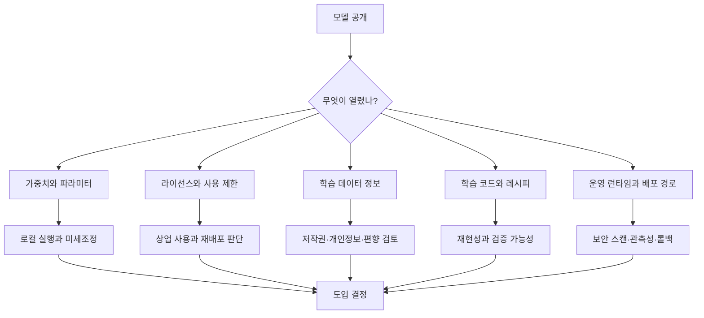

> 한 줄 요약: 오픈 모델 논쟁은 이제 성능표 싸움이 아니라, 가중치·학습 데이터·학습 방법·운영 책임 중 어디까지 사용자가 통제할 수 있는지를 따지는 문제다. 모델을 내려받을 수 있다는 이유만으로 오픈소스 AI라고 부르기에는 실무 리스크가 크다.

## 무슨 일이 있었나

2026년 7월 9일 전후 LocalLLaMA에 오픈 모델이 생태계에 실제로 얼마나 도움이 되는지 묻는 글이 올라왔다. 논의의 출발점은 Artificial Analysis의 Openness Index였다. 이 지표는 모델이 얼마나 열려 있는지를 0~100점으로 계산한다.

확인된 범위는 다음과 같다.

| 구분 | 확인된 사실 |
|---|---|
| 지표 | Artificial Analysis Openness Index |
| 평가 축 | 모델 사용 가능성, 라이선스, 학습 데이터 공개, 후처리 데이터 공개, 학습 방법 공개 |
| 점수 구조 | 원점수 최대 18점을 0~100으로 정규화 |
| 2026년 7월 9일 확인 화면 | 182개 모델 중 일부 상위 모델이 88.89점을 기록 |
| 커뮤니티 쟁점 | 오픈웨이트 모델과 오픈소스 AI를 같은 말로 봐도 되는가 |

Reddit 글의 요지는 간단하다. 어떤 모델은 무료로 쓸 수 있고 가중치도 받을 수 있지만, 학습 데이터와 학습 절차는 공개하지 않는다. 반대로 어떤 모델은 충분한 자원을 갖춘 사람이 비슷한 모델을 다시 만들 수 있을 만큼 많은 정보를 제공한다.

소프트웨어로 비유하면 차이가 더 분명하다.

- 실행 파일만 받는 경우: 쓸 수는 있지만 내부를 바꾸기 어렵다.
- 소스 코드까지 받는 경우: 검토하고 수정하고 다시 빌드할 수 있다.
- 빌드 스크립트, 의존성, 테스트, 라이선스까지 받는 경우: 조직 안에서 재현 가능한 운영 자산이 된다.

AI 모델에서도 비슷한 단계가 생겼다. 가중치만 공개된 모델은 오픈웨이트(Open Weight)에 가깝다. 학습 데이터 정보, 학습 코드, 파라미터, 라이선스까지 갖춘 모델은 OSI(Open Source Initiative)가 말하는 오픈소스 AI(Open Source AI)에 더 가까워진다.

같은 시기 다른 흐름도 있었다. Hugging Face 모델을 Microsoft Foundry Managed Compute에서 운영할 수 있게 한 발표는 오픈 모델이 실험 환경에서 기업 운영 환경으로 넘어가고 있음을 보여준다. Microsoft와 Hugging Face는 모델을 선별하고, 라이선스를 검토하고, `trust_remote_code` 같은 실행 경로를 확인하고, 런타임 이미지를 빌드·스캔·서명해 Azure 안에 배치한다고 설명했다.

동시에 HF Viewer는 2,000개가 넘는 모델 구조를 검색하고 시각적으로 살펴볼 수 있는 기능을 내놓았다. 한 사용자는 DeepSeek로 만든 응답을 Gemma 계열 모델에 증류(Distillation)하면서 데이터셋, 비용, GPU 구성, 학습 손실을 공유했다. 중국의 UN AI 거버넌스 발언을 다룬 글에서는 DeepSeek와 Qwen 같은 중국 오픈 모델이 채택 비용을 낮췄다는 주장이 토론으로 이어졌다.

확인된 사실과 해석은 나눠서 봐야 한다.

- 확인된 사실: 오픈 모델 평가지표가 가중치 공개만 보지 않고 데이터·방법·라이선스를 함께 본다.
- 확인된 사실: Hugging Face와 Microsoft는 오픈웨이트 모델을 기업 운영 카탈로그로 옮기는 관리형 경로를 공개했다.
- 확인된 사실: 커뮤니티에서는 DeepSeek, Qwen, Gemma, OLMo, Apertus 같은 모델을 비교하며 재현성·비용·국가 리스크를 함께 논의한다.
- 추정에 가까운 해석: 특정 국가나 회사가 더 낫다는 결론은 자료만으로 말하기 어렵다.
- 더 조심해야 할 해석: 싸고 공개된 모델이 곧 법적·보안적으로 안전하다는 뜻은 아니다.

## 왜 사람들이 반응했나

### 오픈소스 AI와 오픈웨이트 AI 차이점은 왜 불편한가?

개발자 커뮤니티가 민감하게 반응한 이유는 용어 문제가 곧 사용자의 권한 문제로 이어지기 때문이다.

모델 가중치만 공개돼도 개인 개발자에게는 의미가 크다. 로컬에서 실행하고, 양자화(Quantization)하고, 미세조정(Fine-tuning)하고, 벤치마크를 돌릴 수 있다. API 가격이 바뀌거나 서비스가 막혀도 당장 손에 남는 것이 있다.

하지만 기업이나 연구 조직에서는 질문이 더 까다롭다.

- 이 모델을 상업 서비스에 써도 되는가?
- 학습 데이터 출처를 감사할 수 있는가?
- 저작권·개인정보 문제가 생겼을 때 설명 가능한가?
- 모델 업데이트가 기존 품질을 깨뜨리면 롤백할 수 있는가?
- 파생 모델을 다시 배포할 수 있는가?
- 특정 클라우드나 플랫폼 정책에 묶이는가?

오픈웨이트는 이 질문 중 일부에만 답한다. 오픈소스 AI에 가까운 공개는 답할 수 있는 범위를 넓힌다. 그래서 사람들은 점수표 하나에도 반응한다. 점수는 자존심 문제가 아니라, 나중에 장애·감사·비용 문제가 생겼을 때 선택지가 얼마나 남는지를 보여주는 신호에 가깝다.

### 왜 성능보다 재현성이 더 크게 보이나?

DeepSeek를 Gemma에 증류한 커뮤니티 글은 이 논쟁을 실무 쪽으로 끌어당긴다. 작성자는 Natural Questions 기반 1,200개 요청을 DeepSeek v4 Pro로 다시 채우는 데 0.36달러를 썼고, 2x RTX 3090 서버를 빌려 26B MoE 모델과 12B Dense 모델을 비교했다. 결과는 단순한 승패가 아니었다. 26B는 VRAM을 더 먹었고, 12B는 더 빨랐으며, 손실 곡선과 과적합 양상도 달랐다.

이런 글이 커뮤니티에서 의미를 갖는 이유는 모델 카드의 점수만으로는 알 수 없는 정보가 드러나기 때문이다.

- 데이터가 작을 때 어떤 모델이 더 빨리 과적합되는가
- MoE(Mixture of Experts) 구조가 학습 비용에 어떤 부담을 주는가
- 저렴한 API 증류가 실제 품질 개선으로 이어지는가
- 공개된 GGUF 모델과 데이터셋으로 다른 사람이 다시 확인할 수 있는가

여기서 오픈의 가치는 주장보다 디버깅 가능성에 가깝다. 모델이 좋아 보이는지보다, 이상할 때 어디까지 파고들 수 있는지가 더 오래 남는다.

### 플랫폼은 왜 오픈 모델을 다시 포장하나?

Microsoft Foundry의 Hugging Face 모델 통합은 반대 방향의 흐름을 보여준다. 커뮤니티는 더 많이 열리길 원하지만, 기업은 더 안전하게 통제된 운영 경로를 원한다.

Foundry 발표에서 눈에 띄는 부분은 모델 자체보다 운영층이다. Microsoft는 인기 모델을 선별하고, 라이선스와 보안을 검토하고, SafeTensors 형식만 허용하고, 런타임을 선택하고, 컨테이너 취약점(CVE)을 스캔하고, Azure 안에 가중치를 미리 배치한다고 설명했다. 또한 vLLM, SGLang, TensorRT-LLM, NIM, TEI, llama.cpp 같은 런타임을 모델에 맞게 붙인다.

오픈 모델 생태계에는 이런 긴장이 있다.

- 커뮤니티는 자유로운 접근을 원한다.
- 기업은 검증된 공급망을 원한다.
- 클라우드는 그 사이에서 큐레이션과 거버넌스를 상품화한다.

현업에서 비슷한 고민을 해봤다면 낯선 구도는 아니다. 라이브러리는 GitHub에 있지만, 실제 운영에서는 사내 아티팩트 저장소, 보안 스캔, 승인된 베이스 이미지, 롤백 절차를 거친다. 오픈 모델도 같은 길을 걷고 있다.

## 내가 보는 핵심

이번 오픈 모델 논쟁의 핵심은 모델을 얼마나 믿을 수 있느냐보다, 믿기 어려운 상황이 왔을 때 무엇을 할 수 있느냐다.

API만 쓰는 모델은 편하다. 장애 대응, 보안 패치, 스케일링, 품질 개선을 공급자가 맡는다. 대신 가격, 정책, 지역 제한, 콘텐츠 필터, 데이터 처리 조건이 바뀌면 사용자가 움직일 공간은 좁다.

오픈웨이트 모델은 그 공간을 조금 넓힌다. 직접 호스팅할 수 있고, 특정 버전을 고정할 수 있고, 도메인 데이터로 미세조정할 수 있다. 하지만 학습 데이터와 학습 절차가 보이지 않으면 법적 설명과 재현성에는 구멍이 남는다.

완전한 공개에 가까운 모델은 더 많은 권한을 준다. 대신 비용과 책임도 같이 온다. 직접 운영하려면 GPU 비용, 추론 런타임, 모델 서빙, 보안 패치, 평가 자동화, 품질 회귀 테스트를 감당해야 한다. 공개가 많다고 공짜가 되는 것은 아니다. 판단할 재료가 많아지는 쪽에 가깝다.

현실적인 기준은 하나다.

오픈 모델은 도덕 점수가 아니라 운영 옵션이다.  
나중에 바꾸고, 설명하고, 재현하고, 빠져나올 수 있는 권리를 얼마나 확보했는지 봐야 한다.

그래서 Artificial Analysis의 Openness Index 같은 지표에 말이 붙는다. 완벽한 답이라서가 아니다. 모델 회사가 오픈이라는 단어를 마케팅 문구로 쓸 때, 사용자가 되물을 체크리스트를 제공하기 때문이다.

특히 DeepSeek와 Qwen을 둘러싼 반응은 양쪽이 다 있다. 많은 개발자는 낮은 비용과 좋은 성능을 반긴다. 동시에 일부는 학습 데이터, 증류 의혹, 국가 규제, 데이터 주권, 검열 가능성을 걱정한다. 둘 중 하나만 말하면 현실을 놓친다. 싸고 강한 모델은 채택 압력을 만들고, 설명하기 어려운 공급망은 승인 절차를 늦춘다.

## 앞으로 볼 기준

### 오픈 모델을 도입하기 전에 무엇을 확인해야 하나?

다음에 오픈 모델 관련 뉴스를 볼 때는 모델 이름보다 아래 항목을 먼저 확인하는 편이 낫다.

| 체크포인트 | 봐야 할 질문 |
|---|---|
| 가중치 | 다운로드와 자체 호스팅이 가능한가 |
| 라이선스 | 상업 사용, 재배포, 파생 모델 공개가 허용되는가 |
| 데이터 정보 | 학습 데이터 출처와 필터링 방법이 설명되는가 |
| 학습 방법 | 아키텍처, 하이퍼파라미터, 후처리 방식이 공개되는가 |
| 보안 | `trust_remote_code` 없이 실행 가능한가, SafeTensors 같은 안전한 형식을 쓰는가 |
| 운영 | vLLM, SGLang, llama.cpp 등 검증된 런타임에서 안정적으로 도는가 |
| 관측성 | 지연시간, 토큰 처리량, 실패율, 품질 회귀를 추적할 수 있는가 |
| 데이터 주권 | 요청·로그·가중치가 어느 지역과 어느 계정 경계 안에 머무는가 |
| 탈출 가능성 | 가격·정책 변경 시 다른 모델로 바꿀 수 있는가 |

오픈소스 AI라는 이름만 보고 들어가면 실망하기 쉽다. 반대로 오픈웨이트라서 부족하다고만 보면 실무의 장점을 놓친다. 작은 팀에는 가중치 공개만으로도 충분히 큰 자유가 될 수 있다. 규제가 강한 조직에는 같은 모델도 데이터 출처와 라이선스가 확인되지 않으면 통과하기 어렵다.

### 오픈 모델 뉴스에서 과장을 거르는 방법

앞으로 비슷한 발표를 볼 때는 세 문장으로 걸러볼 수 있다.

- 누구나 실행할 수 있는가?
- 누구나 검증할 수 있는가?
- 문제가 생겼을 때 누구 책임으로 고칠 수 있는가?

첫 번째만 만족하면 오픈웨이트에 가깝다. 첫 번째와 두 번째를 만족하면 연구와 커뮤니티 검증에 강하다. 세 번째까지 답이 나오면 운영 자산으로 볼 수 있다.

이 기준으로 보면 Microsoft Foundry 같은 관리형 카탈로그는 오픈 모델의 자유 일부를 플랫폼 통제와 맞바꾸는 선택이다. 보안 스캔, 라이선스 검토, 관측성, 사설 네트워크, 자동 패치를 얻는 대신 어떤 모델이 카탈로그에 들어오는지와 어떤 런타임으로 제공되는지는 플랫폼의 판단을 따른다.

반대로 LocalLLaMA식 실험은 자유도가 높다. 비용도 낮고 학습도 빠르다. 대신 버그, 재현성, 라이선스, 데이터 출처, 운영 안정성은 사용자가 직접 감당해야 한다.

오픈 모델을 둘러싼 다음 논쟁은 누가 더 오픈인가에서 끝나지 않을 가능성이 크다. 실제 질문은 더 차갑다. 이 모델을 내 서비스의 장애 보고서, 보안 검토, 비용 계획, 법무 검토 앞에 세울 수 있는가.

그 질문에 답할 수 있어야 오픈이라는 말이 실제 선택지로 남는다.

## 참고 자료

- [선정 글감] [Which open models help the eco system more?](https://www.reddit.com/r/LocalLLaMA/comments/1urbn11/which_open_models_help_the_eco_system_more/) — Reddit LocalLLaMA
- [관련] [Artificial Analysis Openness Index](https://artificialanalysis.ai/evaluations/artificial-analysis-openness-index) — Artificial Analysis
- [관련] [The Open Source AI Definition 1.0](https://opensource.org/ai/open-source-ai-definition) — Open Source Initiative
- [관련] [Hugging Face Models on Foundry Managed Compute](https://huggingface.co/blog/microsoft/foundry-managed-compute) — Hugging Face Blog
- [관련] [HF Viewer tons of new features!](https://www.reddit.com/r/LocalLLaMA/comments/1uqzwdy/hf_viewer_tons_of_new_features/) — Reddit LocalLLaMA
- [관련] [What China Said at the UN’s First Global Dialogue on AI Governance](https://www.reddit.com/r/LocalLLaMA/comments/1ur4tz5/what_china_said_at_the_uns_first_global_dialogue/) — Reddit LocalLLaMA
- [관련] [Distilled DeepSeek into Gemma 4 26B-A4B vs 12B](https://www.reddit.com/r/LocalLLaMA/comments/1ur1i1a/distilled_deepseek_into_gemma_4_26ba4b_vs_12b_not/) — Reddit LocalLLaMA