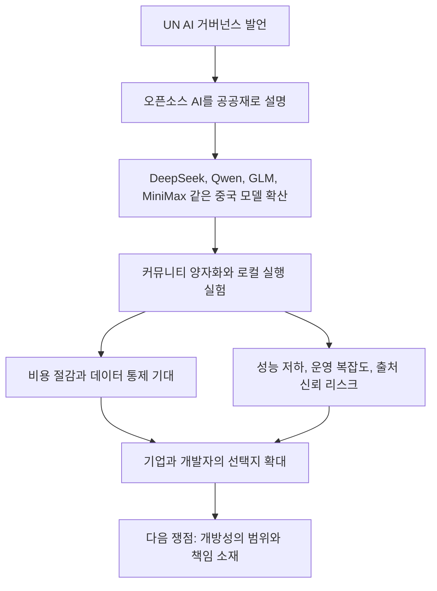

> 한 줄 요약: 중국의 UN AI 거버넌스 발언이 LocalLLaMA에서 반응을 얻은 이유는 외교 문구 자체보다, 오픈소스 AI를 인류 공동 자산이라고 부른 말이 DeepSeek, Qwen, GLM, MiniMax 계열 모델로 비용 구조가 바뀌고 있다는 체감과 겹쳤기 때문이다.

## 무슨 일이 있었나

2026년 7월 9일 작성 시점, Reddit LocalLLaMA에는 “What China Said at the UN’s First Global Dialogue on AI Governance”라는 글이 올라왔다. 게시글은 중국이 UN의 첫 AI 거버넌스 글로벌 대화에서 오픈소스 AI를 인류 공동 자산으로 표현했고, DeepSeek와 Qwen 같은 중국 오픈소스 모델이 AI 도입 장벽과 비용을 낮췄다고 전한다.

제공된 자료에서 직접 확인할 수 있는 건 다음 정도다.

- 당사자: 중국 측 발언, UN AI 거버넌스 대화, Reddit LocalLLaMA 커뮤니티
- 범위: AI 거버넌스, 오픈소스 AI, 국제 협력, 산업, 학계, 연구기관의 AI 활용
- 주장: 중국 오픈소스 모델이 비용과 진입 장벽을 낮췄고, 포용적 생태계를 만들겠다는 방향

확인 범위도 분명히 봐야 한다. 제공된 Reddit 본문에는 UN 원문 회의록, 공식 발언 전문, 발언 날짜가 직접 포함되어 있지 않다. 이 글에서는 발언의 세부 문구를 확정된 정책 문서처럼 다루지 않고, 커뮤니티가 왜 이 메시지에 반응했는지를 중심으로 본다.

이 반응은 단일 게시글만으로 설명하기 어렵다. 같은 시점 LocalLLaMA에는 MiniMax가 2.7조 파라미터 모델을 준비한다는 글, GLM-5.2 504B 코드 모델의 140GB IQ2_XXS REAP 양자화판을 테스트한다는 글, llama.cpp에 Ternary Bonsai 모델 지원을 위한 Q2_0 CPU 양자화가 추가된다는 글, GLM-5.2 753B MoE를 4비트로 4대의 DGX Spark에서 돌려 Terminal-Bench 2.1 결과를 공유한 글도 함께 올라왔다.

커뮤니티가 본 것은 외교 연설 하나라기보다 이런 흐름에 가깝다.

- 국가 단위에서는 오픈소스 AI가 거버넌스 언어로 설명된다.
- 기업 단위에서는 거대 모델 공개, 또는 공개 예고가 이어진다.
- 개발자 단위에서는 수백 GB 모델을 줄이고, llama.cpp 백엔드에 붙이고, 로컬 장비에서 성능을 재는 실험을 한다.
- 사용자 단위에서는 API 비용, 검열 가능성, 데이터 반출, 하드웨어 비용을 놓고 선택지가 늘어난다.

## 왜 사람들이 반응했나

### 왜 오픈소스 AI 거버넌스 발언에 커뮤니티가 반응했을까?

LocalLLaMA는 모델을 소비만 하는 커뮤니티가 아니다. 누군가는 GGUF 파일을 만들고, 누군가는 llama.cpp 백엔드를 고치고, 누군가는 벤치마크를 돌리고, 누군가는 자기 장비에서 돌아가는 최소 비용 조합을 찾는다.

그래서 오픈소스 AI는 인류 공동 자산이라는 문장은 추상적인 선언으로만 들리지 않는다. 이 커뮤니티에서 오픈소스는 매일 만지는 파일 형식, 양자화 옵션, GPU 메모리 한계, 추론 속도, 라이선스 문구, 모델 카드의 빈칸이다.

중국 측 발언이 반응을 얻은 이유는 먼저 기대다. DeepSeek와 Qwen 이후 개발자들은 이미 중국계 모델이 닫힌 상용 API의 가격 기준을 흔드는 장면을 봤다. MiniMax가 2.7조 파라미터 모델을 준비하고, 빠르면 올해 3분기 공개 및 오픈소스화될 수 있다는 보조 자료의 내용도 이 기대를 키운다.

또 하나는 불편함이다. 국가가 오픈소스를 인류 공동 자산이라고 말하는 순간, 개발자들은 곧바로 다음 질문을 던진다.

- 모델 가중치가 공개되는가?
- 학습 데이터 구성은 설명되는가?
- 상업적 사용이 가능한 라이선스인가?
- 안전 필터와 검열 정책은 어디에 들어가는가?
- 추론 인프라를 직접 운영할 수 있는가?
- 제재, 수출통제, 지역 규제에 걸릴 여지는 없는가?

공개라는 단어만으로는 부족하다. 오픈소스 AI에서 공개 범위는 늘 여러 층으로 갈린다.

| 구분 | 개발자가 실제로 확인하는 것 |
|---|---|
| 모델 가중치 | 내려받아 직접 실행할 수 있는지 |
| 코드 | 학습, 추론, 평가 파이프라인이 재현 가능한지 |
| 데이터 | 학습 데이터 출처와 제외 기준이 설명되는지 |
| 라이선스 | 상업 이용, 재배포, 파생 모델 허용 범위 |
| 운영 정책 | 안전 필터, 지역 제한, API 의존성 여부 |
| 벤치마크 | 같은 조건에서 성능을 재현할 수 있는지 |

### 커뮤니티의 기대는 왜 비용 문제와 연결되나?

오픈소스 AI를 둘러싼 반응의 중심에는 비용이 있다. 무료라서 좋다는 식의 이야기는 아니다.

현업에서 비슷한 고민을 하다 보면 모델 선택은 성능표만으로 끝나지 않는다. 데이터가 외부 API로 나가도 되는지, 호출량이 늘어났을 때 비용을 감당할 수 있는지, 장애가 났을 때 대체 경로가 있는지, 특정 공급자 정책 변화에 제품이 묶이는지까지 같이 보게 된다.

이 대목에서 LocalLLaMA의 다른 글들이 배경처럼 붙는다. GLM-5.2 504B 코드 모델을 140GB IQ2_XXS REAP 양자화로 만들었다는 게시글은 거대 모델을 개인과 소규모 팀의 테스트 범위로 끌어내리려는 시도다. 140GB는 작은 파일이 아니다. 그래도 원래 크기와 비교하면 모델 접근 방식이 달라진다.

GLM-5.2 753B MoE를 4비트로 줄여 4대의 DGX Spark에서 돌린 실험도 같은 맥락이다. 게시글 요약에 따르면 Terminal-Bench 2.1에서 63/89, 즉 70.8%를 기록했고, 공식 full precision 수치인 81.0%와 비교했다. 작성자는 이 차이를 양자화만으로 설명하지 않았다. 100K 대 256K 컨텍스트 제한, 더 작은 토큰 예산, 샘플링 조건 차이가 모두 섞여 있다고 밝혔다. 실행에는 72.5시간이 걸렸고, 엔진이 두 번 크래시했으며, 한 설정은 네 노드를 모두 멈추게 했다고 한다.

이런 숫자는 홍보 문구보다 쓸모가 있다. 오픈소스 모델의 진짜 비용은 다운로드 버튼 뒤에 숨어 있다.

- 모델 파일 저장 공간
- GPU 또는 통합 메모리
- 컨텍스트 길이에 따른 KV 캐시 비용
- 양자화로 인한 성능 손실
- 백엔드별 커널 지원
- 장시간 평가 중 크래시 대응
- 결과 재현을 위한 샘플링 조건 통제

이런 맥락에서 커뮤니티가 중국의 오픈소스 AI 발언에 반응한 것을 정치적 호불호만으로 보기는 어렵다. 이미 손으로 비용을 재고 있는 사람들에게, 국가 단위 발언은 공급망의 방향을 암시하는 신호처럼 보인다.

### 왜 오해도 생기나?

오픈소스라는 단어는 듣기 좋지만, AI 모델에서는 소프트웨어 오픈소스와 같지 않다. 코드 저장소 하나를 공개한다고 끝나는 문제가 아니다.

예를 들어 llama.cpp의 Q2_0 CPU 양자화 지원 PR은 Ternary Bonsai 1.58-bit 모델을 지원하려는 실무적인 변화다. 요약에 따르면 ARM NEON과 일반 스칼라 fallback을 포함한 CPU 전용 지원이며, x86, Metal, CUDA, Vulkan 백엔드는 이후 제출될 준비가 되어 있다고 한다.

이런 변화는 오픈 모델 생태계에서 실행 가능한 범위를 넓힌다. 더 낮은 비트폭, 더 많은 백엔드, 더 싼 장비에서의 실행 가능성은 개발자에게 실제 선택지를 준다. 동시에 사용자는 더 많은 조합을 직접 검증해야 한다.

오픈소스 AI가 좋다는 말과 내 제품에 넣어도 된다는 말 사이에는 간격이 있다. 그 간격을 줄이는 일은 커뮤니티가 한다. 양자화 제작자, 백엔드 기여자, 벤치마크 실행자, 모델 카드 작성자가 각각 빈칸을 메운다.

## 내가 보는 핵심

### 오픈소스 AI 논쟁의 핵심은 공개 여부가 아니라 의존성의 위치다

이번 이슈를 중국 대 미국, 오픈소스 대 폐쇄형 모델의 구도로만 보면 놓치는 것이 있다. 더 실무적인 질문은 이것이다.

AI 시스템의 통제권은 어디에 놓이는가?

닫힌 상용 API는 빠르고 편하다. 성능이 높고 운영 부담이 작으며 제품에 붙이기 쉽다. 대신 가격, 정책, 지역 제한, 모델 변경, 데이터 처리 방식이 공급자 쪽에 있다.

오픈 모델은 부담의 종류가 다르다. 직접 띄울 수 있고, 데이터 경로를 통제할 수 있고, 장애 격리도 설계할 수 있다. 대신 모델 품질 검증, 보안 패치, 추론 비용, 하드웨어 운영, 라이선스 해석을 직접 떠안아야 한다.

중국의 UN 발언이 커뮤니티에서 말이 붙는 이유는 이 의존성의 위치를 바꾸는 흐름과 맞닿아 있기 때문이다. DeepSeek와 Qwen은 이미 비용 기대치를 바꿨고, GLM과 MiniMax 같은 이름은 거대 모델 공개 경쟁의 다음 축처럼 언급된다. 여기에 llama.cpp, GGUF, REAP 양자화, Q2_0 같은 커뮤니티 기술이 붙으면서 공개 모델은 연구 데모가 아니라 운영 후보가 된다.

하지만 공개 모델이 곧 독립성을 보장하지는 않는다. 모델 가중치를 받을 수 있어도 학습 데이터와 평가 조건을 모르면 품질 리스크가 남는다. 직접 실행할 수 있어도 특정 하드웨어와 커널 최적화에 묶이면 공급망 리스크가 다른 곳으로 이동한다. 라이선스가 애매하면 법무 검토 없이 제품에 넣기 어렵다.

### 커뮤니티가 만드는 신뢰와 국가가 말하는 신뢰는 다르다

UN 같은 자리에서 쓰는 AI 거버넌스 언어는 보통 포용, 협력, 안전, 혁신 같은 단어로 구성된다. 이 언어가 쓸모없다는 뜻은 아니다. 국제 규범은 결국 그런 단어를 통해 만들어진다.

하지만 개발자 커뮤니티에서 신뢰는 다르게 생긴다.

- 누가 모델을 실제로 내려받아 돌렸는가
- 어떤 장비에서 어떤 옵션으로 실행했는가
- 벤치마크 조건이 공개되었는가
- 실패 로그와 크래시가 공유되었는가
- 작은 모델과 큰 모델을 같은 작업으로 비교했는가
- 코드 변경이 특정 백엔드에만 갇혀 있지 않은가

GLM-5.2 4비트 실험 글이 흥미로운 이유는 좋은 점만 말하지 않아서다. 70.8%라는 결과와 함께, 공식 수치와의 차이가 여러 조건 차이를 포함한다고 선을 긋는다. 72.5시간 실행, 두 번의 크래시, 네 노드가 멈춘 설정까지 적는다. 이런 정보가 있어야 실무자는 환상을 줄일 수 있다.

정책 발언은 방향을 만든다. 커뮤니티 실험은 바닥을 확인한다. 둘 중 하나만으로는 부족하다.

## 앞으로 볼 기준

### 다음 오픈소스 AI 뉴스를 볼 때 무엇을 확인해야 하나?

앞으로 중국계 모델이든 미국계 모델이든, 오픈소스 AI라는 이름으로 새 모델이 나올 때는 발표 문구보다 다음 항목을 먼저 보는 편이 낫다.

| 체크포인트 | 봐야 할 질문 |
|---|---|
| 공개 범위 | 가중치, 코드, 데이터 설명 중 무엇이 공개됐나 |
| 라이선스 | 상업 이용과 재배포가 허용되나 |
| 실행 가능성 | 일반적인 서버나 로컬 장비에서 돌릴 수 있나 |
| 양자화 품질 | 낮은 비트폭에서 성능 손실이 어느 정도인가 |
| 벤치마크 조건 | 공식 수치와 커뮤니티 수치의 조건이 같은가 |
| 안전 정책 | 거절, 필터링, 지역 제한이 어디에서 작동하나 |
| 공급망 | 모델, 런타임, 하드웨어, 드라이버가 어디에 묶이나 |
| 데이터 리스크 | 입력 데이터가 외부로 나가는지, 로그가 남는지 |

특히 AI 거버넌스 이슈에서는 확인된 사실과 해석을 분리해야 한다. 중국이 오픈소스 AI를 공동 자산으로 표현했다는 것과, 앞으로 모든 중국 모델이 완전한 의미의 오픈소스로 공개된다는 것은 별개다. MiniMax가 2.7조 파라미터 모델을 준비한다는 보도 요약과, 그 모델이 실제로 언제 어떤 라이선스로 공개되는지도 다른 문제다.

### 기업은 어떤 판단을 해야 하나?

실무에서 이 흐름을 볼 때 당장 할 일은 특정 모델로 갈아타는 게 아니다. 의존성 지도를 그리는 일이다.

현재 제품이 상용 API에 묶여 있다면, 어떤 기능이 공급자 정책 변화에 취약한지 확인해야 한다. 고객 데이터가 민감하다면, 로컬 또는 사내 실행 가능한 모델이 대체 경로가 될 수 있는지 봐야 한다. 비용이 문제라면, 작은 모델과 양자화 모델이 실제 업무 품질을 어디까지 만족하는지 직접 재야 한다.

반대로 오픈 모델 도입을 검토한다면 낙관만으로는 부족하다. 모델 업데이트 주기, 취약점 대응, 프롬프트 인젝션 방어, 로그 관리, GPU 장애 대응, 라이선스 추적이 같이 따라와야 한다. 공개 모델은 운영 책임을 덜어주는 모델이 아니라 책임의 위치를 바꾸는 모델이다.

처음의 긴장은 여기로 돌아온다. 오픈소스 AI를 인류 공동 자산이라고 부르는 말은 듣기 좋다. 하지만 개발자와 기업이 실제로 마주하는 질문은 더 차갑다.

누가 공개했는가보다, 내가 어디까지 검증할 수 있는가.  
누가 선의로 말했는가보다, 장애와 비용과 정책 변화가 왔을 때 내가 버틸 수 있는가.

이번 LocalLLaMA의 반응은 그래서 가볍지 않다. 외교 발언에 대한 댓글 놀이가 아니라, AI 인프라의 통제권을 어디에 둘 것인지에 대한 실무 감각이 드러난 장면에 가깝다.

## 참고 자료

- [선정 글감] [What China Said at the UN’s First Global Dialogue on AI Governance](https://www.reddit.com/r/LocalLLaMA/comments/1ur4tz5/what_china_said_at_the_uns_first_global_dialogue/) (Reddit LocalLLaMA)
- [관련] [China’s MiniMax Plans to Launch 2.7-Trillion Parameter Model](https://www.reddit.com/r/LocalLLaMA/comments/1uqnqsc/chinas_minimax_plans_launch_27trillion/) (Reddit LocalLLaMA)
- [관련] [I created a 140 GB IQ2_XXS REAP quant of GLM 5.2 for coding. Looking for testers.](https://www.reddit.com/r/LocalLLaMA/comments/1ur08mq/i_created_a_140_gb_iq2_xxs_reap_quant_of_glm_52/) (Reddit LocalLLaMA)
- [관련] [Ternary Bonsai 1.58-bit models - ggml: add Q2_0 quantization support](https://www.reddit.com/r/LocalLLaMA/comments/1uqur7o/ternary_bonsai_158bit_models_ggml_add_q2_0/) (Reddit LocalLLaMA)
- [관련] [4-bit GLM-5.2 (753B MoE) on 4× DGX Spark](https://www.reddit.com/r/LocalLLaMA/comments/1ur41ou/4bit_glm52_753b_moe_on_4_dgx_spark_708_on/) (Reddit LocalLLaMA)