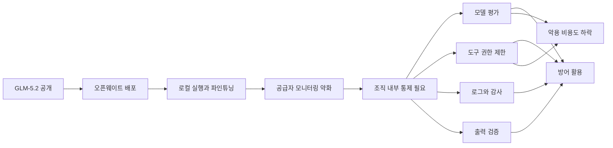

> 한 줄 요약: GLM-5.2 논란은 오픈웨이트 AI 모델을 막을지 말지의 문제라기보다, 사이버보안 책임이 모델 제공자에서 운영자, 조직, 플랫폼으로 옮겨간 사건에 가깝다. 언론의 공포 프레임만으로 보기엔 성능과 비용 변화가 크고, 전면 차단으로 풀기엔 방어자에게도 같은 도구가 필요하다.

## 무슨 일이 있었나

2026년 6월, 중국 Z.ai가 GLM-5.2를 공개했다. Semgrep 글에 따르면 GLM Coding Plan 회원에게는 6월 13일 먼저 제공됐고, 6월 16일 오픈웨이트와 릴리스 노트가 공개됐다.

개발자 커뮤니티에서 이 모델이 빠르게 퍼진 이유는 새 중국산 모델이라는 점만은 아니었다. GLM-5.2는 약 750B급 총 파라미터의 Mixture-of-Experts(MoE) 모델로 소개됐고, 토큰당 활성 파라미터는 약 40B 수준이라고 설명됐다. 1M 토큰 컨텍스트, 긴 코딩 작업, 에이전트형 워크플로가 주요 특징으로 제시됐다.

확인된 내용은 이렇다.

- GLM-5.2는 오픈웨이트 모델로 공개됐다. 모델 가중치를 내려받아 자체 환경에서 실행할 수 있다.
- Semgrep은 IDOR(Insecure Direct Object Reference) 탐지 벤치마크에서 GLM-5.2가 39% F1을 기록했다고 밝혔다.
- 같은 Semgrep 실험에서 Semgrep Multimodal 파이프라인은 53~61% F1을 기록했고, GLM-5.2는 단순 프롬프트 기반 Pydantic AI 하네스에서 테스트됐다.
- Graphistry는 CyBT-CTF 보안 조사 벤치마크에서 GLM-5.2가 28/59 solve rate를 기록해 자사 테스트 기준 최상위 오픈웨이트 모델이라고 설명했다.
- Axios와 Futurism은 이 결과를 바탕으로 GLM-5.2가 공격 자동화 비용과 접근 장벽을 낮출 수 있다는 보안 업계 우려를 다뤘다.

아직 확정되지 않은 부분도 있다.

Graphistry는 GLM-5.2의 정답과 오답 패턴이 GPT-5.5, Opus 4.8과 통계적으로 비슷하다며 불법 증류(distillation) 가능성을 제기했다. 다만 이는 공개적으로 확정된 사실이 아니라 측정값을 바탕으로 한 의혹이다. Z.ai가 해당 의혹을 인정했다는 근거도 현재 참고 자료 안에서는 찾기 어렵다.

Reddit LocalLLaMA의 반응은 갈렸다. 한쪽은 언론이 GLM-5.2를 Mythos급 위협으로 포장해 오픈 모델 검열 명분을 만들 수 있다고 봤다. 다른 한쪽은 보안 작업에 실제로 쓸 만한 성능이라면, 위험을 말하는 것 자체를 공포 조장으로만 볼 수 없다고 본다.

둘 다 맞는 부분이 있다. 다만 놓치기 쉬운 지점은 논쟁의 중심이 모델 자체에서 배포 구조로 옮겨갔다는 점이다.

## 왜 사람들이 반응했나

### GLM-5.2 오픈웨이트 모델이 불편한 이유는 무엇인가

폐쇄형 모델은 불편하지만 통제 지점이 분명하다. API 키를 정지할 수 있고, 사용 로그를 볼 수 있고, 정책 위반 사용자를 차단할 수 있다. 완벽하진 않아도 공급자가 중간에 있다.

오픈웨이트 모델은 다르다. 내려받아 로컬에서 실행하면 공급자의 모니터링, 사용량 제한, 정책 필터가 닿지 않는다. 조직 내부망에서 합법적으로 쓰는 보안팀에게는 이 점이 장점이다. 민감한 소스코드와 로그를 외부 API로 보내지 않아도 되기 때문이다.

문제는 같은 장점이 공격자에게도 장점이 된다는 데 있다.

- 로컬 실행: 제공자 로그에 남지 않는다.
- 파인튜닝: 특정 대상 환경에 맞춰 조정할 수 있다.
- 비용 절감: 대량 시도와 반복 실험이 쉬워진다.
- 가드레일 제거 가능성: 공개된 가중치를 변형하거나 우회 프롬프트를 실험할 수 있다.

커뮤니티가 예민하게 반응한 이유는 명확하다. 오픈 모델을 위험하다고만 말하면 연구, 방어, 개인 실행권까지 한꺼번에 묶어 규제할 수 있다. 그렇다고 아무 위험도 없다고 말하면 비용과 접근성의 변화를 놓치게 된다.

### 언론의 공포 프레임은 왜 의심받았나

Futurism의 글은 GLM-5.2를 Mythos와 연결해 소개했다. 보안 벤치마크에서 강한 성능을 보였고, 누구나 내려받아 실행할 수 있으며, 중간 공급자 없이 악용될 수 있다는 흐름이다.

이 프레임이 커뮤니티에서 반발을 산 이유는 세 가지다.

첫째, 오픈웨이트와 오픈소스를 섞어 부르는 문제가 있다. Semgrep도 지적했듯이 오픈웨이트는 학습된 가중치가 공개됐다는 뜻이지, 학습 데이터와 전체 학습 파이프라인이 모두 공개됐다는 뜻은 아니다. 용어가 흐려지면 정책 논의도 흐려진다.

둘째, 벤치마크 결과가 실제 공격 능력으로 바로 이어지지는 않는다. Semgrep의 IDOR 실험은 특정 취약점 유형과 특정 데이터셋에서의 결과다. Graphistry의 CyBT-CTF도 보안 조사형 태스크에 대한 비교다. 현실 공격은 초기 침투, 권한 상승, 횡적 이동, 운영 보안, 인프라까지 엮인다.

셋째, 하네스(harness)의 역할이 크다. Semgrep과 Graphistry 모두 모델만이 승패를 가른다고 말하지 않는다. 어떤 파일을 보여줄지, 어떤 도구를 연결할지, 출력을 어떻게 검증할지, 재시도와 탐색을 어떻게 돌릴지가 결과를 바꾼다.

그래서 공포 프레임은 과장될 수 있다. 다만 과장 가능성이 있다고 해서 신호 전체가 사라지는 것은 아니다.

### 왜 비용이 보안 이슈가 되나

AI 보안 논쟁은 자주 능력만 따진다. 이 모델이 제로데이를 찾을 수 있나, 악성코드를 만들 수 있나, 방어를 우회할 수 있나 같은 질문이다.

실무에서는 비용도 같은 비중으로 봐야 한다. 공격이든 방어든 반복 실험이 싸지면 운영 방식이 바뀐다. 수백 개 저장소를 훑고, 수천 개 엔드포인트를 비교하고, 실패한 프롬프트를 계속 바꾸는 작업은 모델 단가가 낮을수록 현실적인 선택지가 된다.

Semgrep은 GLM-5.2가 IDOR 탐지에서 취약점 1건당 약 0.17달러 수준의 비용을 보였다고 적었다. Graphistry도 같은 결과 대비 Opus가 2.2배 이상 비싸다고 설명했다. 이 숫자들을 모든 환경에 그대로 적용할 수는 없지만, 논쟁의 방향은 보여준다.

성능이 조금 낮아도 가격이 크게 낮으면 더 많은 시도를 할 수 있다. 방어자는 더 자주 스캔할 수 있고, 공격자는 더 많은 변형을 시험할 수 있다. 그래서 GLM-5.2 논란은 모델 성능표보다 운영 경제학에 가깝다.

## 내가 보는 핵심

### GLM-5.2 논란의 핵심은 검열이 아니라 통제 지점의 이동이다

오픈웨이트 모델을 둘러싼 논쟁은 흔히 자유 대 안전으로 압축된다. 하지만 이번 사안은 그보다 구체적이다. 통제 지점이 모델 공급자에서 실행 환경으로 이동했다.

폐쇄형 API에서는 공급자가 일부 책임을 진다. 사용 정책, 모니터링, 레이트 리밋(rate limit), 계정 차단, 고위험 기능 제한이 공급자 계층에 있다. 오픈웨이트에서는 그 계층이 약해진다. 대신 책임은 모델을 배포하는 조직, 로컬 실행 환경, 에이전트 하네스, CI/CD, 보안팀의 평가 체계로 내려온다.

이 구조를 보면 전면 차단만으로는 문제가 풀리지 않는다. 모델이 이미 내려받아 실행 가능한 형태라면, 정책은 다운로드 금지 문구보다 실행 경계와 책임 체계를 다뤄야 한다.

현업에서 비슷한 고민을 하다 보면 모델 이름보다 연결된 권한이 더 위험할 때가 많다. 같은 모델이라도 읽기 전용 코드 검색만 가능한 환경과, 내부망 접근, 쉘 실행, 티켓 생성, 배포 권한까지 가진 에이전트 환경은 전혀 다른 시스템이다.

그래서 GLM-5.2를 볼 때 물어야 할 질문은 이 모델이 착한가 나쁜가가 아니다. 이 모델이 어떤 권한으로 어떤 데이터에 접근하고, 누가 결과를 검증하며, 실패했을 때 어디서 멈추는가다.

### 보안 벤치마크는 모델 순위표가 아니라 운영 설계 힌트다

Semgrep 결과에서 가장 흥미로운 부분은 GLM-5.2가 Claude Code를 몇 점 차이로 이겼다는 문장이 아니다. 더 큰 차이는 하네스가 붙은 파이프라인과 단순 프롬프트 실행 사이에 있었다.

Semgrep Multimodal은 엔드포인트를 열거하고, 중요한 컨텍스트를 추려 모델에 준다. 반면 GLM-5.2는 더 단순한 하네스에서 같은 IDOR 프롬프트로 테스트됐다. Graphistry도 하네스 선택과 프롬프팅 구성이 Opus와 GLM-5.2의 모델 차이보다 더 큰 영향을 줄 수 있다고 적었다.

이 말은 방어자에게 꽤 실용적이다.

- 모델 교체만으로 보안 자동화가 완성되지 않는다.
- 취약점 유형별로 코드 탐색 전략을 따로 설계해야 한다.
- 모델 출력은 정적 분석, 테스트, 재현 스크립트와 붙어야 한다.
- 비용이 낮은 모델은 1차 탐색에, 고비용 모델은 검증 단계에 배치할 수 있다.

공격자도 같은 생각을 한다. 모델이 싸지고 로컬화되면, 공격자는 단일 프롬프트보다 자동화된 탐색 루프를 만들 가능성이 크다. 이 지점이 실제 리스크다. 모델이 갑자기 모든 해킹을 대신한다는 이야기가 아니라, 반복 실험의 단가가 내려간다는 이야기다.

### 증류 의혹은 별도 트랙으로 봐야 한다

Graphistry의 증류 의혹은 논쟁성이 크다. 정답과 오답 패턴의 상관이 높다는 관찰은 흥미롭지만, 그것만으로 불법 증류를 확정할 수는 없다. 같은 공개 벤치마크, 비슷한 학습 데이터, 유사한 후처리 전략도 결과 패턴을 비슷하게 만들 수 있다.

다만 이 의혹은 다른 질문을 남긴다. 앞으로 기업이 오픈웨이트 모델을 도입할 때 성능과 라이선스만 보면 충분한가?

아니다. 최소한 다음 항목은 함께 봐야 한다.

- 모델 가중치 라이선스와 상업적 사용 조건
- 학습 데이터와 증류 관련 공개 설명
- 벤치마크 오염 가능성
- 보안 태스크에서의 오탐과 미탐 패턴
- 내부 코드, 고객 데이터, 로그를 넣을 때의 법무 리스크
- 공급망 관점에서 모델 파일과 런타임을 검증하는 절차

오픈웨이트는 클라우드 API 종속을 줄여준다. 동시에 모델 공급망이라는 새 검토 대상을 만든다.

## 앞으로 볼 기준

### 다음 GLM-5.2 같은 뉴스를 볼 때 무엇을 확인해야 하나

앞으로 비슷한 모델이 나올 때 첫 질문은 성능이 몇 위인가가 아니어야 한다. 다음 다섯 가지를 먼저 확인하는 편이 낫다.

| 기준 | 봐야 할 질문 |
| --- | --- |
| 배포 형태 | 오픈웨이트인가, 진짜 오픈소스인가, API 전용인가 |
| 실행 경계 | 로컬 실행 시 로그·감사·접근 제어를 누가 맡는가 |
| 하네스 | 모델이 어떤 도구와 권한을 갖고 움직이는가 |
| 평가 | 우리 코드와 태스크에서 오탐·미탐을 측정했는가 |
| 비용 | 낮은 단가가 방어 자동화와 공격 자동화에 각각 어떤 변화를 주는가 |

GLM-5.2를 막자는 말만으로는 부족하다. GLM-5.2를 무해하다고 말하는 것도 부족하다. 오픈웨이트 모델은 이미 연구자, 보안팀, 스타트업, 개인 개발자에게 매력적인 선택지가 됐다. 특히 민감한 코드를 외부 API로 보내기 어려운 조직에는 더 그렇다.

선택지는 셋이다.

- 금지: 규제와 내부 정책으로 사용을 막는다. 단, 비공식 사용과 우회 실행을 발견하기 어렵다.
- 방치: 각 팀이 알아서 쓰게 둔다. 비용은 빨리 줄 수 있지만 데이터와 권한 관리가 무너질 수 있다.
- 통제된 허용: 승인된 런타임, 제한된 도구 권한, 자체 벤치마크, 감사 로그를 묶어 쓴다.

현실적인 길은 세 번째에 가깝다. 모델을 신뢰하지 말고, 실행 환경을 설계해야 한다. 보안 자동화에 쓸 때도 모델에게 쓰기 권한을 바로 주지 말고, 읽기 전용 분석, 재현 가능한 패치 제안, 사람 검토, 테스트 통과 같은 단계를 나눠야 한다.

이번 논란의 불편함은 여기에 있다. 언론의 공포 프레임은 거칠 수 있다. 커뮤니티의 검열 우려도 타당하다. 그래도 조직이 해야 할 일은 사라지지 않는다.

오픈웨이트 AI 모델은 공급자가 대신 막아주는 세계를 조금씩 벗어나고 있다. 다음번에 더 싸고 더 강한 모델이 나왔을 때 같은 논쟁을 반복하지 않으려면, 지금 필요한 것은 모델 이름을 외우는 일이 아니라 실행 경계를 정하는 일이다.

## 참고 자료

- [선정 글감] [GLM-5.2 fearmongering in the press](https://www.reddit.com/r/LocalLLaMA/comments/1urhzox/glm52_fearmongering_in_the_press/) - Reddit LocalLLaMA
- [관련] [We have Mythos at Home: GLM 5.2 beats Claude in our Cyber Benchmarks](https://semgrep.dev/blog/2026/we-have-mythos-at-home-glm-52-beats-claude-in-our-cyber-benchmarks/) - Semgrep
- [관련] [GLM 5.2 on CyberBT-CTF: The strongest open source contender to Anthropic/OpenAI we have tested](https://www.graphistry.com/blog/glm-5-2-cybersecurity-open-model) - Graphistry
- [관련] [China’s new open-source model accelerates AI hacking threat](https://www.axios.com/2026/06/25/china-glm-52-open-source-hackers) - Axios
- [관련] [Experts Say There’s Now an Open Source AI Model as Scary as Mythos](https://futurism.com/artificial-intelligence/open-source-ai-model-scary-mythos) - Futurism
- [관련] [What is GLM-5.2? Another open-source Chinese AI model has Silicon Valley's attention.](https://www.businessinsider.com/what-is-glm-5-2-chinese-ai-coding-model-2026-6) - Business Insider