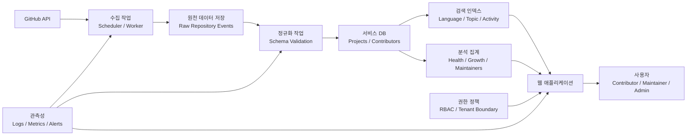

> 한 줄 요약: 오픈소스 인텔리전스 플랫폼은 정적 웹사이트에 검색창을 붙인 형태가 아니라, GitHub 데이터 수집 방식과 권한 모델, 관측성 운영까지 함께 설계해야 하는 데이터 제품에 가깝다.

## 왜 지금 이슈인가

정적 웹사이트는 오픈소스 조직의 첫 화면으로 쓰기 좋다. 빠르고, 배포가 단순하고, 장애가 날 부분도 적다. 문제는 GitHub 저장소, 기여자, 이슈, 릴리스, 토픽, 활동량이 계속 바뀌기 시작할 때 생긴다.

처음에는 홈페이지, 프로젝트 카드, 기여자 소개 정도면 충분해 보인다. 하지만 저장소가 늘고 기여자가 바뀌고 프로젝트 상태가 달라지면, 웹사이트는 현재 상태를 보여주는 창이 아니라 사람이 계속 고쳐야 하는 카탈로그가 된다.

이 주제가 개발자 커뮤니티에서 이야기되는 이유는 프론트엔드만의 문제가 아니기 때문이다. 겉으로는 사이트 개편처럼 보이지만, 실제로는 이런 질문이 따라온다.

- GitHub를 런타임 의존성으로 둘 것인가, 데이터 소스로 볼 것인가
- API 호출 실패와 rate limit을 어디서 흡수할 것인가
- 기여자와 저장소의 관계를 어떤 스키마로 보관할 것인가
- 검색과 분석을 화면 기능으로 볼 것인가, 데이터 모델의 결과로 볼 것인가
- 조직 밖 기여자에게 어디까지 데이터를 보여줄 것인가

이 질문은 오픈소스 포털에만 해당하지 않는다. 내부 개발자 포털, 플랫폼 엔지니어링 대시보드, AI 에이전트용 코드 인덱스, 운영 지표 통합 화면도 비슷한 압력을 받는다. 처음에는 정적 목록으로 시작하지만, 어느 시점부터는 데이터 수집, 정규화, 권한, 관측성, 재처리 흐름이 없는 화면이 운영 리스크가 된다.

## 커뮤니티에서 갈리는 지점

### GitHub를 CMS처럼 쓸 것인가, 데이터 소스로 볼 것인가?

가장 쉬운 방식은 페이지 요청 시 GitHub API를 호출하는 것이다. 저장소 목록을 가져오고, 스타 수와 언어 정보를 보여주고, 기여자 정보도 붙인다. 저장소가 적고 트래픽이 낮다면 이 방식은 꽤 오래 버틴다.

하지만 이 구조에서는 사용자가 페이지를 볼 때마다 외부 API 상태가 함께 드러난다. GitHub 응답이 느리면 화면도 느려지고, rate limit에 걸리면 핵심 페이지가 깨질 수 있다. 외부 서비스 장애가 곧 내 서비스 장애가 되는 구조다.

선정 글감이 제안하는 방향은 GitHub를 직접 렌더링 의존성으로 두지 않는 것이다. GitHub는 원천 데이터로 보고, 서비스는 별도 저장소에 필요한 형태로 적재한 데이터를 제공한다. 이것은 단순히 캐시를 하나 더 두는 문제가 아니다. 웹사이트가 데이터 제품으로 바뀌는 지점이다.

### 데이터 파이프라인은 보이지 않을 때 더 위험하다

보조 레퍼런스인 DEV Community의 데이터 파이프라인 글은 이 문제를 다른 각도에서 설명한다. 정상적인 파이프라인은 거의 눈에 띄지 않는다. 대시보드는 갱신되고, 모델은 새 입력을 받고, 하위 애플리케이션은 기대한 대로 움직인다.

그래서 작은 스키마 변경, 예상보다 큰 데이터 증가, 상위 작업 지연이 뒤늦게 큰 장애처럼 보인다. 원인은 위쪽에 있는데 증상은 아래쪽 BI, 검색, 추천, 리포트에서 발견된다.

오픈소스 인텔리전스 플랫폼도 마찬가지다. GitHub에서 저장소 설명 필드가 비거나, 토픽 표기가 흔들리거나, contributor 식별 기준이 바뀌면 화면 문제처럼 보일 수 있다. 하지만 실제 장애 지점은 수집, 정규화, 검증, 인덱싱 중 하나일 가능성이 크다.

### 관측성을 모으면 권한 문제가 따라온다

Grafana Cloud의 접근 제어 사례는 또 다른 축을 보여준다. 여러 시스템의 메트릭, 로그, 비즈니스 지표, 고객별 데이터를 한곳에 모으면 상관관계 분석은 쉬워진다. 대신 누가 어떤 데이터를 볼 수 있는지 관리해야 한다.

오픈소스 인텔리전스 플랫폼도 비슷하다. 공개 저장소 데이터만 다룬다면 단순해 보이지만, 실제 운영 화면에는 관리자 메모, 프로젝트 상태 평가, 리뷰 우선순위, 멘토링 대상, 보안 관련 이슈 분류 같은 민감한 정보가 들어올 수 있다.

공개 데이터와 운영 데이터가 같은 플랫폼에 섞이는 순간, 검색 품질보다 먼저 권한 경계를 설계해야 한다. 모든 데이터를 모은 단일 화면은 편하지만, 모든 사람이 같은 화면을 보면 안 되는 시점이 온다.

## 아키텍처 관점에서 볼 점

### 오픈소스 인텔리전스 플랫폼 아키텍처는 어떻게 달라져야 할까?

정적 웹사이트의 기본 흐름은 단순하다. 마크다운이나 JSON 파일을 빌드 시점에 읽고, HTML을 만들어 배포한다. 반면 오픈소스 인텔리전스 플랫폼은 데이터 변경과 사용자 조회를 분리해야 한다.

이 구조에서 핵심은 수집과 조회의 분리다. 사용자가 페이지를 열 때 GitHub를 다시 뒤지는 것이 아니라, 이미 검증된 내부 데이터를 읽는다. GitHub 장애와 사용자 경험 사이에 완충 구간을 두는 방식이다.

다만 데이터베이스를 넣는 순간 새로운 책임이 생긴다. 동기화 실패, 오래된 데이터, 중복 레코드, 인덱스 불일치, 권한 누락, 재처리 비용을 감당해야 한다. 정적 사이트의 단순함을 버리고 얻는 것은 확장성이고, 잃는 것은 운영 부담이다.

### 검색은 UI가 아니라 스키마의 결과다

선정 글감에서 눈에 띄는 점은 검색을 검색창 문제가 아니라 데이터 구조 문제로 본다는 것이다. 저장소 이름 검색은 쉽다. 언어, 토픽, 관리자, 활동성, 기여 기회, 프로젝트 건강도를 조합해 찾으려면 모델이 달라져야 한다.

예를 들어 프로젝트 건강도를 보여주려면 최소한 이런 데이터가 필요하다.

| 질문 | 필요한 데이터 | 실패하기 쉬운 지점 |
|---|---|---|
| 어떤 저장소가 활발한가 | 커밋, PR, 이슈, 릴리스 시점 | 단순 커밋 수가 활동 품질을 대체함 |
| 기여자가 몰리는 프로젝트는 어디인가 | contributor, PR author, reviewer 관계 | 봇 계정과 실제 기여자 구분 실패 |
| 관리자가 부족한 프로젝트는 무엇인가 | maintainer 수, 리뷰 지연, 미응답 이슈 | 공개 API만으로 맥락 부족 |
| 입문자가 접근하기 쉬운 이슈는 무엇인가 | 라벨, 난이도, 최근 응답 | 라벨 운영이 일관되지 않음 |

검색 품질은 인덱스 엔진만으로 나오지 않는다. 원천 데이터의 의미를 정리하고, 누락과 예외를 어떻게 처리할지 정해야 한다. GitHub 토픽 하나를 그대로 믿을지, 내부 분류 체계를 별도로 둘지도 아키텍처 결정이다.

### 데이터 신선도와 성능은 서로 당긴다

라이브 API 호출은 신선하지만 느리고 불안정하다. 저장된 데이터는 빠르지만 낡을 수 있다. 캐시는 빠르지만 무효화가 어렵다. 이 긴장을 숨기면 장애가 났을 때 설명할 방법이 없다.

현실적인 선택지는 데이터별 신선도 목표를 다르게 두는 것이다.

- 저장소 이름, 설명, 기본 언어: 몇 시간 단위 갱신 허용
- 스타, 포크 수: 실시간보다 추세가 더 유용할 수 있음
- 보안 경고, 취약한 의존성: 지연 허용 범위를 짧게 잡아야 함
- 기여자 랭킹: 일 단위 집계가 더 안정적일 수 있음
- 관리자용 운영 메모: GitHub가 아니라 내부 DB를 원천으로 둬야 함

모든 데이터를 실시간으로 만들려 하면 비용과 장애 면적이 커진다. 반대로 모든 데이터를 배치로 밀면 사용자가 믿기 어려운 화면이 된다. 데이터마다 사용 목적을 먼저 나누는 편이 낫다.

## 실무에서 볼 점

### 도입 전에 확인할 조건

정적 사이트를 플랫폼으로 바꾸기 전에 먼저 확인할 것은 기술 스택이 아니다. 운영 질문에 답할 수 있어야 한다.

- 어떤 데이터가 반드시 최신이어야 하는가
- 어떤 데이터는 지연되어도 되는가
- 원천 API 장애 시 화면은 어떻게 동작해야 하는가
- 재수집과 재처리를 누가, 어떤 절차로 실행하는가
- 공개 정보와 내부 운영 정보를 같은 DB에 둘 것인가
- 기여자 식별 기준은 GitHub 계정 하나로 충분한가
- 검색 결과가 틀렸을 때 사용자가 수정 요청을 할 수 있는가

이 질문에 답하지 못한 상태에서 데이터베이스와 검색 엔진부터 붙이면, 화면은 좋아져도 운영은 더 복잡해진다.

### 실패하기 쉬운 지점은 수집보다 경계다

처음 만드는 팀은 대개 GitHub API 수집에 집중한다. 저장소 목록을 가져오고, contributor를 저장하고, 언어 비율을 계산한다. 여기까지는 튜토리얼처럼 보일 수 있다.

어려운 부분은 경계다. 어떤 데이터가 공개되어도 되는지, 어떤 집계가 사람을 부정확하게 평가할 수 있는지, 어떤 운영 정보가 검색에 노출되면 안 되는지를 구분해야 한다.

Grafana Cloud의 접근 제어 사례가 실무적으로 연결되는 이유도 여기에 있다. 관측성 데이터를 한곳에 모으는 순간, 역할별 접근 제어와 프로비저닝 자동화가 필요해진다. 오픈소스 포털도 관리자, 메인테이너, 외부 기여자, 프로그램 멘토가 서로 다른 화면과 데이터를 봐야 할 수 있다.

권한 모델은 나중에 붙이기 어렵다. 검색 인덱스와 캐시에 이미 섞인 데이터를 뒤늦게 분리하려면 구조를 다시 손봐야 한다.

### 운영 리스크는 관측성으로 드러내야 한다

오픈소스 인텔리전스 플랫폼에서 관측해야 할 대상은 웹 요청만이 아니다. 데이터 흐름 자체를 봐야 한다.

- GitHub API 호출 성공률과 rate limit 잔여량
- 수집 작업 지연 시간
- 마지막 성공 동기화 시각
- 스키마 검증 실패 건수
- 검색 인덱스 반영 지연
- 저장소별 데이터 누락률
- 권한 거부 이벤트
- 관리자 수동 수정 이력

이 지표가 없으면 사용자가 틀린 데이터를 보고 알려줄 때까지 장애를 모른다. 데이터 파이프라인 글에서 말한 보이지 않는 취약성이 그대로 재현된다. 화면은 떠 있지만, 플랫폼은 이미 실제 상태와 어긋나 있을 수 있다.

### 대안은 무엇인가?

모든 조직이 바로 데이터 플랫폼을 만들 필요는 없다. 저장소가 적고 업데이트가 드문 조직이라면 정적 생성(Static Site Generation)과 주기적 빌드만으로 충분하다.

| 선택지 | 어울리는 상황 | 감수할 점 |
|---|---|---|
| 완전 정적 사이트 | 저장소 수가 적고 변경이 드묾 | 수동 관리 부담 |
| 빌드 시점 GitHub 수집 | 하루 단위 갱신이면 충분함 | 빌드 실패가 배포 실패로 이어짐 |
| 서버 사이드 API 호출 | 데이터가 작고 실시간성이 필요함 | 외부 API 장애에 취약 |
| DB 기반 동기화 | 검색, 분석, 권한, 이력 관리가 필요함 | 운영 복잡도 증가 |
| 이벤트 기반 파이프라인 | 변경량이 많고 자동화가 핵심임 | 설계와 관측성 비용 증가 |

도입 기준은 멋진 아키텍처가 아니라 반복되는 불편이다. 사람이 계속 같은 데이터를 고치고 있다면 자동화할 때다. 페이지가 느려지고 외부 API 상태에 흔들린다면 저장 계층을 둘 때다. 검색 조건이 늘어나고 분석 질문이 반복된다면 스키마와 인덱스를 설계할 때다.

## 정리

오픈소스 인텔리전스 플랫폼의 본질은 더 많은 페이지를 만드는 데 있지 않다. 커뮤니티 활동을 데이터로 받아들이고, 그 데이터를 신뢰 가능한 흐름으로 바꾼 뒤, 역할에 맞게 보여주는 일에 가깝다.

정적 웹사이트에서 출발하는 것은 자연스럽다. 다만 GitHub가 CMS처럼 쓰이고, 운영 판단이 수동 편집에 의존하고, 검색과 분석 요구가 늘어난다면 이미 다른 문제로 넘어간 것이다.

지금 운영 중인 개발자 포털이나 오픈소스 사이트가 있다면, 화면에 보이는 핵심 데이터 10개를 적고 각각의 원천, 갱신 주기, 실패 시 동작, 접근 권한을 표시해보자. 그 표를 채우기 어렵다면 문제는 UI가 아니라 데이터 아키텍처에 있다.

## 참고 자료

- [선정 글감] [When a Static Website Isn’t Enough: Building an Open Source Intelligence Platform](https://dev.to/tarunya/when-a-static-website-isnt-enough-building-an-open-source-intelligence-platform-5e5o) — DEV Community
- [관련] [Your Data Pipeline Is Probably More Fragile Than You Think](https://dev.to/sampada_sharma_842c114249/your-data-pipeline-is-probably-more-fragile-than-you-think-3bc9) — DEV Community
- [관련] [How to scale access control in Grafana Cloud](https://grafana.com/blog/how-to-scale-access-control-in-grafana-cloud/) — Grafana Blog