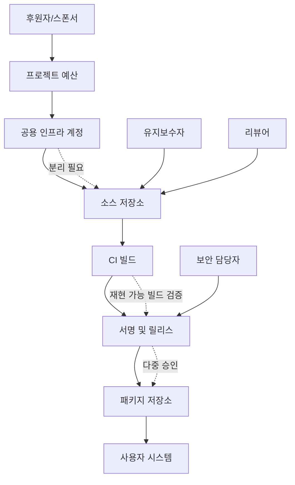

> 한 줄 요약: 오픈소스 보안과 공급망 보안은 후원금을 얼마나 모으느냐보다 권한, 리뷰, 배포 경로를 어떻게 나누느냐에 달려 있다. 돈은 프로젝트를 살릴 수 있지만, 통제권 설계가 없으면 위험을 빠르게 키운다.

## 왜 지금 이슈인가

오픈소스 후원은 대체로 좋은 일처럼 보인다. 유지보수자는 시간을 벌고, 사용자는 더 안정적인 소프트웨어를 기대한다. 문제는 후원이 단순한 결제 링크로 끝나지 않는다는 데 있다. 프로젝트 운영권, 릴리스 권한, 인프라 접근권과 쉽게 얽힌다.

Yorick Peterse의 글은 제목 그대로 오픈소스 소프트웨어에 돈을 넣되 프로젝트를 망가뜨리지 않는 방법을 묻는다. 이 질문이 GitHub와 개발자 커뮤니티에서 반복되는 이유는 분명하다. 오픈소스는 이제 취미 코드 저장소에 머물지 않는다. 회사 제품, 리눅스 배포판, 패키지 저장소, 게임 엔진, 클라우드 인프라 안에 들어가 있다.

후원이 들어오면 이런 질문이 바로 따라온다.

- 누가 돈을 받는가
- 누가 우선순위를 정하는가
- 누가 릴리스 버튼을 누르는가
- 누가 저장소와 패키지 저장소의 관리자 권한을 갖는가
- 후원자의 요구가 사용자 안전보다 앞설 수 있는가

OpenMandriva 사례는 이 질문을 보안 사고 쪽으로 끌고 간다. 프로젝트 측 설명에 따르면 핵심 저장소 일부를 개인이 통제하는 사설 OneDev 인스턴스로 옮기거나 미러링하자는 제안이 있었다. 이후 내부 갈등 뒤 남아 있던 관리자 권한으로 GitHub 작업물이 삭제됐고, Cooker 저장소에는 빈 패키지가 올라가 GNOME과 COSMIC 패키지를 대체하는 상황이 벌어졌다고 한다.

이 사례에서 중요한 건 특정 인물의 선악이 아니다. 실무에서 따져볼 질문은 따로 있다. 프로젝트가 누군가를 계속 믿어야만 굴러가는 구조였는가. 아니면 신뢰가 깨져도 피해 범위를 제한할 수 있는 구조였는가.

## 커뮤니티에서 갈리는 지점

오픈소스 자금 조달을 둘러싼 논쟁은 크게 두 방향으로 갈린다.

한쪽은 유지보수자의 번아웃을 줄이려면 돈이 필요하다고 본다. 현실적인 주장이다. 리뷰, 이슈 대응, 릴리스, 보안 패치, 문서 정리는 눈에 잘 띄지 않지만 사용자에게 직접 영향을 준다. 돈이 없으면 이 모든 일이 느려진다.

다른 한쪽은 돈이 들어오는 순간 프로젝트의 독립성이 흔들릴 수 있다고 본다. 후원자가 원하는 기능이 우선순위를 바꾸고, 특정 회사의 사용 사례가 일반 사용자의 요구를 밀어낼 수 있다. 더 나쁜 경우에는 인프라 비용을 대신 내는 사람이 자연스럽게 운영권을 가져간다.

Fenris Creations가 EVE Online의 Carbon 엔진을 오픈소스로 공개한 사례는 다른 면을 보여준다. 공개 이유 중 하나로 코드 검토 가능성과 커뮤니티 신뢰를 들었고, 실제로 커뮤니티에서 보안 수정 PR이 들어오기 시작했다. 여기서 공개는 단순한 마케팅이 아니다. 코드를 열어 외부 검증 가능성을 높이는 방식이다.

다만 공개가 곧 건강한 거버넌스는 아니다. 저장소가 열려 있어도 릴리스 권한, 보안 취약점 대응 절차, 리뷰 책임, 상표권, 후원금 수령 구조가 닫혀 있으면 사용자는 여전히 내부 결정을 믿어야 한다.

Flathub의 LLM 생성 제출 제한 논쟁도 같은 축에 있다. Flathub 리뷰어는 앱 매니페스트의 권한 최소화, 소스 빌드, 아키텍처별 빌드, 메타데이터 검증, 커밋 고정, 샌드박스 예외 검토 같은 일을 한다. LLM으로 만든 제출물이 늘어나면 제출 비용은 낮아지지만 리뷰 비용은 올라간다.

커뮤니티가 갈리는 지점은 기술 자체보다 비용 배분이다.

| 쟁점 | 기대 | 우려 |
|---|---|---|
| 오픈소스 후원 | 유지보수 지속 가능성 | 후원자 중심 우선순위 |
| 코드 공개 | 검토 가능성, 신뢰 | 공개만 하고 운영은 불투명 |
| 개인 인프라 지원 | 빠른 실행, 비용 절감 | 단일 관리자 리스크 |
| AI 생성 PR/패키징 | 제출 속도 향상 | 리뷰 큐 오염, 보안 검증 부담 |
| 패키지 저장소 자동화 | 배포 효율 | 잘못된 권한 전파 |

이런 상황에서는 좋은 의도도 리스크를 만든다. 누군가 서버를 제공하고, 빌드 파이프라인을 정리하고, 패키지 배포를 대신 맡아주면 당장은 편하다. 하지만 그 사람이 떠났을 때 남는 것이 문서화된 절차인지, 개인 계정에 묶인 권한인지가 프로젝트의 체력을 가른다.

## 아키텍처 관점에서 볼 점

오픈소스 공급망 보안은 사람을 믿지 말자는 얘기가 아니다. 사람을 믿더라도 실수와 갈등이 시스템 전체로 번지지 않게 설계하자는 쪽에 가깝다.

특히 후원, 저장소, CI/CD, 패키지 배포가 한 사람 또는 한 조직에 묶이면 장애 격리가 어려워진다. 돈을 내는 주체가 인프라를 제공하고, 그 인프라가 빌드 산출물을 만들고, 같은 계정이 릴리스까지 할 수 있다면 기술적으로는 단순하다. 운영상으로는 위험하다.

이 흐름에서 봐야 할 지점은 네 가지다.

### 오픈소스 권한관리는 계정이 아니라 역할로 봐야 한다

저장소 관리자, CI 관리자, 릴리스 승인자, 패키지 서명자는 같은 사람이 맡을 수도 있다. 작은 프로젝트에서는 어쩔 수 없는 경우가 많다. 그래도 역할을 문서로 나눠두면 문제가 생겼을 때 어디를 끊어야 하는지 보인다.

OpenMandriva 사례처럼 저장소와 패키지 저장소 양쪽에 남은 권한이 있으면 소스 코드 훼손과 사용자 환경 훼손이 동시에 일어날 수 있다. 권한 회수 체크리스트가 없으면 내부 갈등이 기술 사고로 번진다.

### 공급망 보안은 리뷰 큐의 품질 문제다

Flathub 논쟁에서 눈에 띄는 부분은 AI 생성 코드 자체보다 리뷰 병목이다. 제출자가 PR 템플릿을 지키지 않고, 권한 요청 근거를 설명하지 않고, 빌드 검증을 생략하면 리뷰어는 코드를 보는 대신 제출물을 수습해야 한다.

보안 리뷰는 무한 자원이 아니다. 자동화가 들어와도 검증해야 할 사람이 줄지 않으면 병목은 뒤로 밀릴 뿐이다.

### 공개 저장소는 신뢰의 시작이지 끝이 아니다

Carbon 엔진 공개처럼 코드를 열면 외부인이 취약점을 보고 고칠 수 있다. 분명한 장점이다. 하지만 실무에서는 다음 질문까지 가야 한다.

- 외부 보안 PR은 누가 triage 하는가
- 취약점 보고는 공개 이슈로 받는가, 비공개 채널로 받는가
- 릴리스 노트와 보안 공지는 누가 작성하는가
- 배포 산출물은 소스와 연결해 검증 가능한가
- 포크가 생겼을 때 상표와 생태계 혼란을 어떻게 다루는가

코드 공개만으로 사용자 신뢰가 완성되지는 않는다. 사용자가 설치하는 것은 저장소의 텍스트가 아니라 빌드된 산출물이다.

### 돈의 흐름과 배포 권한은 분리해야 한다

후원자가 운영 인프라를 직접 제공하는 일도 있다. 늘 나쁘다고 볼 일은 아니다. 다만 후원 중단, 조직 변경, 개인 이탈이 생겨도 프로젝트가 독립적으로 빌드와 배포를 이어갈 수 있어야 한다.

실무적으로는 최소한 다음 분리가 필요하다.

- 후원금 수령 계정과 소스 저장소 관리자 계정 분리
- CI 비밀값(secret) 접근 권한 제한
- 릴리스 서명 키 다중 보관
- 패키지 저장소 배포 권한의 정기 감사
- 관리자 퇴출 또는 이탈 시 즉시 실행할 권한 회수 절차

## 실무에서 볼 점

오픈소스 프로젝트를 회사 제품에 도입하거나, 사내에서 오픈소스를 공개하려 한다면 먼저 별표 수나 후원 규모보다 운영 구조를 봐야 한다.

### 도입 전에 확인할 조건

첫째, 릴리스 경로가 설명돼 있어야 한다. GitHub 태그가 곧 배포인지, 별도 CI가 산출물을 만드는지, 패키지 저장소에 누가 올리는지 확인해야 한다. 설치 경로가 여러 개라면 어느 경로가 공식인지도 봐야 한다.

둘째, 권한자가 한 명뿐인지 확인해야 한다. 작은 프로젝트에서 단일 유지보수자는 흔하다. 문제는 단일 유지보수자라는 사실이 아니라, 그 상태를 사용자가 알 수 없고 백업 절차도 없다는 데 있다.

셋째, 보안 신고 채널이 있어야 한다. SECURITY.md, 취약점 보고 이메일, GitHub Security Advisory 사용 여부는 프로젝트 성숙도를 보여준다. 없다고 바로 배제할 필요는 없지만, 핵심 의존성이라면 내부에서 보완책을 마련해야 한다.

넷째, 후원 모델이 우선순위에 어떤 영향을 주는지 봐야 한다. 특정 벤더가 강하게 후원하는 프로젝트라면 해당 벤더의 요구가 로드맵에 반영될 가능성이 크다. 제품 방향과 맞으면 장점이고, 다르면 잠재 리스크다.

### 실패하기 쉬운 지점

가장 흔한 실패는 커뮤니티 운영을 코드 품질 문제로만 보는 것이다. 테스트 커버리지가 높아도 릴리스 권한이 불투명하면 공급망 리스크는 남는다. 반대로 거버넌스 문서가 훌륭해도 리뷰어가 부족하면 보안 패치가 밀린다.

AI 기반 제출 자동화도 비슷하다. PR을 많이 만들 수 있다는 사실만으로는 가치가 없다. 프로젝트가 요구하는 권한 최소화, 빌드 재현성, 메타데이터 검증을 통과할 때만 가치가 생긴다. 자동화가 리뷰어의 시간을 빼앗는다면 생산성 도구가 아니라 큐를 오염시키는 입력원이 된다.

현업에서 비슷한 고민을 하다 보면 가장 어려운 부분은 기준을 만드는 일이다. 좋은 기여와 부담스러운 기여를 구분하는 규칙이 없으면 리뷰어는 매번 감정노동을 하게 된다. 그래서 기술 프로젝트에도 제출 정책, 권한 정책, 릴리스 정책이 필요하다.

### 현실적인 대안

모든 프로젝트가 재단을 만들거나 복잡한 거버넌스를 갖출 수는 없다. 대신 작은 프로젝트도 적용 가능한 단계가 있다.

| 단계 | 할 일 | 효과 |
|---|---|---|
| 1 | 관리자 목록과 역할 공개 | 단일 장애점 식별 |
| 2 | 릴리스 절차 문서화 | 배포 재현성 확보 |
| 3 | 후원금 사용 범위 공개 | 후원자 영향력 투명화 |
| 4 | 보안 신고 채널 마련 | 취약점 대응 시간 단축 |
| 5 | 권한 회수 체크리스트 작성 | 갈등과 이탈 시 피해 제한 |
| 6 | 자동 제출물 기준 강화 | 리뷰 큐 보호 |

회사 입장에서는 내부 미러와 고정 버전 정책도 필요하다. 핵심 시스템이 외부 패키지 저장소의 최신 버전을 바로 따라가면 프로젝트 내부 사고가 곧 운영 사고가 된다. 롤링 브랜치나 개발 채널을 쓰는 경우에는 특히 격리된 테스트 환경을 거쳐야 한다.

## 정리

오픈소스 후원은 프로젝트를 살리는 도구가 될 수 있다. 코드 공개도 신뢰를 만드는 좋은 출발점이다. 하지만 둘 다 권한 설계, 리뷰 체계, 배포 경로 검증 없이 들어오면 공급망 리스크를 키운다.

지금 확인할 것은 하나다. 우리 서비스가 의존하는 오픈소스의 릴리스 경로를 한 번 그려보는 일이다. 소스 저장소에서 사용자 시스템까지 누가 어떤 권한으로 코드를 움직이는지 보이면, 후원할 프로젝트와 먼저 보강할 지점이 드러난다.

## 참고 자료

- [선정 글감] [Funding open-source software without compromising it](https://yorickpeterse.com/articles/funding-open-source-software-without-compromising-it/) (Lobsters)
- [관련] [OpenMandriva Says Former Contributor Sabotaged Its Repositories](https://linuxiac.com/openmandriva-says-former-contributor-sabotaged-its-repositories/) (Lobsters)
- [관련] [Eve Online's Carbon engine is now open source: Fenris Creations explains why](https://www.gamesindustry.biz/eve-onlines-carbon-engine-is-now-open-source-fenris-creations-explains-why) (Lobsters)
- [관련] [Democratizing Abandonware](https://geopjr.dev/blog/democratizing-abandonware) (Lobsters)