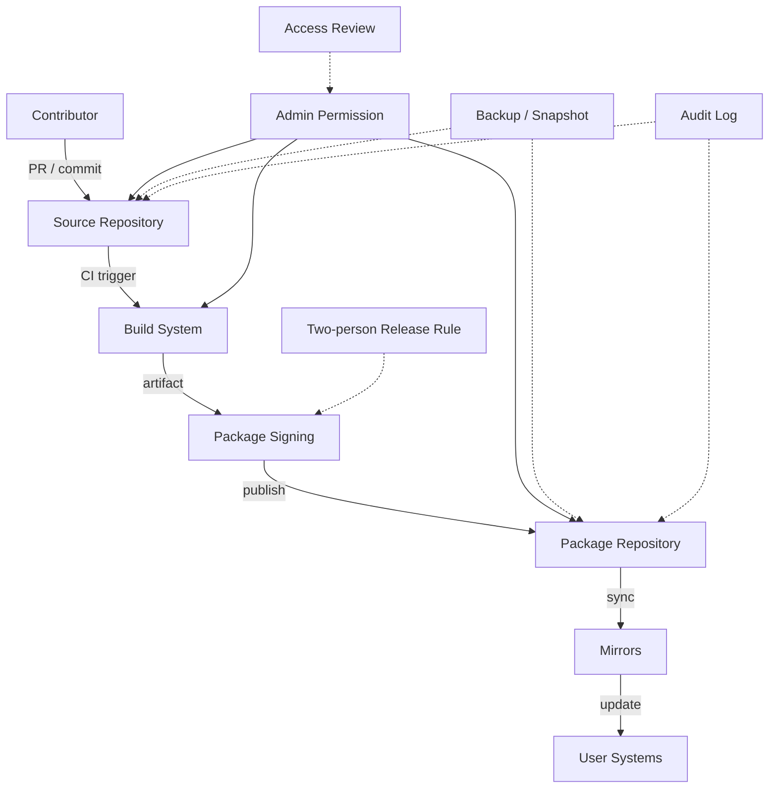

> 한 줄 요약: 오픈소스 공급망 보안은 외부 공격만의 문제가 아니다. GitHub 권한, 패키지 저장소 운영, 릴리스 경계를 사람 사이의 갈등까지 버티도록 나눠야 한다.

## 왜 지금 이슈인가

OpenMandriva 사건이 불편한 이유는 기술적으로 낯선 공격이라서가 아니다. 오히려 너무 흔한 운영 구조에서 벌어질 수 있는 일이라서 더 찜찜하다.

한 기여자가 사설 OneDev 인스턴스로 저장소를 옮기거나 미러링하자고 제안했고, 일부 팀원은 핵심 저장소가 개인 인프라에 묶이는 상황을 꺼렸다. 이후 내부 갈등과 이탈이 이어졌고, OpenMandriva 측은 남아 있던 관리자 권한으로 GitHub 저장소 일부가 삭제되고 Cooker 저장소에 빈 패키지가 배포됐다고 밝혔다.

여기서 문제는 둘로 갈린다.

- 저장소 삭제는 복구 가능한 운영 사고처럼 보일 수 있다.
- 패키지 저장소에 빈 패키지가 올라간 일은 사용자 시스템을 망가뜨릴 수 있는 공급망 사고다.

특히 Cooker는 rolling development branch다. 안정 릴리스보다 빠른 업데이트를 받는 대신 사용자가 더 높은 변동성을 감수하는 영역이다. 그렇다고 임의의 빈 패키지가 GNOME, COSMIC 패키지를 대체해도 되는 실험장은 아니다.

개발자 커뮤니티에서 말이 붙는 이유도 여기에 있다. 오픈소스 프로젝트는 신뢰로 굴러가지만, 배포 파이프라인까지 신뢰만으로 굴러가서는 안 된다. 갈등이 생긴 사람을 미리 의심하자는 뜻이 아니다. 갈등이 생겨도 저장소와 패키지 배포 권한이 자동으로 좁아지는 구조가 있어야 한다는 얘기다.

## 커뮤니티에서 갈리는 지점

이런 사건을 두고 가장 쉬운 해석은 개인 인프라는 위험하고 GitHub 같은 공개 플랫폼은 안전하다는 식이다. 하지만 실제 운영에서는 그 구도가 너무 얇다.

GitHub에 있어도 관리자 권한이 남아 있으면 삭제는 가능하다. 사설 인프라여도 접근 제어, 백업, 감사 로그, 서명된 릴리스, 권한 분리, 복구 절차가 잡혀 있으면 위험을 줄일 수 있다. 플랫폼 이름보다 먼저 봐야 할 것은 권한이 어떻게 생기고, 얼마나 오래 유지되며, 어떤 행위가 리뷰 없이 가능한가다.

커뮤니티에서 갈리는 지점은 대략 이렇게 나뉜다.

| 쟁점 | 한쪽 관점 | 반대쪽 관점 | 실무 판단 |
|---|---|---|---|
| 개인 인프라 | 빠르고 유연하다 | 핵심 자산이 개인에게 묶인다 | 미러는 가능해도 원본 권한은 공동 통제해야 한다 |
| 관리자 권한 | 믿는 기여자에게 맡겨야 한다 | 이탈 시 위험이 크다 | 최소 권한과 만료 정책이 필요하다 |
| rolling 저장소 | 위험을 감수하는 사용자 대상이다 | 그래도 배포 무결성은 지켜야 한다 | 실험성과 파괴적 변경은 별개다 |
| 내부 갈등 공개 | 투명성이 필요하다 | 개인 비난으로 번질 수 있다 | 사건보다 통제 실패를 중심에 둬야 한다 |

반대로 이렇게도 물어야 한다. 모든 기여자에게 강한 통제를 걸면 오픈소스 프로젝트가 제대로 굴러갈까?

쉽지 않다. 작은 프로젝트일수록 권한을 촘촘히 나눌 사람도, 릴리스 엔지니어링을 전담할 사람도 부족하다. 그래서 이 문제를 대기업식 보안 체계를 그대로 들여오자는 결론으로 몰고 가면 현실성이 떨어진다.

대신 기준을 낮춰서라도 반드시 분리해야 할 선이 있다.

코드를 머지할 수 있는 권한, 패키지를 배포할 수 있는 권한, 저장소를 삭제할 수 있는 권한은 같은 권한처럼 다루면 안 된다. 셋 다 maintainer 권한이라는 이름 아래 묶이는 순간, 사람 사이의 갈등이 사용자 시스템으로 번질 수 있다.

## 아키텍처 관점에서 볼 점

오픈소스 배포 파이프라인은 보통 코드 저장소, 빌드 시스템, 패키지 저장소, 미러, 사용자 업데이트 경로로 이어진다. 사고가 나면 사람들은 GitHub repository 삭제에 먼저 반응하지만, 사용자 피해는 대개 패키지 저장소에서 발생한다.

이 흐름에서 위험한 지점은 관리자 권한 하나가 여러 계층을 동시에 건드릴 때다.

소스 저장소를 삭제할 수 있는 사람과 패키지를 publish할 수 있는 사람이 같을 수는 있다. 작은 프로젝트에서는 어쩔 수 없는 경우도 많다. 그렇더라도 위험한 행위마다 브레이크는 걸어야 한다.

예를 들어 패키지 저장소에는 이런 조건을 둘 수 있다.

- 기존 패키지를 빈 패키지로 대체하는 변경은 자동 차단
- 대량 패키지 삭제나 대체는 별도 승인 필요
- stable, testing, rolling 저장소별 publish 권한 분리
- 패키지 서명 키는 개인 계정이 아니라 별도 보안 경계에서 관리
- 저장소 스냅샷을 주기적으로 남기고 복구 시간을 측정
- 관리자 권한은 영구 부여하지 않고 역할 변경 시 회수

Cooker 같은 rolling branch에서는 빠른 업데이트가 장점이다. 그러나 빠르다는 말이 검증을 생략해도 된다는 뜻은 아니다. rolling 저장소는 변경이 잦기 때문에 오히려 이상한 패키지 교체를 탐지할 메타데이터가 많다.

예를 들어 정상적인 GNOME 패키지 묶음이 어느 날 빈 패키지로 대체된다면, 이는 빌드 실패나 의도된 제거와 구분되는 신호다. 패키지 크기, 파일 목록, dependency 변화, maintainer 변경, 서명 주체를 함께 보면 자동 경고를 만들 수 있다.

이런 검사를 꼭 큰 보안 제품처럼 도입해야 하는 것도 아니다. 단순한 정책 몇 개만 있어도 피해 범위는 줄어든다.

- 패키지 파일 수가 0에 가까운데 기존 패키지를 replace하면 publish 보류
- core desktop, kernel, package manager 계층은 별도 보호
- 저장소 삭제 권한은 owner 그룹에서도 제한
- mirror 전환은 문서화된 rollback plan과 함께 진행
- 퇴장한 기여자의 계정과 토큰을 체크리스트로 회수

서킷 브레이커(Circuit Breaker)는 서비스 장애에만 쓰는 개념이 아니다. 배포 파이프라인에서도 특정 조건이 걸리면 자동으로 멈추는 장치가 필요하다.

## 실무에서 볼 점

현업에서 비슷한 고민을 하다 보면 접근 제어 논의가 자주 사람 문제로 흐른다. 누구를 믿을 수 있느냐, 누가 더 오래 기여했느냐, 누가 프로젝트를 잘 아느냐 같은 이야기다.

하지만 운영 설계의 목적은 좋은 사람을 고르는 데 있지 않다. 좋은 사람이 실수하거나, 관계가 틀어지거나, 계정이 탈취되거나, 판단이 흔들릴 때도 피해가 제한되게 만드는 쪽에 가깝다.

도입 전에 확인할 조건은 꽤 구체적이어야 한다.

첫째, 프로젝트의 crown jewel이 무엇인지 정해야 한다. 모든 저장소를 같은 수준으로 보호할 수는 없다. 사용자 시스템을 직접 바꾸는 패키지 저장소, 릴리스 서명 키, 설치 스크립트, 업데이트 메타데이터가 우선순위다.

둘째, 권한 회수 흐름이 있어야 한다. 팀에서 나간 뒤 며칠 안에 회수한다는 식의 느슨한 문장으로는 부족하다. GitHub org, CI secret, package registry token, mirror server, DNS, Matrix/Discord 관리자 권한까지 목록으로 관리해야 한다.

셋째, 백업은 존재 여부보다 복구 가능성으로 봐야 한다. 저장소 백업이 있어도 패키지 저장소의 특정 시점 상태를 재현하지 못하면 사용자 피해를 줄이기 어렵다. 복구 리허설 없이 백업이 있다고 말하는 것은 거의 운영 희망사항에 가깝다.

넷째, 실험 저장소와 사용자 업데이트 경로를 분리해야 한다. rolling branch라고 해서 모든 보호 장치를 낮추면 안 된다. rolling은 빠른 피드백을 위한 채널이지, 임의 배포를 허용하는 예외 구역이 아니다.

다섯째, 공개 커뮤니케이션의 초점을 사람에서 시스템으로 옮겨야 한다. 사건의 책임 소재를 밝히는 일과 재발 방지 설계를 설명하는 일은 다르다. 사용자와 기여자는 누가 나쁜 사람이었는지보다, 다음번에는 어떤 행위가 막히는지를 알고 싶어 한다.

이 주제의 어려움은 보안 원칙이 대부분 맞는 말이라는 데 있다. 최소 권한, 감사 로그, 2인 승인, 서명, 백업, 키 관리는 모두 필요하다. 그런데 작은 오픈소스 프로젝트에 전부 요구하면 아무도 릴리스를 못 한다.

현실적인 순서는 다음에 가깝다.

| 우선순위 | 먼저 할 일 | 이유 |
|---|---|---|
| 1 | 패키지 publish 권한과 저장소 admin 권한 분리 | 사용자 피해로 바로 이어지는 경로를 줄인다 |
| 2 | 릴리스/패키지 저장소 스냅샷 자동화 | 사고 후 복구 시간을 줄인다 |
| 3 | 퇴장자 권한 회수 체크리스트 | 갈등 상황에서 빠뜨리기 쉽다 |
| 4 | 대량 삭제와 대체 감지 규칙 | 단순하지만 효과가 크다 |
| 5 | 서명 키와 CI secret 분리 | 계정 탈취와 내부 사고 모두에 대비한다 |

과한 대응도 피해야 한다. 모든 변경에 2인 승인을 강제하면 유지보수 속도가 급격히 떨어질 수 있다. 모든 인프라를 특정 SaaS로 몰아넣으면 벤더 장애나 계정 정지에 취약해진다. 모든 권한을 중앙 운영팀에만 두면 커뮤니티 기여자의 자율성이 줄어든다.

좋은 설계는 보안 원칙을 많이 붙인 설계가 아니다. 가장 파괴적인 행위 몇 개를 골라, 그 행위만큼은 혼자서 즉시 실행할 수 없게 만드는 설계다.

## 정리

OpenMandriva 사건을 개인 인프라 대 GitHub의 구도로만 읽으면 남는 게 적다. 더 큰 질문은 따로 있다. 우리 프로젝트에서 한 사람의 관리자 권한이 사용자 시스템까지 도달하는 데 몇 단계가 필요한가.

오픈소스 공급망 보안은 외부 공격자를 막는 일에 그치지 않는다. 내부 갈등, 계정 방치, 권한 회수 실패, 패키지 저장소 검증 부재까지 포함한다. 신뢰를 없애자는 얘기가 아니다. 신뢰가 깨지는 순간에도 배포 파이프라인이 바로 무너지지 않게 만들자는 얘기다.

당장 확인할 것은 하나다. 핵심 저장소와 패키지 저장소에서 대량 삭제, 빈 패키지 대체, 릴리스 서명 키 접근이 단일 계정으로 가능한지 점검해보자. 가능하다면 플랫폼 이전보다 권한 경계부터 다시 그리는 편이 먼저다.

## 참고 자료

- [선정 글감] [OpenMandriva Says Former Contributor Sabotaged Its Repositories](https://linuxiac.com/openmandriva-says-former-contributor-sabotaged-its-repositories/) (Linuxiac/Lobsters)