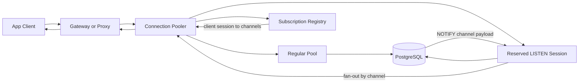

> 한 줄 요약: PostgreSQL LISTEN/NOTIFY는 가벼운 이벤트 신호에는 잘 맞지만, 커넥션 풀링과 만나면 세션 상태 문제가 바로 드러난다. 풀러가 이 기능을 지원하려면 세션 소유권, 장애 격리, 백프레셔까지 설계해야 한다.

## 왜 지금 이슈인가

PostgreSQL LISTEN/NOTIFY, 커넥션 풀링, 멀티테넌트 데이터베이스를 같이 쓰는 팀은 대개 같은 질문에 도착한다.

애플리케이션 연결 수는 늘어나는데 Postgres 백엔드 커넥션은 무한히 늘릴 수 없다. 그래서 PgBouncer 같은 풀러를 붙인다. 그런데 어느 날 알림, 캐시 무효화, 작업 큐 트리거, 실시간 화면 갱신에 쓰던 `LISTEN/NOTIFY`가 풀링 모드에서 흔들린다.

문제는 기능 자체보다 위치에 있다. `LISTEN`은 현재 세션을 특정 채널의 리스너로 등록한다. 세션이 끝나면 등록도 사라진다. 반면 트랜잭션 풀링(Transaction Pooling)은 클라이언트가 특정 서버 세션을 계속 소유하지 않는다는 전제로 성능을 얻는다.

Multigres가 2026년 7월에 `LISTEN/NOTIFY`를 풀링된 커넥션 위에서 지원한다고 쓴 글이 눈에 띄는 이유도 여기에 있다. 겉으로는 작은 호환성 기능처럼 보인다. 실제로는 Postgres를 수평 확장 가능한 데이터베이스처럼 운영할 때 표준 Postgres의 사용감을 어디까지 유지할 수 있느냐는 문제다.

## 커뮤니티에서 갈리는 지점

### PostgreSQL LISTEN/NOTIFY를 이벤트 버스로 써도 될까?

찬성 쪽 논리는 단순하다. 데이터가 이미 Postgres에 있고, 변경을 알리는 신호도 같은 트랜잭션 경계 안에서 발생한다. 별도 브로커를 운영하지 않아도 된다. 캐시 무효화나 가벼운 워커 깨우기에는 꽤 매력적이다.

반대 쪽은 한계가 분명하다고 본다. `NOTIFY`는 메시지 저장소가 아니다. PostgreSQL 문서 기준으로 알림은 커밋 뒤에 전달되고, 기본 설정에서 payload는 8000바이트보다 작아야 한다. 큐가 꽉 차면 `NOTIFY`를 실행한 트랜잭션이 커밋 시점에 실패할 수도 있다.

판단 기준은 복구 가능성이다. 알림이 얼마나 빨리 오느냐보다, 놓쳤을 때 상태를 다시 맞출 수 있느냐가 먼저다.

| 용도 | LISTEN/NOTIFY 적합도 | 이유 |
|---|---:|---|
| 캐시 무효화 | 높음 | 놓쳐도 DB를 다시 읽어 회복 가능 |
| 워커 깨우기 | 중간 | 실제 작업은 테이블에 저장해야 안전 |
| 채팅 메시지 전달 | 낮음 | 재전송, 순서, 저장, 구독자 상태가 필요 |
| 결제/정산 이벤트 | 낮음 | 감사 로그와 재처리 경로가 필요 |
| 관리 콘솔 갱신 | 높음 | 최신 상태를 다시 조회하면 됨 |

현업에서 비슷한 고민을 하다 보면 `NOTIFY`에 JSON 전체를 넣고 싶어지는 순간이 온다. 그때부터 설계가 흔들린다. payload에는 이벤트 본문이 아니라 레코드 키, 버전, 테넌트 범위 같은 최소 정보만 넣는 쪽이 안전하다.

### 커넥션 풀링에서 LISTEN은 왜 특별할까?

PgBouncer 문서의 기능 표를 보면 차이가 선명하다. 세션 풀링(Session Pooling)은 `LISTEN`을 지원하지만, 트랜잭션 풀링에서는 `LISTEN`이 맞지 않는다. `NOTIFY`는 실행할 수 있어도, 계속 듣고 있어야 하는 리스너는 세션에 묶이기 때문이다.

Multigres가 눈여겨볼 만한 지점은 풀링 모드를 사용자에게 고르게 하지 않는 방향이다. 이전 글에서 Multigres는 연결을 반환할 수 없는 이유를 비트마스크로 추적한다고 설명한다. 트랜잭션, 임시 테이블, COPY, 포털(Portal), `LISTEN` 같은 상태가 남아 있으면 그 연결은 일반 풀로 돌아가지 않는다.

실무적으로도 납득되는 방식이다. 풀러가 빠르려면 커넥션을 빨리 돌려써야 한다. 풀러가 안전하려면 돌려쓰면 안 되는 순간을 알아야 한다. 둘 중 하나를 설정 파일에서 고르는 방식은 단순하지만, 애플리케이션이 조금만 복잡해져도 예외가 늘어난다.

## 아키텍처 관점에서 볼 점

### LISTEN/NOTIFY와 커넥션 풀링 아키텍처는 어떻게 분리해야 할까?

`LISTEN`을 일반 쿼리 커넥션과 같은 풀에서 다루면 설계가 꼬인다. 리스너는 오래 살아 있어야 하고, 풀은 연결을 빠르게 반납받아야 한다. 두 요구가 서로 반대다.

안전한 구조는 리스너를 별도 수명주기로 다루는 것이다. 클라이언트가 `LISTEN channel`을 요청하면 풀러는 그 사실을 클라이언트 세션 상태로 기록하고, 백엔드 Postgres에는 전용 또는 예약된 리스닝 세션을 유지한다. 이후 `NOTIFY`가 오면 풀러가 해당 채널을 구독한 클라이언트로 다시 팬아웃한다.

이 그림에서는 경로와 상태를 따로 봐야 한다.

알림 수신 경로는 일반 쿼리 경로와 다르다. 일반 쿼리는 실행 후 커넥션을 돌려줄 수 있지만, 리스닝 세션은 계속 살아 있어야 한다.

풀러 내부에는 구독 레지스트리(Subscription Registry)가 필요하다. 이 레지스트리는 클라이언트 세션과 채널의 매핑을 들고 있어야 한다. 클라이언트가 끊기거나 `UNLISTEN`을 실행하거나 프록시가 재시작될 때 정리되어야 한다.

장애 복구도 별도의 일이다. Postgres 연결이 끊기면 풀러는 다시 연결한 뒤 필요한 채널을 재등록해야 한다. 이 사이에 발생한 알림은 보장되지 않는다. 알림만 믿지 말고, 재연결 뒤 기준 테이블을 다시 읽는 복구 루틴이 필요하다.

### PostgreSQL NOTIFY의 운영 리스크

`NOTIFY`는 트랜잭션과 같이 움직인다. 트랜잭션 안에서 실행된 알림은 커밋 전까지 전달되지 않는다. 리스닝 세션이 트랜잭션 안에 머물러 있어도 클라이언트로 바로 전달되지 않는다.

같은 트랜잭션에서 같은 채널과 같은 payload로 여러 번 알리면 하나로 접힐 수 있다. 반대로 서로 다른 payload는 별개 알림으로 전달된다. 이 특성은 중복 제거에는 좋지만, 알림을 카운터처럼 쓰는 설계에는 맞지 않는다.

운영에서 특히 조심할 부분은 큐다. PostgreSQL에는 모든 리스닝 세션이 처리하지 못한 알림을 보관하는 큐가 있고, 표준 설치 기준으로 꽤 크지만 무한하지 않다. 오래 열린 트랜잭션이 정리를 막으면 큐 사용량이 올라간다. `pg_notification_queue_usage()`를 관측 지표로 넣어야 하는 이유다.

보안도 따로 봐야 한다. 문서상 알림은 같은 데이터베이스의 리스너에게 전달된다. 멀티테넌트 환경에서는 채널명과 payload를 권한 경계로 착각하면 안 된다. 테넌트 ID, 이메일, 내부 식별자처럼 노출되면 곤란한 값은 그대로 싣지 않는 편이 낫다.

## 실무에서 볼 점

### PostgreSQL LISTEN/NOTIFY 도입 전에 확인할 조건

도입 판단은 기능 선호가 아니라 실패 모드로 해야 한다.

- 알림을 놓쳐도 다음 조회로 복구되는가
- payload 없이 ID만 받아도 동작하는가
- 구독 채널 수가 폭증하지 않는가
- 리스너 재시작 뒤 재동기화 절차가 있는가
- 큐 사용량, 리스너 수, 재연결 횟수를 관측할 수 있는가
- 멀티테넌트 환경에서 채널명과 payload가 민감 정보를 담지 않는가
- 풀러가 `LISTEN` 세션을 일반 트랜잭션 풀과 분리해서 다루는가

이 중 하나라도 애매하면 대안을 검토해야 한다.

| 대안 | 맞는 상황 | 대가 |
|---|---|---|
| Outbox 테이블 + 폴링 | 정확한 재처리와 감사 로그가 필요할 때 | 지연과 폴링 부하 |
| Redis Pub/Sub | 짧은 실시간 신호가 많을 때 | DB 트랜잭션과 원자적으로 묶기 어려움 |
| Redis Streams, Kafka, NATS JetStream | 메시지 보존과 컨슈머 상태가 필요할 때 | 별도 운영 복잡도 |
| Logical Replication | DB 변경 흐름 자체를 읽어야 할 때 | 스키마, 슬롯, 지연 관리 필요 |
| 세션 풀링 | 기존 LISTEN 사용을 그대로 보존해야 할 때 | 커넥션 재사용 효율 하락 |

이런 상황에서는 `LISTEN/NOTIFY`를 이벤트 본체가 아니라 초인종처럼 쓰는 설계가 가장 덜 위험하다. 초인종이 울리면 문 앞에 무엇이 있는지는 테이블에서 확인한다. 초인종 소리를 한 번 놓쳐도 다음 점검 때 따라잡을 수 있어야 한다.

### 풀러를 믿기 전에 테스트해야 할 것

풀러가 `LISTEN/NOTIFY`를 지원한다고 말해도 확인할 항목은 남는다.

트랜잭션 경계부터 본다. `BEGIN` 안에서 `NOTIFY`를 보낸 뒤 롤백했을 때 알림이 없어야 한다. 커밋했을 때만 전달되어야 한다.

재연결도 확인해야 한다. 리스닝 중인 백엔드 커넥션을 끊었을 때 풀러가 다시 `LISTEN`을 등록하는지 봐야 한다. 이때 유실 구간을 어떻게 회복할지도 같이 정해야 한다.

백프레셔 테스트도 필요하다. 리스너가 느려졌을 때 풀러가 메모리를 계속 먹는지, 느린 클라이언트를 끊는지, 채널별로 격리하는지 확인해야 한다. 팬아웃 계층이 생기면 느린 소비자 하나가 전체 알림 경로를 막을 수 있다.

권한 테스트도 빼면 안 된다. 다른 테넌트나 다른 역할이 같은 채널을 들을 수 있는지, payload에 민감 정보가 들어가는지 확인해야 한다. `NOTIFY`는 인증과 권한 설계를 대신해주지 않는다.

## 정리

`LISTEN/NOTIFY`는 작고 날카로운 도구다. Postgres 안에서 변경 신호를 보내는 데에는 좋다. 하지만 커넥션 풀링과 수평 확장이 들어오면 SQL 한 줄로 끝나지 않는다. 세션 상태를 누가 소유하는지, 알림을 누가 다시 배달하는지, 끊긴 동안 무엇을 잃어도 되는지까지 설계해야 한다.

Multigres의 사례는 Postgres 호환성을 표면 API가 아니라 운영 의미론까지 맞추려는 시도로 읽을 수 있다. 실무에서 당장 할 일은 분명하다. 현재 코드베이스에서 `LISTEN`, `NOTIFY`, `pg_notify`를 검색하고, 각 사용처가 초인종인지 메시지 큐인지부터 분류해보면 된다.

## 참고 자료

- [선정 글감] [How Multigres Supports LISTEN/NOTIFY Across Pooled Connections](https://multigres.com/blog/listen-notify) (Multigres)
- [관련] [PostgreSQL NOTIFY 공식 문서](https://www.postgresql.org/docs/current/sql-notify.html) (PostgreSQL)
- [관련] [PostgreSQL LISTEN 공식 문서](https://www.postgresql.org/docs/current/sql-listen.html) (PostgreSQL)
- [관련] [PgBouncer features](https://www.pgbouncer.org/features.html) (PgBouncer)
- [관련] [Pooling without choosing a mode](https://multigres.com/blog/pooling-without-choosing-a-mode) (Multigres)