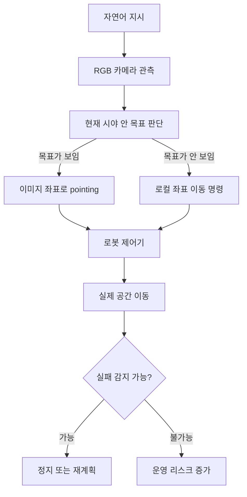

> 한 줄 요약: 로봇 내비게이션 모델 논쟁의 핵심은 성능 수치보다, 단일 RGB 카메라와 시뮬레이션 데이터만으로 물리 세계의 안전 책임을 어디까지 맡길 수 있느냐에 있다.

## 무슨 일이 있었나

Mistral은 2026년 7월 Robostral Navigate를 공개했다. 로봇 내비게이션(robot navigation)을 위한 8B 모델이고, 한 대의 RGB 카메라 이미지와 자연어 지시를 받아 로봇이 공간을 이동하도록 설계됐다.

공개 자료에서 가장 눈에 띈 숫자는 R2R-CE(Room-to-Room in Continuous Environments) 벤치마크였다. Mistral은 Robostral Navigate가 validation unseen 기준 76.6% 성공률을 기록했고, validation seen에서는 79.4%를 기록했다고 밝혔다. 단일 카메라 방식의 기존 최고 성능보다 9.7포인트, 깊이 센서나 여러 카메라를 쓰는 방식보다 4.5포인트 높다는 설명도 붙었다.

확인된 사실은 여기까지다.

- 당사자: Mistral AI
- 제품 범위: 로봇의 자율 내비게이션 모델
- 입력: 단일 RGB 카메라, 자연어 지시
- 제외된 센서: LiDAR, depth sensor, multi-camera 구성
- 학습 방식: 약 6,000개 시뮬레이션 장면, 약 400,000개 trajectory
- 효율화: prefix-caching 기반 학습으로 토큰 사용량 22배 감소 주장
- 후처리: CISPO 온라인 강화학습(Reinforcement Learning)으로 성공률 3.2% 개선 주장

여기서부터는 해석이 섞인다. 이 모델을 사무실, 물류, 접객, 배송 환경에 곧바로 쓸 수 있다는 기대는 벤치마크만으로 확정하기 어렵다. 공개 자료만으로는 실사용 배포의 장애율, 사람과 충돌할 가능성, 조명과 반사, 카메라 오염, 네트워크 지연, 장시간 운영 중 누적 오류를 충분히 판단하기 힘들다.

같은 시점에 TechCrunch는 General Intuition의 관점을 다뤘다. 이 회사는 게임 플레이 데이터, 특히 사람이 언제 어떤 버튼을 눌렀는지 같은 action data가 물리 AI(physical AI)의 기반 모델을 만드는 데 도움이 된다고 본다. CEO Pim de Witte는 로봇 업계도 자연어 처리처럼 범용 모델을 먼저 만들고, 이후 적은 현실 데이터로 조정하는 방향으로 갈 것이라고 주장했다.

두 이야기는 다른 회사 이야기지만 결국 한 질문으로 이어진다. 로봇도 ChatGPT 순간을 맞을 수 있는가. 다만 여기서 반대로 물어봐야 한다. 언어 모델의 성공 공식을 물리 세계에 그대로 옮겨도 되는가.

## 왜 사람들이 반응했나

커뮤니티가 반응한 이유는 로봇 내비게이션이 그럴듯한 데모와 실제 운영 사이의 거리가 큰 영역이기 때문이다. 텍스트 모델이 틀리면 답변을 고치면 되지만, 로봇은 잘못 움직이면 공간을 막고, 물건을 치고, 사람의 동선을 침범한다.

첫 번째 불편함은 센서 구성이다. 단일 RGB 카메라는 싸고 배치가 쉽다. 카메라 하나로 depth sensor와 LiDAR를 이기는 결과가 나오면 제조 비용과 하드웨어 복잡도를 크게 줄일 수 있다.

문제는 같은 장점이 곧 리스크가 된다는 점이다. RGB 카메라는 깊이를 직접 측정하지 않는다. 조명, 그림자, 유리, 거울, 반사, 낮은 장애물, 갑자기 끼어드는 사람에 취약할 수 있다. 벤치마크에서 좋은 점수를 받은 모델이 현장에서도 같은 방식으로 실패하지 않는다고 말하려면 다른 검증이 필요하다.

두 번째 반응 지점은 시뮬레이션 데이터다. Mistral은 전체 학습 데이터 생성 파이프라인을 시뮬레이션으로 구축했다고 설명했다. General Intuition도 게임 데이터가 물리 AI의 직관을 만들 수 있다고 본다. 둘 다 현실 데이터를 무한정 모으는 접근에 의문을 던진다.

이 주장은 매력적이다. 현실 로봇 데이터는 비싸고 느리고 위험하다. 하지만 시뮬레이션과 게임 데이터는 물리적 책임을 직접 지지 않는다. 문이 반쯤 열린 사무실, 바닥에 놓인 투명한 케이블, 사람이 급하게 지나가는 복도 같은 장면은 데이터셋 안에서 그럴듯하게 재현돼도 실제 운영에서는 다른 비용으로 돌아온다.

세 번째는 권한의 문제다. 로봇이 자연어 지시를 받아 이동한다는 것은 사용자 인터페이스가 쉬워진다는 뜻이다. 동시에 명령 해석의 애매함도 커진다.

예를 들어 이런 지시가 있다고 하자.

> 로비를 나와 복도를 지나 공급실에 들어가 두 번째 선반을 바라보고 멈춰.

사람은 공급실이 잠겨 있거나, 복도에 출입 제한 표지가 있거나, 선반 앞에 사람이 있으면 상황에 맞춰 멈춘다. 모델이 여기까지 판단하려면 내비게이션 모델만으로는 부족하다. 공간 정책, 접근 권한, 안전 규칙, 현장 센서, 로그 감사가 함께 붙어야 한다.

네 번째는 벤치마크의 해석이다. R2R-CE success rate는 의미 있는 지표지만, 운영자가 정말 알고 싶은 것은 그것만이 아니다.

| 질문 | 벤치마크 수치가 주는 답 | 현장에서 필요한 답 |
|---|---|---|
| 목적지에 도달했나 | 성공률 | 실패 시 어디서 멈췄나 |
| 경로가 효율적인가 | path length 가중치 | 사람 동선과 충돌하지 않았나 |
| 낯선 공간에 강한가 | unseen 환경 점수 | 조명, 공사, 임시 장애물에 버티나 |
| 센서가 단순한가 | RGB 단일 카메라 | 고장 감지와 fallback은 있나 |
| 학습이 효율적인가 | 토큰 22배 감소 | 재학습 비용과 검증 비용은 어떤가 |

사람들이 말이 많아지는 지점은 기술이 부족해서만이 아니다. 기술이 꽤 좋아 보일수록, 그다음 질문은 더 현실적으로 바뀐다. 이제 데모가 아니라 책임 배분을 물어야 하기 때문이다.

## 내가 보는 핵심

이번 이슈의 핵심은 로봇 내비게이션 모델이 좋아졌다는 말보다, 비용을 줄이는 선택이 어디에서 새로운 운영 리스크를 만드는가에 있다.

단일 RGB 카메라는 좋은 방향일 수 있다. 하드웨어가 단순하면 설치가 쉬워지고, 장애 지점도 줄어든다. 물류 창고나 호텔 복도처럼 규모가 큰 환경에서는 센서 비용 하나가 전체 도입 가능성을 바꾼다.

하지만 센서를 줄였다고 검증까지 줄어드는 것은 아니다. 오히려 검증 계층은 더 두꺼워져야 한다. RGB 기반 모델이 공간을 얼마나 잘 이해하는지보다, 이해하지 못하는 순간을 어떻게 감지하고 멈추는지가 더 운영적인 질문이다.

Mistral의 pointing-based navigation도 흥미롭다. 모델은 현재 카메라 이미지에서 다음 목표 위치의 이미지 좌표와 도착 시 방향을 예측한다. 카메라 내부 파라미터나 공간 크기가 달라도 어느 정도 버티기 쉬운 구조다. 다만 목표가 현재 시야 밖에 있으면 local coordinate frame 기반 이동 명령으로 fallback한다.

이 구조는 장점과 한계를 같이 보여준다.

현업에서 비슷한 시스템을 검토하다 보면 모델 성능보다 먼저 보게 되는 항목이 있다. 실패를 누구에게 보고하는가. 사람이 끼어들 수 있는가. 로그로 원인을 되짚을 수 있는가. 특정 공간에서만 허용할 수 있는가. 모델 업데이트 후 이전보다 위험해졌는지 비교할 수 있는가.

General Intuition의 주장도 같은 기준으로 봐야 한다. 게임 데이터로 공간과 시간에 대한 직관을 배울 수 있다는 관점은 설득력이 있다. 게임은 반복 가능하고, 행동 데이터가 풍부하고, 실패를 값싸게 만들 수 있다. 언어 모델이 인터넷 텍스트에서 일반 패턴을 배웠듯, embodied AI도 가상 환경에서 움직임의 패턴을 배울 수 있다는 생각은 자연스럽다.

다만 물리 세계는 텍스트보다 덜 너그럽다. 게임 속 충돌은 학습 신호지만, 현실의 충돌은 사고다. 그래서 로봇의 ChatGPT 순간이라는 표현은 절반만 맞다. 범용 모델이 로봇 개발의 출발점을 바꿀 수는 있어도, 배포 책임까지 자동으로 해결하지는 않는다.

## 앞으로 볼 기준

다음 로봇 내비게이션 모델 발표를 볼 때는 성공률보다 먼저 범위를 확인하는 편이 낫다.

- 실내인지, 실외인지, 둘 다인지
- 사람과 같은 공간을 공유하는지
- 카메라 외 센서가 정말 없는지, 안전용 센서는 별도로 있는지
- 실패 시 정지, 후진, 원격 호출 같은 fallback이 있는지
- 학습 환경과 테스트 환경이 얼마나 다른지
- 벤치마크가 장시간 운영과 누적 오류를 반영하는지
- 모델 업데이트 후 회귀 테스트(regression test)를 어떻게 하는지
- 자연어 지시와 현장 정책이 충돌할 때 무엇이 우선인지

특히 플랫폼 리스크는 작게 보면 안 된다. 로봇이 건물 안을 이동하려면 지도, 카메라 영상, 이동 로그, 사용자 지시, 출입 구역 정보가 함께 움직인다. 이는 개인정보와 보안의 영역이기도 하다. 카메라 기반 모델이 더 널리 쓰일수록 영상 저장 여부, 온디바이스 처리 여부, 원격 추론 여부, 로그 보관 기간이 제품 선택의 핵심 조건이 된다.

Mistral의 발표는 로봇 내비게이션이 더 싸고 단순한 방향으로 갈 수 있음을 보여준다. General Intuition의 사례는 물리 AI도 범용 모델 경쟁으로 이동할 가능성을 보여준다. 둘을 합쳐 보면 낙관만 남지는 않는다. 오히려 질문이 더 날카로워진다.

로봇이 한 대의 카메라로 길을 찾을 수 있다면, 이제 우리가 봐야 할 것은 길 찾기 실력만이 아니다. 멈춰야 할 때 멈추는가. 모를 때 모른다고 행동하는가. 현장 운영자가 그 판단을 검증할 수 있는가.

로봇의 다음 단계는 더 사람 같은 이동이 아니라, 책임질 수 있는 이동이다.

## 참고 자료

- [선정 글감] [Mistral's Robostral Navigate: a state of the art robotics navigation model](https://mistral.ai/news/robostral-navigate/) - Hacker News Best
- [관련] [This startup thinks robotics is about to have its ChatGPT moment](https://techcrunch.com/2026/07/08/this-startup-thinks-robotics-is-about-to-have-its-chatgpt-moment/) - TechCrunch