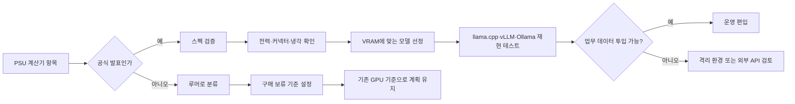

> 한 줄 요약: RTX 5080 SUPER 24GB, RTX 5070 Ti SUPER 24GB, RTX 5070 SUPER 18GB 루머는 새 GPU 출시 소식이라기보다, 로컬 LLM 사용자가 VRAM, 전력, 공급망 신호를 어디까지 믿고 계획에 넣어야 하는지 보여준 사례에 가깝다.

## 무슨 일이 있었나

### RTX 50 Super 루머, 확인된 것은 어디까지인가

LocalLLaMA에 Seasonic 파워서플라이 계산기에서 미발표 RTX 50 Super 모델명이 보였다는 글이 올라왔다. 제목에는 RTX 5080 SUPER 24GB, RTX 5070 Ti SUPER 24GB, RTX 5070 SUPER 18GB가 함께 언급됐다.

먼저 확인된 내용과 아직 추정에 가까운 부분을 나눠 볼 필요가 있다.

| 구분 | 확인된 범위 | 아직 추정인 부분 |
|---|---:|---|
| Seasonic PSU 계산기 | RTX 5070 Super, RTX 5070 Ti Super 항목과 전력값이 공개 보도로 확인됨 | 이 항목이 실제 출시 제품을 뜻하는지 |
| RTX 5070 Super | 18GB VRAM, 275W로 거론 | 최종 CUDA 코어, 가격, 출시일 |
| RTX 5070 Ti Super | 24GB VRAM, 350W로 거론 | 실제 제품명과 보드 파트너 SKU |
| RTX 5080 Super | 24GB, 약 415W 루머가 같이 돌고 있음 | Seasonic 계산기에서의 확인 범위와 NVIDIA 공식 출시 여부 |

Tom’s Hardware는 2025년 9월 27일 보도에서 Seasonic 계산기에 RTX 5070 Super와 RTX 5070 Ti Super가 보였고, 각각 275W와 350W로 표시됐다고 정리했다. 다만 NVIDIA가 공식 발표한 제품은 아니며, 계산기 항목만으로 출시가 확정됐다고 보기는 어렵다.

2026년 7월 9일 기준으로도 이 흐름은 확정 제품 뉴스보다는 루머와 공급망 신호에 가깝다. PC Gamer는 2026년 6월 9일 Benchlife발 보도를 인용해 RTX 50 Super 시리즈가 2027년 1월 CES 이후로 밀릴 수 있다고 전했다.

헷갈리기 쉬운 지점도 있다. 파워 계산기에 보이는 전력값은 구매 계획을 세울 때 참고할 수 있지만, 공식 스펙표와 같은 무게를 갖지는 않는다. GPU 기사와 계산기에서는 TDP라는 말이 섞여 쓰이지만, 실제 시스템을 맞출 때는 TGP(Total Graphics Power), 순간 피크, 커넥터 규격, 케이스 냉각까지 같이 봐야 한다.

## 왜 사람들이 반응했나

### 로컬 LLM GPU 구매에서 왜 VRAM 24GB가 갈림길인가

이 반응은 게이머의 신제품 기대만으로는 설명하기 어렵다. LocalLLaMA 커뮤니티에서 GPU는 취미 장비이면서 작은 추론(inference) 인프라이기도 하다.

로컬 LLM(local LLM)을 돌리는 사람에게 VRAM은 단순한 성능 옵션이 아니다. 모델이 느리게라도 올라가는지, 컨텍스트를 얼마나 길게 잡을 수 있는지, 양자화(quantization)를 어디까지 낮춰야 하는지가 VRAM에서 갈린다.

그래서 18GB와 24GB라는 숫자가 민감하게 받아들여진다. 12GB와 16GB에서는 애매했던 모델이 18GB나 24GB에서는 단일 GPU에 들어올 수 있다. 단일 GPU로 해결되면 다중 GPU 분산, PCIe 병목, 레이어 오프로딩, 전력 튜닝 같은 문제가 줄어든다.

커뮤니티가 기대한 것도 이 지점이다.

- RTX 5070 Super 18GB가 사실이면 중상급 카드에서 로컬 LLM 진입선이 넓어진다.
- RTX 5070 Ti Super 24GB가 사실이면 중고 RTX 3090 24GB에 기대던 수요 일부가 새 카드로 이동할 수 있다.
- RTX 5080 Super 24GB가 사실이면 80급 카드에서도 16GB 한계를 피할 수 있다.

문제는 이 기대가 제품 발표가 아니라 PSU 계산기 드롭다운에서 시작됐다는 점이다.

### 신뢰 문제: 드롭다운 하나가 로드맵처럼 소비된다

PSU 계산기는 원래 사용자가 CPU, GPU, 저장장치, 팬을 고르고 적정 파워 용량을 추정하는 도구다. 그런데 미발표 GPU가 여기에 들어가면 사람들은 단순 입력 실수보다 공급망의 흔적으로 읽는다.

그 해석이 완전히 엉뚱한 것은 아니다. 파워 제조사는 차세대 GPU의 전력 범위를 미리 알아야 신제품 PSU를 준비할 수 있다. 보드 파트너, 케이블 규격, 패키징, 검증 일정도 GPU 출시 전에 움직인다.

문제는 이런 신호가 공식 발표처럼 소비될 때 생긴다. 커뮤니티에는 곧 제품이 나온다는 기대가 생기고, 구매를 미루거나 기존 장비를 처분할 이유가 생긴다. 실제 출시가 밀리면 그 비용은 사용자가 떠안는다.

### 사용성 문제: VRAM만 늘어난다고 로컬 LLM이 안정되진 않는다

보조 사례로 올라온 llama.cpp 이슈는 이 지점을 잘 보여준다. 한 사용자는 DeepSeek V4 계열 모델을 5-GPU 구성에서 돌리며, 2개의 RTX 3090, 1개의 RTX 5060 Ti, 2개의 RTX 4060 Ti를 섞어 총 96GiB VRAM과 125GiB DDR4 환경을 만들었다고 설명했다.

겉으로 보면 VRAM은 충분해 보인다. 그런데 upstream master에서 특정 실행이 매번 29번째 반복에서 멈추는 문제가 있었고, 사용자는 이슈와 수정 포크를 공유했다.

이 사례가 말하는 것은 단순하다. 로컬 LLM 운영에서 병목은 GPU 용량 하나로 끝나지 않는다.

- 모델 포맷: GGUF, MXFP4 같은 양자화와 메타데이터
- 런타임: llama.cpp 커밋, 체크포인팅, Flash Attention 계열 최적화
- 하드웨어: GPU 세대 혼합, VRAM 크기 차이, PCIe 배치
- 운영: 재현 가능한 프롬프트, 반복 횟수, 로그, 실패 지점

새 GPU가 24GB를 달고 나와도 이 계층이 맞지 않으면 멈춘다. 반대로 지금 장비가 애매해도 런타임과 모델 조합이 잘 맞으면 충분히 쓸 수 있다.

## 내가 보는 핵심

### RTX 50 Super 루머는 구매 뉴스가 아니라 의존성 관리 문제다

이번 이슈의 핵심은 NVIDIA가 어떤 카드를 내느냐만이 아니다. 미확정 하드웨어 로드맵이 개인과 팀의 아키텍처 판단에 얼마나 빨리 들어오는지가 더 중요하다.

현업에서 비슷한 고민을 하다 보면 GPU 이름보다 먼저 봐야 할 것이 있다. 이 장비가 없어도 일정이 유지되는가. 출시가 밀리면 외부 API로 우회할 것인가. 외부 API를 쓰면 코드, 문서, 고객 데이터의 경계가 바뀌는가.

로컬 LLM을 선택하는 이유 중 하나는 데이터 반출을 줄이는 것이다. 그런데 특정 GPU 출시를 기다리다가 일정이 밀리면, 임시로 클라우드 모델을 쓰자는 압력이 생긴다. 이때 리스크는 성능 저하가 아니라 데이터 정책, 접근 로그, 감사 가능성으로 옮겨간다.

이 다이어그램에서 앞쪽 절반은 하드웨어 뉴스처럼 보인다. 뒤쪽 절반은 운영 판단이다. 로컬 LLM을 실제 업무에 붙이면 결국 뒤쪽 문제가 더 오래 남는다.

### 기다릴 이유와 기다리면 안 되는 이유

RTX 5070 Ti Super 24GB 같은 제품이 실제로 나온다면 매력은 분명하다. 24GB 단일 GPU는 로컬 추론에서 다루기 편한 구간이다. 전력과 가격이 합리적이면 중고 3090 기반 구성보다 조용할 수 있고, 최신 드라이버와 미디어 엔진, 전력 효율에서도 이점이 생길 수 있다.

반대로 기다리면 안 되는 이유도 있다.

| 판단 | 위험 |
|---|---|
| 루머만 보고 현재 GPU를 처분 | 출시 지연 시 작업 환경 공백 |
| 24GB만 보고 PSU를 대충 선택 | 피크 전력, 커넥터, 케이스 냉각 문제 |
| VRAM만 보고 모델 운영을 결정 | 런타임 버그, 양자화 품질, 컨텍스트 한계 |
| Super 출시를 전제로 예산 편성 | 가격, 공급량, 지역별 재고가 변수 |
| 로컬 전환을 보안 대책으로만 포장 | 로그, 접근권한, 모델 파일 출처 검증이 빠질 수 있음 |

이런 상황에서는 새 GPU가 나올 때까지 기다릴지보다, 지금 돌려야 하는 모델 목록을 먼저 고정하는 편이 낫다. 예를 들어 7B, 14B, 32B, MoE 모델을 각각 어떤 양자화로 돌릴지 정하고, 필요한 컨텍스트 길이와 동시 요청 수를 적어보면 18GB와 24GB의 의미가 훨씬 선명해진다.

그다음에 GPU 후보를 넣어야 한다. 순서가 바뀌면 하드웨어 쇼핑이 설계를 끌고 간다.

## 앞으로 볼 기준

### RTX 50 Super 출시일보다 먼저 확인할 체크포인트

다음에 RTX 5080 SUPER 24GB, RTX 5070 Ti SUPER 24GB, RTX 5070 SUPER 18GB 관련 뉴스가 나오면 아래 순서로 보면 된다.

1. NVIDIA 공식 제품 페이지나 드라이버 릴리스 노트에 모델명이 들어갔는가.
2. AIB 제조사 SKU와 리테일러 재고가 동시에 보이는가.
3. 전력값이 PSU 계산기 수준인지, 독립 리뷰의 실측인지 구분되는가.
4. VRAM 용량뿐 아니라 메모리 버스, 대역폭, 전력 제한이 같이 공개됐는가.
5. 내가 쓰는 모델이 해당 VRAM에 실제로 들어가는지 테스트 로그가 있는가.
6. llama.cpp, vLLM, Ollama 같은 런타임에서 같은 모델과 같은 양자화로 재현 사례가 있는가.
7. 출시가 3개월, 6개월 밀려도 유지되는 대안 장비나 클라우드 경로가 있는가.
8. 외부 API로 우회할 때 데이터 반출, 키 관리, 감사 로그 기준이 준비돼 있는가.

이 기준을 적용하면 이번 Seasonic PSU 계산기 이슈는 흥미로운 신호지만, 구매 결재서에 들어갈 근거는 아니다. 커뮤니티가 반응한 이유는 이해된다. 24GB는 로컬 LLM 사용자에게 작은 숫자가 아니고, 70급 카드에서 그 숫자가 보인다면 기대가 붙을 수밖에 없다.

다만 드롭다운은 아키텍처가 아니다. 로컬 LLM 시스템의 설계는 루머가 맞았을 때보다, 루머가 틀렸을 때 무엇이 흔들리는지에서 시작해야 한다.

## 참고 자료

- [선정 글감] [Seasonic PSU calculator now mentions RTX 5080 SUPER (24GB), RTX 5070 Ti SUPER (24GB) and RTX 5070 SUPER (18GB)](https://www.reddit.com/r/LocalLLaMA/comments/1uqzv4q/seasonic_psu_calculator_now_mentions_rtx_5080/) — Reddit LocalLLaMA
- [관련] [llama.cpp fix for DeepSeek V4 Flash crash and stall](https://www.reddit.com/r/LocalLLaMA/comments/1uqy37j/llamacpp_fix_for_deepseek_v4_flash_crash_and_stall/) — Reddit LocalLLaMA
- [관련] [Nvidia RTX 5070 Ti Super and RTX 5070 Super TDP leaked](https://www.tomshardware.com/pc-components/gpus/nvidia-rtx-5070-ti-super-and-rtx-5070-super-tdp-leaked-long-rumored-rtx-50-super-series-gpus-appear-in-power-supply-calculator) — Tom’s Hardware
- [관련] [RTX 50 Super Series refresh rumoured to be pushed out to 2027](https://www.pcgamer.com/hardware/graphics-cards/2026-is-shaping-up-to-be-one-of-the-worst-years-ever-for-new-graphics-cards-as-nvidias-rtx-50-super-series-refresh-rumoured-to-be-pushed-out-to-2027/) — PC Gamer