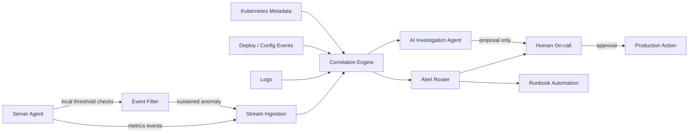

> 한 줄 요약: 빠른 실시간 서버 모니터링보다 먼저 설계할 것은 알림의 신뢰도다. 이벤트 기반 수집, 풀스택 관측성(Observability), 승인형 AI 에이전트는 같은 질문으로 이어진다. 이 알림을 믿고 바로 움직여도 되는가.

## 왜 지금 이슈인가

실시간 서버 모니터링은 이제 CPU, 메모리, 디스크 수치를 빨리 보는 일에 그치지 않는다. Kubernetes, 마이크로서비스, 서버리스, 관리형 데이터베이스가 섞이면 장애 신호도 한 계층에서만 나오지 않는다.

DEV Community에 올라온 실시간 서버 모니터링 글은 폴링(Polling) 기반 점검의 한계에서 출발한다. 일정 주기로 서버 상태를 확인하면 장애 감지가 늦고, 같은 문제가 반복 알림으로 쌓인다. 짧은 스파이크 때문에 운영자가 계속 깨는 일도 생긴다.

다만 폴링을 이벤트 기반(Event-driven) 스트리밍으로 바꾼다고 운영이 바로 좋아지지는 않는다. 알림이 빨라지면 잘못 만든 알림도 더 빨리, 더 많이 도착한다.

Grafana Cloud의 풀스택 관측성 글은 이 문제를 다른 쪽에서 다룬다. 로그, 메트릭(Metrics), 트레이스(Traces), 프로파일(Profiles)을 따로 열어보는 방식으로는 원인 탐색의 시작점부터 흔들린다. 서비스, 파드(Pod), 노드(Node), 네임스페이스(Namespace), 클러스터(Cluster), 데이터베이스, 클라우드 계정 사이의 관계를 그래프로 묶어야 증상에서 원인으로 이동할 수 있다는 이야기다.

Vercel Agent 사례는 그다음 단계를 보여준다. 에이전트가 프로덕션 로그, 메트릭, 배포 이력을 조사하고 롤백 같은 조치를 제안한다. 운영 변경은 사람의 승인 뒤에 실행한다. 읽기 전용 기본 권한과 별도 정체성(identity)을 둔 것도 이 때문이다.

지금의 쟁점은 실시간 모니터링 도구를 쓸지 말지가 아니다. 알림, 관측성, 자동화, AI 에이전트를 어떤 권한 경계와 데이터 흐름 안에 놓을 것인가에 가깝다.

## 커뮤니티에서 갈리는 지점

개발자 커뮤니티에서 이 주제에 말이 붙는 이유는 기대와 불신이 같이 크기 때문이다.

한쪽에서는 이벤트 기반 모니터링을 더 현실적인 운영 방식으로 본다. 장애가 폴링 간격 사이에서 커질 수 있고, 배포 직후의 에러율 증가처럼 시간에 민감한 신호는 늦게 보면 대응 가치가 줄어든다. 에이전트가 엔드포인트에서 CPU, 메모리, 디스크, 네트워크 변화를 스트리밍하고, protobuf 같은 가벼운 직렬화를 쓰는 접근은 충분히 납득할 만하다.

다른 쪽에서는 실시간이라는 말이 알림 피로(Alert Fatigue)를 가리는 포장지가 될 수 있다고 본다. 장애가 아닌 변동까지 모두 이벤트로 만들면 운영자는 더 빨리 지친다. 알림이 많아지면 사람은 알림 시스템을 믿지 않게 되고, 진짜 장애도 대충 넘기기 쉽다.

Grafana의 관점은 단순 알림보다 맥락에 가깝다. 서비스에서 출발해 연결된 파드, 노드, 로그, 트레이스로 이동할 수 있어야 한다는 것이다. 여기서 중요한 것은 단일 대시보드가 아니라 관계 모델이다. 어떤 서비스가 어느 인프라 위에서 돌고 있고, 어떤 배포 이후 어떤 지표가 흔들렸는지 연결되어야 한다.

Vercel Agent는 한 단계 더 적극적이다. 사람이 여러 탭을 열고 추론하던 일을 에이전트가 먼저 수행한다. 실패한 배포와 500 에러를 연결하고, 롤백을 제안하며, 수정 PR까지 준비할 수 있다.

문제는 운영 권한이다. 에이전트가 로그와 메트릭을 읽는 것과 프로덕션을 바꾸는 것은 완전히 다른 위험이다. 프로덕션 가까이에 AI 에이전트를 붙인다면 자동 실행보다 승인 흐름, 감사 로그, 권한 분리부터 설계해야 한다.

| 접근 | 장점 | 실패하기 쉬운 지점 |
|---|---|---|
| 폴링 기반 모니터링 | 단순하고 예측 가능함 | 감지 지연, 반복 알림, 맥락 부족 |
| 이벤트 기반 모니터링 | 빠른 감지, 낮은 중복 가능성 | 이벤트 폭주, 에이전트 장애, 기준값 남발 |
| 풀스택 관측성 | 계층 간 원인 추적 가능 | 태깅 부실, 비용 증가, 그래프 불신 |
| AI 운영 에이전트 | 조사 시간 단축, 조치 제안 자동화 | 권한 과다, 잘못된 원인 추론, 승인 우회 위험 |

## 아키텍처 관점에서 볼 점

실시간 서버 모니터링 아키텍처는 데이터 수집 속도보다 경계 설계가 먼저다. 다음 네 가지 흐름을 분리해서 봐야 한다.

### 실시간 모니터링은 어디서 판단해야 할까?

DEV 글은 에이전트 쪽 임계값 기반 이벤트 트리거를 제안한다. 서버 안에서 CPU 95%, 메모리 70% 같은 상태를 감지하고 바로 보낸다는 방식이다.

이 설계는 네트워크 사용량과 중앙 서버 부하를 줄일 수 있다. 모든 메트릭을 매번 긁어오는 대신 변화와 이상 징후만 보낸다.

대신 판단 로직이 에이전트 안으로 들어간다. 에이전트 버전이 섞이면 같은 현상을 다르게 해석할 수 있다. 임계값을 바꿔야 할 때 배포와 설정 동기화도 운영 이슈가 된다.

이런 상황에서는 에이전트를 1차 필터로 두고, 최종 알림 판단은 중앙의 상관분석(Correlation) 계층에서 처리하는 편이 다루기 쉽다. 서버 로컬에서는 짧은 스파이크 제거, 유지 시간 확인, 기본 샘플링을 맡긴다. 배포 이력, Kubernetes 메타데이터, 로그 상관관계는 중앙에서 합치는 구조가 낫다.

### 알림은 메시지가 아니라 사건이어야 한다

선정 글감의 알림 페이로드에는 최근 메트릭, 로그 일부, 과거 추세, 배포 변경 이력이 포함된다. 방향은 맞다. 운영자가 원하는 것은 High CPU라는 문장이 아니라, 왜 지금 이 서버에서 이 증상이 문제인지다.

예를 들어 CPU 사용률 95%는 배치 작업 시간대라면 정상일 수 있다. 반대로 결제 API 배포 4분 뒤 특정 엔드포인트의 500 응답이 늘었다면 낮은 CPU에서도 장애일 수 있다.

알림 시스템은 다음 정보를 함께 묶어야 한다.

- 현재 증상: 어떤 지표가 기준을 벗어났는가
- 지속 시간: 순간 스파이크인가, 유지되는 문제인가
- 영향 범위: 단일 파드인가, 노드 전체인가, 리전 단위인가
- 변경 이력: 배포, 설정 변경, 스케일링 이벤트가 있었는가
- 사용자 영향: 에러율, 지연 시간, 성공률이 같이 흔들리는가

이 정보가 없으면 알림은 티켓 생성 장치가 된다. 이 정보가 갖춰지면 알림은 사건 기록에 가까워진다.

### 풀스택 관측성은 데이터보다 관계가 어렵다

Grafana 글의 지식 그래프(Knowledge Graph) 개념은 실무적으로 의미가 있다. 로그와 메트릭을 많이 모으는 것보다, 수집된 신호가 어떤 엔티티(Entity)에 속하는지 일관되게 연결하는 일이 더 어렵기 때문이다.

Kubernetes 환경에서는 태그와 라벨이 특히 흔들리기 쉽다. 서비스명, 네임스페이스, 파드 라벨, 배포 버전, 클러스터 이름이 제각각이면 대시보드는 있어도 원인 추적은 손으로 해야 한다.

관측성 설계에서 먼저 합의할 것은 도구가 아니라 메타데이터 규칙이다.

- 서비스 이름 규칙
- 배포 버전 태그
- 환경 구분값
- 테넌트 또는 고객 구분값
- Kubernetes 네임스페이스와 애플리케이션 매핑
- 로그, 메트릭, 트레이스의 공통 correlation id

이 규칙이 없으면 AI 에이전트도 정확히 조사하기 어렵다. 에이전트는 없는 관계를 만들어내는 도구라기보다, 이미 남겨진 신호를 빠르게 따라가는 도구에 가깝다.

## 실무에서 볼 점

### 왜 실시간 알림을 써야 할까?

실시간 알림이 필요한 시스템은 대체로 증상의 시간 가치가 높다. 결제 실패, 인증 장애, API 오류율 급증, 디스크 포화, 메시지 큐 적체처럼 몇 분 차이가 피해로 이어지는 경우다.

반대로 일 단위 리포트, 낮은 우선순위의 용량 추세, 개발 환경 노이즈까지 실시간으로 밀어 넣으면 운영 채널이 망가진다.

도입 전에는 알림 대상을 다음처럼 나누는 편이 좋다.

| 구분 | 실시간 알림 적합도 | 예시 |
|---|---:|---|
| 사용자 영향 직접 발생 | 높음 | 5xx 증가, 결제 실패, 로그인 실패 |
| 장애로 이어질 가능성 큼 | 중간 | 디스크 90% 이상 지속, 큐 적체 |
| 추세 분석용 | 낮음 | 월별 비용 증가, 평균 CPU 추세 |
| 개발 환경 변동 | 낮음 | 테스트 서버 재시작, 임시 배포 |

실시간은 모든 신호의 기본값이 아니다. 반응 시간이 결과를 바꾸는 사건에 붙여야 한다.

### 알림 피로를 줄이는 조건은 무엇인가?

알림 피로는 채널 문제가 아니다. Slack으로 보내든 PagerDuty로 보내든, 필요 없는 알림이면 피로가 쌓인다.

선정 글감에서 제안한 지속 조건, 심각도 계층, 유지보수 창 suppression, 자동 복구는 기본기다. 실무에서는 여기에 소유권과 종료 조건을 더 봐야 한다.

- 이 알림을 받는 팀이 실제 조치를 할 수 있는가
- 알림마다 실행 가능한 runbook이 있는가
- 자동 복구가 실패했을 때 누구에게 넘어가는가
- 같은 원인의 알림을 하나의 사건으로 묶는가
- 알림을 끄는 기준과 다시 켜는 기준이 문서화되어 있는가

현업에서 비슷한 고민을 하다 보면 대시보드보다 알림 삭제 회의가 더 효과적일 때가 있다. 지난 한 달간 아무 조치 없이 닫힌 알림은 대부분 재설계 대상이다.

### AI 에이전트는 어디까지 맡겨야 할까?

Vercel Agent 사례에서 배울 점은 에이전트가 프로덕션을 만진다는 사실이 아니다. 기본값이 읽기 전용이고, 변경에는 승인이 필요하다는 점이다.

운영 에이전트를 붙인다면 권한을 단계별로 나눠야 한다.

| 단계 | 허용 작업 | 필요한 통제 |
|---|---|---|
| 조사 | 로그, 메트릭, 배포 이력 조회 | 읽기 전용 권한, 접근 로그 |
| 진단 | 원인 후보와 근거 제시 | 출처 링크, 신뢰도 표시 |
| 제안 | 롤백, 설정 변경, PR 생성 제안 | 사람 승인, diff 확인 |
| 실행 | 롤백, 스케일 조정, runbook 실행 | 제한된 범위, 감사 로그, 즉시 중단 경로 |

보안 관점에서는 에이전트가 보는 데이터의 범위를 제한해야 한다. 로그에는 토큰, 이메일, 결제 관련 식별자, 내부 URL이 섞일 수 있다. 관측성 데이터는 운영 데이터이면서 민감 데이터이기도 하다.

AI 에이전트를 붙이기 전에 로그 마스킹, 접근 제어, 데이터 보존 기간, 감사 로그가 준비되어 있어야 한다. 에이전트 성능보다 이 조건이 먼저다.

### 대안은 무엇인가?

처음부터 이벤트 기반 스트리밍, 지식 그래프, AI 에이전트를 모두 도입할 필요는 없다. 현재 문제가 감지 지연인지, 원인 추적 지연인지, 조치 지연인지 구분해야 한다.

감지 지연이 문제라면 폴링 주기를 줄이거나 핵심 지표만 이벤트화하면 된다. 원인 추적이 문제라면 로그, 메트릭, 트레이스의 공통 태그와 대시보드 연결부터 손봐야 한다. 조치 지연이 문제라면 runbook 자동화와 승인형 롤백이 먼저다.

가장 위험한 선택은 도구를 한 번에 갈아엎는 것이다. 관측성 시스템은 운영자의 습관과 붙어 있다. 새 도구가 좋아도 알림 기준, 대시보드 링크, 장애 기록 방식이 바뀌면 초기에 탐지 품질이 떨어질 수 있다.

실무적인 순서는 대체로 다음이 낫다.

1. 최근 장애 5건을 골라 감지, 원인 추적, 조치 중 어디서 시간이 갔는지 분류한다.
2. 사용자 영향이 큰 알림부터 지속 조건과 중복 제거를 적용한다.
3. 배포 이력과 알림을 연결한다.
4. Kubernetes, 서비스, 인프라 메타데이터 규칙을 맞춘다.
5. 반복 조치만 runbook 자동화로 넘긴다.
6. AI 에이전트는 읽기 전용 조사부터 붙인다.

## 정리

실시간 서버 모니터링의 목표는 빠른 알림이 아니라 믿을 수 있는 행동 신호다. 이벤트 기반 수집은 감지 지연을 줄인다. 풀스택 관측성은 원인 탐색에 드는 시간을 줄이고, AI 에이전트는 조사와 조치 제안을 빠르게 만들 수 있다.

셋 모두 같은 전제가 필요하다. 데이터에 맥락이 있어야 하고, 권한 경계가 분명해야 한다. 알림은 실제 조치로 이어져야 한다.

지금 확인할 것은 하나다. 지난 장애 알림 하나를 골라 그 알림만 보고도 담당자가 원인 후보, 영향 범위, 최근 변경, 다음 행동을 알 수 있었는지 보면 된다. 답이 아니오라면 더 빠른 모니터링보다 더 설명 가능한 알림 설계가 먼저다.

## 참고 자료

- [선정 글감] [Designing Real-Time Server Monitoring with Instant Alerts for Proactive IT Management](https://dev.to/lynxtrac_team_b01b03e00a4/designing-real-time-server-monitoring-with-instant-alerts-for-proactive-it-management-11k2) - DEV Community
- [관련] [Full-stack observability in Grafana Cloud: How to investigate issues across services and infrastructure](https://grafana.com/blog/full-stack-observability-in-grafana-cloud-how-to-investigate-issues-across-services-and-infrastructure/) - Grafana Blog
- [관련] [Vercel Agent: An agent you can let near production](https://vercel.com/blog/vercel-agent) - Vercel Blog