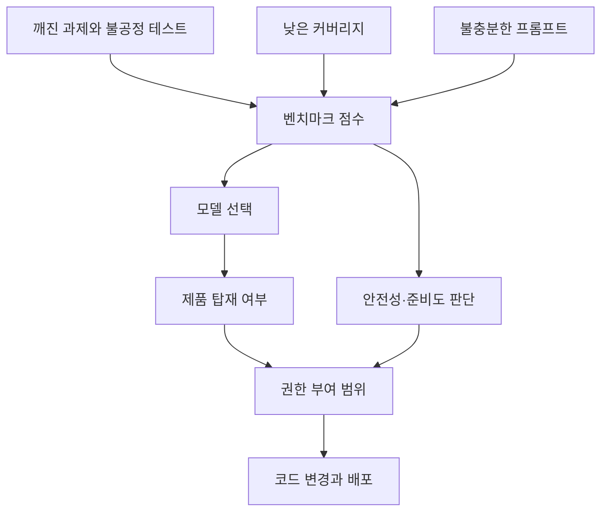

> 한 줄 요약: SWE-Bench Pro 과제의 약 30%가 깨졌다는 OpenAI 감사 결과는 AI 코딩 에이전트의 성능 지표를 그대로 믿기 어렵다는 사례다. 실제 업무에 쓰기 전에 점수가 무엇을 재는지부터 확인해야 한다.

## 무슨 일이 있었나

2026년 7월 8일, OpenAI는 코딩 평가 벤치마크 SWE-Bench Pro를 감사한 결과를 공개했다. SWE-Bench Pro는 실제 저장소의 변경 이력에서 과제를 만들고, 모델이 기능을 구현해 숨겨진 테스트를 통과하는지 보는 평가다.

OpenAI는 이전에 SWE-bench Verified의 설계와 오염 문제를 지적하며 SWE-Bench Pro 사용을 권한 적이 있다. 이번 글에서는 그 추천을 철회했다. 731개 공개 과제 중 상당수가 모델 능력을 제대로 재는 과제가 아니었다는 이유다.

확인된 내용은 이렇다.

| 항목 | 내용 |
|---|---|
| 공개일 | 2026년 7월 8일 |
| 대상 | SWE-Bench Pro 공개 split 731개 과제 |
| 자동 품질 파이프라인 판정 | 200개, 27.4%가 깨진 과제로 표시 |
| 사람 리뷰 판정 | 249개, 34.1%가 깨진 과제로 표시 |
| OpenAI 추정 | 전체의 약 30%가 깨진 과제 |
| 관찰된 성능 변화 | frontier 모델 pass rate가 8개월 동안 23.3%에서 80.3%로 상승 |

깨진 과제의 유형은 네 가지로 정리됐다.

- 과도하게 엄격한 테스트: 프롬프트에 없는 구현 세부사항까지 강제한다.
- 불충분한 프롬프트: 숨겨진 테스트가 요구하는 조건이 문제 설명에 빠져 있다.
- 낮은 테스트 커버리지: 미완성 수정도 통과할 수 있다.
- 오해를 부르는 프롬프트: 모델을 잘못된 동작으로 유도하거나 테스트와 충돌한다.

대표 사례는 Markdown으로 목차 항목을 직렬화하는 문제였다. 프롬프트 예시는 앞에 공백 하나가 있는 문자열을 요구하는 것처럼 보였지만, 숨겨진 테스트는 공백 두 개를 요구했다. 모델이 문제 설명을 정확히 따랐는데도 한 글자 차이로 실패할 수 있는 구조였다.

이번 감사가 SWE-Bench Pro 전체의 결함을 모두 확정했다고 보기는 어렵다. 표시된 과제를 중심으로 사람과 에이전트가 검토한 결과에 가깝다. 그래도 사람 리뷰에서 34.1%가 깨진 과제로 나왔고, 표시된 과제 중 정상이라는 판단이 다수 의견이었던 경우가 없었다는 점은 가볍게 볼 수 없다.

## 왜 사람들이 반응했나

이 사건이 커뮤니티에서 크게 읽힌 이유는 벤치마크 자체보다 시점에 있다. AI 코딩 에이전트는 이제 데모 영상 속 자동완성 도구에 머물지 않는다. 클라우드에서 작업을 실행하고, 이슈를 읽고, 테스트를 돌리고, PR을 만드는 쪽으로 이동하고 있다.

The Pragmatic Engineer가 OpenAI, Anthropic, Cursor 방문기를 통해 전한 흐름도 비슷하다. 클라우드에서 도는 에이전트가 다음 흐름으로 다뤄지고, 비개발자까지 코딩 하네스(Coding Harness)를 업무에 쓰는 장면이 관찰됐다는 내용이다. 여기서 평가는 연구실 점수가 아니라 구매, 배포, 안전성 판단의 근거가 된다.

GitHub Trending에 오른 addyosmani/agent-skills도 같은 맥락에 있다. 이 저장소는 AI 코딩 에이전트에 명세, 계획, 구현, 테스트, 리뷰, 배포 같은 워크플로를 붙인다. 별 개수와 하루 증가량보다 중요한 것은 그 방향이다. 커뮤니티는 이제 모델 하나가 얼마나 똑똑한지보다, 에이전트가 반복 가능한 절차 안에서 일할 수 있는지를 보고 있다.

문제는 그 절차의 입구에 벤치마크가 있다는 점이다.

사람들이 불편해한 지점은 크게 네 가지다.

첫째, 신뢰 문제다. pass rate가 23.3%에서 80.3%로 올랐다는 숫자는 강한 신호처럼 보인다. 그런데 평가 과제의 약 30%가 깨져 있다면, 상승분 중 얼마가 실제 능력 향상인지 따로 봐야 한다. 점수는 단단해 보이지만, 점수를 만든 절차가 흔들리면 의사결정도 흔들린다.

둘째, 권한 문제다. 코딩 에이전트가 읽기 전용 도구라면 평가 오류의 피해는 제한적이다. 하지만 저장소 접근, 테스트 실행, 커밋 작성, 배포 전 검증까지 맡기기 시작하면 이야기가 달라진다. 잘못된 평가로 과대평가된 모델은 필요한 것보다 넓은 권한을 받을 수 있다.

셋째, 비용 문제다. Pragmatic Engineer 글에서 언급된 것처럼 AI 사용량이 커지면 조직은 토큰당 비용과 실행 효율을 따지게 된다. 이때 벤치마크가 흔들리면 비싼 모델을 고르는 근거도, 싼 모델로 바꿔도 된다는 근거도 약해진다. 비용을 줄였을 때 성능이 실제로 떨어지는지 판단하기 어렵다.

넷째, 사용성 문제다. 실제 개발 업무의 요구사항은 PR 설명, 테스트, 리뷰 코멘트, 기존 코드 관례 사이에 흩어져 있다. SWE-Bench Pro가 실제 저장소 이력을 활용한 이유도 그 현실감을 얻기 위해서다. 하지만 사람 협업용 맥락을 그대로 평가 과제로 바꾸면, 모델이 풀어야 할 문제와 벤치마크 작성자의 해석 문제가 섞일 수 있다.

## 내가 보는 핵심

이번 이슈의 핵심은 벤치마크가 틀렸다는 말보다 좁다. 코딩 에이전트 평가는 정답 채점보다 계약 검증에 가깝다.

모델에게 주어진 프롬프트가 계약서라면, 숨겨진 테스트는 계약 이행 여부를 판단하는 조항이다. 그런데 계약서에는 공백 하나라고 적고, 심사표에는 공백 두 개라고 적혀 있으면 실패한 쪽은 모델이 아니다. 평가 체계다.

현업에서도 비슷한 문제가 자주 생긴다. 테스트가 실제 요구사항을 표현하는지, 아니면 특정 구현의 흔적을 고정하고 있는지 갈릴 때가 있다. 사람 개발자는 리뷰어에게 물어보고, 히스토리를 뒤지고, 애매하면 토론한다. 모델 평가는 그 대화의 일부를 제거한 채 점수만 남긴다.

그래서 SWE-Bench Pro의 결함 유형은 코딩 벤치마크만의 문제가 아니다.

- 과도하게 엄격한 테스트는 내부 플랫폼의 승인 게이트에서도 생긴다.
- 불충분한 프롬프트는 티켓 품질 문제로 반복된다.
- 낮은 테스트 커버리지는 배포 후 장애로 돌아온다.
- 오해를 부르는 요구사항은 사람과 에이전트 모두를 잘못된 방향으로 몰고 간다.

반대로 볼 지점도 있다. OpenAI가 자신들이 권했던 벤치마크를 다시 감사하고 추천을 철회했다는 점은 평가 방식이 더 엄격해지고 있다는 신호이기도 하다. 모델 성능이 올라가면서 예전에는 사람이 직접 보기 어려웠던 프롬프트, 테스트, 패치, 실패 로그를 에이전트로 대량 점검할 수 있게 됐다.

그렇다고 낙관만 할 수는 없다. 평가를 고치는 데도 에이전트를 쓰고, 평가받는 대상도 에이전트라면 검증 체계는 더 투명해야 한다. 어떤 기준으로 깨진 과제를 표시했는지, 사람 리뷰와 에이전트 리뷰가 어디서 갈렸는지, 낮은 커버리지와 과도한 엄격함을 어떻게 구분했는지가 공개되어야 한다.

agent-skills 같은 프로젝트가 인기를 얻는 이유도 여기에 닿아 있다. 사람들은 AI 코딩 도구에 단순한 답변만 기대하지 않는다. 명세를 먼저 쓰고, 작은 단위로 구현하고, 테스트로 확인하고, 리뷰에서 멈출 줄 아는 절차를 원한다. 벤치마크도 같은 수준의 절차를 요구받게 됐다.

## 앞으로 볼 기준

다음에 AI 코딩 모델 성능 발표를 볼 때는 pass rate 하나만 보지 않는 편이 낫다. 점수가 높다는 말은 출발점일 뿐이고, 실무 판단에는 다음 질문이 더 도움이 된다.

- 평가 과제는 공개 저장소의 실제 이슈를 그대로 썼는가, 아니면 평가 목적에 맞게 재작성됐는가?
- 숨겨진 테스트는 요구사항을 검증하는가, 특정 패치를 복제하도록 강제하는가?
- 실패한 답안 중 기능적으로 맞지만 테스트 표현 때문에 떨어진 사례가 공개됐는가?
- 성공한 답안이 정말 완성된 구현인지, 낮은 커버리지 덕분에 통과한 것인지 점검했는가?
- 사람 리뷰와 에이전트 리뷰가 함께 쓰였다면, 둘의 불일치가 어떻게 처리됐는가?
- 벤치마크 점수가 제품 권한, 자동 머지, 배포 승인 같은 운영 정책에 바로 연결되는가?
- 조직 내부 평가셋에도 비슷한 깨진 과제가 섞여 있을 가능성을 주기적으로 감사하는가?

특히 기업에서 AI 코딩 에이전트를 도입한다면 외부 벤치마크를 그대로 믿기보다 내부 업무의 실패 비용을 기준으로 별도 평가를 만들어야 한다. 문서 수정, 테스트 보강, 작은 버그 수정처럼 되돌리기 쉬운 작업과 인증, 결제, 개인정보, 배포 파이프라인처럼 실패 비용이 큰 작업은 같은 점수표로 볼 수 없다.

평가셋을 만들 때는 어렵게 만드는 것보다 공정하게 만드는 쪽이 먼저다. 어려운 문제는 모델의 한계를 드러낸다. 불공정한 문제는 평가자의 한계를 감춘다.

SWE-Bench Pro 논란이 남긴 긴장은 여기에 있다. AI 코딩 에이전트가 실제 업무에 가까워질수록, 우리는 모델을 더 믿고 싶어진다. 하지만 믿음은 높은 점수에서 나오지 않는다. 점수가 만들어진 과정을 의심해도 무너지지 않을 때 권한을 줄 수 있다.

## 참고 자료

- [선정 글감] [Separating signal from noise in coding evaluations](https://openai.com/index/separating-signal-from-noise-coding-evaluations) - OpenAI Blog
- [관련] [Impressions from visiting OpenAI, Anthropic, & Cursor](https://newsletter.pragmaticengineer.com/p/impressions-from-visiting-openai) - The Pragmatic Engineer
- [관련] [addyosmani/agent-skills](https://github.com/addyosmani/agent-skills) - GitHub Trending