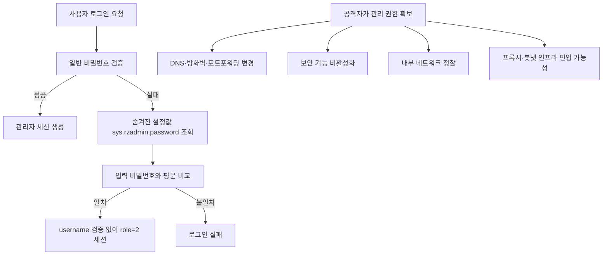

> 한 줄 요약: Tenda 라우터 펌웨어에서 문서화되지 않은 인증 우회 경로가 공개됐다. 집과 소규모 사무실의 라우터, TV, 셋톱박스가 공격자의 프록시 인프라로 쓰이는 상황에서, 관리 인터페이스를 어디까지 믿을 수 있는지 다시 묻게 하는 사례다.

## 무슨 일이 있었나

2026년 7월 6일, CERT/CC는 Tenda의 여러 펌웨어 버전에 문서화되지 않은 인증 백도어가 들어 있다고 공개했다. 취약점 번호는 CVE-2026-11405다.

영향을 받는 범위는 일부 Tenda 라우터·네트워크 장비 펌웨어다. CERT/CC가 공개한 목록에는 `FH1201`, `W15E`, `AC10`, `AC5`, `AC6` 계열의 특정 펌웨어 버전이 포함돼 있다.

확인된 내용은 다음과 같다.

- 웹 관리 인터페이스를 담당하는 `/bin/httpd` 바이너리 안의 `login()` 함수에 우회 경로가 있다.
- 일반 로그인은 MD5 기반 비밀번호 검증을 먼저 수행한다.
- 인증이 실패하면 `GetValue("sys.rzadmin.password")`로 별도 비밀번호 값을 읽는다.
- 사용자가 입력한 비밀번호와 설정에 저장된 값을 평문 `strcmp()`로 비교한다.
- 일치하면 사용자 이름 검증 없이 `role=2` 수준의 관리자 세션이 만들어진다.

정상 관리자 계정의 비밀번호를 몰라도 특정 조건을 만족하면 관리자로 들어갈 수 있다는 뜻이다. 더 문제인 점은 이 경로가 관리자 화면에 표시되지 않고 문서에도 없다는 것이다.

CERT/CC는 2026년 5월 19일 Tenda에 통지했지만, 2026년 7월 6일 공개 시점까지 벤더의 공식 답변을 받지 못했다고 밝혔다. 패치도 없는 상태다. 그래서 권고도 근본 수정이 아니라 완화책에 머문다. 원격 관리를 끄고, 로컬 네트워크 노출을 줄이라는 식이다.

여기까지가 확인된 사실이다.

아직 추정으로 남겨야 할 부분도 있다. 이 백도어가 의도적으로 심어진 것인지, 내부 유지보수용 코드가 남은 것인지, 특정 유통 버전에만 들어간 것인지는 공개 자료만으로 단정하기 어렵다. 또한 이 취약점이 실제 공격에 쓰였다는 공개 근거도 이번 CERT/CC 문서 안에는 없다.

그럼에도 커뮤니티가 반응한 이유는 분명하다. Hacker News에서 이 건은 Best 목록에 오르며 287포인트와 99개 댓글을 모았다. 사람들은 라우터 취약점 하나보다, 보이지 않는 관리 권한이 소비자 네트워크 장비 안에 있었다는 사실에 더 민감하게 반응한다.

## 왜 사람들이 반응했나

### Tenda 백도어가 불편한 이유는 비밀번호 문제가 아니다

비밀번호가 약해서 뚫리는 사건이라면 사용자는 어느 정도 책임을 나눠 가진다. 기본 비밀번호를 바꾸지 않았거나, 원격 관리를 켜두었거나, 펌웨어 업데이트를 하지 않았다는 설명이 가능하다.

이번 건은 다르다. 사용자가 강한 비밀번호를 설정해도, 공식 관리 화면에는 보이지 않는 별도 인증 경로가 남아 있다. 사용자 입장에서는 방어할 방법을 알 수 없다.

운영 관점에서도 난감하다. 장비 관리자는 보통 다음 항목을 점검한다.

- 관리자 비밀번호 변경 여부
- 원격 관리 비활성화 여부
- 최신 펌웨어 적용 여부
- 방화벽 또는 ACL(Access Control List) 설정
- 관리자 페이지 접근 로그

그런데 인증 로직 자체에 우회 경로가 있으면 체크리스트의 의미가 흔들린다. 특히 패치가 없는 상태에서는 보안팀이나 운영자가 할 수 있는 일이 노출면을 줄이는 정도로 제한된다.

이 그림에서 마지막 줄은 이번 Tenda 사례에서 확인된 침해 사실이 아니다. 라우터 관리자 권한이 공격자에게 넘어갔을 때 현실적으로 이어질 수 있는 위험을 보여주는 예시다.

### 집 안 장비는 더 이상 사적인 장비로만 끝나지 않는다

보조 사례로 볼 만한 사건도 있다. Krebs on Security는 2026년 7월 FBI가 NetNut 프록시 플랫폼과 Popa 봇넷 관련 도메인 수백 개를 압수했다고 보도했다. 보도에 따르면 NetNut은 이스라엘 상장사 Alarum Technologies가 운영한 대규모 주거용 프록시 서비스였고, 여러 보안 업체는 NetNut 인프라가 최소 200만 대 규모의 Popa 봇넷과 연결돼 있다고 봤다.

이 사례에서 언급된 장비는 스마트 TV, 스트리밍 박스처럼 집 안에 흔한 기기다. NetNut 소프트웨어는 이런 장비를 상시 켜진 주거용 프록시 노드로 만들었고, 그 트래픽은 대량 스크래핑, 광고 사기, 계정 탈취 시도 같은 활동에 쓰였다고 보도됐다.

Tenda 취약점과 NetNut 사건을 직접 연결하면 안 된다. 공개 자료상 Tenda 장비가 Popa 봇넷에 쓰였다는 근거는 없다.

다만 두 사건은 같은 불안을 건드린다. 소비자용 네트워크 장비와 홈 디바이스는 공격자에게 신뢰도 높은 출구 노드가 된다. 데이터센터 IP보다 주거용 IP가 차단을 덜 당하기 때문이다. 공격자는 굳이 서버를 빌리지 않아도, 남의 집 네트워크를 빌린 것처럼 움직일 수 있다.

이 지점에서 라우터 백도어는 개인 문제를 넘어선다. 한 집의 라우터가 뚫리면 그 집만 느려지는 것이 아니라, 다른 서비스에 대한 공격 트래픽의 출처가 될 수 있다. 커뮤니티가 민감하게 반응하는 이유가 여기에 있다.

### 벤더 침묵은 취약점보다 오래 남는다

CERT/CC 문서에서 특히 거슬리는 문장은 벤더와 조율하지 못했다는 대목이다. 2026년 5월 19일 통지, 7월 6일 공개, 벤더 입장 없음. 이 흐름은 사용자에게 다음 질문을 남긴다.

| 질문 | 왜 불편한가 |
|---|---|
| 패치가 나올 것인가 | 장비 교체 말고는 해법이 없을 수 있다 |
| 어떤 모델이 더 영향을 받는가 | 공개된 버전 외 장비도 의심하게 된다 |
| 백도어의 성격은 무엇인가 | 실수인지, 내부 기능인지, 공급망 문제인지 판단할 근거가 없다 |

보안 사고에서 모든 사실을 즉시 공개하기 어렵다는 점은 이해할 수 있다. 하지만 소비자 네트워크 장비는 다르다. 사용자는 장비 내부를 포렌식할 수 없고, 기업처럼 EDR(Endpoint Detection and Response)이나 중앙 로그를 갖추지도 않는다.

벤더가 침묵하면 사용자는 신뢰를 회수할 수밖에 없다. 패치가 늦는 것보다 더 큰 문제는 판단할 정보가 없다는 점이다.

## 내가 보는 핵심

### 라우터 관리 인터페이스는 제품 기능이 아니라 신뢰 경계다

이번 이슈를 라우터 보안 사고로만 보면 좁다. 더 넓게 보면 관리 인터페이스의 신뢰 경계 문제다.

관리 인터페이스는 설정 화면에 그치지 않는다. DNS를 바꾸고, 포트포워딩을 열고, 방화벽을 끄고, 펌웨어를 올리고, 내부 네트워크 주소 체계를 바꿀 수 있는 권한의 입구다. 이 입구에 숨겨진 인증 경로가 있으면 나머지 보안 설정은 모두 후순위가 된다.

현업에서 비슷한 고민을 하다 보면, 인증 로직 자체보다 인증 우회 가능성을 검증하는 일이 더 어렵다. 화면에는 로그인 하나만 보이지만, 실제 바이너리에는 유지보수 계정, 복구 모드, 원격 지원 기능, 지역별 빌드 차이가 섞여 있을 수 있다.

그래서 이 사건의 교훈은 강한 비밀번호를 쓰자는 수준에서 멈추면 부족하다. 소비자 장비와 소형 사무실 장비도 다음 질문을 받아야 한다.

- 인증 경로가 하나뿐인가
- 숨겨진 계정이나 설정값이 있는가
- 실패한 로그인 뒤에 다른 검증 루틴이 실행되는가
- 관리자 세션 생성 조건이 코드와 문서에서 일치하는가
- 벤더가 취약점 조율에 응답하는가

반론도 가능하다. 모든 소비자 장비에 엔터프라이즈급 검증과 투명성을 요구하면 가격이 오른다. 사용자는 저렴한 장비를 원하고, 벤더는 빠르게 모델을 바꾼다. 오래된 펌웨어까지 완벽히 관리하기 어렵다는 현실도 있다.

하지만 백도어 성격의 인증 우회는 그 반론으로 덮기 어렵다. 싸고 단순한 제품이어도, 문서화되지 않은 관리자 진입로를 넣어도 된다는 뜻은 아니다. 관리 권한은 제품 원가의 문제가 아니라 사용자 네트워크 전체의 통제권 문제다.

### 보안 권고가 완화책뿐일 때는 이미 늦은 상태다

CERT/CC가 제시한 완화책은 합리적이다. 원격 관리를 끄고, 로컬 노출을 줄이는 것은 당장 할 수 있는 조치다. CISA와 미국 기관들이 반복해서 말하는 홈 네트워크 보안 원칙도 비슷한 방향이다. 기본 노출을 줄이고, 불필요한 관리 기능을 끄고, 장비를 최신 상태로 유지하라는 것이다.

다만 이번 경우에는 최신 상태라는 표현이 어색해진다. 패치가 없기 때문이다. 사용자는 다음 선택지 사이에 놓인다.

- 원격 관리를 끄고 계속 쓴다
- 내부망 접근을 엄격히 제한한다
- 별도 방화벽 뒤에 격리한다
- 장비를 교체한다
- 벤더의 패치와 설명을 기다린다

개인 사용자에게 네 번째 선택지는 비용 문제다. 소규모 사무실에는 운영 중단 문제다. 장비가 많을수록 펌웨어 버전 식별부터 일이 된다. 모델명은 같아 보여도 하드웨어 리비전과 지역별 펌웨어가 다를 수 있다.

이런 상황에서 관리자는 취약점 점수보다 노출 경로를 먼저 봐야 한다. 인터넷에서 관리자 페이지가 열려 있는지, 내부 게스트망에서 접근되는지, VPN이나 사내망을 통해 우회 접근이 가능한지부터 확인해야 한다.

## 앞으로 볼 기준

### 다음 라우터 보안 뉴스를 볼 때 확인할 것

비슷한 사건은 또 나올 가능성이 크다. 그때는 CVE 번호와 벤더 이름만 보고 지나가지 말고, 다음 기준으로 읽는 편이 낫다.

| 체크포인트 | 봐야 할 이유 |
|---|---|
| 공개일과 최초 통지일 | 벤더가 대응할 시간을 가졌는지 판단할 수 있다 |
| 패치 존재 여부 | 완화책인지 근본 수정인지 갈린다 |
| 인증 전 공격인지 | 로그인 없이 가능한 취약점은 위험도가 급격히 올라간다 |
| 원격 관리 필요 여부 | 인터넷 노출 장비와 내부망 한정 장비의 리스크가 다르다 |
| 사용자 이름 검증 여부 | 계정 통제가 무력화되는지 확인해야 한다 |
| 설정값 저장 방식 | 평문 비교, 하드코딩, 숨겨진 키 여부를 봐야 한다 |
| 실제 악용 근거 | 이론적 취약점인지 진행 중인 공격인지 구분해야 한다 |
| 벤더 성명 | 제품을 계속 신뢰할 수 있는지 판단하는 자료다 |

Tenda 사례에서 당장 할 수 있는 조치는 명확하다. 영향을 받는 펌웨어 버전을 쓰는지 확인하고, 관리자 페이지가 외부에 열려 있다면 닫아야 한다. 원격 관리가 필요하다면 최소한 VPN 뒤로 숨기는 편이 낫다. 게스트망이나 사내 일반 사용자망에서 라우터 관리 페이지에 접근할 수 있는지도 확인해야 한다.

조직이라면 자산 목록에 소비자용 라우터와 공유기를 빠뜨리지 말아야 한다. 프린터, CCTV, 회의실 장비, 임시 네트워크에 붙은 공유기처럼 정식 자산 관리에서 빠진 장비가 더 위험할 때가 많다.

개인 사용자에게는 더 단순한 기준이 필요하다. 벤더가 취약점에 응답하지 않고, 패치를 내지 않고, 영향을 받는 범위를 명확히 설명하지 않는다면 그 장비는 더 이상 조용히 믿고 둘 수 있는 장비가 아니다.

이번 사건의 불편함은 숨겨진 비밀번호 하나에 있지 않다. 사용자가 관리한다고 믿었던 장비 안에, 사용자가 볼 수 없는 관리 경로가 있었다는 데 있다. 라우터는 인터넷으로 나가는 문이면서 집 안으로 들어오는 문이다. 그 문에 누가 열쇠를 하나 더 들고 있었는지 설명하지 못하는 벤더라면, 다음 구매 목록에서는 아래로 내려갈 수밖에 없다.

## 참고 자료

- [선정 글감] [Tenda firmware (multiple versions) contains hidden authentication backdoor](https://kb.cert.org/vuls/id/213560) — CERT/CC
- [관련] [FBI Seizes NetNut Proxy Platform, Popa Botnet](https://krebsonsecurity.com/2026/07/fbi-seizes-netnut-proxy-platform-popa-botnet/) — Krebs on Security
- [관련] [CISA Project Upskill Module 5](https://www.cisa.gov/audiences/high-risk-communities/projectupskill/module5) — CISA
- [관련] [Best Practices for Securing Your Home Network](https://media.defense.gov/2023/Feb/22/2003165170/-1/-1/0/CSI_BEST_PRACTICES_FOR_SECURING_YOUR_HOME_NETWORK.PDF) — U.S. Government Cybersecurity Guidance