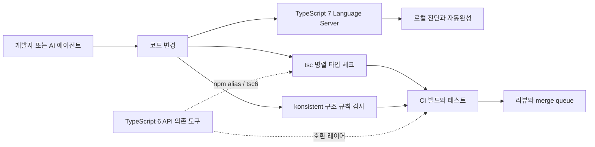

> 한 줄 요약: TypeScript 7의 Go 네이티브 포트는 빌드 시간만 줄이는 변화가 아니다. 타입 검사, 에디터, CI, AI 에이전트가 함께 쓰는 개발 피드백 루프의 병목을 옮긴다. 다만 빨라진 만큼 팀은 타입 정확성뿐 아니라 도구 호환성, 병렬 실행 리스크, 구조 규칙의 빈틈을 더 꼼꼼히 봐야 한다.

## 왜 지금 이슈인가

TypeScript 7은 컴파일러와 언어 서버(Language Server)를 Go 기반 네이티브 구현으로 옮기면서, 대형 코드베이스에서 8~12배 수준의 빌드 속도 향상을 제시했다. VS Code, Sentry, Bluesky, Playwright, tldraw 같은 프로젝트에서 측정한 전체 빌드 시간과 메모리 사용량 감소도 함께 공개됐다.

커뮤니티에서 반응이 큰 이유는 단순하다. TypeScript는 이제 타입 시스템을 넘어 개발 워크플로의 중앙 경로에 가깝다.

- 에디터 자동완성
- find-all-references
- 저장 시 진단
- `tsc --watch`
- CI 타입 체크
- merge queue
- AI 에이전트가 수정 후 검증하는 루프

이 중 하나만 느려도 개발자는 타입 검사를 로컬에서 돌리지 않고 CI에 맡기게 된다. 그러면 작은 타입 오류가 늦게 발견되고, AI 에이전트는 한 번에 더 큰 변경을 만들며, 리뷰어는 구조적인 문제까지 눈으로 확인해야 한다.

TypeScript 7 발표에서 눈에 띄는 부분도 이 지점이다. Slack 사례에서는 CI 타입 체크가 약 7.5분에서 1.25분으로 줄었고, merge queue 시간이 40% 감소했다고 소개됐다. Microsoft News Services 팀은 CI 대기 시간 절감 효과를 월 400시간으로 언급했다.

속도 수치 자체보다 중요한 변화는 로컬 검증이 다시 현실적인 선택지가 된다는 점이다. 타입 검사가 느린 팀은 보통 우회로를 만든다. pre-push 검사를 빼거나, 특정 패키지만 검사하거나, 오류가 많은 영역을 느슨하게 둔다. TypeScript 7은 이런 타협의 비용을 다시 계산하게 만든다.

## 커뮤니티에서 갈리는 지점

### TypeScript 7은 왜 빠른데도 조심해야 할까?

빠른 컴파일러는 대체로 환영받지만, 네이티브 포트는 보통 몇 가지 질문을 함께 만든다.

| 쟁점 | 기대 | 우려 |
|---|---|---|
| Go 네이티브 포트 | CPU와 메모리를 더 잘 쓰는 컴파일러 | 기존 JS 구현과의 미묘한 동작 차이 |
| 병렬 타입 체크 | 대형 저장소에서 빠른 피드백 | 재현 어려운 레이스, 환경별 성능 편차 |
| 새 언어 서버 | 에디터 진단과 탐색 속도 개선 | 플러그인·확장·툴링 호환성 |
| API 미제공 | 7.0 안정화 범위 축소 | typescript-eslint 같은 도구는 6.x API 필요 |
| AI 에이전트 활용 | 수정-검증 루프 단축 | 빠른 검증이 구조적 일관성을 보장하지는 않음 |

TypeScript 팀은 7.0에서 API를 제공하지 않고, 7.1에서 새 API를 예고했다. 그래서 7.0 전환기에는 `@typescript/typescript6` 패키지와 npm alias로 TypeScript 6 API를 함께 두는 경로를 제안한다.

이 부분은 실무에서 꽤 중요하다. 많은 프론트엔드 저장소는 `tsc` 하나만 쓰지 않는다. `typescript-eslint`, 빌드 도구, 테스트 러너, 코드 생성기, IDE 확장, 문서 생성 도구가 TypeScript API를 직접 또는 간접적으로 사용한다. 컴파일은 빨라졌는데 린트나 테스트가 깨진다면, 팀 입장에서는 단순 업그레이드가 아니라 마이그레이션 작업이 된다.

Vercel의 konsistent 같은 도구도 다른 방향에서 같은 문제를 건드린다. konsistent는 TypeScript 코드베이스에서 파일, 폴더, export, class 구현 같은 구조 규칙을 검사하는 CLI다. TypeScript와 ESLint로 표현하기 어려운 구조적 관례를 `konsistent.json`에 적고, 사람과 AI 에이전트가 같은 규칙을 보도록 만든다.

결국 커뮤니티의 실제 쟁점은 TypeScript 7이 빠른지 여부가 아니다.

빠른 타입 검사만으로 충분한가, 아니면 그 위에 구조 규칙까지 올려야 하는가에 가깝다.

## 아키텍처 관점에서 볼 점

### TypeScript 7 vs 기존 TypeScript: 어디서 병목이 바뀌나?

기존 TypeScript 운영에서 병목은 크게 두 곳에 있었다.

첫째, 언어 서버가 프로젝트를 여는 시간이다. 발표 자료에서는 VS Code 코드베이스에서 오류가 있는 파일을 열고 첫 오류를 보기까지 약 17.5초 걸리던 흐름이 TypeScript 7에서 1.3초 미만으로 줄었다고 설명한다.

둘째, CI의 전체 타입 체크다. 대형 모노레포에서는 타입 체크가 merge queue의 공용 자원을 오래 붙잡는다. 이 시간이 길수록 PR은 늦게 합쳐지고, 개발자는 더 큰 변경을 한 번에 밀어 넣는다.

TypeScript 7은 parsing, type-checking, emitting, project reference build 일부를 병렬화한다. 다만 모든 단계가 같은 난이도로 병렬화되는 것은 아니다. parsing과 emitting은 파일 단위 독립성이 커서 비교적 잘 쪼갤 수 있다. type-checking은 의존 타입 정보가 얽혀 있어 더 신중한 제어가 필요하다.

발표에서 언급된 `--checkers`, `--builders`, `--singleThreaded`는 그래서 단순한 튜닝 옵션이라기보다 장애 분석과 자원 제어를 위한 운영 옵션에 가깝다.

이 구조에서 리스크는 몇 가지로 나뉜다.

- 타입 의미론 리스크: TypeScript 6과 7이 같은 코드에 대해 같은 판단을 내리는가
- 도구 생태계 리스크: 주변 도구가 TypeScript 7의 실행 파일, API 부재, LSP 변화에 맞게 동작하는가
- 운영 리스크: 병렬 실행이 CI 머신의 CPU·메모리 제한과 충돌하지 않는가
- 품질 리스크: 빠른 타입 체크가 폴더 구조, export 계약, 생성 파일 누락까지 잡아주는가

여기서 konsistent는 네 번째 리스크를 겨냥한다. 예를 들어 특정 패키지는 `index.ts`에서 정해진 factory와 settings type을 export해야 하고, bridge가 있는 harness 파일은 protocol type과 schema를 함께 선언해야 한다는 식의 규칙은 TypeScript 타입만으로 자연스럽게 강제하기 어렵다.

AI 에이전트를 코드베이스에 붙이면 이 문제는 더 커진다. 에이전트는 타입 오류를 고치는 데는 강하지만, 저장소 내부 관례를 놓치기 쉽다. 파일 하나를 만들었는데 옆에 필요한 인증 파일을 빠뜨리거나, export barrel을 갱신하지 않거나, 특정 폴더에 있어야 하는 테스트 harness를 만들지 않는 식이다.

빠른 TypeScript 7은 피드백 속도를 줄인다. konsistent류의 구조 검사 도구는 피드백 범위를 넓힌다. 둘을 같은 파이프라인에서 봐야 하는 이유가 여기에 있다.

## 실무에서 볼 점

### TypeScript 7 도입 전에 무엇을 확인해야 할까?

첫 번째 확인 지점은 TypeScript API 의존성이다.

`tsc`만 실행하는 저장소라면 전환 난이도가 낮을 수 있다. 반대로 `typescript-eslint`, 커스텀 AST 분석기, 코드 생성기, 문서 생성기, 테스트 변환기, 빌드 플러그인이 섞여 있다면 TypeScript 7.0만으로 끝나지 않는다. 7.0은 API를 제공하지 않기 때문에 TypeScript 6 API를 함께 두는 구성이 필요할 수 있다.

두 번째는 CI 자원 모델이다.

병렬화는 공짜가 아니다. 로컬 개발 머신에서는 빨라졌는데, 공유 CI 러너에서는 동시에 여러 job이 돌면서 CPU contention이 생길 수 있다. 컨테이너에 CPU limit가 걸려 있거나 메모리 limit가 낮다면 `--singleThreaded` 또는 병렬도 제어 옵션을 비교해야 한다.

세 번째는 실패 재현성이다.

성능 최적화 도입 후 가장 곤란한 상황은 빠르지만 가끔 실패하는 빌드다. TypeScript 7 자체가 그렇다는 뜻은 아니다. 네이티브 포트와 병렬 실행을 운영 경로에 넣을 때 팀이 봐야 할 일반적인 리스크다. 특히 캐시, incremental build, project references, generated types가 함께 쓰이는 저장소라면 실패 로그를 재현할 수 있는 최소 명령을 먼저 확보해야 한다.

네 번째는 에디터와 CI의 버전 일치다.

개발자는 에디터에서 TypeScript 7 언어 서버를 보고, CI는 TypeScript 6 기반 도구를 섞어 쓰는 상태가 될 수 있다. 전환기에는 자연스러운 모습이다. 다만 로컬에서는 통과했는데 CI에서 실패하거나, 에디터에서는 오류가 보이지 않는데 린트에서 깨지는 케이스가 늘어날 수 있다.

### AI 에이전트 코드 검증에는 무엇이 부족한가?

AI 에이전트를 쓰는 팀은 TypeScript 7의 속도 향상을 더 크게 체감할 가능성이 높다. 에이전트는 코드를 바꾸고, 타입 체크를 돌리고, 오류를 읽고, 다시 수정한다. 한 번의 검증이 10분이면 반복 단위가 커진다. 1분 안쪽이면 훨씬 작은 단위로 다시 시도할 수 있다.

하지만 여기서 착각하기 쉽다.

타입 체크가 빨라졌다고 코드베이스 이해가 깊어진 것은 아니다. TypeScript는 타입 계약을 본다. ESLint는 문법과 일부 스타일 규칙을 본다. 그러나 저장소의 암묵적 구조, 패키지 경계, 테스트 fixture 위치, export 정책, feature flag 파일 쌍 같은 것은 별도의 규칙으로 표현해야 한다.

konsistent가 다루는 부분이 바로 여기에 있다. 이 도구는 사람과 에이전트 모두에게 같은 구조 규칙을 제공한다. 타입 시스템이 아니라 저장소 운영 규칙을 lint 대상으로 만든다.

도입 기준은 다음처럼 잡는 편이 현실적이다.

| 상황 | TypeScript 7 우선 | 구조 규칙 도구도 필요 |
|---|---:|---:|
| 소형 앱, 단일 패키지 | 높음 | 낮음 |
| 모노레포, project references 사용 | 높음 | 중간 |
| AI 에이전트가 파일 생성·리팩터링 수행 | 높음 | 높음 |
| 내부 프레임워크·harness 패턴 존재 | 중간 | 높음 |
| TypeScript API 의존 도구 다수 | 단계적 도입 | 높음 |

### 실패하기 쉬운 전환 시나리오

가장 흔한 실패는 TypeScript 7을 성능 패치처럼 넣는 것이다.

`typescript` 버전만 올리고 CI가 빨라졌는지 본다. 그런데 며칠 뒤 eslint 플러그인, custom transformer, IDE 확장, 테스트 변환 도구에서 미묘한 문제가 나온다. 원인은 TypeScript 7 자체가 아니라 전환 범위를 잘못 잡은 데 있을 수 있다.

더 나은 순서는 작게 나누는 것이다.

1. `tsc --noEmit` 기준으로 TypeScript 6과 7 결과를 비교한다.
2. CI에서 TypeScript 7 job을 비차단(non-blocking)으로 먼저 추가한다.
3. editor language server 전환 여부를 팀 단위로 나눠 본다.
4. API 의존 도구는 `@typescript/typescript6` 또는 npm alias 전략을 분리해 검증한다.
5. AI 에이전트가 수정하는 경로에는 타입 체크와 구조 규칙 검사를 함께 둔다.
6. merge queue 시간, 실패율, 재시도율, 평균 PR 대기 시간을 함께 본다.

성능만 보면 성공처럼 보일 수 있다. 하지만 운영 지표를 같이 봐야 한다. CI 시간이 줄었는데 flaky failure가 늘었다면 좋은 전환이 아니다. 에디터 진단은 빨라졌는데 팀이 서로 다른 TypeScript 버전을 쓰면 리뷰 비용이 남는다. AI 에이전트의 수정 속도는 빨라졌지만 구조 규칙 누락이 늘었다면 리뷰어 부담이 다른 곳으로 옮겨간 것뿐이다.

## 정리

TypeScript 7은 문법 기능 하나를 추가한 릴리스라기보다 타입 검사와 언어 서버의 비용 구조를 바꾸는 릴리스에 가깝다. 대형 코드베이스에서는 이 변화가 로컬 개발, CI, merge queue, AI 에이전트 루프까지 이어진다.

다만 실무 판단은 속도 수치에서 멈추면 안 된다. TypeScript 7을 도입할 때는 다음 항목을 함께 봐야 한다.

- TypeScript 6과 7의 검사 결과 차이
- TypeScript API에 기대는 주변 도구
- 병렬 실행이 CI 자원에 미치는 영향
- 타입 시스템 밖의 구조 규칙을 어떻게 강제할지

먼저 저장소에서 `typescript`를 직접 import하는 도구와 패키지를 찾아보는 편이 좋다. 그 목록이 짧으면 TypeScript 7 전환은 성능 개선 작업에 가깝다. 길다면 컴파일러 업그레이드가 아니라 개발 플랫폼 마이그레이션으로 다뤄야 한다.

## 참고 자료

- [선정 글감] [Announcing TypeScript 7.0](https://devblogs.microsoft.com/typescript/announcing-typescript-7-0/) — Lobsters
- [관련] [Enforce consistent code for agents and humans with konsistent](https://vercel.com/changelog/enforce-consistent-code-for-agents-and-humans-with-konsistent) — Vercel Blog