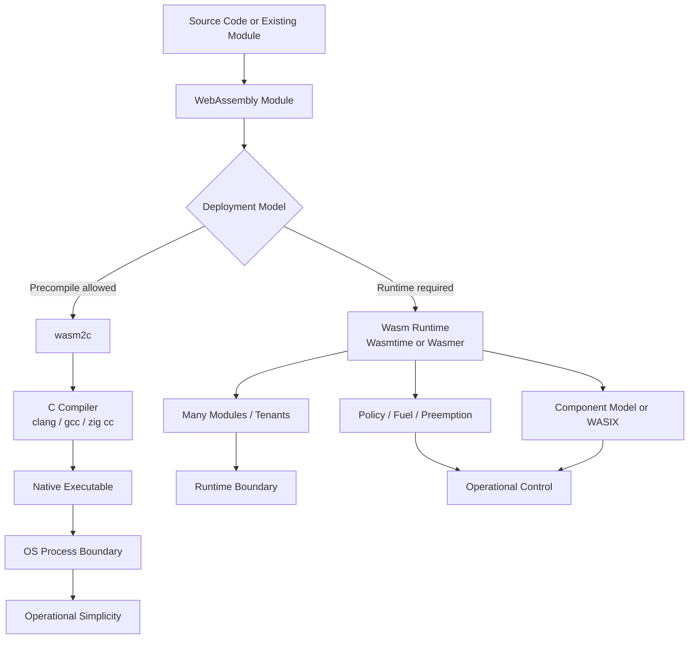

> 한 줄 요약: WebAssembly 런타임 선택은 성능 벤치마크보다 운영 경계의 문제에 가깝다. 코드를 미리 알고, 배포 대상을 통제하고, 런타임 서비스가 필요 없다면 wasm2c 같은 WebAssembly-to-C 경로는 여전히 강한 선택지다.

## 왜 지금 이슈인가

WebAssembly 런타임을 고를 때 보통 Wasmtime, Wasmer, JIT, AOT, WASI 지원 같은 항목부터 비교한다. 이번 논쟁은 조금 다른 방향에서 출발한다.

더 좋은 런타임을 고르는 문제가 아니라, 런타임을 아예 가져가지 않는 선택이 아직도 실무적으로 맞느냐다.

선정 글감의 저자는 libsodium 벤치마크에서 WABT의 wasm2c 경로를 다시 시험했다. WebAssembly 모듈을 C로 변환한 뒤 `zig cc -O3 -march=native`로 네이티브 실행 파일을 만드는 방식이다. 비교 대상은 Wasmer 7.1.0, Wasmtime 46.0.0, WABT wasm2c였고, 모든 빌드는 `lime1+simd128+wide_arithmetic` 기능 세트를 사용했다.

WebAssembly 런타임들은 새 wide arithmetic 제안을 구현하면서 성능을 끌어올렸다. 그런데 wasm2c에도 같은 연산 지원을 추가하자 C 컴파일 경로가 다시 따라붙었다. 저자는 wasm2c가 중앙값에서 Wasmer와 비슷했고, 기하평균 기준으로 Wasmer보다 0.887배, Wasmtime보다 0.814배의 시간을 썼다고 적었다. 여기서 숫자는 네이티브 대비 slowdown을 기준으로 한 벤치마크다.

이 말은 WebAssembly 런타임이 느리다는 뜻이 아니다. 질문을 다르게 잡아야 한다.

필요한 것이 WebAssembly 실행 엔진인가, 아니면 WebAssembly를 배포 가능한 중간 표현으로 쓰는 것인가?

이 차이 때문에 GitHub나 개발자 커뮤니티에서 말이 붙는다. WebAssembly는 브라우저 밖에서 인프라 기술로 쓰이는 영역이 넓어지고 있다. 플러그인 격리, 서버리스, 엣지 실행, 데이터베이스 확장, 정책 엔진, 에이전트 샌드박스까지 후보가 많다. 다만 모든 사용 사례가 런타임의 동적 실행 능력을 필요로 하지는 않는다.

## 커뮤니티에서 갈리는 지점

가장 큰 갈림길은 WebAssembly를 런타임 플랫폼으로 볼지, 이식 가능한 컴파일 타깃으로 볼지다.

런타임을 선호하는 쪽은 실행 시점의 통제를 본다. untrusted code를 동적으로 올리고, 테넌트마다 정책을 걸고, fuel이나 preemption으로 실행량을 제한하고, 하나의 엔진을 여러 모듈에 재사용할 수 있다. Wasmtime의 Component Model도 이 방향에 가깝다. 타입이 있는 인터페이스 경계를 두고 여러 WebAssembly 컴포넌트를 조합하는 모델은 큰 시스템에서 코드 경계를 명시하는 데 도움이 된다.

WebAssembly-to-C 경로는 배포와 운영 단순성을 본다. 이미 내가 소유한 모듈이고, 배포 전에 컴파일할 수 있고, 런타임 정책 엔진이 필요 없다면 실행 파일 하나로 끝난다. 별도 엔진의 cold start 비용, JIT/AOT 준비 비용, 런타임 메모리 상주 비용을 끌고 가지 않는다.

이 논쟁은 Vercel과 Shopify가 Hydrogen을 다시 만드는 방향과도 닿아 있다. 그 글의 핵심은 특정 프레임워크에 묶인 storefront가 아니라, 어디서든 실행 가능한 runtime agnostic 구조다. Hydrogen을 core, client, server 계층으로 나누고, Shopify API 주변의 반복되는 glue code를 공통화하겠다는 접근이다.

두 사례를 같이 보면 원칙은 비슷하다. 실행 위치를 늦게 결정하려면 핵심 로직을 특정 런타임보다 더 작은 단위로 분리해야 한다.

다만 같은 원칙이 항상 같은 결론으로 이어지지는 않는다.

| 관점 | 런타임 중심 | WebAssembly-to-C 중심 |
|---|---|---|
| 배포 단위 | `.wasm` 아티팩트와 실행 엔진 | 네이티브 실행 파일 |
| 강점 | 동적 로딩, 정책, 격리, 다중 테넌트 | 단순한 배포, 낮은 엔진 오버헤드, 기존 C 툴체인 활용 |
| 약점 | 엔진 상주 비용, 운영 복잡도 | 사전 컴파일 필요, 런타임 서비스 부족 |
| 잘 맞는 경우 | 플러그인, 서버리스, 엣지, untrusted code | 통제된 모듈, 고정 배포, 임베디드/CLI/단일 서비스 |

커뮤니티에서 갈리는 지점은 결국 성능표 하나가 아니다. 성능표는 질문을 여는 역할만 한다. 실무에서는 운영 권한, 코드 신뢰 수준, 배포 빈도, 장애 격리 방식이 더 먼저 온다.

## 아키텍처 관점에서 볼 점

WebAssembly 실행 방식을 고를 때는 데이터 흐름보다 제어 흐름을 먼저 봐야 한다. 누가 코드를 제공하고, 언제 컴파일하며, 어디서 정책을 적용하고, 장애가 어디까지 번지는지가 중요하다.

이 그림에서 조심해야 할 지점은 가운데 분기점이다. WebAssembly라는 같은 입력을 두고도 결과 운영 모델이 완전히 달라진다.

런타임 경로에서는 엔진이 실행 경계다. 정책, 메모리 보호, 인터페이스, 모듈 로딩, 여러 호출의 재사용을 런타임이 담당한다. 하나의 서비스가 여러 WebAssembly 모듈을 반복 실행한다면 엔진의 고정 비용은 희석된다. 선정 글감에서도 Wasmer와 Wasmtime의 RSS 차이 상당 부분은 fixed engine overhead이고, 서비스를 오래 띄워 여러 모듈이나 호출에 재사용하면 그 비용은 amortize될 수 있다고 설명한다.

WebAssembly-to-C 경로에서는 OS 프로세스와 네이티브 바이너리가 경계다. 실행 시점에는 엔진이 없다. cold process RSS를 보면 이 차이가 잘 드러난다. 저자는 빈 WASI 모듈 실행 비용을 빼면 모듈 자체가 차지하는 비용은 몇 MiB 수준이라고 썼다. 런타임 엔진이 제공하는 기능을 쓰지 않는다면, 그 엔진을 들고 다니는 비용이 그대로 오버헤드가 될 수 있다는 얘기다.

하지만 이 단순함은 공짜가 아니다.

런타임이 맡던 일을 어디론가 옮겨야 한다. untrusted code를 받는다면 사전 컴파일만으로는 부족하다. 실행 시간 제한, 시스템 호출 제한, 파일 접근 정책, 네트워크 접근, 메모리 격리를 누가 맡는지 정해야 한다. wasm2c가 guard page 기반 메모리 보호를 지원한다고 해도, 그것이 런타임 수준의 정책 시스템 전체를 대체하지는 않는다.

또 하나의 쟁점은 툴체인 선택권이다. WebAssembly-to-C는 C 컴파일러를 선택할 수 있다. 선정 글감은 clang, gcc뿐 아니라 Fil-C 같은 메모리 안전 툴체인이나 CompCert 같은 고신뢰 컴파일러를 선택할 수 있다는 점을 장점으로 든다. 직접 벤치마크한 것은 아니라고 선을 그었지만, 아키텍처 옵션으로는 검토할 만하다.

실제로 이런 상황에서는 성능보다 감사 가능성이 더 큰 기준이 되기도 한다. 제한된 환경에 배포되는 CLI 도구, 네트워크가 닫힌 내부 어플라이언스, 특정 알고리즘을 여러 플랫폼에 동일하게 배포해야 하는 경우라면 런타임 엔진의 기능보다 C 툴체인과 네이티브 패키징의 익숙함이 더 맞을 수 있다.

사용자 제공 코드를 실행하는 제품이라면 이야기가 달라진다. 플러그인 마켓플레이스, 다중 테넌트 확장 기능, 서버리스 함수 실행, 에이전트가 동적으로 생성한 코드를 샌드박스에서 돌리는 구조라면 런타임의 정책 경계가 핵심 기능이다. 이때 WebAssembly-to-C는 빠른 길처럼 보이지만, 나중에 정책과 격리를 다시 구현하게 될 가능성이 크다.

## 실무에서 볼 점

도입 판단은 다음 질문으로 시작하는 편이 낫다.

| 확인 질문 | WebAssembly-to-C가 유리한 신호 | 런타임이 유리한 신호 |
|---|---|---|
| 모듈을 누가 만드는가 | 내부 팀이 통제 | 외부 사용자나 플러그인 |
| 컴파일 시점은 언제인가 | 배포 전에 고정 | 실행 중 동적 로딩 |
| 정책 제어가 필요한가 | OS 권한과 배포 정책으로 충분 | fuel, preemption, sandbox policy 필요 |
| 배포 대상은 어떤가 | C 컴파일러와 libc 환경을 통제 가능 | `.wasm` 하나를 여러 환경에서 실행해야 함 |
| 호출 패턴은 어떤가 | 단일 실행 또는 짧은 CLI | 장기 실행 엔진에서 많은 모듈 반복 호출 |
| 인터페이스 경계는 어떤가 | 단순 FFI나 고정 API | Component Model 같은 조합 경계 필요 |

실패하기 쉬운 지점은 성능 벤치마크를 그대로 일반화하는 것이다.

libsodium 벤치마크에서 좋은 결과가 나왔다고 해서 모든 WebAssembly 워크로드에서 wasm2c가 낫다고 말할 수는 없다. 암호 연산처럼 컴파일러 최적화가 잘 먹는 계산 중심 코드와, host import를 자주 호출하거나 I/O 경계가 많은 코드는 병목 위치가 다르다. WASI, WASIX, Component Model을 얼마나 쓰는지도 결과를 바꾼다.

운영 리스크도 다르다.

WebAssembly-to-C를 선택하면 런타임 패치 부담은 줄 수 있지만, C 컴파일러와 네이티브 빌드 파이프라인의 재현성이 새로운 리스크가 된다. `-march=native` 같은 옵션은 성능을 끌어올리지만 배포 대상 CPU가 섞이면 문제가 될 수 있다. 빌드 환경이 결과 바이너리에 강하게 반영되므로, CI에서 타깃별 빌드를 명확히 나눠야 한다.

런타임을 선택하면 엔진 버전, WASI/WASIX 지원 범위, Component Model 안정성, 메모리 제한, cold start, 관측성 계측을 운영 항목으로 가져가야 한다. Wasmer가 WASIX로 POSIX 형태의 간극을 메우는 것은 기존 애플리케이션을 WebAssembly로 옮기려는 팀에는 장점이다. Wasmtime의 Component Model은 컴포넌트 조합과 타입 경계를 중요하게 보는 팀에 맞는다. 다만 그 기능을 실제로 쓰지 않는다면 복잡도만 남는다.

Hydrogen 재설계 사례도 비슷한 이야기를 한다. runtime agnostic을 말하려면 먼저 core를 분리해야 한다. Shopify API의 `MoneyV2`처럼 amount가 문자열로 직렬화되는 도메인 타입을 매번 앱에서 처리하게 두면, 런타임을 바꿔도 이식성은 좋아지지 않는다. 공통 core가 있어야 Next.js, Nuxt, Svelte, custom framework 같은 실행 선택지가 의미를 가진다.

WebAssembly도 비슷하다. 런타임을 바꿀 수 있게 하려면 모듈의 import/export 경계, 파일 시스템 접근, 시간, 난수, 네트워크, 설정 주입 같은 부분을 먼저 정리해야 한다. 이 경계가 지저분하면 Wasmtime에서 Wasmer로 옮기든, wasm2c로 빼든, 결국 glue code가 새 병목이 된다.

현업에서 비슷한 고민을 하다 보면 도입 논의가 성능으로 시작해서 배포 체계에서 멈추는 일이 잦다. 로컬에서는 빠른데 CI 빌드가 복잡해지고, 샌드박스가 충분한 줄 알았는데 파일 접근 정책이 빠져 있고, 런타임을 붙였지만 실제로는 동적 로딩을 쓰지 않는 식이다. 기술 선택 자체보다 전제를 적지 않아서 생기는 문제다.

도입 전에 최소한 다음 한 장은 있어야 한다.

- 어떤 코드를 신뢰하는가
- 컴파일은 언제 하는가
- 실패한 모듈은 어떻게 격리하는가
- 실행 시간과 메모리는 누가 제한하는가
- host API는 어떤 타입 경계로 노출하는가
- 배포 대상 CPU와 libc 조건은 무엇인가
- 런타임 업그레이드 또는 컴파일러 업그레이드는 어떻게 검증하는가

이 목록에 답하지 못하면, WebAssembly 런타임을 쓰든 쓰지 않든 운영 리스크가 남는다.

## 정리

WebAssembly-to-C가 던지는 메시지는 단순하다. 런타임이 제공하는 기능을 쓰지 않는다면, 런타임은 플랫폼이 아니라 비용일 수 있다.

동적 실행, untrusted code, 정책 제어, Component Model, WASIX 호환성이 필요하다면 런타임은 비용이 아니라 제품의 일부다. 이 경우에는 Wasmtime이나 Wasmer 같은 엔진을 평가하는 것이 맞다.

지금 만들고 있는 WebAssembly 사용 사례에서 런타임이 제공하는 기능 목록을 적어보면 판단이 빨라진다. 실제로 쓰는 것과 쓰지 않는 것을 나눴을 때 쓰지 않는 기능이 대부분이라면 wasm2c 같은 no runtime 경로를 실험해볼 만하다. 쓰는 기능이 핵심이라면 성능표보다 정책 경계와 운영 모델부터 검증해야 한다.

## 참고 자료

- [선정 글감] [The best WebAssembly runtime may still be no runtime at all](https://00f.net/2026/07/08/webassembly-compilation-to-c-2026/) (Lobsters)
- [관련] [Vercel and Shopify are rebuilding Hydrogen](https://vercel.com/blog/vercel-and-shopify-are-rebuilding-hydrogen) (Vercel Blog)