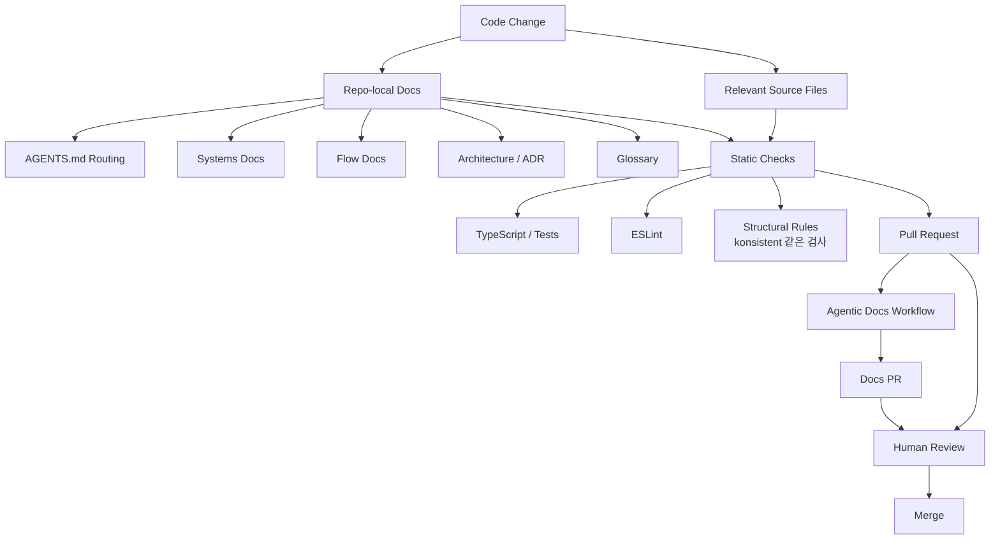

> 한 줄 요약: 에이전트가 코드를 고치기 시작하면 문서는 안내문이 아니라 작업 입력값이 된다. AGENTS.md와 repo-local documentation은 필요하지만, 리뷰·검증·자동화 규칙 없이 늘리면 오래된 지식을 더 그럴듯하게 반복할 수 있다.

## 왜 지금 AI 에이전트 문서화가 이슈인가

AI 에이전트, AGENTS.md, repo-local documentation을 둘러싼 논쟁은 문서를 어디에 두느냐의 문제가 아니다. 코드 변경을 맡긴 자동화가 어떤 맥락을 믿고 움직이게 할 것인가의 문제다.

선정 글감은 AGENTS.md를 상세 설명서가 아니라 라우팅 계층으로 두고, 실제 시스템 설명은 `docs/` 아래에 두자고 제안한다. `docs/systems/`, `docs/flows/`, `docs/architecture/`, `docs/glossary.md`, ADR(Architecture Decision Record)을 나눠 사람과 에이전트가 같은 지식 기반을 읽게 만드는 방식이다.

이 접근이 개발자 커뮤니티에서 논의될 만한 이유는 있다. 에이전트가 실패하는 순간은 문법을 몰라서만 생기지 않는다. 시스템 경계, 도메인 용어, 예외 처리, 배포 제약, 보안 전제 같은 암묵지가 빠졌을 때 그럴듯하지만 위험한 패치가 나온다.

반대쪽 문제도 있다. 문서는 쉽게 낡는다. AGENTS.md는 금방 프롬프트 조각을 모아 둔 파일이 된다. 에이전트에게 더 많은 텍스트를 읽히면 나아질 것 같지만, 실제로는 오래된 규칙을 더 자신 있게 적용하는 실패도 생긴다.

## 커뮤니티에서 갈리는 지점: AGENTS.md는 문서인가, 실행 계약인가

첫 번째 쟁점은 AGENTS.md의 역할이다.

선정 글감의 핵심은 AGENTS.md를 얇게 유지하자는 데 있다. AGENTS.md는 어디를 읽고 어떻게 작업할지 알려주는 운영 가이드이고, 시스템 동작 설명은 `docs/`가 맡는다. 이 구분이 없으면 한 파일에 빌드 명령, 보안 주의, 도메인 설명, 배포 예외, 팀 규칙이 계속 붙는다.

다만 얇은 AGENTS.md만으로 품질이 보장되지는 않는다. 에이전트가 관련 문서를 읽었다는 사실과, 그 문서가 현재 코드와 맞는다는 사실은 별개다.

Vercel의 konsistent 사례가 이 틈을 짚는다. konsistent는 TypeScript 코드베이스에서 구조적 규칙을 검사하는 CLI다. 특정 패턴의 파일이 어떤 export를 가져야 하는지, 어떤 폴더에 어떤 파일이 함께 있어야 하는지, 클래스가 어떤 타입을 구현해야 하는지를 프로젝트 설정으로 강제한다.

이건 일반적인 ESLint나 타입 검사와 결이 다르다. 타입은 맞지만 아키텍처 관례를 어긴 코드가 있을 수 있다. 에이전트와 사람이 같은 컨텍스트를 공유하려면 문서뿐 아니라 결정론적 검사도 필요하다.

GitHub의 Agentic Workflows 사례도 같은 방향을 보여준다. Aspire 팀은 제품 저장소와 문서 저장소가 다른 상황에서, 병합된 제품 변경을 바탕으로 문서 PR을 자동 생성하고 기능을 만든 엔지니어가 리뷰하게 했다. 공개된 사례에 따르면 Aspire 13.3과 13.4에서 기능 문서 PR 82개가 제품 PR 이후 중앙값 44.8시간에 병합됐다.

여기서 핵심은 자동 작성 자체가 아니다. cross-repo 자동화에서 넓은 토큰 권한을 피하고, 리뷰 체인을 남기고, 사람이 최종 책임을 갖게 만든 점이다. 에이전트 문서화는 생성 속도보다 권한 경계와 검토 경로의 문제에 가깝다.

## 아키텍처 관점에서 볼 점: repo-local docs를 지식 그래프로 착각하지 말기

repo-local documentation은 별도 문서 플랫폼보다 단순하다. Markdown 파일을 저장소에 두고 코드와 함께 리뷰한다. 이 단순함이 장점이다.

다만 이 구조를 지식 그래프처럼 과신하면 실패한다. 저장소 안에 문서가 있다고 해서 자동으로 최신 상태가 되지는 않는다. 에이전트가 읽기 좋은 구조라고 해서 사람이 유지하기 쉬운 구조라는 보장도 없다.

현실적인 아키텍처는 네 층으로 나누는 편이 낫다.

이 흐름에서 AGENTS.md는 입구다. 에이전트가 작업 전에 읽어야 할 위치를 안내하고, 변경 후 어떤 문서를 갱신해야 하는지 알려준다. 여기에 시스템 설명을 과하게 넣으면 라우터가 데이터베이스처럼 변한다.

`docs/systems/`는 현재 시스템의 동작을 설명한다. 예를 들어 인증, 결제, 검색, 백그라운드 잡처럼 책임이 분명한 영역이 여기에 들어간다.

`docs/flows/`는 여러 시스템을 가로지르는 흐름을 맡는다. 이메일 인증, 구독 갱신, 웹훅 처리처럼 상태 전이와 실패 처리가 중요한 작업이 대상이다.

`docs/architecture/`와 ADR은 더 느리게 변하는 결정의 기록이다. 왜 세션 기반 인증을 썼는지, 왜 결제 웹훅을 비동기로 처리하는지, 왜 특정 데이터 소유권을 특정 DB에 뒀는지 같은 내용이다.

여기에 구조 검사 계층이 붙어야 한다. 문서에 모든 하네스 패키지는 creator와 settings type을 export해야 한다고 써도, CI가 확인하지 않으면 권고에 머문다. konsistent 같은 도구는 이런 구조적 관례를 실패 가능한 규칙으로 바꾼다.

## 왜 AGENTS.md만으로는 부족할까?

AGENTS.md는 에이전트에게 유용한 신호다. 빌드 명령, 테스트 명령, 수정 금지 경로, 문서 위치, 보안 제한을 짧게 안내할 수 있다.

하지만 AGENTS.md에 시스템 지식을 몰아넣으면 세 가지 문제가 생긴다.

- 변경 충돌이 잦아진다.
- 오래된 설명을 찾기 어려워진다.
- 에이전트가 파일 하나만 읽고 전체 시스템을 안다고 착각한다.

선정 글감이 제안하는 문서 분리는 이 문제를 줄인다. AGENTS.md는 지도이고, `docs/`는 지형이다. 지도에 도시의 모든 건물을 그리려는 순간 둘 다 못 쓰게 된다.

실제로 이런 상황에서는 문서의 양보다 진입 경로가 더 큰 차이를 만든다. 에이전트에게 모든 문서를 읽으라고 하는 것보다, 변경 대상에 맞는 시스템 문서와 플로우 문서를 찾게 하는 편이 낫다.

## 실무에서 볼 점: 도입 전 확인할 조건

repo-local documentation을 도입할 때 가장 먼저 확인할 것은 문서 폴더 구조가 아니다. 코드 리뷰에서 문서 변경을 실제로 요구할 수 있는가다.

다음 조건이 없으면 문서 시스템은 금방 선언으로 남는다.

| 확인 항목 | 질문 |
| --- | --- |
| 변경 감지 | 어떤 코드 변경이 어떤 문서 갱신을 요구하는가 |
| 리뷰 책임 | 문서와 코드 불일치를 누가 막는가 |
| 자동 검사 | 구조 규칙 중 CI로 실패시킬 수 있는 것은 무엇인가 |
| 권한 경계 | 에이전트가 어떤 저장소와 토큰에 접근할 수 있는가 |
| 폐기 절차 | 틀린 ADR이나 낡은 flow doc을 어떻게 표시하는가 |

특히 ADR은 신중해야 한다. Accepted 상태의 ADR을 계속 고쳐서 다른 결정을 설명하게 만들면 기록으로서 가치가 깨진다. 결정이 바뀌면 새 ADR을 만들고 기존 ADR은 Superseded로 남기는 편이 낫다.

문서 자동화도 마찬가지다. GitHub 사례처럼 제품 저장소와 문서 저장소가 갈라져 있으면 권한 문제가 날카로워진다. 넓은 repo-scoped token으로 모든 것을 해결하면 빠르지만, 사고가 났을 때 피해 범위가 커진다.

에이전트가 문서 PR을 만들게 할 수는 있다. 다만 그 PR이 어떤 변경에서 파생됐는지, 어떤 사람이 검토해야 하는지, 어떤 배포 경로를 타는지가 남아야 한다. 자동화의 목적은 사람을 빼는 것이 아니라 누락을 줄이는 쪽에 가깝다.

## 하네스와 테스트 자동화 관점에서 무엇을 강제할까?

AI 에이전트가 자주 망치는 지점은 프로젝트 고유의 구조다. 타입 검사로는 통과하지만, 실제 하네스 등록 규칙이나 패키지 export 규칙을 어기는 경우가 있다.

이런 규칙은 문서에만 두지 말고 세 가지로 나눠야 한다.

- 사람에게 설명할 규칙: `docs/systems/` 또는 `docs/architecture/`
- 에이전트에게 찾게 할 규칙: AGENTS.md의 문서 지도
- CI에서 실패시킬 규칙: 테스트, 린터, 구조 검사

예를 들어 하네스 패키지가 반드시 `createX` 함수와 `XSettings` 타입을 export해야 한다면, 문서에는 이유를 쓴다. 구조 검사에는 패턴을 쓴다. PR 리뷰에서는 예외가 필요한지 판단한다.

이렇게 나누면 문서는 단순 규정집이 아니라 시스템 이해를 돕는 자료가 된다. 반대로 모든 것을 문서로만 통제하면, 에이전트는 잘 정리된 설명을 읽고도 같은 실수를 반복할 수 있다.

## 운영 리스크: 낡은 문서는 장애의 다른 이름이다

문서가 틀리면 개발 속도만 느려지는 게 아니다. AI 에이전트 환경에서는 잘못된 변경이 더 빠르게 만들어질 수 있다.

보안 쪽에서 특히 위험하다. 예를 들어 문서에는 웹훅 서명 검증이 필수라고 쓰여 있는데 코드 경로가 바뀌었다면, 에이전트는 오래된 설명을 기준으로 엉뚱한 파일을 고칠 수 있다. 반대로 문서에 예전 예외가 남아 있으면 더 안전한 현재 구현을 되돌리는 패치가 나올 수도 있다.

데이터 관점에서도 비슷하다. 어떤 테이블이 상태의 소유자인지, 어떤 큐가 재시도 기준인지, 어떤 이벤트가 멱등성(Idempotency)을 가져야 하는지가 문서와 코드에서 어긋나면 장애 분석 시간이 늘어난다.

그래서 repo-local docs의 운영 원칙은 단순해야 한다.

- 문서는 코드의 대체물이 아니다.
- 문서는 현재 동작과 설계 의도를 연결해야 한다.
- 검증 가능한 규칙은 자동화해야 한다.
- 검증 불가능한 판단은 리뷰 책임자를 남겨야 한다.

이 네 가지를 만족하지 못하면, 문서 시스템은 에이전트 성능을 높이기보다 실패의 근거를 제공할 수 있다.

## 정리

AI 에이전트를 위한 repo-local documentation은 쓸모 있는 출발점이다. AGENTS.md를 얇은 라우터로 두고, 시스템·플로우·아키텍처·ADR·용어집을 저장소 안에서 관리하면 사람과 에이전트가 같은 맥락을 읽을 수 있다.

다만 거기서 멈추면 부족하다. 문서가 현재 코드와 맞는지, 구조 규칙이 자동으로 검증되는지, cross-repo 자동화의 권한이 좁게 잡혀 있는지까지 봐야 한다.

당장 확인할 것은 하나다. 지금 저장소의 AGENTS.md나 개발 가이드가 에이전트에게 읽을 위치만 알려주는지, 아니면 오래된 시스템 설명까지 떠안고 있는지 보자. 그 파일이 이미 비대해져 있다면 문서를 더 쓰기 전에 라우팅과 검증 경계를 먼저 나눌 때다.

## 참고 자료

- [선정 글감] [Repo-Local Documentation System for Humans & Agents](https://gist.github.com/lukewilson2002/cb48062397d8b51954034d94b8c19d6d) — Lobsters
- [관련] [Enforce consistent code for agents and humans with konsistent](https://vercel.com/changelog/enforce-consistent-code-for-agents-and-humans-with-konsistent) — Vercel Blog
- [관련] [Automating cross-repo documentation with GitHub Agentic Workflows](https://github.blog/ai-and-ml/github-copilot/automating-cross-repo-documentation-with-github-agentic-workflows/) — GitHub Blog Engineering