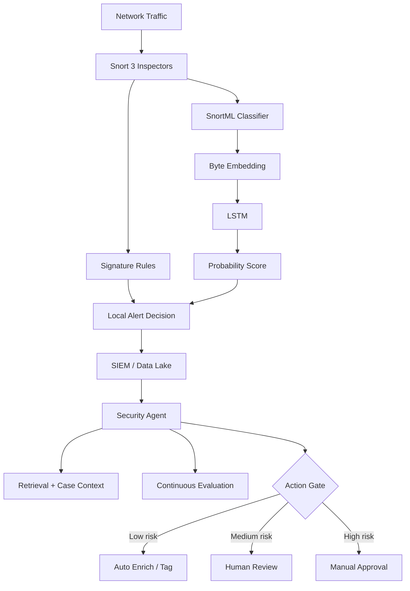

> 한 줄 요약: 침입 탐지에 AI를 붙인다는 말은 센서를 똑똑하게 만든다는 뜻이 아니다. 어떤 판단을 로컬 모델에 맡기고, 어떤 판단을 에이전트와 사람의 검증 루프로 남길지 정하는 문제다.

## 왜 지금 이슈인가

침입 탐지 시스템(IDS), 보안 AI 에이전트, 온디바이스 머신러닝이 같은 논쟁 안으로 들어왔다. SnortML 같은 시도는 시그니처 기반 탐지의 빈틈을 줄이려 하고, 보안 운영 쪽에서는 에이전트가 알림 분류, 엔드포인트 조사, 탐지 규칙 생성까지 맡기 시작했다.

기존 Snort 룰은 강하다. 알려진 CVE, 알려진 페이로드, 알려진 와이어 레벨 패턴에는 낮은 오탐과 예측 가능한 비용으로 반응한다. 문제는 공격자가 같은 취약 경로를 살짝 다른 페이로드로 지나갈 때다. 룰이 작성되고 검증되고 배포되기 전까지 노출 시간이 생긴다.

SnortML은 이 지점을 다룬다. HTTP 요청의 URI query string과 POST body를 Snort 3 내부 파이프라인에서 받아, 로컬 TensorFlow 모델로 SQL injection 같은 공격 클래스의 형태를 판단한다. 원문 기준 단일 분류는 4.7GHz AMD 프로세서에서 약 350마이크로초 수준이고, 추론은 클라우드가 아니라 장비 안에서 끝난다.

이 이야기가 커뮤니티에서 말이 붙는 이유는 단순히 IDS에 ML이 들어갔기 때문이 아니다. 보안 탐지에서 던지는 질문이 바뀌고 있기 때문이다.

- 예전 질문: 이 패킷이 알려진 공격 패턴과 일치하는가?
- 바뀌는 질문: 이 요청은 지금 맥락에서 공격으로 보는 게 맞는가?
- 더 어려운 질문: 이 판단을 자동 조치까지 연결해도 되는가?

## 커뮤니티에서 갈리는 지점

가장 큰 갈림길은 정밀한 센서와 자율 에이전트를 같은 문제의 연장선으로 볼 수 있느냐다.

SnortML 쪽 접근은 작고 선명하다. HTTP 파라미터라는 제한된 입력을 보고, SQL injection, XSS, command injection 같은 취약 클래스의 변형을 잡는다. LSTM(Long Short-Term Memory) 앞에 임베딩(Embedding) 레이어를 두고 raw byte 값을 벡터로 바꾼 뒤, 바이트 순서에서 공격 페이로드의 형태를 학습한다.

예를 들어 apostrophe, OR, URL encoding, 특수문자 조합은 각각 따로 보면 정상 요청에도 나타날 수 있다. 하지만 순서와 주변 맥락을 함께 보면 공격 클래스의 모양이 드러난다. SnortML은 이 판단을 Snort의 기존 inspector publish/subscribe 구조 안에서 수행한다.

반대로 보안 에이전트 논의는 훨씬 넓다. Elastic의 AI agent governance 글은 에이전트가 알림을 분류하고, 지표를 보강하고, 탐지 규칙을 만들고, 운영자가 하던 행동 상당수를 수행하는 단계로 가고 있다고 본다. 여기서 문제는 권한 등급만으로는 충분하지 않다는 점이다.

낮은 위험 작업은 자동, 중간 위험 작업은 승인, 높은 위험 작업은 사람 검토라는 모델은 무엇을 할 수 있는지만 말한다. 그 행동을 잘하고 있는지는 말하지 않는다. 알림 분류 에이전트가 모든 경보를 false positive로 처리해도, 허용된 권한 안에서만 움직였다면 단순 권한 게이트는 실패를 잡지 못한다.

Stack Overflow의 에이전트 오케스트레이션 논의도 비슷한 지점을 짚는다. 2024년식으로 복잡한 오케스트레이션 계층을 두껍게 쌓는 접근이 항상 답은 아니며, 모델이 장기 작업을 더 잘하게 될수록 차별점은 retrieval, 고유 데이터, end-to-end evaluation으로 이동한다는 관점이다. 보안 에이전트에서도 마찬가지다. 프롬프트 흐름도보다 무엇을 근거로 판단했는지, 그 판단이 반복 검증되는지가 더 큰 차이를 만든다.

LLM만능론에 대한 경계도 필요하다. intent prediction에 LLM만으로 부족하다는 논의는 보안에도 적용된다. 다음 토큰 예측은 언어에는 강하지만, 인간 행동 예측이나 공격 캠페인 흐름처럼 그래프, 시계열, 관계 구조가 강한 문제에는 다른 inductive bias가 필요할 수 있다. 보안 탐지에서 모든 상관관계를 채팅형 LLM 하나에 맡기면 모델 선택부터 어긋날 수 있다.

## 아키텍처 관점에서 볼 점

SnortML의 핵심은 대체가 아니라 병렬이다. 기존 시그니처 평가를 없애지 않고, ML 분류기를 같은 파이프라인 안에 병렬로 둔다. 두 경로는 서로 다른 실패 양상을 가진다.

| 탐지 방식 | 강점 | 약점 |
| --- | --- | --- |
| 시그니처 | 알려진 공격에 낮은 오탐, 운영 비용 예측 가능 | 신규 변형과 미작성 룰에 취약 |
| SnortML 같은 로컬 ML | 알려진 취약 클래스의 변형 탐지 가능, 외부 의존 낮음 | 입력 범위와 학습 데이터 밖에서는 약함 |
| 보안 AI 에이전트 | 시간 축, 여러 로그, 엔드포인트, 티켓 맥락 연결 가능 | 설명 가능성, 권한 통제, 평가 체계가 어려움 |

문제는 각 계층이 보는 데이터의 해상도가 다르다는 데 있다. SnortML은 개별 HTTP 파라미터를 본다. 어떤 요청이 오기 20분 전에 같은 IP가 probe를 했는지, 이후 enumeration이 이어졌는지는 기본적으로 보지 못한다. 반대로 에이전트는 여러 이벤트를 엮을 수 있지만, 와이어 레벨에서 350마이크로초 안에 판정해야 하는 일에는 맞지 않는다.

이 구조에서 리스크는 계층마다 다르다.

센서 계층의 리스크는 latency budget과 false positive다. SnortML의 350마이크로초는 작아 보이지만, 고처리량 방화벽에서는 룰셋 크기, 프로토콜 복잡도, 패킷 처리 예산에 따라 체감이 달라진다. XNNPACK으로 행렬 연산을 가속해도, 모든 요청에 ML을 붙이는 순간 병목이 어디로 이동하는지 봐야 한다.

입력 길이도 단순한 구현 디테일이 아니다. Secure Firewall 10.0.0 이후 SnortML은 256, 512, 1024 byte 모델을 query 길이에 따라 고른다. 1024 byte를 넘는 입력은 경계에서 잘린다. 긴 파라미터를 자주 만드는 애플리케이션이라면, 탐지 누락과 오탐 분석 때 이 동작을 반드시 확인해야 한다.

에이전트 계층의 리스크는 판단의 확산이다. 에이전트가 잘못된 경보 분류를 하면 단일 알림 하나가 아니라 이후 조사, 티켓 우선순위, 자동 차단, 룰 생성까지 영향을 줄 수 있다. 그래서 reasoning separation, progressive trust, agent-specific telemetry, continuous evaluation은 문서에 적어두는 원칙이 아니라 운영 구조에 들어가야 하는 항목이다.

## 실무에서 볼 점

도입 판단은 기능 목록보다 실패 모드를 먼저 놓고 해야 한다.

첫째, 어떤 공격면을 줄일 것인지 좁혀야 한다. SnortML은 HTTP 파라미터 기반 공격 클래스에 강점을 둔다. DNS tunneling, SMB exploitation, TLS-layer 공격, timing-based covert channel은 다른 관측 지점과 다른 모델이 필요하다. IDS에 ML이 들어갔다고 전체 네트워크 이상행위 탐지가 해결되는 것은 아니다.

둘째, 기존 시그니처와 ML 결과를 서로 검증 가능한 신호로 다뤄야 한다. 둘 다 울린 알림은 confidence가 높다. ML만 울린 알림은 신규 변형일 수 있지만 정상 쿼리의 특수문자 조합일 수도 있다. 시그니처만 울린 알림은 알려진 공격의 재등장일 가능성이 높다. 세 경우를 같은 큐에 넣으면 운영자는 금방 피로해진다.

셋째, 에이전트는 조치보다 평가부터 붙여야 한다. 많은 팀이 자동화 권한을 어디까지 줄지 먼저 논의하지만, 실제 병목은 그 에이전트가 좋은 판단을 하고 있는지 증명하는 쪽에 있다. ISO 42001, DORA, NIS2, EU AI Act 같은 규제 흐름도 사람이 의미 있는 감독을 유지하고, 시스템이 의도대로 작동한다는 증거를 요구하는 방향으로 간다.

현업에서 비슷한 고민을 하다 보면 자동화가 실패하는 지점은 대개 모델 성능 하나가 아니다. 데이터가 늦게 들어오고, 알림 스키마가 흔들리고, 예외 케이스가 티켓에만 남고, 운영자가 override한 이유가 학습 데이터로 돌아가지 않는다. 이 상태에서 에이전트를 붙이면 똑똑한 판단자가 생기는 게 아니라 불투명한 우회로가 하나 더 생긴다.

도입 전 체크리스트는 단순해야 한다.

- 센서 레벨 판단과 에이전트 레벨 판단을 분리했는가?
- ML 알림, 시그니처 알림, 상관분석 알림의 우선순위를 다르게 처리하는가?
- 모델 입력 길이, truncation, threshold, 업데이트 채널을 운영 문서에 남겼는가?
- 에이전트가 참고한 evidence와 retrieval 결과를 나중에 재현할 수 있는가?
- 사람이 승인한 결정과 거절한 결정이 평가 데이터로 다시 들어가는가?
- 자동 조치 전 단계에서 shadow mode나 dry run 기간을 둘 수 있는가?

대안도 있다. 모든 조직이 SnortML이나 보안 에이전트를 바로 도입할 필요는 없다. 트래픽 규모가 작고 공격면이 단순하다면 잘 관리된 WAF 룰, EDR, SIEM 상관 규칙, 위협 인텔리전스 피드만으로도 충분할 수 있다. 반대로 인터넷 노출 API가 많고, 공격 변형이 빠르며, 보안 운영 큐가 이미 포화 상태라면 로컬 ML 탐지와 에이전트 기반 triage의 조합이 비용을 줄일 수 있다.

핵심은 AI를 어디에 놓을지다. 센서 안의 ML은 빠르고 좁아야 한다. 운영 계층의 에이전트는 느려도 설명 가능하고 검증 가능해야 한다. 두 요구를 한 모델, 한 프롬프트, 한 대시보드로 합치려는 순간 설계가 흐려진다.

## 정리

침입 탐지의 다음 단계는 시그니처를 버리는 일이 아니다. 시그니처, 로컬 ML, 보안 에이전트가 서로 다른 시간 범위와 데이터 범위를 맡도록 나누는 일에 가깝다.

SnortML은 센서가 알려진 패턴 밖의 변형을 볼 수 있게 만든다. 하지만 그것만으로 공격 캠페인의 맥락을 이해하지는 못한다. 에이전트는 그 맥락을 다룰 수 있지만, 권한 게이트만으로는 안전해지지 않는다.

먼저 현재 보안 파이프라인에서 자동 판단이 내려지는 지점을 표시해보는 편이 낫다. 그리고 각 지점마다 입력 데이터, 실패 모드, 재현 가능한 평가 방법이 있는지 확인해야 한다. AI 도입 여부는 그다음 문제다.

## 참고 자료

- [선정 글감] [When the sensor starts thinking: SnortML, agentic AI, and the evolving architecture of intrusion detection](https://stackoverflow.blog/2026/07/06/when-the-sensor-starts-thinking-snortml-agentic-ai-and-the-evolving-architecture-of-intrusion-detection/) — Stack Overflow Blog
- [관련] [The future of governing AI agents](https://www.elastic.co/blog/the-future-of-governing-ai-agents) — Elastic Blog
- [관련] [Agent orchestration is so two-years ago](https://stackoverflow.blog/2026/07/07/agent-orchestration-is-so-two-years-ago/) — Stack Overflow Blog
- [관련] [Why intent prediction needs more than an LLM](https://stackoverflow.blog/2026/06/30/why-intent-prediction-needs-more-than-an-llm/) — Stack Overflow Blog