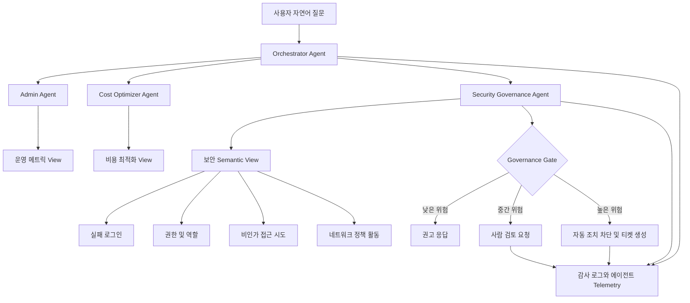

> 한 줄 요약: AI 에이전트 보안 거버넌스의 중심은 더 똑똑한 보안 챗봇이 아니라, 에이전트가 볼 수 있는 데이터와 실행할 수 있는 행동, 실패했을 때 번질 피해를 아키텍처로 제한하는 데 있다.

## 왜 지금 이슈인가

멀티 에이전트(Multi-Agent) 구조가 운영, 비용 최적화, 보안 분석까지 들어오면서 질문이 바뀌고 있다.

예전 질문은 이랬다.

- 로그를 어디에 모을까?
- 권한 점검 쿼리를 어떻게 자동화할까?
- 보안 대시보드를 누가 매주 확인할까?

이제는 이렇게 묻는다.

- AI 에이전트가 실패 로그와 권한 정보를 보고 위험을 판단해도 될까?
- 비용 최적화 에이전트와 보안 에이전트가 같은 질문에 함께 답하면 무엇이 좋아질까?
- 사람 승인(Human-in-the-loop)이 있으면 정말 안전한가?
- 에이전트가 틀렸다는 사실을 나중에 어떻게 증명할 수 있을까?

선정 글감인 Snowflake 멀티 에이전트 예시는 이 변화를 잘 보여준다. Admin Agent는 사용량과 스토리지를 보고, Cost Optimizer Agent는 유휴 웨어하우스와 비용 낭비를 찾는다. Security and Governance Agent는 실패 로그인, 과도한 권한, 비인가 접근 시도를 다룬다. 사용자가 자연어로 물으면 Orchestrator Agent가 알맞은 전문 에이전트로 넘긴다.

겉으로는 관리 콘솔에 AI를 붙인 이야기처럼 보인다. 실무 관점에서 더 큰 쟁점은 따로 있다.

보안 업무를 에이전트에게 맡기는 순간, 에이전트는 단순 조회 도구에서 운영 판단 경로의 일부로 바뀐다. 이때는 답변 품질만으로 부족하다. 권한 경계, 데이터 지연, 승인 피로, 감사 로그, 재현 가능한 평가 체계가 같이 들어가야 한다.

## 커뮤니티에서 갈리는 지점

### AI 보안 에이전트는 자동화인가, 위험 증폭기인가?

찬성 쪽의 논리는 분명하다. 보안팀이 처리해야 할 신호는 많고, 사람이 모든 권한 변경과 실패 로그인 패턴을 눈으로 확인하기는 어렵다.

Anthropic이 소개한 앨버타 정부 사례는 이 기대를 크게 만든다. 27개 부처에 걸친 약 1,280개 애플리케이션과 3,400개 저장소를 대상으로 Claude Code를 활용했고, 4억 6,600만 줄의 코드를 20시간 안에 스캔했다는 내용이다. 낡고 문서화가 부족한 정부 시스템에서 취약점을 찾고 수정하는 데 AI 코딩 에이전트가 쓰였다는 점은, 보안 자동화가 데모 수준을 넘어가고 있음을 보여준다.

반대편의 의문도 만만치 않다.

보안 에이전트가 많은 코드를 읽고, 많은 로그를 보고, 많은 권한 정보를 분석할수록 접근 권한도 커진다. 잘못된 분류 하나가 알림 누락으로 끝날 수도 있지만, 자동 조치까지 연결되면 계정 잠금, 권한 회수, 배포 차단 같은 운영 장애로 이어질 수 있다.

Anthropic의 Claude containment 글은 이 긴장을 정면으로 다룬다. 에이전트 배포 위험은 실패 가능성과 피해 범위로 나뉘며, 모델이 좋아질수록 실패 가능성은 줄어도 접근 권한이 커지면 피해 범위는 커진다. 특히 사람 승인 프롬프트가 완전한 해법은 아니라는 대목이 현실적이다. 승인 요청이 많아지면 사용자는 점점 덜 주의 깊게 승인한다. 해당 글은 Claude Code에서 사용자가 권한 프롬프트의 약 93%를 승인했다는 관찰도 언급한다.

이 수치는 사람 승인 자체가 나쁘다는 뜻이 아니다. 승인 장치가 너무 자주 나오면 보안 통제가 아니라 클릭 절차가 된다는 뜻에 가깝다.

### 전문 에이전트 여러 개가 정말 더 안전한가?

Snowflake 예시는 전문 에이전트를 나누는 방식을 택한다. 운영, 비용, 보안을 하나의 거대한 에이전트에 넣지 않고, 각 영역에 맞는 semantic view와 도구를 붙인다.

이 방식에는 장점이 있다.

| 선택지 | 장점 | 위험 |
|---|---|---|
| 단일 범용 에이전트 | 구현이 단순하고 사용자 경험이 쉽다 | 권한 범위가 커지고 테스트 경계가 흐려진다 |
| 전문 에이전트 + 오케스트레이터 | 책임과 데이터 범위를 나누기 쉽다 | 라우팅 오류, 상태 공유, 관측성 설계가 필요하다 |
| 대시보드 + 수동 분석 | 예측 가능하고 감사가 쉽다 | 대응 속도와 탐색성이 떨어질 수 있다 |

여기서 반대로 물어봐야 한다. 전문 에이전트로 쪼갰다고 자동으로 안전해지는가?

아니다. 에이전트를 나누는 것은 출발점일 뿐이다. Security Agent가 모든 권한 테이블과 감사 로그를 읽고, Orchestrator가 모든 질문을 우회해서 보낼 수 있으며, 실행 로그가 남지 않는다면 이름만 분리된 단일 에이전트와 크게 다르지 않다.

Google의 ADK Go 2.0이 graph-based workflow engine을 전면에 둔 것도 이 맥락에서 읽을 수 있다. 실제 에이전트 앱은 단일 프롬프트가 아니라 분기, fan-out, 재시도, 사람 승인, 반복 실행을 포함한다. 이를 임시 제어 흐름으로 엮으면 테스트와 관측이 어려워진다. 그래프 기반 워크플로는 에이전트의 판단 경로를 구조화하고, 어디서 승인하고 어디서 재시도할지 드러낸다.

보안 에이전트도 마찬가지다. 똑똑한 모델 하나보다 실행 경로가 보이는 그래프가 더 유용할 때가 많다.

## 아키텍처 관점에서 볼 점

### AI 보안 거버넌스 아키텍처는 어떻게 나눠야 할까?

Snowflake 예시는 다음 계층으로 볼 수 있다.

1. 원천 데이터: ACCOUNT_USAGE, 로그인 이력, 권한 부여, 역할 계층, 네트워크 정책
2. 보안 뷰: 실패 로그인, 과도한 권한, 비인가 접근, 사용자 감사 요약
3. semantic view: 자연어 질문을 안정적인 지표와 차원으로 연결
4. 전문 에이전트: 보안 영역별 분석 도구를 호출
5. 오케스트레이터: 운영, 비용, 보안 질문을 라우팅하고 응답을 합성

이 구조에서 가장 취약한 부분은 경계가 애매한 지점이다.

이 다이어그램에서 핵심은 Security Agent가 바로 조치하지 않는다는 점이다. 먼저 governance gate를 지난다. 낮은 위험은 권고로 끝내고, 중간 위험은 사람에게 넘기고, 높은 위험은 자동 조치를 막고 티켓이나 별도 승인 흐름으로 보낸다.

Elastic의 AI agent governance 글도 비슷한 문제를 짚는다. 단순한 tiered autonomy 모델은 어떤 행동을 할 수 있는지는 말해주지만, 그 행동이 잘 수행됐는지는 말해주지 못한다. 예를 들어 보안 triage 에이전트가 모든 알림을 false positive로 분류하면 승인 게이트를 건드리지 않고도 큰 사고를 만들 수 있다.

그래서 권한 등급표만으로는 부족하다.

- reasoning trace: 왜 이 위험 등급을 줬는지
- evaluation set: 과거 사고와 정상 이벤트에 대한 회귀 테스트
- agent telemetry: 어떤 도구를 어떤 순서로 호출했는지
- drift detection: 같은 질문에 대한 판단이 시간이 지나며 바뀌는지
- audit replay: 나중에 같은 입력으로 비슷한 판단을 재현할 수 있는지

### Snowflake 보안 에이전트에서 놓치기 쉬운 데이터 지연

선정 글감은 SNOWFLAKE.ACCOUNT_USAGE 기반 뷰를 만든다. 이 선택은 실용적이다. 많은 조직에서 이미 접근 가능한 관리 데이터이고, failed login, role grant, query history, warehouse usage 같은 운영 정보와도 잘 맞는다.

다만 ACCOUNT_USAGE 계열 뷰에는 지연이 있다. 원문도 near-real-time 사고 대응에는 event-driven telemetry와 결합하라고 말한다. 이 문장은 작아 보이지만 설계상으로는 꽤 크다.

실패 로그인 이상 징후를 월간 리뷰로 보는 것과, 계정 탈취 시도를 몇 분 안에 감지하는 것은 다른 시스템이다. 같은 Security Agent라는 이름을 쓰더라도 데이터 지연 허용 범위가 다르다.

| 사용 사례 | 허용 가능한 지연 | 적합한 설계 |
|---|---:|---|
| 월간 권한 리뷰 | 수 시간 이상도 가능 | ACCOUNT_USAGE 기반 리포트 |
| 비용 상승과 보안 리스크 통합 분석 | 약간의 지연 허용 | 운영/비용/보안 뷰 조합 |
| 계정 탈취 의심 대응 | 짧은 지연 필요 | 이벤트 스트림, SIEM, 알림 연동 |
| 자동 권한 회수 | 낮은 지연보다 정확성 우선 | 승인 워크플로와 변경 로그 필수 |

현업에서 비슷한 자동화를 붙이다 보면, 대시보드에서 잘 보이는 쿼리를 그대로 대응 자동화에 쓰고 싶어진다. 그런데 조회용 데이터와 대응용 데이터는 다르다. 지연, 누락, 중복, 권한 모델이 다르기 때문이다.

AI 에이전트는 이 차이를 더 흐리게 만든다. 자연어로 그럴듯하게 답하기 때문이다. 그래서 에이전트 응답에는 데이터 기준 시각, 조회 범위, 신뢰도, 후속 확인 경로가 함께 있어야 한다.

## 실무에서 볼 점

### AI 보안 에이전트 도입 전에 무엇을 확인해야 할까?

첫 번째는 읽기 전용부터 시작하는 것이다.

Security Agent가 처음부터 계정을 잠그거나 권한을 회수하게 만들 필요는 없다. 실패 로그인 요약, 과도한 권한 후보, 비인가 접근 시도 후보를 찾아서 티켓으로 보내는 정도로도 가치가 있다. 자동 조치는 데이터 품질과 평가 체계가 쌓인 뒤에 붙이는 편이 낫다.

두 번째는 전문 에이전트의 권한을 실제로 분리하는 것이다.

Admin Agent, Cost Agent, Security Agent를 코드상 클래스로만 나누고 같은 서비스 계정으로 모든 테이블을 읽게 하면 분리 효과가 약하다. Snowflake라면 역할(Role), 스키마, 뷰, masking policy, row access policy를 이용해 에이전트별 접근 범위를 줄여야 한다. Kubernetes 환경이라면 service account, RBAC, namespace, network policy까지 같이 봐야 한다.

세 번째는 사람 승인을 과신하지 않는 것이다.

Anthropic containment 글의 93% 승인 관찰은 에이전트 UI 설계에 직접적인 힌트를 준다. 승인 요청은 적어야 하고, 맥락이 충분해야 하며, 위험한 변경일수록 diff와 되돌리기 경로가 보여야 한다. 승인 버튼만 두는 방식은 감사 가능한 통제가 아니다.

네 번째는 보안 대시보드와 에이전트를 경쟁 관계로 보지 않는 것이다.

Vercel Security Dashboard는 프로젝트와 계정 전반의 보안 상태를 모아 보여주는 방향이다. 2FA 미사용 멤버, 공개 preview environment, 장기 credential 같은 작은 설정 오류가 팀이 커지며 빠르게 누적된다는 문제의식이다. 이는 에이전트가 대체할 대상보다는, 에이전트가 참조해야 할 안정적인 보안 상태 저장소에 가깝다.

에이전트는 질문에 맞춰 탐색하고 설명하는 데 강하다. 대시보드는 현재 상태를 일관되게 보여주고 조직 전체 기준을 맞추는 데 강하다. 둘을 합치려면 에이전트가 대시보드의 findings를 근거로 삼고, 대시보드는 에이전트의 판단과 조치 이력을 다시 흡수하는 구조가 낫다.

### 자동화해도 되는 것과 남겨야 하는 것

실무 판단은 보통 yes/no로 끝나지 않는다. 아래처럼 나눠야 한다.

| 작업 | 에이전트 자동화 적합도 | 이유 |
|---|---:|---|
| 실패 로그인 추세 요약 | 높음 | 조회와 집계 중심 |
| 미사용 고권한 계정 후보 탐지 | 높음 | 규칙과 근거가 비교적 명확 |
| 권한 회수 추천 | 중간 | 업무 맥락 확인 필요 |
| 계정 잠금 | 낮음에서 중간 | 오탐 시 업무 중단 |
| 네트워크 정책 변경 | 낮음 | 장애 범위가 클 수 있음 |
| 감사 보고서 초안 작성 | 높음 | 사람이 검토하기 좋음 |
| 규정 위반 최종 판단 | 낮음 | 법무, 보안 정책, 조직 맥락 필요 |

이 표에서 가장 조심해야 할 구간은 중간이다. 권한 회수 추천처럼 자동화 가치가 크지만 맥락이 빠지면 사고가 나는 작업이다.

여기에는 progressive trust가 맞다. 처음에는 후보만 제시하고, 그다음에는 티켓 생성까지 맡기고, 충분한 평가가 쌓이면 낮은 위험의 변경만 자동 적용한다. Elastic이 말하는 지속 평가와 에이전트 전용 telemetry가 이 단계 전환의 근거가 된다.

### Kubernetes와 인프라 환경에서는 무엇이 달라지나?

Snowflake 예시는 데이터 플랫폼 중심이지만, 같은 패턴은 Kubernetes와 인프라에도 적용된다.

- Admin Agent: cluster health, node pressure, deployment 상태
- Cost Agent: idle node, over-provisioned request/limit, 미사용 volume
- Security Agent: RBAC 과다 권한, image 취약점, public ingress, secret 노출
- Orchestrator: 장애, 비용, 보안 맥락을 함께 묶어 설명

다만 Kubernetes에서는 조치의 폭발 반경이 더 크다. 잘못된 network policy는 서비스를 끊고, 잘못된 RBAC 변경은 배포 파이프라인을 멈추며, 잘못된 autoscaling 판단은 비용과 장애를 동시에 만든다.

그래서 인프라 에이전트에는 특히 세 가지가 필요하다.

- dry-run: 실제 적용 전 예상 변경을 보여주기
- policy-as-code: OPA, Kyverno, Terraform policy 같은 기존 통제와 연결하기
- rollback path: 변경 전 상태와 되돌리기 명령을 함께 남기기

AI 에이전트가 kubectl 권한을 갖는 순간부터는 챗봇이 아니다. 운영 주체다. 운영 주체라면 SLO, 감사, 장애 대응, 권한 회수 기준이 있어야 한다.

## 정리

AI 보안 거버넌스는 에이전트 하나를 추가하는 문제가 아니다. 운영 데이터, semantic layer, 전문 에이전트, 오케스트레이터, 사람 승인, 대시보드, telemetry, 평가 세트를 한 흐름으로 묶는 설계 문제다.

Snowflake 멀티 에이전트 예시는 좋은 출발점이다. 운영, 비용, 보안 질문을 나눠 처리하고 다시 하나의 답으로 합치는 방식은 실제 관리 업무와 잘 맞는다. 다만 이 구조를 그대로 운영 자동화로 밀어붙이면 위험하다. 데이터 지연, 권한 경계, 승인 피로, 감사 재현성을 먼저 확인해야 한다.

당장 할 일은 하나다. 보안 에이전트를 만들기 전에 조직의 위험 작업을 세 등급으로 나눠보자.

- 읽기와 요약만 허용할 작업
- 티켓 생성과 승인 요청까지 허용할 작업
- 자동 조치를 금지할 작업

이 표가 없으면 멀티 에이전트는 편리한 인터페이스가 아니라 권한이 넓은 블랙박스가 된다.

## 참고 자료

- [선정 글감] [From Optimization to Protection: Adding a Security and Governance Agent to Your Snowflake Multi-Agent Team (Part 3)](https://dev.to/swaroop_krishna_e2f4b83b2/from-optimization-to-protection-adding-a-security-and-governance-agent-to-your-snowflake-369f), DEV Community
- [관련] [Build reliable multi-agent applications with ADK Go 2.0](https://developers.googleblog.com/announcing-adk-go-20/), Google Developers
- [관련] [Vercel Security Dashboard is in private beta](https://vercel.com/changelog/vercel-security-dashboard-is-in-private-beta), Vercel Blog
- [관련] [Government of Alberta uses Claude to find and fix cybersecurity vulnerabilities across government systems](https://www.anthropic.com/news/alberta-government-claude-cybersecurity), Anthropic News
- [관련] [How we contain Claude across products](https://www.anthropic.com/engineering/how-we-contain-claude), Anthropic Engineering
- [관련] [The future of governing AI agents](https://www.elastic.co/blog/the-future-of-governing-ai-agents), Elastic Blog