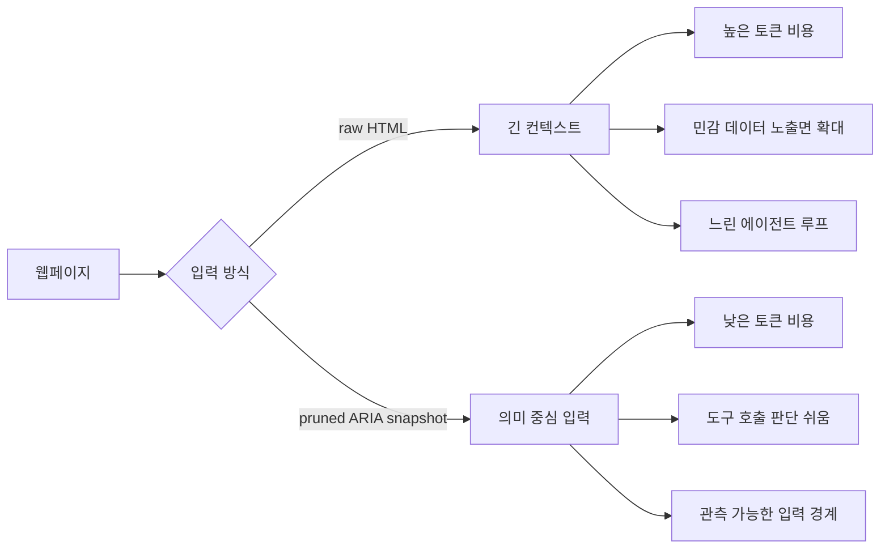

> 한 줄 요약: 토큰 효율 논쟁은 모델이 말을 길게 하느냐의 문제가 아니라, 에이전트가 컨텍스트, 도구 호출, 가격 변동을 어디까지 통제할 수 있느냐의 문제다. `\no_think` 같은 프롬프트 팁은 임시 처방이고, 더 큰 리스크는 비용 구조가 제품 아키텍처 바깥에 방치되는 데 있다.

## 무슨 일이 있었나

Reddit LocalLLaMA에서 한 사용자가 CEO 발언을 인용하며 토큰 효율(token efficiency) 논쟁을 꺼냈다. 핵심은 토큰 사용량이 앞으로 12개월 안에 최대 20% 수준으로, 그다음 해에는 90%까지 줄어야 한다는 취지였다.

커뮤니티 반응은 곧장 실무적인 농담으로 번졌다. 이메일 요약 프롬프트 앞에 `\no_think`를 붙이면 되는 것 아니냐는 식이다. 여기서 `no_think`는 추론 과정을 길게 생성하는 모델에게 생각 토큰을 줄이라고 유도하는 프롬프트 관용구처럼 쓰인다.

확인된 사실은 이렇다.

- LocalLLaMA 커뮤니티에서 토큰 효율과 에이전트 비용을 둘러싼 게시물이 동시에 여러 개 올라왔다.
- 한 게시물은 raw HTML 대신 정리된 접근성 트리(ARIA snapshot)를 모델에 넘기는 `barebrowse`를 소개했다.
- 다른 게시물은 Neuralwatt가 7월 16일부터 가격을 두 배로 올린다는 이메일을 받았다고 공유했다.
- 또 다른 게시물은 에이전트 작업에서 튜닝된 75B 모델보다 튜닝되지 않은 27B 모델이 더 적은 도구 호출로 좋은 결과를 냈다고 주장했다.

추정인 부분도 분리해서 봐야 한다. 특정 CEO의 발언이 실제 제품 가격 정책으로 바로 이어진다고 볼 근거는 없다. Neuralwatt 가격 인상도 개별 서비스 사례이지, 모든 추론 API 가격의 방향을 대표한다고 단정할 수 없다. 27B 모델이 75B 모델보다 낫다는 실험도 게시자가 구성한 작업, 프롬프트, 하드웨어 조건 안에서 읽어야 한다.

그런데도 커뮤니티가 민감하게 반응한 이유는 있다. 토큰은 이제 단순한 과금 단위가 아니다. 에이전트 제품의 지연 시간, 장애 범위, 개인정보 노출면, 운영비를 동시에 흔드는 리소스가 됐다.

## 왜 사람들이 반응했나

### 토큰 효율 논쟁은 왜 불편하게 들리나

토큰을 90% 줄여야 한다는 말은 겉으로는 비용 최적화처럼 들린다. 하지만 사용자 입장에서는 다른 질문으로 들린다.

지금까지 비싼 모델과 긴 컨텍스트를 팔아놓고, 이제는 사용자에게 적게 쓰는 법을 배우라고 하는 것인가.

이 불편함은 단순한 반감이 아니다. 많은 AI 도구가 긴 컨텍스트 창, 에이전트 자동화, 멀티스텝 추론을 앞세워 확장됐다. 그런데 실제 운영 단계에 들어서면 긴 생각, 반복 도구 호출, 중복 컨텍스트 주입이 비용 폭탄으로 돌아온다.

프롬프트 앞에 `\no_think`를 붙이면 된다는 반응은 그래서 농담이면서 진단이다. 커뮤니티는 모델 제공자가 말하는 거대한 효율 목표를, 사용자가 직접 프롬프트로 우회해야 하는 현실로 받아들였다.

### 가격이 오르면 로컬 LLM의 의미가 달라진다

Neuralwatt 가격이 7월 16일부터 두 배가 된다는 게시물은 토큰 효율 논쟁에 다른 결을 더한다. 사람들은 가격 인상 자체보다 예측 가능성에 더 예민하게 반응한다.

클라우드 추론 비용은 처음에는 실험 비용이다. 나중에는 제품 원가가 된다. 이 차이를 놓치면 작은 자동화도 운영비를 계속 밀어 올린다.

현업에서 비슷한 고민을 하다 보면, 모델 호출량은 초기에 잘 보이지 않는다. 사용자가 적을 때는 프롬프트 몇 줄 늘어나는 일이 별일 아닌 것처럼 보인다. 하지만 에이전트가 브라우저를 열고, 페이지를 읽고, 도구를 여러 번 호출하고, 실패하면 다시 시도하는 순간 비용은 요청 수가 아니라 경로 길이에 비례한다.

| 리스크 | 겉으로 보이는 문제 | 실제로 확인할 지점 |
|---|---|---|
| 가격 변동 | API 단가 인상 | 월별 상한, 캐시율, 대체 모델 경로 |
| 긴 컨텍스트 | 답변 품질 향상 | 중복 주입, 민감 데이터 포함 여부 |
| 추론 토큰 | 더 똑똑한 답변 | 지연 시간, 실패 재시도, 비용 추적 |
| 에이전트 반복 | 자동화 성공률 | 도구 호출 수, 롤백 가능성, 관측성 |

로컬 LLM(local LLM)은 여기서 단순히 무료 대안이 아니다. 비용 예측권과 데이터 경계권을 되찾는 선택지에 가깝다. 물론 로컬도 공짜는 아니다. GPU, 전력, 운영 복잡도, 모델 업데이트 부담이 있다. 다만 가격표가 갑자기 바뀌는 리스크와 외부 서비스 장애 의존도는 줄일 수 있다.

### raw HTML을 모델에 넣는 순간 비용은 구조가 된다

`barebrowse` 게시물은 이 논쟁을 더 구체적으로 만든다. 작성자는 로컬 모델 에이전트에 브라우저를 붙일 때 raw HTML을 통째로 넣으면 컨텍스트가 빠르게 소진된다고 지적한다. 대신 광고, 내비게이션, 보일러플레이트를 제거한 접근성 트리(ARIA snapshot)를 넘기면 토큰을 크게 줄일 수 있다는 주장이다.

이건 단순한 라이브러리 소개가 아니다. 에이전트 아키텍처에서 입력을 어떻게 줄일 것인가에 대한 사례다.

브라우저 기반 에이전트는 페이지를 읽어야 한다. 하지만 웹페이지는 사람에게 보이는 정보보다 훨씬 많은 노이즈를 포함한다. 메뉴, 푸터, 추적 스크립트, 스타일, 중복 링크, 숨겨진 요소가 섞여 있다. 이걸 모델에게 그대로 넘기면 모델은 비싼 독해력을 노이즈 처리에 쓰게 된다.

이 흐름에서 핵심은 모델 선택보다 전처리다. 더 싼 모델을 찾는 것보다, 모델에게 보여줄 세계를 줄이는 쪽이 더 안정적일 때가 많다.

### 큰 모델보다 짧은 경로가 이길 때

27B 모델이 75B 모델보다 에이전트 작업에서 나았다는 게시물도 같은 축에 있다. 작성자는 27B 모델이 중립적인 시스템 프롬프트에서 모든 에이전트 작업을 6~9회 도구 호출 안에 통과했고, 75B 모델은 통과를 위해 손으로 조정한 프로필이 필요했으며 턴 수도 두 배였다고 설명했다.

이 주장은 벤치마크로 일반화하기 어렵다. 모델명, 양자화, vLLM 구성, GPU 구성, 컨텍스트 길이, 프롬프트 조건이 모두 영향을 준다.

다만 커뮤니티가 반응한 지점은 분명하다. 에이전트에서는 초당 토큰 수(tokens per second)보다 턴 수가 더 큰 비용이 될 수 있다. 한 번의 답변이 빠른 모델보다, 덜 헤매고 덜 호출하고 덜 되묻는 모델이 실제 사용에서는 더 싸고 빠르다.

이건 제품 설계에서도 자주 놓치는 부분이다. 모델 성능표만 보면 큰 모델이 좋아 보인다. 하지만 실제 워크플로에서는 다음 질문이 더 중요하다.

- 같은 작업을 몇 번의 도구 호출로 끝내는가
- 실패했을 때 재시도 비용은 얼마인가
- 컨텍스트가 깊어져도 판단 품질이 유지되는가
- 시스템 프롬프트 튜닝이 없으면 성능이 무너지는가
- 토큰 절약이 답변 품질 저하로 이어지는 구간은 어디인가

## 내가 보는 핵심

### 토큰 최적화는 프롬프트 문제가 아니라 경계 설계 문제다

이번 논쟁에서 가장 위험한 오해는 토큰 효율을 사용자의 프롬프트 습관 문제로 축소하는 것이다. 물론 `\no_think` 같은 팁은 도움이 될 수 있다. 요약, 분류, 단순 추출 작업에서 긴 추론을 막으면 비용과 지연 시간을 줄일 수 있다.

하지만 제품 단위에서는 그걸 사용자에게 맡기면 안 된다. 어떤 작업에서 추론을 켜고 끌지, 어떤 데이터를 모델에 넣을지, 실패 시 어디까지 재시도할지, 어떤 모델로 라우팅할지를 시스템이 결정해야 한다.

토큰을 줄이는 방식도 여러 층으로 나뉜다.

| 층 | 할 일 | 예시 |
|---|---|---|
| 입력 경계 | 모델에 넣기 전 노이즈 제거 | HTML 대신 ARIA snapshot |
| 추론 정책 | 작업별 생각 토큰 제한 | 요약은 짧게, 계획 수립은 길게 |
| 모델 라우팅 | 작업 난도별 모델 선택 | 분류는 소형, 복합 계획은 고성능 |
| 캐싱 | 반복 입력 재사용 | 문서 임베딩, 페이지 스냅샷 캐시 |
| 관측성 | 비용을 경로별로 추적 | 요청당 토큰이 아니라 작업당 토큰 |

이 중 하나만 해서는 부족하다. 입력을 줄이지 않은 채 모델만 바꾸면 품질이 흔들린다. 캐시 없이 추론만 줄이면 반복 작업에서 계속 새 비용이 난다. 관측성이 없으면 무엇이 비싼지 모른 채 감으로 최적화하게 된다.

### 개인정보와 보안 리스크도 토큰 수와 붙어 있다

토큰 효율 논쟁은 비용 이야기로 시작하지만, 데이터 리스크와도 연결된다. 브라우저 에이전트가 로그인된 페이지를 읽고, 쿠키가 있는 브라우저 프로필을 재사용하고, 긴 DOM을 모델에 넘기는 구조라면 입력 토큰에는 민감한 데이터가 섞일 수 있다.

`barebrowse`처럼 실제 브라우저 프로필을 재사용해 로그인 페이지를 읽는 방식은 편하다. 로그인 스크립트를 따로 만들지 않아도 된다. 반대로 말하면 세션 권한을 가진 도구가 모델 입력을 만드는 경로에 들어온다.

이때 봐야 할 것은 라이브러리의 선악이 아니다. 권한 경계다.

- 모델에 전달되는 최종 입력을 로그로 확인할 수 있는가
- 비밀번호, 토큰, 이메일, 사내 문서 제목을 제거하는 필터가 있는가
- 페이지 전체가 아니라 필요한 영역만 선택할 수 있는가
- 로컬 모델과 원격 API 모델에 같은 데이터를 보내도 되는가
- 브라우저 프로필 재사용 권한을 작업별로 분리할 수 있는가

토큰을 줄이는 일은 곧 노출면을 줄이는 일이 될 수 있다. 반대로 무작정 긴 컨텍스트를 쓰는 습관은 비용뿐 아니라 데이터 반출 위험도 키운다.

### 커뮤니티의 농담은 대개 비용 모델을 찌른다

LocalLLaMA 커뮤니티의 반응이 흥미로운 이유는 냉소만 있는 게 아니기 때문이다. 누군가는 가격 인상을 보고 로컬 전환을 말하고, 누군가는 브라우저 입력을 줄이는 도구를 만들고, 누군가는 작은 모델이 에이전트에서 이기는 조건을 공유한다.

각각은 다른 이야기처럼 보인다. 하지만 같은 질문으로 모인다.

모델이 더 싸지기를 기다릴 것인가, 아니면 애플리케이션이 토큰을 덜 낭비하도록 설계할 것인가.

여기서 판단을 미루면 나중에 비용 최적화가 제품 품질을 해치는 방식으로 들어온다. 답변을 짧게 자르고, 컨텍스트를 줄이고, 모델을 낮추고, 실패율이 올라간 뒤에야 원인을 찾게 된다. 처음부터 경로별 토큰 비용과 실패율을 같이 봤다면 피할 수 있는 일이다.

## 앞으로 볼 기준

### 다음 토큰 효율 뉴스를 볼 때 확인할 것

토큰 효율을 말하는 발표나 게시물을 볼 때는 절감률 숫자만 보면 부족하다. 아래 기준으로 봐야 실제 판단에 가깝다.

- 절감 대상이 입력 토큰인지, 출력 토큰인지, 추론 토큰인지 구분되어 있는가
- 품질 저하 기준을 무엇으로 잡았는가
- 에이전트라면 도구 호출 수와 재시도 수가 함께 줄었는가
- 긴 컨텍스트 작업에서도 같은 결과가 나오는가
- 가격 인상이나 무료 한도 변경에 대비한 대체 경로가 있는가
- 민감 데이터가 모델 입력에 들어가기 전 제거되는가
- 로컬 모델과 원격 모델을 작업별로 나눌 수 있는가

이 기준을 통과하지 못한 토큰 절감은 비용을 다른 곳으로 옮겼을 가능성이 크다. 출력은 짧아졌지만 도구 호출이 늘 수도 있고, 입력은 줄었지만 실패 재시도가 늘 수도 있다. 작은 모델로 바꿨지만 프롬프트 튜닝 비용이 커질 수도 있다.

### 실무에서 먼저 할 수 있는 일

거창한 모델 교체보다 먼저 볼 수 있는 지점이 있다. 작업 하나가 끝날 때까지 들어간 총 토큰을 재는 것이다. 요청 단위 평균 토큰은 착시를 만든다. 에이전트는 한 작업 안에서 여러 번 호출되기 때문이다.

그다음은 입력을 줄이는 일이다. 웹페이지라면 raw HTML을 그대로 넣지 말고 본문, 버튼, 폼, 링크처럼 행동에 필요한 정보만 남긴다. 문서라면 전체 파일을 매번 넣지 말고 섹션 검색과 요약 캐시를 둔다. 이메일 요약이라면 스레드 전체가 아니라 새 메시지와 필요한 이전 맥락만 넘긴다.

마지막으로 작업별 추론 정책을 분리한다. 모든 요청에 깊은 추론을 켜는 방식은 편하지만 비싸다. 단순 요약, 포맷 변환, 태깅, 중복 제거 같은 작업은 짧은 경로로 충분한 경우가 많다. 반대로 권한 변경, 결제, 배포, 데이터 삭제처럼 되돌리기 어려운 작업은 더 긴 검토 경로가 필요하다.

토큰 효율 논쟁은 앞으로도 숫자로 포장되어 나올 가능성이 크다. 90% 절감, 두 배 가격, 더 큰 컨텍스트, 더 빠른 디코딩 같은 표현은 눈에 잘 띈다. 하지만 실제 제품을 흔드는 것은 숫자 하나가 아니라 경로다.

모델에게 무엇을 보여줬고, 몇 번 생각하게 했고, 몇 번 도구를 불렀고, 실패했을 때 어디까지 반복했는가. 이 경로를 볼 수 있는 팀은 가격표가 바뀌어도 선택지가 남는다. 볼 수 없는 팀은 프롬프트 끝에 `\no_think`를 붙이며 원가 구조를 뒤늦게 추적하게 된다.

## 참고 자료

- [선정 글감] CEO: “token efficiency needs to drop 90%” Dude… just write “\no_think” before you ‘summarize this email’ prompts — Reddit LocalLLaMA  
  https://www.reddit.com/r/LocalLLaMA/comments/1uscsin/ceo_token_efficiency_needs_to_drop_90_dude_just/
- [관련] I built barebrowse: give a local-model agent a browser without Playwright — pruned ARIA snapshots instead of raw HTML — Reddit LocalLLaMA  
  https://www.reddit.com/r/LocalLLaMA/comments/1usg4cq/i_built_barebrowse_give_a_localmodel_agent_a/
- [관련] Neuralwatt Pricing will Double From 07/16 - Got This Email — Reddit LocalLLaMA  
  https://www.reddit.com/r/LocalLLaMA/comments/1use2ee/neuralwatt_pricing_will_double_from_0716_got_this/
- [관련] The untuned 27B beat the tuned 75B as an agent — Reddit LocalLLaMA  
  https://www.reddit.com/r/LocalLLaMA/comments/1us8x06/the_untuned_27b_beat_the_tuned_75b_as_an_agent/