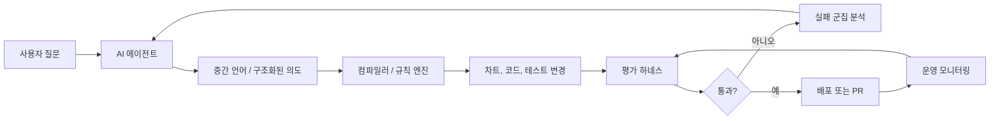

> 한 줄 요약: AI 에이전트 시각화가 흔들리는 이유는 모델이 차트를 못 그려서만은 아니다. 에이전트가 다루는 언어가 너무 낮은 수준이면, 모델은 데이터의 의미보다 눈금, 색상, 레이아웃 같은 세부 결정을 떠안는다. Flint, 평가 플라이휠, 구조 린터 사례를 함께 보면 에이전트 품질은 프롬프트만이 아니라 중간 언어, 테스트 자동화, 코드베이스 어휘에서 갈린다.

## 왜 지금 이슈인가

AI 에이전트에게 데이터 시각화를 맡기면 처음에는 꽤 그럴듯해 보인다. 막대그래프, 선그래프, 산점도 정도는 자연어 요청만으로 만들어낸다. 문제는 실무 화면에 붙이는 순간 드러난다.

축 이름이 애매하고, 색상 기준이 일관되지 않고, 범례가 데이터를 제대로 설명하지 못한다. 작은 차트에서는 라벨이 겹치기도 한다. 반대로 세부 옵션을 전부 지정하면 결과물은 나아지지만, 에이전트가 작성해야 할 스펙이 길어지고 오류 가능성도 커진다.

Microsoft의 Flint는 이 지점을 시각화 언어의 문제로 본다. 기존 시각화 언어가 AI 에이전트에게 너무 저수준이면, 에이전트는 데이터의 의미를 판단하기보다 눈금, 색상, 레이아웃 같은 세부 결정을 직접 처리하게 된다. Flint의 방향은 에이전트가 의도를 표현하고, 컴파일러가 좋은 기본값과 시각적 결정을 맡는 중간 언어(Intermediate Language)에 가깝다.

이 흐름은 시각화에만 해당하지 않는다. Google Developers의 에이전트 품질 플라이휠은 프롬프트 변경이 실제 품질을 올렸는지 평가 데이터, 추론 실행, 자동 채점, 실패 군집 분석, targeted optimization으로 확인해야 한다고 말한다. Vercel의 konsistent는 TypeScript 코드베이스에서 폴더 구조, export 규칙, 타입 구현 같은 구조적 관례를 결정적으로 검사한다.

겉으로는 서로 다른 글이다. 하지만 실무 쟁점은 비슷하다. 에이전트를 잘 쓰려면 자연어 지시를 더 다듬는 데서 멈추면 안 된다. 에이전트가 의존할 수 있는 언어와 검증 장치를 같이 만들어야 한다.

## 커뮤니티에서 갈리는 지점

### AI 에이전트 시각화는 왜 프롬프트만으로 부족할까?

찬성 쪽은 Flint 같은 접근을 반긴다. 에이전트가 모든 시각적 결정을 직접 생성하지 않아도 되면 결과가 더 안정된다. 차트 품질을 모델의 순간적인 선택에 맡기지 않고, 언어와 컴파일러의 책임으로 옮길 수 있기 때문이다.

우려는 대체로 통제력에서 나온다. 시각화는 단순 출력물이 아니라 분석 과정의 일부다. 색상, 축 범위, 집계 방식, 정렬 기준 하나가 의사결정을 바꾼다. 너무 높은 수준의 언어가 이런 결정을 숨기면, 사용자는 예쁜 차트를 얻는 대신 검증하기 어려운 해석을 받을 수 있다.

그래서 핵심 질문은 Flint가 좋은가 나쁜가가 아니다. 어떤 결정을 에이전트에게 맡기고, 어떤 결정을 언어와 컴파일러에 맡기며, 어떤 결정은 사람이 명시해야 하는가다.

예를 들어 매출 추이를 보여달라는 요청에서는 차트 유형과 기본 레이아웃을 컴파일러가 잡아도 된다. 하지만 환불액을 매출에서 차감할지, 세전 금액을 쓸지, 누락된 월을 0으로 채울지 같은 기준은 사람이 확인해야 한다. 에이전트 시각화의 위험은 그림이 틀리는 경우보다, 그림은 맞아 보이는데 질문이 틀린 경우에 더 크다.

### 테스트 자동화는 에이전트 품질을 어디까지 잡아줄까?

Google의 에이전트 품질 플라이휠은 이 문제를 더 넓게 다룬다. 에이전트가 특정 사용자 불만 하나를 해결하도록 프롬프트를 바꿨을 때, 다른 케이스 열 개가 망가지지 않았는지 확인해야 한다는 문제의식이다.

여기서 커뮤니티가 갈리는 지점은 평가 자동화의 신뢰도다. 자동 채점기(AutoRater)가 있으면 반복 검증은 쉬워진다. 운영 트래픽이나 합성 시나리오를 기반으로 회귀를 잡을 수도 있다. 하지만 채점 기준 자체가 부정확하면 에이전트는 점수에 맞춰 오히려 나빠질 수 있다.

이건 테스트 자동화에서 익숙한 문제다. 테스트가 시스템의 의도를 잘 표현하면 개발 속도와 안정성이 같이 오른다. 반대로 테스트가 구현 세부에 묶이면 변경을 방해한다. 에이전트 평가도 마찬가지다. 무엇을 좋은 답으로 볼지 정의하지 못하면, 자동화는 판단을 대신해주지 못한다.

### 코드베이스 어휘가 왜 에이전트 성능이 되는가?

DEV Community의 글은 다른 각도에서 같은 문제를 짚는다. 에이전트는 코드베이스에 없는 어휘를 스스로 가져오지 않는다. 주변 테스트, 타입, 함수명, 팩토리, 디렉터리 구조를 보고 그 패턴을 증폭한다.

정리된 코드베이스에서는 에이전트가 도메인 언어를 따라간다. 예를 들어 `aCartReadyForCheckout`, `Money`, `Address` 같은 이름이 반복되면 새 테스트도 그 언어로 작성된다. 반대로 매번 흩어진 객체 리터럴과 임시 변수명으로 준비된 테스트가 많으면, 에이전트는 그 혼란도 그대로 복제한다.

Vercel의 konsistent가 흥미로운 이유도 여기에 있다. ESLint나 TypeScript가 잘 잡지 못하는 구조적 관례를 별도 규칙으로 검사한다. 특정 패턴의 파일은 어떤 export를 가져야 하는지, 어떤 폴더에는 어떤 파일이 함께 있어야 하는지, 특정 클래스가 어떤 타입을 구현해야 하는지를 정적으로 확인한다.

이건 사람을 위한 컨벤션 문서가 아니라, 사람과 에이전트가 함께 따르는 실행 가능한 문맥이다. 에이전트에게 좋은 예시를 주는 데서 한 걸음 더 나아가, 나쁜 구조가 코드베이스에 남지 못하게 막는다.

## 아키텍처 관점에서 볼 점

### AI 에이전트 아키텍처는 프롬프트보다 경계가 먼저다

에이전트 기반 시스템을 설계할 때 흔한 실수는 모델 호출을 중심에 두는 것이다. 실제로는 모델보다 앞뒤의 경계가 품질을 더 많이 좌우한다.

Flint 같은 시각화 중간 언어는 모델 출력의 경계를 좁힌다. 에이전트가 임의의 JavaScript나 복잡한 차트 스펙을 직접 만들지 않고, 제한된 의도 표현을 생성한다. 컴파일러는 그 표현을 실제 차트 스펙으로 변환한다. 평가 시스템은 결과가 요구사항과 품질 기준을 만족하는지 확인한다.

이 구조에서 각 컴포넌트의 역할은 다르다.

| 계층 | 맡길 결정 | 맡기면 안 되는 결정 |
| --- | --- | --- |
| AI 에이전트 | 사용자 의도 해석, 후보 생성, 설명 | 승인 없이 데이터 정의 변경 |
| 중간 언어 | 표현 범위 제한, 의도 구조화 | 비즈니스 의미 자동 확정 |
| 컴파일러 | 기본 레이아웃, 반복 가능한 변환 | 검증 불가능한 추론 |
| 평가 하네스 | 회귀 탐지, 실패 유형 분류 | 제품 판단 전체 대체 |
| 구조 린터 | 코드베이스 관례 강제 | 아키텍처 의도 설명 생략 |

Flint의 가치는 이 표에서 중간 언어와 컴파일러 사이에 있다. 좋은 시각화 결정을 모델이 매번 새로 생성하게 하지 않고, 재사용 가능한 변환 규칙으로 내린다. 이때 에이전트는 모든 픽셀을 지시하는 작성자가 아니라, 분석 의도를 전달하는 상위 계층 작성자가 된다.

### 장애 격리는 어떻게 달라질까?

에이전트가 직접 완성물을 생성하면 장애 원인 분석이 어렵다. 프롬프트가 문제인지, 모델이 문제인지, 입력 데이터가 문제인지, 출력 스펙이 문제인지 한꺼번에 섞인다.

중간 언어를 두면 실패 지점이 나뉜다.

- 에이전트가 잘못된 의도를 만들었는가
- 중간 언어가 필요한 표현을 담지 못했는가
- 컴파일러 기본값이 부적절했는가
- 평가 하네스가 실패를 놓쳤는가
- 운영 데이터 분포가 테스트 데이터와 달랐는가

이 분리가 운영 리스크를 줄인다. 예를 들어 차트 색상이 접근성 기준을 만족하지 못했다면 모델을 바꾸기 전에 컴파일러의 팔레트 규칙을 고치면 된다. 특정 도메인 질문에서 잘못된 집계를 한다면 프롬프트보다 데이터 계약과 평가 케이스를 먼저 봐야 한다.

### 성능과 운영 복잡도는 공짜가 아니다

중간 언어, 평가 하네스, 구조 린터를 넣으면 시스템은 안정되지만 복잡해진다. 에이전트 호출 한 번으로 끝나던 작업에 컴파일, 검증, 재시도, 분석 단계가 붙는다.

특히 운영 환경에서는 비용과 지연 시간이 문제다. 모든 요청마다 자동 채점과 재생성을 수행할 수는 없다. 실시간 사용자 요청은 빠른 검증만 거치고, 더 무거운 평가는 샘플링된 운영 트레이스나 배포 전 테스트에서 돌리는 식의 계층화가 필요하다.

현업에서 비슷한 고민을 하다 보면 결국 두 종류의 경로가 생긴다. 사용자에게 즉시 응답해야 하는 경로와, 품질을 끌어올리기 위해 비동기로 학습하고 검증하는 경로다. 둘을 섞으면 응답은 느려지고 원인 분석도 어려워진다.

## 실무에서 볼 점

### AI 에이전트 도입 전에 무엇을 확인해야 할까?

첫 번째는 출력 형식의 안정성이다. 에이전트가 자연어 답변을 하는 수준인지, 차트 스펙이나 코드 변경처럼 시스템에 투입될 산출물을 만드는지 구분해야 한다. 후자라면 자유 텍스트 출력만으로는 부족하다.

두 번째는 도메인 어휘다. 테스트 이름, 타입 이름, 팩토리 함수, 디렉터리 구조가 이미 제품 언어를 반영하고 있는지 봐야 한다. 에이전트는 빈 곳에서 좋은 언어를 만들어내기보다, 이미 있는 언어를 증폭한다.

세 번째는 평가 데이터다. 좋은 케이스 몇 개로는 부족하다. 실패가 잦은 사용자 요청, 경계값, 권한 문제, 데이터 누락, 다국어 입력, 모호한 의도 같은 케이스가 필요하다. Google의 플라이휠식 접근은 이 평가 세트를 한 번 만들고 끝내는 방식이 아니라, 운영에서 배운 실패를 다시 테스트로 되돌리는 구조에 가깝다.

네 번째는 구조 규칙이다. konsistent 같은 도구가 보여주는 방향은 단순하다. 문서에만 있는 규칙은 에이전트도 사람도 놓친다. 실행 가능한 규칙으로 바꿔야 한다.

### Flint 같은 중간 언어는 언제 적합할까?

적합한 조건은 비교적 분명하다.

- 출력물이 반복적인 구조를 가진다
- 기본값 품질이 사용자 경험에 큰 영향을 준다
- 모든 세부 옵션을 사람이 매번 지정하기 어렵다
- 잘못된 출력이 운영 리스크로 이어진다
- 컴파일러나 규칙 엔진으로 품질을 끌어올릴 여지가 있다

데이터 시각화는 이 조건에 잘 맞는다. 차트는 반복 구조가 있고, 기본값이 품질을 크게 좌우하며, 잘못된 집계나 레이아웃은 오해를 만든다.

반대로 탐색적 분석처럼 의도 자체가 계속 바뀌는 작업에서는 너무 이른 추상화가 방해가 될 수 있다. 아직 팀이 어떤 질문을 자주 하는지도 모른다면, 중간 언어부터 만들기보다 로그를 모으고 실패 패턴을 분류하는 편이 낫다.

### 도입이 실패하기 쉬운 지점

가장 흔한 실패는 중간 언어를 만능 인터페이스로 키우는 것이다. 모든 옵션을 담으려다 보면 결국 기존 저수준 스펙과 비슷해진다. 그러면 에이전트가 편해지는 것이 아니라 새 문법 하나가 더 생긴다.

두 번째 실패는 평가 없이 언어만 도입하는 것이다. Flint류의 접근은 컴파일러가 좋은 결정을 내려준다는 전제가 있다. 그런데 좋은 결정인지 검증하는 하네스가 없으면, 기본값은 취향의 묶음이 된다.

세 번째 실패는 코드베이스의 어휘를 방치하는 것이다. 에이전트에게 중간 언어를 주더라도 주변 코드가 혼란스럽다면, 수정 PR과 테스트는 여전히 흔들린다. DEV Community 글의 표현처럼 에이전트는 발견한 어휘를 증폭한다. 이 말은 에이전트 도입 전에 리팩터링이 필요하다는 뜻이 아니다. 최소한 새로 생성되는 코드가 따라야 할 이름과 구조를 실행 가능한 형태로 고정해야 한다는 뜻이다.

### X vs Y: 프롬프트 개선과 구조 개선의 차이

| 접근 | 빠른 효과 | 지속성 | 주요 리스크 |
| --- | --- | --- | --- |
| 프롬프트 개선 | 높음 | 낮거나 중간 | 특정 사례에 과적합 |
| 예시 추가 | 중간 | 중간 | 나쁜 예시도 함께 증폭 |
| 중간 언어 | 중간 | 높음 | 표현 범위 설계 실패 |
| 평가 하네스 | 낮거나 중간 | 높음 | 채점 기준 부정확 |
| 구조 린터 | 중간 | 높음 | 규칙 유지 비용 |

프롬프트 개선은 필요하다. 다만 그것만으로는 운영 품질을 설명하기 어렵다. 에이전트가 만드는 결과물이 제품 안으로 들어간다면, 프롬프트는 시스템의 일부일 뿐이다. 언어, 컴파일러, 테스트, 린터, 모니터링이 함께 있어야 변경을 믿을 수 있다.

## 정리

AI 에이전트 시각화의 다음 단계는 더 그럴듯한 차트 프롬프트보다, 에이전트가 실수하기 어려운 작업 경계를 만드는 쪽에 가깝다. Flint는 그 경계를 시각화 중간 언어로 제안한다. Google의 품질 플라이휠은 변경이 실제로 나아졌는지 검증하는 루프를 제안한다. Vercel의 konsistent는 코드베이스 구조를 실행 가능한 규칙으로 고정한다.

셋을 함께 읽으면 실무 판단은 꽤 선명해진다. 에이전트를 도입할 때 먼저 볼 것은 모델 순위가 아니라 시스템의 언어다. 우리 팀의 테스트, 타입, 파일 구조, 차트 스펙, 평가 데이터가 에이전트에게 무엇을 반복하라고 가르치는지 확인해야 한다.

당장 해볼 일은 하나다. 에이전트가 자주 생성하는 산출물 하나를 고르고, 그 출력에서 사람이 매번 리뷰로 잡는 문제를 적어보는 것이다. 그중 하나라도 규칙, 중간 표현, 평가 케이스로 옮길 수 있다면 프롬프트보다 먼저 고칠 곳이 보인다.

## 참고 자료

- [선정 글감] [Show HN: Microsoft releases Flint, a visualization language for AI agents](https://microsoft.github.io/flint-chart/#/) — Hacker News Best
- [관련] [Driving the Agent Quality Flywheel from Your Coding Agent](https://developers.googleblog.com/driving-the-agent-quality-flywheel-from-your-coding-agent/) — Google Developers
- [관련] [Agents Amplify Whatever Vocabulary They Find](https://dev.to/tmfrisinger/agents-amplify-whatever-vocabulary-they-find-5e3g) — DEV Community
- [관련] [Enforce consistent code for agents and humans with konsistent](https://vercel.com/changelog/enforce-consistent-code-for-agents-and-humans-with-konsistent) — Vercel Blog