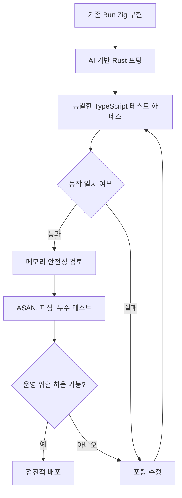

> 한 줄 요약: Bun의 Rust 재작성은 언어 교체 자체보다, 큰 시스템 변경을 어떤 테스트와 검증 장치로 받아낼 수 있는지를 보여준다. 봐야 할 지점은 Zig와 Rust의 승패가 아니라, 테스트 하네스와 메모리 안전성으로 재작성 결과를 어디까지 믿을 수 있느냐다.

## 왜 지금 이슈인가

Bun의 Rust 재작성 이야기가 개발자 커뮤니티에서 회자되는 이유는 분명하다. 53만 줄이 넘는 Zig 코드베이스를 Rust로 옮기는 작업은 보통 제품 로드맵을 멈춰 세울 만한 일이다. Bun 팀은 이 작업을 AI 에이전트와 기존 테스트 하네스(Test Harness)를 함께 써서 진행했다고 설명한다.

여기에는 두 가지 긴장이 있다.

하나는 기술적 긴장이다. JavaScript 런타임은 가비지 컬렉션(Garbage Collection), 네이티브 메모리, C/C++ 라이브러리, 비동기 I/O가 한 프로세스 안에서 맞물린다. 이런 시스템에서 use-after-free, double-free, 누락된 free, 예외 경로의 누수는 코드 스타일 문제가 아니라 런타임 안정성 문제다.

다른 하나는 운영적 긴장이다. AI가 대규모 포팅을 빠르게 해냈다는 이야기는 흥미롭지만, 빠르다는 이유만으로 신뢰할 수는 없다. 커뮤니티가 물어야 할 질문은 “AI가 코드를 잘 짰나?”보다 “그 변경을 받아낼 검증 장치가 이미 있었나?”에 가깝다.

The Pragmatic Engineer의 보조 글도 비슷한 지점을 짚는다. 11일, 16만 5천 달러 상당의 토큰 비용이라는 숫자는 눈에 띄지만, 글의 무게중심은 속도 자체보다 “철저히 테스트된 프로젝트여야 이런 시도가 가능하다”는 조건에 있다.

## 커뮤니티에서 갈리는 지점

Bun 사례를 두고 가장 쉽게 나오는 반응은 Zig에서 Rust로 옮긴 이유를 언어 우열로 해석하는 것이다. 하지만 Bun의 원문을 자세히 보면 논지는 더 좁고 구체적이다.

Bun은 Zig 덕분에 초기 속도를 냈다고 말한다. esbuild의 Go 기반 트랜스파일러를 Zig로 옮기고, JavaScript/TypeScript/CSS 트랜스파일러, 번들러, npm 호환 패키지 매니저, 테스트 러너, Node.js API 구현까지 빠르게 넓힌 배경에 Zig의 단순성과 저수준 제어가 있었다는 설명이다.

문제는 프로젝트의 성격이 바뀌었다는 점이다. 초기에는 구현 속도와 성능 제어가 더 중요했지만, 월간 다운로드가 커지고 Claude Code, OpenCode 같은 도구가 Bun 런타임에 기대기 시작하면 안정성의 무게가 달라진다. 이때부터 “개발자가 조심한다”는 전략은 점점 약해진다.

커뮤니티에서 갈리는 쟁점은 대략 이렇다.

| 쟁점 | 기대하는 쪽 | 우려하는 쪽 |
|---|---|---|
| Rust 전환 | 메모리 소유권을 타입 시스템으로 강제할 수 있다 | FFI, unsafe, C/C++ 의존성은 여전히 남는다 |
| AI 포팅 | 반복적 변환과 테스트 피드백 루프를 빠르게 돌릴 수 있다 | 의미 보존을 착각하면 대규모 회귀가 생긴다 |
| 전면 재작성 | 언어 경계를 단순화하고 일관된 모델을 만들 수 있다 | 점진적 마이그레이션보다 장애 반경이 크다 |
| 테스트 기반 검증 | 기존 TypeScript 테스트가 런타임 언어와 분리되어 있다 | 테스트가 없는 동작은 조용히 바뀔 수 있다 |

Rust가 모든 문제를 없애는 것은 아니다. Bun은 JavaScriptCore, uWebSockets, BoringSSL, SQLite 같은 C/C++ 구성요소를 포함한다. Rust로 옮겨도 외부 라이브러리와의 경계, FFI(Foreign Function Interface), unsafe 코드, GC 객체와 네이티브 객체 사이의 수명 관리는 계속 남는다.

그래도 전환의 논리는 분명하다. Zig에서는 `defer`, `errdefer`, 스타일 가이드, 코드 리뷰, ASAN(Address Sanitizer), 퍼징(Fuzzing)으로 문제를 줄일 수 있다. Rust에서는 적어도 safe Rust 영역 안에서 소유권(Ownership), 빌림(Borrowing), `Drop`을 통해 “정리 코드가 정확히 한 번 실행되는가”를 컴파일러가 더 일찍 따진다.

현업에서 비슷한 고민을 하다 보면 이 차이는 꽤 크다. 리뷰어가 모든 예외 경로와 콜백 재진입, 버퍼 분리, 참조 카운트 감소를 매번 따라가야 하는 구조는 팀이 커질수록 흔들린다. 반대로 타입 시스템이 일부 규칙을 강제하면 리뷰의 초점은 “이 값이 언제 해제되는가”에서 “이 경계의 unsafe가 타당한가”로 옮겨간다.

## 아키텍처 관점에서 볼 점

Bun 사례에서 눈여겨볼 부분은 AI 에이전트 자체보다 검증 가능한 아키텍처다. Bun의 테스트가 TypeScript로 작성되어 있어 런타임 구현 언어와 분리되어 있었다는 점은 대규모 재작성의 전제 조건에 가깝다.

테스트 하네스가 제품의 외부 계약을 잡고 있었기 때문에 내부 구현을 Zig에서 Rust로 바꿀 수 있었다. 이 장치가 없었다면 AI 포팅은 빠른 실험이 아니라 위험한 코드 생성에 가까웠을 것이다.

이 흐름에서는 테스트, 메모리 검증, 피드백 루프를 따로 봐야 한다.

첫째, 테스트가 구현 언어와 분리되어 있어야 한다. C++에서 Rust로 바꾸든, Zig에서 Rust로 바꾸든, 외부 동작을 검증하는 계약 테스트가 같은 입력과 출력을 확인해야 한다. Bun의 경우 JavaScript 런타임이므로 TypeScript 테스트가 이 역할을 했다.

둘째, 메모리 안전성은 단일 도구로 해결되지 않는다. Bun은 이미 ASAN, ReleaseSafe 빌드, Fuzzilli 기반 퍼징, 엔드투엔드 메모리 누수 테스트를 사용하고 있었다. 그런데도 use-after-free, re-entrant callback, GC marker thread와의 race condition 같은 문제가 남았다. 기존 안전망이 무의미했다기보다, 문제 영역이 그만큼 복잡했다는 뜻에 가깝다.

셋째, AI 포팅은 생성기라기보다 증폭기에 가깝다. 좋은 테스트와 짧은 피드백 루프가 있으면 반복 작업을 빠르게 밀어준다. 반대로 테스트가 빈약하면 잘못된 확신도 같은 속도로 커진다.

아키텍처적으로는 다음 경계를 따로 봐야 한다.

| 경계 | 확인할 질문 |
|---|---|
| GC 객체와 네이티브 객체 | 누가 소유하고, 언제 해제하며, 콜백 중 재진입되면 안전한가 |
| Rust와 C/C++ FFI | unsafe 블록의 책임 범위가 작고 문서화되어 있는가 |
| 비동기 I/O와 스레드풀 | 작업 중 close, reset, detach가 발생해도 포인터가 유효한가 |
| 테스트 하네스 | 구현 변경 없이도 외부 계약을 충분히 검증하는가 |
| 배포 전략 | 재작성 결과를 한 번에 켜지 않고 실패 반경을 줄일 수 있는가 |

이 관점에서 Bun의 사례는 “AI로 재작성했다”보다 “AI가 재작성할 수 있을 만큼 관찰 가능한 시스템이었나”로 읽는 편이 낫다.

## 실무에서 볼 점

실제로 이런 상황에서는 언어 선택보다 먼저 봐야 할 것이 있다. 현재 장애의 주된 원인이 언어가 막을 수 있는 종류인지 확인해야 한다.

예를 들어 use-after-free, double-free, 누락된 free, 예외 경로 누수처럼 소유권과 수명 관리에서 반복적으로 문제가 난다면 Rust 전환은 설득력이 있다. 반대로 장애 원인이 프로토콜 해석, 캐시 무효화, 분산 트랜잭션, 스키마 호환성이라면 Rust로 바꿔도 핵심 위험은 그대로 남는다.

도입 전에 확인할 조건은 꽤 현실적이다.

- 외부 동작을 고정하는 테스트가 충분한가
- 테스트가 구현 언어에 묶여 있지 않은가
- 퍼징, 메모리 검사, 누수 테스트를 CI에서 돌릴 수 있는가
- unsafe와 FFI 경계를 작게 유지할 설계가 있는가
- 재작성 중 보안 패치와 버그 수정 흐름을 멈추지 않을 방법이 있는가
- 성능 회귀를 잡을 벤치마크가 있는가
- 배포 후 빠르게 되돌릴 수 있는 릴리스 전략이 있는가

가장 위험한 실패 패턴은 “AI가 해냈으니 우리도 하자”다. Bun처럼 기존 테스트와 퍼징 자산이 있고, 런타임의 외부 계약이 비교적 명확하며, 메모리 안정성 문제가 반복적으로 비용을 만들던 상황과 일반적인 웹 서비스의 재작성은 다르다.

특히 데이터베이스, 결제, 권한, 보안 감사 로그처럼 데이터 정합성이 핵심인 시스템은 더 조심해야 한다. 테스트가 통과해도 마이그레이션 전후 데이터 의미가 달라지면 장애는 늦게 드러난다. AI 기반 포팅이 유리한 영역은 반복적이고 구조적인 변환이다. 도메인 의미가 코드 곳곳에 암묵적으로 묻혀 있는 시스템에서는 검증 비용이 다시 커진다.

대안도 있다.

하나는 점진적 Rust 도입이다. 메모리 오류가 많은 모듈부터 Rust로 감싸고, 기존 런타임과 FFI로 연결한다. 장애 반경은 줄지만 언어 경계와 빌드 복잡도는 늘어난다.

다른 하나는 기존 언어 안에서 소유권 규칙을 강화하는 방식이다. Bun 원문에 나온 것처럼 스마트 포인터, 스타일 가이드, 정적 분석, 코드 리뷰 규칙을 더 강하게 둘 수 있다. 다만 이 방식은 결국 사람과 리뷰 프로세스에 많은 부담을 남긴다.

또 다른 선택은 테스트 하네스를 먼저 키우는 것이다. 당장 재작성하지 않더라도 외부 계약 테스트, 퍼징, 회귀 벤치마크, 메모리 검사 자동화를 늘리면 이후 선택지가 넓어진다. Bun 사례에서 가장 재사용하기 쉬운 교훈도 이쪽에 있다.

AI 에이전트가 강해질수록 코드 작성 비용은 내려간다. 그러면 상대적으로 비싸지는 것은 검증, 운영, 책임 경계다. 앞으로 대규모 리팩터링의 병목은 “누가 코드를 옮기나”보다 “무엇을 근거로 같은 시스템이라고 말할 수 있나”가 될 가능성이 크다.

## 정리

Bun의 Rust 재작성은 Zig가 졌고 Rust가 이겼다는 이야기가 아니다. 메모리 안전성이 제품 안정성의 병목이 되었고, 기존 테스트 하네스가 있었으며, AI 에이전트가 그 사이의 반복 작업을 압축했다는 이야기다.

실무에서 가져갈 질문은 하나면 충분하다.

지금 우리 시스템은 대규모 변경을 시도했을 때, 사람이든 AI든 만든 결과를 같은 제품이라고 검증할 수 있는가?

이 질문에 답하지 못한다면 재작성의 첫 단계는 새 언어 선택이 아니다. 먼저 테스트 하네스와 관측성, 실패를 되돌릴 배포 경로를 만들어야 한다.

## 참고 자료

- [선정 글감] [Rewriting Bun in Rust](https://bun.com/blog/bun-in-rust) (Bun)
- [관련] [The Pulse: What can we learn from Bun’s rapid Rust rewrite with AI?](https://newsletter.pragmaticengineer.com/p/the-pulse-what-can-we-learn-from) (The Pragmatic Engineer)