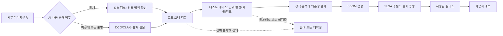

> 한 줄 요약: AI 코드 기여는 생산성 도구 문제가 아니라 오픈소스 보안, 저작권 출처, 유지보수 책임이 함께 걸린 소프트웨어 공급망 리스크다. 금지할지 허용할지보다 먼저 정해야 할 것은 이 저장소가 어떤 신뢰 모델로 운영될 것인가다.

## 왜 지금 이슈인가

AI 코드 기여, 오픈소스 보안, 소프트웨어 공급망이라는 키워드가 한 지점에서 만난 사례가 Vim Classic이다. Drew DeVault는 Vim 8.x를 기반으로, 생성형 AI 도구 없이 사람이 유지보수하는 장기 유지 버전을 만들겠다고 밝혔다.

이 이야기는 특정 편집기 하나의 포크에 그치지 않는다. GitHub와 개발자 커뮤니티에서 계속 논의되는 이유도 분명하다. AI로 만든 패치가 늘어나면 리뷰어는 코드의 동작뿐 아니라 그 코드가 어디서 왔고, 문제가 생겼을 때 누가 책임질 수 있는지도 봐야 한다.

인터뷰에서 DeVault가 강하게 제기한 지점은 크게 네 가지다.

- LLM이 만든 성급한 풀 리퀘스트가 유지보수자의 시간을 소모한다.
- 저작권과 코드 출처(provenance)를 설명하기 어려워진다.
- 사용자가 문제를 직접 이해하지 못한 채 결과만 제출하는 방향으로 밀릴 수 있다.
- 에너지, 자원, 노동, 정치적 사용에 관한 윤리 문제가 따라온다.

이 중 실무자가 바로 다룰 수 있는 부분은 출처, 리뷰 비용, 보안 경계, 장기 유지보수다. 윤리 논쟁에 동의하든 아니든, AI가 작성한 코드가 저장소에 들어오는 순간 프로젝트의 신뢰 모델은 달라진다.

## 커뮤니티에서 갈리는 지점

### AI 코드 기여를 왜 금지해야 할까?

AI-free 정책을 지지하는 쪽은 코드 품질보다 책임 소재를 먼저 본다. 패치가 작동하더라도 작성자가 왜 그 구조를 선택했는지 설명하지 못하면, 다음 장애나 취약점 수정 때 유지보수 비용은 프로젝트가 떠안게 된다.

반대쪽은 실용성을 든다. 테스트를 통과하고 리뷰도 받는다면 도구 사용 여부를 문제 삼을 필요가 없다는 주장이다. 특히 문서, 반복적인 리팩터링, 테스트 케이스 작성에서는 AI가 시간을 줄일 수 있다고 본다.

갈등은 여기서 생긴다. 테스트는 동작을 검증하지만 출처와 의도를 검증하지 않는다. 리뷰는 코드를 읽지만, 그 코드가 특정 라이선스 코드와 유사한 이유까지 항상 밝혀내지는 못한다.

| 쟁점 | AI-free 정책 | AI 허용 정책 | 실무 리스크 |
|---|---|---|---|
| 코드 출처 | 사람이 직접 작성했다는 운영 원칙을 둔다 | 기여자 신고와 리뷰에 의존한다 | 실제 작성 경로를 완전히 증명하기 어렵다 |
| 리뷰 비용 | 기여량은 줄 수 있지만 검토 부담을 제한한다 | 기여량은 늘 수 있지만 저품질 PR도 같이 늘 수 있다 | 메인테이너 번아웃과 병목 |
| 저작권 | 불확실성을 줄이는 방향 | DCO/CLA와 정책 문구로 보완 | 생성 코드의 원천 설명 한계 |
| 보안 | 고위험 경로에 보수적 | 자동화 검사와 코드 리뷰 강화 | 취약한 패턴이 그럴듯하게 들어올 수 있음 |
| 숙련도 | 작성자가 문제를 이해해야 한다 | 도구가 보조한 결과도 인정한다 | 설명할 수 없는 코드가 누적됨 |

Mitchell Hashimoto 인터뷰는 다른 방향에서 같은 문제를 건드린다. Ghostty를 만든 이유를 설명하면서 그는 터미널 에뮬레이터를 직접 이해하고 싶었다고 말한다. GPU, 데스크톱/단일 노드 시스템, Zig, 네이티브 크로스플랫폼 같은 조건은 단순히 코드 줄을 많이 만든다고 해결되지 않는다.

여기서 원칙이 나온다. 도구가 코드를 빨리 써도, 어떤 코드를 써야 하는지 아는 능력은 대체되지 않는다. 터미널, 에디터, 패키지 매니저, 인증 시스템, 데이터베이스 드라이버처럼 오래 살아남는 기반 도구일수록 이 차이는 더 커진다.

## 아키텍처 관점에서 볼 점

### AI 코드 기여는 공급망 어디에 들어오는가?

AI가 만든 코드는 보통 외부 기여자의 PR 형태로 들어온다. 겉으로 보면 일반 PR과 같다. 하지만 위험은 작성 단계에 숨어 있다.

SLSA(Supply-chain Levels for Software Artifacts)는 빌드와 릴리스 출처를 다루는 데 유용하다. 어떤 소스에서 어떤 빌드 절차를 거쳐 산출물이 나왔는지 증명하는 데 강하다.

다만 SLSA가 해결하지 못하는 영역도 있다. 소스 코드가 저장소에 들어오기 전에 누가 어떤 방식으로 작성했는지는 별도의 기여 정책과 리뷰 체계로 다뤄야 한다. SPDX 같은 SBOM도 구성 요소와 라이선스 파악에는 도움을 주지만, 생성형 AI가 만든 코드 조각의 인지적 출처까지 말해주지는 않는다.

OpenSSF Scorecard도 마찬가지다. 브랜치 보호, 리뷰, 의존성 고정, 취약점 관리 같은 저장소 위생 상태를 보는 데 쓸 수 있다. 하지만 점수가 높다고 해서 모든 기여 코드의 작성 배경이 투명해지는 것은 아니다.

### 테스트 자동화만으로 충분하지 않은 이유

테스트 하네스(Test Harness)는 AI 코드 기여를 다룰 때 더 중요해진다. 단위 테스트, 통합 테스트, 회귀 테스트, 퍼즈 테스트(Fuzz Testing), 보안 스캔은 기본 방어선이다.

문제는 테스트가 이미 정의한 기대 동작만 확인한다는 점이다. AI가 만든 코드는 그럴듯한 예외 처리, 낯익은 추상화, 익숙한 보안 패턴을 흉내 낼 수 있다. 리뷰어가 도메인을 모르면 테스트가 없는 경계 조건에서 실패한다.

특히 다음 영역은 더 보수적으로 봐야 한다.

- 인증(Authentication)과 권한 부여(Authorization)
- 암호화와 키 관리
- 파서, 직렬화, 역직렬화
- 샌드박스와 플러그인 실행
- 네트워크 경계, 프록시, 게이트웨이
- 마이그레이션, 스키마 변경, 데이터 삭제
- Kubernetes 컨트롤러와 운영 자동화 코드

Kubernetes 컨트롤러 예를 보자. AI가 리컨실러(Reconciler) 코드를 만들고 테스트까지 붙였더라도, 재시도 정책, idempotency, finalizer 처리, rate limit, 이벤트 폭주, 권한 범위가 맞지 않으면 운영 중에 클러스터 전체에 영향을 줄 수 있다.

이런 코드는 잘 컴파일되는지가 아니라 실패할 때 얼마나 좁게 실패하는지가 기준이 되어야 한다.

## 실무에서 볼 점

### AI 코드 기여를 허용하려면 무엇을 정해야 할까?

허용 정책을 택한다면 먼저 PR 템플릿부터 바꿔야 한다. AI 사용 여부를 묻는 체크박스만으로는 부족하다. 기여자가 해당 코드의 동작, 출처, 테스트 범위, 알려진 한계를 설명하게 해야 한다.

실제로 이런 상황에서는 테스트 통과 여부보다 리뷰어가 실패 모드를 설명할 수 있는지가 더 빨리 드러난다. 설명이 안 되는 코드는 장애가 났을 때 소유자가 사라진다. 오픈소스에서는 그 부담이 메인테이너에게 간다.

권장되는 최소 조건은 이렇다.

- 기여 정책에 AI 사용 허용 범위와 금지 범위를 쓴다.
- PR에 AI 사용 여부, 사용 도구, 사람이 재검토한 범위를 적게 한다.
- DCO나 CLA 문구에 기여자가 제출 권리를 가진다는 확인을 둔다.
- 보안 민감 경로는 코드 오너 승인을 필수로 둔다.
- 생성 코드가 들어온 PR은 작은 단위로 쪼갠다.
- 테스트는 성공 케이스보다 실패 케이스와 회귀 케이스를 먼저 요구한다.
- 릴리스 산출물에는 서명과 빌드 출처 증명을 붙인다.
- 반려 기준을 공개해 감정 싸움이 아니라 운영 규칙으로 처리한다.

AI-free 정책이 더 맞는 프로젝트도 있다. 기반 도구, 보안 라이브러리, 컴파일러, 에디터, 터미널, 데이터베이스처럼 긴 호환성과 예측 가능성이 제품 가치인 경우다. 기여량보다 유지보수 가능성이 더 비싼 자산이면 금지 정책은 과한 결벽이 아니라 비용 통제다.

반대로 내부 도구, 프로토타입, 일회성 마이그레이션 스크립트처럼 수명이 짧고 영향 반경이 좁은 영역은 부분 허용이 현실적일 수 있다. 이때도 결과물을 그대로 믿어서는 안 되고, 사람이 소유권을 가져가야 한다.

### AI-free vs AI-assisted, 선택 기준

| 상황 | 더 맞는 선택 | 이유 |
|---|---|---|
| 메인테이너가 적고 리뷰 대기열이 길다 | AI-free 또는 엄격 제한 | 저품질 PR을 걸러낼 여력이 부족함 |
| 보안·라이선스 민감도가 높다 | AI-free에 가까운 정책 | 출처 불확실성의 비용이 큼 |
| 내부 생산성 도구다 | 제한적 허용 | 영향 반경을 조직 안에서 통제 가능 |
| 테스트 하네스가 빈약하다 | 허용 전 보강 | 자동화 없이 기여량만 늘면 리스크 증가 |
| 코드 오너십이 명확하다 | 제한적 허용 가능 | 장애 시 책임 경로를 추적할 수 있음 |
| 장기 호환성이 핵심 가치다 | 보수적 정책 | 빠른 생성보다 변화 관리가 더 중요함 |

이 논쟁을 생산성 대 인간성의 싸움으로만 보면 실무 판단이 흐려진다. 더 정확한 질문은 이것이다.

이 저장소는 설명 가능한 코드만 받는가, 아니면 출처와 의도가 불완전해도 자동화 검사로 감당할 수 있다고 보는가?

둘 다 선택 가능하다. 다만 선택한 뒤에는 정책, 리뷰, 테스트, 릴리스 체계가 같은 방향을 봐야 한다. AI 사용은 허용하면서 리뷰어에게 기존과 같은 확신을 요구하면 운영 체계가 버티기 어렵다.

## 정리

Vim Classic이 던지는 질문은 AI를 좋아하느냐 싫어하느냐가 아니다. 오픈소스 프로젝트가 어떤 코드까지 자신의 이름으로 배포할 수 있느냐는 질문이다.

AI 코드 기여를 받으려면 테스트 자동화, 코드 오너 리뷰, 라이선스 확인, 빌드 출처 증명, 릴리스 서명을 함께 봐야 한다. 받지 않겠다면 그 역시 명확한 공급망 정책이다.

당장 확인할 것은 하나다. 지금 운영 중인 저장소의 `CONTRIBUTING.md`와 PR 템플릿에 생성형 AI 사용, 코드 출처, 기여자 책임에 대한 문장이 있는지 보라. 없다면 기술 결정은 이미 내려졌지만 운영 규칙만 비어 있는 상태다.

## 참고 자료

- [선정 글감] [Interview: Drew DeVault on an AI-free version of Vim](https://jasonpolak.substack.com/p/interview-drew-devault-on-an-ai-free) — Lobsters
- [관련] [Lobsters Interview with mitchellh](https://alexalejandre.com/programming/interview-with-mitchell-hashimoto/) — Lobsters
- [관련] [SLSA: Supply-chain Levels for Software Artifacts](https://slsa.dev/) — OpenSSF
- [관련] [OpenSSF Scorecard](https://github.com/ossf/scorecard) — OpenSSF
- [관련] [SPDX](https://spdx.dev/) — SPDX Project