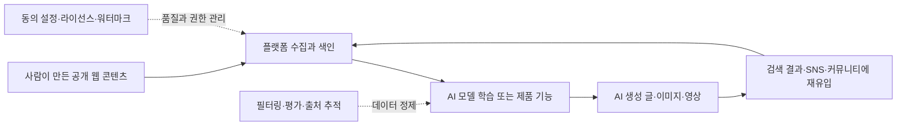

> 한 줄 요약: AI 모델 붕괴 논쟁은 “모델이 망가진다”는 공포담이라기보다, 공개 웹이 학습 데이터이자 배포 채널이 된 뒤 품질 관리와 동의 비용을 누가 부담하느냐에 가까운 문제다.

## 무슨 일이 있었나

Reddit LocalLLaMA에 올라온 “What's up with model collapse?”라는 글은 겉으로는 단순한 기술 질문이다. 그런데 반응이 붙은 이유는 꽤 현실적이다.

작성자는 2026년 현재 인터넷에서 무작위 블로그 글, 유튜브 영상, 인스타그램 이미지와 릴스까지 AI 생성물로 보이는 콘텐츠가 크게 늘었다고 느낀다. 그리고 이런 콘텐츠가 다시 대형 언어 모델(Large Language Model, LLM)의 학습 데이터로 들어가면, 모델이 자기 출력물을 먹고 품질이 무너지는 모델 붕괴(Model Collapse)가 실제로 일어나는지 묻는다.

확인된 사실은 여기까지다.

- 공개 웹에는 AI 생성 콘텐츠가 늘고 있다.
- 모델 붕괴는 합성 데이터가 반복적으로 학습 데이터에 섞일 때 분포가 좁아지고 오류가 누적될 수 있다는 연구 주제다.
- 대형 AI 기업들은 데이터 정제, 필터링, 라이선스 데이터, 사용자 피드백, 합성 데이터 검증에 계속 투자하고 있다.
- Meta는 Muse Image 출시와 함께 미국에서 Instagram 공개 계정 콘텐츠를 AI 이미지 생성 기능에 연결하는 방향의 업데이트를 진행했고, 사용자는 설정에서 일부 재사용을 제한해야 하는 구조로 안내됐다.

아직 추정에 가까운 해석도 따로 봐야 한다.

- 인터넷 전체가 곧 학습 불가능한 상태가 된다고 단정할 근거는 부족하다.
- 최신 모델 성능 개선 속도가 느려졌더라도 그 원인을 모델 붕괴 하나로 설명하기는 어렵다.
- 공개 계정 콘텐츠가 AI 기능에 쓰인다고 해서 모든 콘텐츠가 곧바로 훈련 데이터로 재학습된다는 뜻은 아니다. 제품 기능, 추천, 생성, 학습 데이터 사용은 정책 범위가 다르다.

다만 사람들이 불편해하는 지점은 분명하다. 내 글, 내 사진, 내 영상이 플랫폼의 데이터 자산으로 흡수되고, 그 결과물이 다시 인터넷을 채우며, 그 인터넷이 다음 모델의 입력이 되는 순환 구조가 보이기 시작했기 때문이다.

## 왜 사람들이 반응했나

### 모델 붕괴는 왜 불안하게 들릴까?

모델 붕괴가 무섭게 들리는 이유는 표현 때문이다. 마치 어느 순간 모델이 한꺼번에 무너지는 사건처럼 들린다.

실제에 가까운 그림은 갑작스러운 폭발보다 데이터 분포가 조금씩 좁아지는 쪽이다. 다양한 사람의 표현, 드문 사례, 지역적 맥락, 틀린 듯하지만 의미 있는 예외가 사라지고, 평균적인 문장과 평균적인 이미지가 더 많이 복제되는 현상이다.

현업에서 비슷한 문제를 보면 장애보다 지표 오염에 가깝다. 시스템은 계속 돌아가지만 검색 결과가 어딘가 밋밋해지고, 추천 품질이 떨어지고, 사람이 쓴 문서와 자동 생성 문서를 구분하는 운영 비용이 늘어난다.

### 커뮤니티가 불편해한 건 기술보다 권한이다

LocalLLaMA 같은 커뮤니티에서 이 질문이 반복되는 이유는 연구 논문을 몰라서가 아니다. 사용자 입장에서는 학습 데이터 품질보다 먼저 이런 질문이 떠오른다.

- 내가 만든 콘텐츠가 누구의 입력값이 되는가
- AI 생성물이 검색과 SNS를 채우면 사람은 무엇을 믿어야 하는가
- 플랫폼은 기본값을 opt-in으로 둘 권리가 있는가
- 모델 회사는 AI 생성 콘텐츠를 얼마나 걸러내고 있는가
- 사람 콘텐츠와 합성 콘텐츠의 경계는 누가 표시하는가

Meta의 Instagram 사례가 이 논쟁과 이어지는 지점도 여기에 있다. WIRED 보도에 따르면 Meta의 Muse Image 기능은 미국에서 먼저 Instagram 앱과 깊게 연결됐고, 공개 계정의 게시물은 사용자가 설정에서 제한하지 않으면 AI 이미지 생성의 재료로 쓰일 수 있는 방향으로 안내됐다.

여기서 핵심은 Meta라는 회사 하나를 비난하는 데 있지 않다. 공개 계정이라는 오래된 SNS의 전제가 AI 시대에도 그대로 유지될 수 있느냐는 질문이다.

과거의 공개는 사람이 볼 수 있다는 뜻에 가까웠다. 지금의 공개는 모델이 읽고, 조합하고, 재생성하고, 다른 사람의 프롬프트에 반응하는 재료가 될 수 있다는 뜻으로 넓어지고 있다.

### 기대와 오해도 함께 있다

반대편 주장도 무시하기 어렵다. 공개 콘텐츠를 활용하지 못하면 새로운 생성 기능의 개인화 품질은 떨어지고, 창작 도구로서 매력도 줄어든다. 친구와 함께 초대장을 만들거나, 브랜드 계정이 기존 이미지를 활용해 캠페인 시안을 뽑는 기능은 분명한 사용성이 있다.

문제는 기능의 유용성과 기본값의 정당성이 같은 말이 아니라는 점이다.

사용자가 공개 계정을 운영한다고 해서 자신의 얼굴, 스타일, 작업물이 AI 생성 기능의 호출 가능한 재료가 되는 데 동의했다고 보기는 어렵다. 특히 설정 메뉴 깊숙한 곳에서 opt-out을 찾아야 한다면, 동의라기보다 사후 거부에 가깝게 느껴진다.

모델 붕괴 논쟁도 마찬가지다. AI 생성 데이터를 전부 버려야 한다는 주장은 현실적이지 않다. 합성 데이터는 희귀 케이스를 보강하거나, 안전성 평가를 만들거나, 코드 테스트 케이스를 늘리는 데 쓸 수 있다.

하지만 출처와 품질을 모르는 합성 데이터가 공개 웹에 섞이고, 다시 무차별적으로 수집되는 구조는 다른 문제다. 좋은 합성 데이터와 인터넷에 흩어진 저품질 AI 콘텐츠를 같은 범주로 묶으면 판단이 흐려진다.

## 내가 보는 핵심

### 모델 붕괴보다 먼저 봐야 할 것은 데이터 역류다

이번 이슈의 핵심은 모델 붕괴가 실제냐 가짜냐가 아니다. 더 직접적인 표현은 데이터 역류다.

AI가 만든 콘텐츠가 웹에 풀리고, 플랫폼은 그 콘텐츠를 사용자 반응과 함께 보관한다. 모델 회사는 다시 웹과 플랫폼 데이터를 통해 다음 시스템을 개선한다. 이 순환 자체는 이미 시작됐다.

문제는 순환이 있다는 사실이 아니라, 순환을 제어하는 장치가 사용자에게 잘 보이지 않는다는 점이다.

- 콘텐츠가 학습에 쓰이는지, 제품 기능에만 쓰이는지 구분하기 어렵다.
- AI 생성물 표시가 검색, SNS, 블로그, 영상 플랫폼마다 다르다.
- 데이터 정제 기준은 기업 내부 정책에 머무르는 경우가 많다.
- opt-out은 있어도 기본값과 적용 범위를 이해하기 어렵다.
- 삭제, 비공개 전환, 재사용 제한이 이미 만들어진 파생물에 어디까지 영향을 주는지 불명확하다.

이런 상황에서 사용자는 모델 붕괴라는 말을 빌려 더 넓은 불신을 표현한다. 정말 모델이 무너질까를 묻는 동시에, 인터넷이 학습 가능한 공공재로 남아 있을까를 묻고 있는 셈이다.

### 반대로, 너무 쉬운 공포론도 경계해야 한다

AI 생성 콘텐츠가 늘었다고 해서 모든 대형 모델이 곧 자기복제로 망가진다고 말하는 건 과하다.

대형 모델을 만드는 조직은 웹을 긁어 그대로 넣지 않는다. 중복 제거, 품질 필터링, 도메인 분류, 유해 콘텐츠 제거, 평가 데이터 분리, 사람 피드백, 라이선스 데이터 확보 같은 단계를 둔다. 일부 합성 데이터는 통제된 환경에서 모델 성능을 개선하는 데 쓰이기도 한다.

그래서 실무적으로 더 나은 질문은 이쪽이다.

“AI 생성물이 얼마나 섞였나?”보다 “어떤 경로로 들어온 데이터를 어떤 기준으로 걸러내는가?”

이 질문은 모델 회사뿐 아니라 검색 서비스, SNS, 커머스, 사내 문서 검색, 고객지원 챗봇을 운영하는 팀에도 그대로 적용된다. 고객 문의 자동 답변을 다시 FAQ로 저장하고, 그 FAQ를 다시 챗봇 학습 자료로 쓰는 순간 작은 데이터 역류가 생긴다.

규모만 다를 뿐 패턴은 같다.

### 공개 웹의 기본값이 바뀌고 있다

Meta의 Instagram 사례는 모델 붕괴 논쟁에 사회적 층을 더한다. 공개 콘텐츠가 AI 기능의 재료가 되는 순간, 공개의 의미가 바뀐다.

예전에는 공개 게시물이 검색되고 공유되는 정도를 예상했다. 이제는 내 계정이 프롬프트에 태그되고, 내 이미지 스타일과 얼굴 특징이 새 이미지 생성에 반영될 수 있다. 사용자는 같은 공개라는 단어 안에서 전혀 다른 수준의 재사용을 경험한다.

여기서 플랫폼이 해야 할 일은 기능 설명을 늘리는 데서 끝나지 않는다. 사용자가 이해할 수 있는 단위로 권한을 쪼개야 한다.

| 구분 | 사용자가 알고 싶은 질문 | 필요한 통제 |
|---|---|---|
| 열람 | 누가 내 콘텐츠를 볼 수 있나 | 공개·친구·비공개 |
| 재공유 | 누가 내 콘텐츠를 퍼갈 수 있나 | 공유 허용 범위 |
| AI 생성 | 누가 내 콘텐츠를 프롬프트 재료로 쓸 수 있나 | 계정·게시물 단위 설정 |
| 학습 | 내 콘텐츠가 모델 개선에 쓰이나 | 명시적 설명과 거부권 |
| 파생물 | 이미 생성된 결과물은 어떻게 처리되나 | 삭제·제한 정책 |

이 표에서 가장 까다로운 부분은 파생물이다. 원본을 비공개로 바꿨을 때 이미 만들어진 AI 이미지, 캐시, 추천 피처, 임베딩(Embedding)은 어떻게 되는가. 대부분의 플랫폼은 이 질문에 사용자가 납득할 만큼 선명한 답을 주지 못한다.

## 앞으로 볼 기준

### AI 모델 붕괴 뉴스를 볼 때 확인할 것

앞으로 모델 붕괴나 AI 학습 데이터 오염 뉴스를 볼 때는 공포의 크기보다 범위를 먼저 확인하는 편이 낫다.

- 연구가 반복 학습 실험인지, 실제 상용 모델 관찰인지
- 합성 데이터가 통제된 데이터인지, 출처 불명의 웹 콘텐츠인지
- 성능 저하가 전체 능력인지, 특정 도메인이나 긴 꼬리 데이터인지
- 모델 회사가 데이터 필터링과 평가 분리를 어떻게 설명하는지
- AI 생성물 표시, 워터마크, 출처 추적이 실제 수집 파이프라인에 연결되는지

특히 “AI가 AI를 학습하면 망한다”는 문장은 너무 넓다. 더 정확한 문장은 이렇다.

품질과 출처를 모르는 합성 데이터가 반복적으로 섞이면, 모델은 드문 인간 데이터와 실제 세계의 마찰을 잃을 수 있다.

이 차이를 구분해야 실무 판단이 가능하다.

### 플랫폼 정책 뉴스를 볼 때 확인할 것

Instagram 같은 플랫폼 정책 변화는 기능 출시 기사처럼 읽으면 놓치는 것이 많다. 사용자는 새 버튼이 생겼는지가 아니라 권한의 기본값이 어떻게 바뀌었는지를 봐야 한다.

- 공개 계정이 자동 포함되는가
- opt-out 위치가 명확한가
- 게시물, 릴스, 스토리, 프로필 사진별로 범위가 나뉘는가
- AI 생성 기능과 모델 학습 사용이 분리 설명되는가
- 국가별 적용 범위가 다른가
- 미성년자, 얼굴, 저작권 콘텐츠에 별도 보호가 있는가
- 설정 변경이 과거 콘텐츠와 파생 결과물에 어떤 영향을 주는가

이 기준은 개인 사용자에게만 필요한 것이 아니다. 브랜드 계정, 크리에이터, 언론사, 개발자 커뮤니티, 오픈소스 프로젝트도 공개 콘텐츠를 운영한다. 공개 저장소의 이슈, 문서, 예제 코드, 토론 기록이 모델과 검색 시스템의 재료가 되는 시대에는 공개의 비용을 다시 계산해야 한다.

### 실무에서는 작은 순환부터 끊어야 한다

조직 안에서 당장 할 수 있는 일은 거대한 웹 전체를 걱정하는 것보다 작다.

AI가 만든 답변을 사람이 검토하지 않은 채 지식베이스에 저장하지 않기. 생성 문서에는 출처와 생성 여부를 남기기. 고객지원, 검색, 추천, RAG(Retrieval-Augmented Generation) 파이프라인에서 사람이 작성한 원문과 모델이 요약한 문서를 분리하기. 평가 데이터에는 모델 출력물이 섞이지 않도록 별도 관리하기.

이런 조치는 눈에 띄지는 않지만 데이터 역류를 줄인다.

공개 웹에서도 같은 원칙이 필요하다. 플랫폼은 AI 기능을 만들 수 있다. 사용자는 공개 계정을 운영할 수 있다. 모델 회사는 합성 데이터를 쓸 수 있다. 다만 이 셋이 연결되는 지점에는 기본값, 표시, 거부권, 삭제 범위가 있어야 한다.

처음 Reddit 글의 질문은 “모델 붕괴가 진짜인가?”였다. 더 오래 남을 질문은 아마 이것이다.

우리는 앞으로도 인터넷을 사람이 만든 세계의 기록으로 볼 수 있을까, 아니면 모델이 다시 모델을 위해 남긴 흔적까지 함께 읽는 공간으로 받아들여야 할까.

그 답은 기술 성능표보다 플랫폼의 기본 설정 화면에서 먼저 드러날 가능성이 크다.

## 참고 자료

- [선정 글감] [What's up with model collapse?](https://www.reddit.com/r/LocalLLaMA/comments/1us4pbf/whats_up_with_model_collapse/) — Reddit LocalLLaMA
- [관련] [Meta Now Lets Anyone Use Your Instagram Photos in AI Images—Unless You Opt Out](https://www.wired.com/story/meta-now-lets-anyone-use-your-instagram-photos-in-ai-images-unless-you-opt-out/) — WIRED
- [관련] [AI models collapse when trained on recursively generated data](https://www.nature.com/articles/s41586-024-07566-y) — Nature