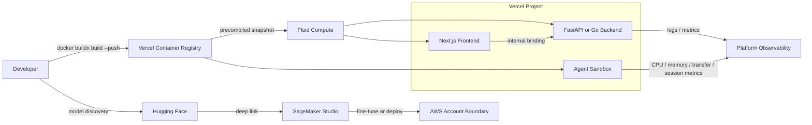

> 한 줄 요약: AI 에이전트, 컨테이너 배포, 모델 실험 환경이 플랫폼 안으로 들어오고 있다. 설정 단계는 줄지만, Kubernetes에서 직접 다루던 통제권, 보안 경계, 관측성을 어디에 둘지는 다시 정해야 한다.

## 왜 지금 이슈인가

Vercel Container Registry, Vercel Services, Dockerfile 기반 Functions, Hugging Face와 SageMaker Studio 연동은 서로 다른 제품 소식처럼 보인다. 그러나 공통점은 뚜렷하다.

인프라 배선이 제품 경험 안으로 들어가고 있다.

예전에는 모델을 고르고, 클라우드 콘솔을 열고, IAM 권한을 맞추고, GPU 쿼터를 확인하고, 컨테이너 이미지를 외부 레지스트리에 올리고, 프론트엔드와 백엔드를 따로 배포한 뒤 CORS와 내부 통신을 정리해야 했다. Kubernetes나 ECS 같은 범용 런타임을 직접 운용할 때는 익숙한 절차지만, AI 에이전트나 샌드박스 워크로드처럼 실험 주기가 짧은 팀에는 시작 비용이 된다.

Hugging Face의 SageMaker Studio 딥링크는 모델을 찾은 뒤 실험 환경으로 들어가는 단계를 줄인다. Vercel은 OCI(Open Container Initiative) 호환 레지스트리, Dockerfile 기반 Functions, Services, Sandbox Custom Images를 붙이면서 웹 애플리케이션, 백엔드, 샌드박스 실행 환경을 같은 배포 단위로 묶으려 한다.

관심을 받는 이유는 단순히 편해서가 아니다. 플랫폼이 설정을 대신해줄수록 운영 책임은 사라지는 것이 아니라 다른 위치로 옮겨간다.

## 커뮤니티에서 갈리는 지점

한쪽에서는 이 흐름을 자연스러운 변화로 본다. 개발자는 비즈니스 로직과 모델 평가에 집중하고, 레지스트리·라우팅·프리뷰 배포·자동 확장·로그는 플랫폼 기본값을 쓰면 된다는 관점이다.

AI 에이전트 워크로드에서는 이 주장이 꽤 설득력이 있다. 에이전트가 코드 실행 샌드박스를 만들고, 여러 세션을 병렬로 띄우고, 도구 체인을 이미지로 고정해야 한다면 매번 VM이나 Kubernetes 네임스페이스를 직접 다루는 방식은 무겁다. Vercel Sandbox Custom Images처럼 `docker push`한 이미지를 곧바로 샌드박스 루트 파일시스템으로 쓰는 모델은 실험 속도를 올려준다.

우려도 있다.

- OCI 레지스트리는 표준이지만, 최적화된 스냅샷과 실행 환경은 플랫폼에 묶일 수 있다.
- 내부 서비스 통신은 편하지만, 네트워크 정책과 인증 모델을 팀이 정확히 이해해야 한다.
- 원클릭 SageMaker 진입은 실험을 빠르게 만들지만, IAM 권한·비용·데이터 반출 경계가 흐려지면 보안 리뷰가 뒤늦게 붙는다.
- 통합 배포는 롤백을 단순하게 만들지만, 장애 원인을 플랫폼 내부 동작과 애플리케이션 코드 사이에서 나눠 봐야 한다.

Kubernetes를 직접 쓰던 팀이 이런 플랫폼으로 일부 워크로드를 옮길 때 자주 부딪히는 질문도 여기 있다. 컨트롤 플레인을 줄이는 것인가, 다른 컨트롤 플레인에 맡기는 것인가.

## 아키텍처 관점에서 볼 점

이 흐름의 핵심은 레지스트리, 빌드, 런타임, 프리뷰, 관측성을 하나의 제품 경계 안에 넣는 것이다.

Vercel Container Registry는 OCI 호환 이미지를 `docker push`, `docker pull`, `docker tag` 같은 표준 흐름으로 다룬다. 다만 이미지를 저장하는 데서 끝나지 않고, Fluid Compute에서 쓰기 위한 스냅샷 최적화를 백그라운드에서 수행한다.

Vercel Services는 `vercel.json` 안에 여러 서비스를 선언하고, 프론트엔드와 백엔드를 같은 프로젝트의 배포 단위로 묶는다. 백엔드는 공개 라우트 없이 내부 서비스 바인딩으로만 접근할 수 있다. 별도 리버스 프록시나 CORS 설정은 줄일 수 있지만, 서비스 간 호출 권한과 장애 전파 방식은 따로 설계해야 한다.

이 구조에서 운영자가 봐야 할 선은 세 가지다.

첫째, 이미지 공급망이다. OCI 호환이라는 말은 도구가 익숙하다는 뜻이지, 보안 검사가 충분히 자동화된다는 뜻은 아니다. 이미지 서명, 취약점 스캔, 베이스 이미지 업데이트, 시크릿 포함 여부 검사는 여전히 별도 정책으로 관리해야 한다.

둘째, 내부 통신 경계다. Vercel Services의 내부 바인딩은 공개 인터넷을 거치지 않는 장점이 있다. 그렇다고 내부 호출에서 인증을 생략해도 된다는 뜻은 아니다. 서비스가 늘어나면 최소 권한 원칙과 요청 추적용 상관관계 ID(Correlation ID)가 없을 때 디버깅이 빠르게 어려워진다.

셋째, 실험 환경의 비용 경계다. Hugging Face에서 SageMaker Studio로 바로 들어가는 흐름은 모델 평가 시간을 줄인다. 동시에 GPU 쿼터, 엔드포인트 유지 비용, 데이터셋 접근 권한을 실험 시작 전에 드러내야 한다. 원클릭 진입이 비용 승인 절차까지 대신해주지는 않는다.

## 실무에서 볼 점

도입 여부는 편의성보다 워크로드 성격에서 먼저 판단해야 한다.

| 질문 | 플랫폼 통합 런타임에 맞는 경우 | 직접 Kubernetes나 별도 클라우드 구성이 나은 경우 |
|---|---|---|
| 배포 단위 | 프론트엔드·백엔드·샌드박스를 함께 프리뷰해야 함 | 서비스별 배포 주기와 장애 격리가 강하게 분리됨 |
| 런타임 요구 | HTTP 서버, 에이전트 샌드박스, 일반 컨테이너 실행 중심 | 커스텀 네트워크, 데몬셋, 특수 스토리지, 복잡한 사이드카 필요 |
| 보안 모델 | 프로젝트 단위 권한과 OIDC로 충분히 관리 가능 | 조직 표준 IAM, 네트워크 정책, 런타임 정책이 이미 깊게 깔려 있음 |
| 관측성 | 플랫폼 로그와 per-sandbox 메트릭으로 원인 추적 가능 | OpenTelemetry, SIEM, 장기 보관 로그, 커스텀 알림 체계가 필수 |
| 비용 구조 | 짧은 실행, 실험, 프리뷰 환경이 많음 | 상시 실행 서비스와 예약 용량 최적화가 핵심 |

Vercel Sandbox의 per-sandbox CPU, 메모리, 데이터 전송, 세션 메트릭은 에이전트 운영에서 유용하다. 에이전트 비용은 요청 수만으로 설명되지 않는다. 긴 세션, 큰 이미지, 반복되는 도구 설치, 외부 네트워크 전송이 비용과 지연 시간을 만든다.

이 메트릭이 샌드박스 단위로 나뉘지 않으면 팀은 제한을 과하게 걸거나 너무 넓게 열어두게 된다. 제한이 세면 정상 작업이 실패하고, 열어두면 폭주 세션을 늦게 발견한다.

Hugging Face와 SageMaker의 원클릭 흐름도 비슷하다. 실험 진입 장벽이 낮아질수록 모델 사용 정책은 더 앞에 있어야 한다.

- 어떤 모델을 내부 데이터로 fine-tuning할 수 있는가
- 어떤 데이터셋은 SageMaker Studio로 가져가면 안 되는가
- 실험용 엔드포인트는 언제 자동 종료되는가
- 모델 아티팩트와 로그는 어느 계정과 리전에 남는가
- 비용 알림은 모델 실험 단위로 볼 수 있는가

현업에서 비슷한 고민을 하다 보면, 실패는 도구가 부족해서보다 경계를 늦게 정해서 생기는 경우가 많다. 처음에는 빠른 실험이 목표였는데, 어느 순간 실험 환경이 사실상 운영 환경처럼 쓰인다. 그때 이미지 태그 정책, 롤백 기준, 접근 권한, 로그 보관 정책이 없으면 작은 편의 기능이 운영 부채가 된다.

## 정리

이번 흐름을 Kubernetes 대체론으로만 읽으면 좁다. 반복적인 인프라 배선을 플랫폼이 흡수하고, 팀은 남은 통제 지점을 더 분명하게 골라야 하는 변화에 가깝다.

Vercel의 OCI 레지스트리와 Services는 웹 애플리케이션, 백엔드, 샌드박스를 같은 배포 경험 안으로 묶는다. Hugging Face와 SageMaker Studio 연동은 모델 발견과 클라우드 실험 사이의 간격을 줄인다. 둘 다 개발 속도에는 직접적인 이득이 있다.

다만 도입 전에 먼저 확인할 것이 있다. 지금 팀의 배포 파이프라인에서 이미지, 권한, 비용, 로그, 롤백 책임이 어디에 적혀 있는가. 그 답이 문서와 설정으로 남아 있지 않다면, 원클릭 경험을 붙이기 전에 운영 경계부터 그려야 한다.

## 참고 자료

- [선정 글감] [Hugging Face + SageMaker, Vercel's OCI Registry, sqlite-utils 4.0](https://dev.to/devsignal/hugging-face-sagemaker-vercels-oci-registry-sqlite-utils-40-2il4) — DEV Community
- [관련] [From Hugging Face to Amazon SageMaker Studio in one click](https://huggingface.co/blog/amazon/one-click-to-sagemaker-studio) — Hugging Face Blog
- [관련] [Introducing VCR: Vercel Container Registry](https://vercel.com/changelog/introducing-vcr-vercel-container-registry) — Vercel Blog
- [관련] [Vercel Services: Run full stack on Vercel](https://vercel.com/blog/vercel-services-run-full-stack-on-vercel) — Vercel Blog
- [관련] [Bring your Dockerfile to Vercel Functions](https://vercel.com/changelog/bring-your-dockerfile-to-vercel-functions) — Vercel Blog
- [관련] [Vercel Sandbox now support Custom Images](https://vercel.com/changelog/vercel-sandbox-now-support-custom-images) — Vercel Blog