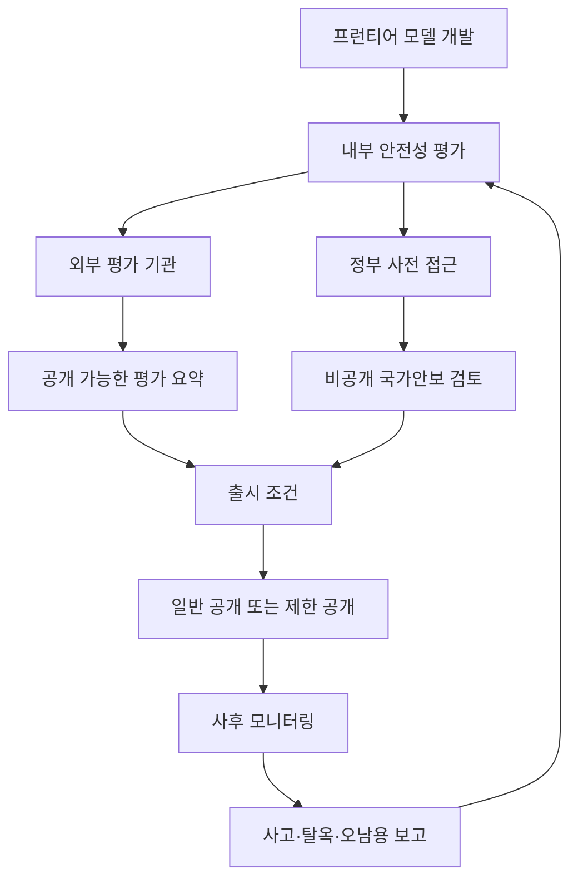

> 한 줄 요약: 프런티어 모델 안전성 평가 논쟁은 OpenAI Sol이 얼마나 위험한지보다, 출시 허가를 누가 어떤 기준으로 판단했는지가 보이지 않는다는 문제에 가깝다. 이제 AI 모델 출시 리스크는 성능 수치보다 절차의 불투명성 쪽으로 옮겨가고 있다.

## 무슨 일이 있었나

2026년 7월 9일 TechCrunch는 OpenAI의 새 프런티어 모델 Sol이 넓은 공개 접근으로 풀리는 과정에서 미국 정부가 어떤 기준으로 안전성을 판단했는지 불분명하다고 짚었다.

기사의 문제 제기는 단순하다. OpenAI Sol은 Anthropic의 Fable과 비슷한 수준의 고성능 모델로 묘사된다. Fable은 사이버 보안 능력과 탈옥(Jailbreak) 우려 때문에 한때 더 넓은 접근이 제한됐고, 외국 국적자의 사용 금지까지 거론된 모델이다. 그런데 Sol은 정부와 사전 대화를 거친 뒤 공개 접근으로 나아갔다.

확인된 사실은 여기까지다.

- OpenAI는 Sol 공개 전 정부와 일부 사용자에게 모델을 먼저 제공했다.
- OpenAI는 최신 모델 안전성 카드에서 UK AISI, SecureBio, Irregular 같은 외부 평가 결과를 언급했다.
- Anthropic은 Fable 5 재배포와 함께 사이버 안전 분류기(Safety Classifier)와 탈옥 심각도 프레임워크 초안을 공개했다.
- 미국 행정부는 프런티어 모델 평가 로드맵을 담은 행정명령을 냈지만, 어떤 모델이 심사를 받아야 하는지, 어떤 기관이 어떤 방식으로 평가하는지는 아직 채워지지 않았다.
- 현재는 상무부 산하 Center for AI Standards and Innovation이 앞에 서는 모양새지만, 6개 내각 기관이 최종 절차를 정해야 하는 상태로 전해졌다.

추정이나 해석에 가까운 부분도 따로 봐야 한다.

OpenAI가 정부와 더 협조적이어서 가벼운 규제를 받았는지, 정치권과의 관계가 심사 강도에 영향을 줬는지, Anthropic Fable 제한에는 기술 리스크 외에 행정부와의 관계 문제가 얼마나 작용했는지는 외부에서 확정하기 어렵다. TechCrunch도 이 지점을 단정하지 않고, 관찰자가 분리해 보기 어렵다고 표현한다.

문제는 이 회색지대다. AI 안전성 평가는 일부 비공개일 수 있다. 모델 가중치, 취약점, 생물보안, 사이버 능력 같은 민감한 내용이 포함되기 때문이다. 하지만 비공개와 무기준은 다르다. 지금 논쟁은 보안을 위해 일부 정보를 숨길 수 있느냐보다, 숨겨진 절차가 공정하고 재현 가능한지 확인할 최소한의 틀이 있느냐에 가깝다.

## 왜 사람들이 반응했나

커뮤니티가 예민하게 보는 지점은 모델 성능이 올라갔다는 사실 자체가 아니다. 더 불편한 질문은 이렇다.

누가 출시 버튼을 누를 권한을 갖는가?

AI 모델 출시에는 적어도 네 종류의 이해관계자가 얽힌다. 모델을 만든 기업, 사용을 허용하거나 제한할 정부, 평가를 수행하는 연구자와 감사기관, 실제로 영향을 받는 개발자와 일반 사용자다. 그런데 현재 구조에서는 앞의 두 주체만 선명하게 보이고, 나머지는 흐릿하다.

### 신뢰는 누가 보증하나

OpenAI는 정부 및 동맹국과의 국가안보 파트너십 원칙을 공개하며, 민주적 책임성, 인간의 판단, 법치, 공공안전을 강조했다. 특히 사이버 방어와 생물보안 같은 영역에서 AI가 방어자에게 이점을 줄 수 있다고 본다.

그 방향 자체는 이상하지 않다. 고성능 모델은 취약점 분석, 악성 코드 이해, 위협 인텔리전스 정리, 보안 패치 우선순위화에 도움이 될 수 있다. 방어 측에 모델을 제공하지 않는다고 공격 측의 역량이 사라지는 것도 아니다.

다만 신뢰는 선언만으로 생기지 않는다. 정부 파트너십 원칙이 있어도, 어떤 테스트를 통과해야 공개 가능한지, 실패하면 어떤 조치가 필요한지, 누가 이의를 제기할 수 있는지 알 수 없다면 외부에서는 정치적 승인과 안전성 평가를 구분하기 어렵다.

Anthropic의 Fable 5 글은 이 지점에서 비교 대상이 된다. 회사는 사이버 안전 분류기가 어떤 해를 막으려 하는지, 탈옥 심각도를 어떻게 나눌지 초안을 공개했다. 물론 이것도 회사가 직접 정리한 프레임워크라 한계가 있다. 그래도 논쟁 가능한 언어를 밖으로 꺼냈다는 점은 다르다.

### 정부 접근은 임시 절차인가 허가제인가

OpenAI는 정부 사전 접근 방식이 장기 기본값이 되어서는 안 된다고 밝혔다. 이 문장은 양면적이다. 기업도 임시방편이라는 점을 알고 있다는 뜻이지만, 현재 임시방편이 이미 출시 경로를 좌우하고 있다는 뜻이기도 하다.

현업에서 비슷한 구조를 보면, 임시 승인 절차는 금방 관행이 된다. 처음에는 예외 처리를 위해 만든 체크리스트가 다음 배포의 기준이 되고, 담당자가 바뀌면 기준은 더 모호해진다. 문서화되지 않은 허가는 빠르지만, 실패했을 때 책임 소재를 남기지 않는다.

AI 모델 출시도 비슷하다. 오늘은 OpenAI와 Anthropic 같은 대형 연구소가 정부와 직접 대화한다. 내일은 더 작은 연구소, 오픈 모델 개발자, 대학 연구팀이 같은 문턱 앞에 선다. 그때 필요한 요건이 공개되어 있지 않다면, 안전성보다 접근권과 인맥이 더 큰 변수가 된다.

### 닫힌 평가는 작은 팀에 더 비싸다

Dean W. Ball은 아무도 라이선스 요건을 모른다고 썼고, Andy Konwinski는 프런티어 랩 직원들조차 절차를 이해하는 사람을 만나기 어렵다고 말했다. 이 말이 맞다면 문제는 대기업 몇 곳의 출시 일정에 그치지 않는다.

불명확한 규제는 큰 기업보다 작은 팀에 더 비싸다. 큰 기업은 전담 정책팀, 로비 채널, 정부 접촉면, 외부 평가 예산을 갖는다. 작은 연구소나 오픈 모델 커뮤니티는 같은 정보를 얻는 데 훨씬 많은 비용을 쓴다.

Reddit LocalLLaMA의 GLM-5.2 반응도 이 맥락에서 읽어야 한다. 해당 게시물은 언론이 오픈 모델의 사이버 능력을 공포 중심으로 다루고, 이것이 검열이나 제한의 근거로 쓰일 수 있다는 우려를 드러낸다. 커뮤니티가 방어적으로 반응하는 이유는 규제를 싫어해서만은 아니다. 닫힌 기업 모델은 협의를 거쳐 통과하고, 내려받을 수 있는 오픈 모델은 위험 담론의 표적이 되는 구조가 생길 수 있기 때문이다.

### 안전장치는 제품 경험을 바꾼다

Anthropic이 설명한 사이버 안전 분류기는 위험하거나 잠재적으로 위험한 사이버 사용을 탐지하고 차단하는 시스템이다. 이런 장치는 모델 본체와 별개로 사용자 요청을 분류하고, 허용 가능한 작업과 차단해야 할 작업을 가른다.

개발자 입장에서는 여기서 사용성이 갈린다. 취약점 재현, 모의 침투 테스트, CTF, 보안 교육, 내부 코드 감사는 합법적이고 필요한 작업일 수 있다. 하지만 문맥을 잘못 읽는 분류기는 정당한 작업도 막을 수 있다. 반대로 너무 느슨하면 실제 공격 보조를 허용한다.

그래서 안전장치가 있다는 사실보다 경계 조건이 더 중요하다. 어떤 요청이 허용되는가. 차단됐을 때 이의 제기나 감사 로그가 남는가. 기업 고객과 일반 사용자에게 같은 기준이 적용되는가. 정부나 대형 파트너에게는 더 높은 권한이 주어지는가.

### FDA는 없어도 허가는 남는다

Sriram Krishnan은 AI를 위한 FDA는 없을 것이라고 말했다. 이 말은 산업계에는 듣기 좋은 신호일 수 있다. 느린 중앙 허가제 없이 혁신을 이어갈 수 있다는 뜻으로 읽히기 때문이다.

하지만 공식 FDA가 없다고 허가제가 사라지는 것은 아니다. 명시적 기관이 없으면 비공식 허가가 생긴다. 회의, 전화, 사전 브리핑, 선택된 평가자, 공개되지 않은 레드팀 결과가 출시의 실질 조건이 된다.

이 방식은 빠르지만 약하다. 같은 성능의 모델 A와 B가 있을 때, A는 허용되고 B는 제한되는 이유를 설명하기 어렵다. 정책의 예측 가능성이 떨어지면 기업은 안전성을 높이는 데 투자하기보다 정부 관계를 관리하는 데 더 많은 자원을 쓰게 된다.

## 내가 보는 핵심

이번 이슈는 프런티어 AI 모델의 위험 여부만으로 정리되지 않는다. 관건은 고위험 기술을 다루는 출시 거버넌스가 제품 출시 속도, 국가안보, 산업 경쟁, 오픈소스 생태계를 함께 감당할 만큼 성숙했는가다.

모델 안전성은 이제 단일 점수로 끝나지 않는다. 사이버 능력, 생물보안 악용 가능성, 탈옥 내성, 에이전트 도구 사용, 데이터 유출 가능성, 정치적 오남용, 특정 국가나 집단에 대한 접근 제한이 서로 얽힌다. 각 항목은 기술 평가와 정책 판단이 섞여 있다.

문제는 이 복합 평가가 닫힌 방 안에서만 이뤄질 때 생긴다. 정부는 민감 정보를 보호해야 하고, 기업은 모델 세부 정보를 공개하기 어렵다. 그렇다고 평가 과정 전체가 불투명하면, 실패했을 때 누구도 납득 가능한 설명을 내놓기 힘들다.

이 흐름에서 가장 약한 고리는 정부 사전 접근과 출시 조건 사이에 있다. 외부에서는 어떤 입력이 어떤 결정으로 이어졌는지 보기 어렵다. 안전성 카드와 블로그 글은 일부 정보를 주지만, 판단 기준과 책임 구조를 대체하지는 못한다.

이런 상황에서는 세 가지 문서가 필요하다.

| 구분 | 필요한 내용 | 공개 범위 |
|---|---|---|
| 출시 전 평가 기준 | 어떤 능력과 위험이 심사 대상인지 | 최대한 공개 |
| 민감 평가 결과 | 사이버, 생물보안 등 상세 테스트 | 요약 공개, 원자료 제한 |
| 출시 후 대응 계획 | 탈옥, 오남용, 사고 발생 시 조치 | 공개 |

이 정도 틀이 있어야 기업도 예측 가능한 경로를 갖고, 정부도 임의적 결정이라는 의심을 줄일 수 있다. 커뮤니티는 모델이 차단되거나 허용될 때 그 이유를 토론할 수 있다.

OpenAI의 정부·국가안보 원칙은 이 틀의 일부가 될 수 있다. Anthropic의 Fable 5 사이버 안전장치와 탈옥 심각도 프레임워크도 일부가 될 수 있다. 하지만 각 회사가 자기 언어로 만든 원칙만으로는 부족하다. 서로 비교 가능한 공통 기준이 있어야 한다.

오픈 모델 논쟁도 여기서 다시 봐야 한다. GLM-5.2 같은 모델이 누구나 내려받아 실행할 수 있다는 사실은 분명 다른 리스크를 만든다. 중앙 서버에서 차단할 수 없고, 사용자의 의도를 실시간으로 통제하기 어렵다. 반대로 닫힌 모델이라고 해서 리스크가 사라지는 것도 아니다. 권한 있는 사용자가 더 강한 도구 접근권을 얻는 순간, 사고의 규모는 더 커질 수 있다.

닫힌 모델은 통제하기 쉽지만 권력이 집중된다. 열린 모델은 검증하기 쉽지만 통제가 어렵다. 어느 쪽도 절대적으로 안전하다고 말하기 어렵다. 그래서 배포 방식별 위험을 따로 재는 기준이 필요하다.

## 앞으로 볼 기준

다음번 프런티어 모델 출시 뉴스를 볼 때는 성능표보다 네 가지를 먼저 보는 편이 낫다.

첫째, 어떤 기관이 평가했는가. 회사 내부 평가인지, 정부가 직접 본 것인지, 독립적인 제3자가 접근했는지 구분해야 한다. 이름만 있는 외부 평가는 충분하지 않다. 어떤 범위를 테스트했는지가 따라와야 한다.

둘째, 어떤 위험 범주가 포함됐는가. 사이버 보안, 생물보안, 에이전트 행동, 탈옥, 데이터 유출, 선거·여론 조작 같은 범주는 서로 다르다. 모델이 코딩 벤치마크에서 강하다는 말은 사이버 위험 평가와 같지 않다.

셋째, 출시 조건이 무엇인가. 전체 공개인지, 제한 공개인지, 국적·지역·고객 유형에 따른 접근 차등이 있는지 봐야 한다. 특히 정부나 대형 파트너에게 일반 사용자보다 강한 권한이 제공되는 경우, 그 사용을 감시하는 장치가 따로 필요하다.

넷째, 사후 대응이 있는가. 탈옥이 발견됐을 때 누가 보고하고, 어떤 기간 안에 수정하고, 사용자에게 무엇을 알리는지 봐야 한다. Anthropic이 HackerOne 프로그램을 언급한 것처럼, 외부 연구자가 취약한 안전장치를 보고할 경로는 점점 더 필요한 요소가 된다.

이번 Sol 논쟁은 OpenAI 한 회사의 출시 논란으로만 보면 작아진다. 더 큰 질문은 앞으로 모든 프런티어 모델이 어떤 문을 통과해 세상에 나올 것인가다.

정부가 아무것도 하지 않는 것도 답이 아니다. 기업이 스스로 안전하다고 말하는 것만 믿는 것도 답이 아니다. 비공개 회의와 정치적 접촉이 사실상의 허가 절차가 되는 방식도 오래 버티기 어렵다.

AI 모델 출시에는 이제 제품 출시 이상의 책임이 붙었다. 그 책임을 감당하려면 비밀을 전부 없앨 필요는 없다. 대신 기준, 역할, 사후 책임은 밖에서 볼 수 있어야 한다. 그래야 다음 모델이 나왔을 때 질문이 성능이 얼마나 좋아졌나에서 누가 왜 허용했나로만 반복해서 돌아가지 않는다.

## 참고 자료

- [선정 글감] [How did the government decide OpenAI’s frontier model was safe to release?](https://techcrunch.com/2026/07/09/how-did-the-government-decide-openais-frontier-model-was-safe-to-release/), TechCrunch
- [관련] [Our approach to government and national security partnerships](https://openai.com/index/government-national-security-partnerships), OpenAI Blog
- [관련] [More details on Fable 5’s cyber safeguards and our jailbreak framework](https://www.anthropic.com/news/fable-safeguards-jailbreak-framework), Anthropic News
- [관련] [GLM-5.2 fearmongering in the press](https://www.reddit.com/r/LocalLLaMA/comments/1urhzox/glm52_fearmongering_in_the_press/), Reddit LocalLLaMA