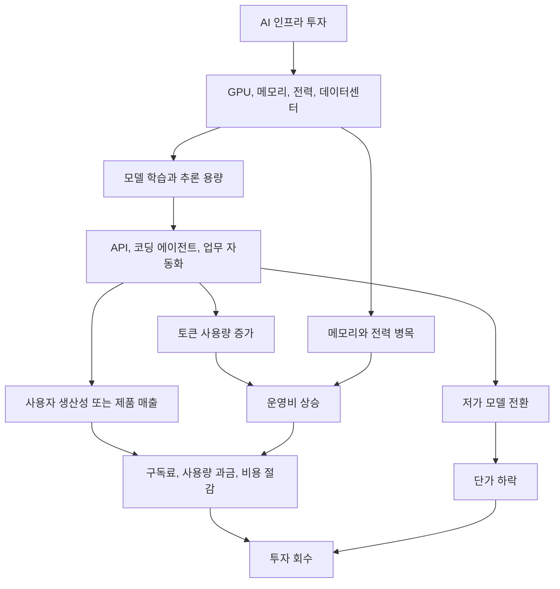

> 한 줄 요약: AI 인프라 투자 논쟁은 이제 “AI가 쓸모 있느냐”보다 “누가 비용을 내고, 어느 정도 사용량으로 회수하느냐”에 가깝다. 개발자와 기업은 모델 성능표만 볼 게 아니라 단가, 락인, 데이터 흐름, 운영 리스크를 같이 계산해야 한다.

## 무슨 일이 있었나

2026년 7월 9일 TechCrunch가 AI 인프라 투자 회수 논쟁을 다시 다뤘다. 출발점은 세쿼이아 캐피털 파트너 데이비드 칸(David Cahn)의 계산이다.

2023년에는 엔비디아(Nvidia)의 연간 GPU 매출 500억 달러를 기준으로 삼았다. 데이터센터 운영비와 사업자 마진까지 넣으면 AI 인프라 투자를 정당화하려면 약 2,000억 달러 매출이 필요하다는 주장이다.

2026년 계산은 더 커졌다. 칸은 AI 인프라 지출 규모를 1.5조 달러로 보고, 이 투자를 정당화하려면 AI 산업이 약 3조 달러 매출을 만들어야 한다고 봤다. 메모리 가격 상승, 추론 전용 칩, 데이터센터 건설 비용까지 넣으면 이 수치도 낮게 잡힌 것일 수 있다는 설명이 붙었다.

확인된 사실과 추정은 나눠 봐야 한다.

| 구분 | 내용 |
|---|---|
| 확인된 흐름 | 하이퍼스케일러가 AI 데이터센터, GPU, 메모리, 전력 인프라에 막대한 투자를 하고 있다 |
| 기사 내 계산 | 2026년 AI 인프라 지출 1.5조 달러, 필요 매출 3조 달러라는 추정 |
| 시장 우려 | 토큰 가격 하락, 오픈 웨이트(Open Weight) 모델 확산, 중국산 저가 모델 사용 증가 |
| 아직 추정인 부분 | OpenAI, Anthropic의 장래 매출과 상장 가치, 하이퍼스케일러의 2028년 현금흐름 회복 |

Apollo의 수석 이코노미스트 토르스텐 슬록(Torsten Slok)은 다른 각도에서 위험을 봤다. Google, Meta, Microsoft, Amazon 같은 하이퍼스케일러가 2028년 자유현금흐름(Free Cash Flow) 반등을 기대하고 있는데, 회수가 늦어지면 AI 섹터만의 문제가 아니라 주식시장 전체 충격으로 번질 수 있다는 관점이다.

여기에 두 흐름이 겹친다.

하나는 AI 기업 가치의 집중이다. TechCrunch의 다른 글은 SpaceX, Anthropic, OpenAI 같은 초대형 기업의 상장 또는 상장 기대 가치가 지난 25년 미국 VC 지원 엑싯 전체와 비교될 만큼 커졌다고 설명한다. 숫자가 그대로 실현될지는 별개다. 다만 시장이 소수 기업의 미래 현금흐름을 너무 앞서 반영하고 있다는 신호로는 읽힌다.

다른 하나는 병목의 이동이다. Nvidia는 AI 컴퓨팅 시장의 중심에 있었지만, 최근 투자자 관심은 GPU 자체보다 고대역폭 메모리(High Bandwidth Memory)와 데이터센터 병목으로 옮겨가고 있다. GPU 부족이 완화되자 메모리, 전력, 네트워크, 추론 비용이 새 제약으로 떠오른 셈이다.

## 왜 사람들이 반응했나

AI ROI 논쟁이 커뮤니티에서 오래 가는 이유는 단순하다. 모두가 AI를 쓰고 있지만, 비용 구조를 완전히 믿는 사람은 많지 않다.

개발자 입장에서는 토큰 가격이 내려가는 게 좋다. 코딩 에이전트가 더 오래 실행되고, 더 많은 파일을 읽고, 더 많은 테스트를 돌려도 부담이 줄어든다. OpenAI CEO 샘 올트먼이 최신 모델의 코딩 작업 토큰 효율이 54% 개선됐다고 말한 것도 사용자에게는 반가운 신호다.

하지만 인프라 투자자에게 같은 사실은 불편하다. 토큰당 가격이 떨어지면 매출을 유지하려고 사용량이 훨씬 더 늘어야 한다. 사용자가 프런티어 모델 대신 저렴한 오픈 웨이트 모델이나 자체 호스팅 모델로 옮겨가면 회수 계산은 더 흔들린다.

현업에서 AI 도입을 검토하다 보면 대개 성능 데모로 이야기가 시작된다. 그런데 실제 의사결정은 곧 이런 질문으로 옮겨간다.

- 이 기능은 매달 얼마를 태우는가
- 실패했을 때 사람이 다시 처리할 수 있는가
- 민감 데이터가 어느 모델과 로그에 남는가
- 같은 품질을 더 싼 모델로 낼 수 있는가
- 특정 벤더 가격 정책이 바뀌면 제품 원가가 무너지는가

커뮤니티가 불편해하는 지점도 여기다. AI 기능이 공짜처럼 보일 때는 마법처럼 느껴진다. 그런데 에이전트가 저장소 전체를 훑고, 실패한 패치를 반복하고, 테스트 로그를 다시 읽고, 같은 프롬프트를 여러 모델에 던지는 순간 비용은 사용자 눈에 잘 안 보이는 운영비가 된다.

Computerphile의 토큰 비용 설명도 이 맥락과 맞닿아 있다. 사람이 보기에는 간단한 작업이어도 에이전트가 스스로 맥락을 수집하고 검증하고 재시도하면 토큰 사용량은 빠르게 늘어난다. 토큰은 채팅창에 찍힌 글자 수라기보다, 에이전트가 시스템을 탐색하는 방식 전체의 비용 단위에 가깝다.

Bun의 Rust 재작성 사례도 그래서 눈에 띈다. The Pragmatic Engineer는 AI를 활용해 Bun의 Zig 코드를 Rust로 옮기는 작업이 11일 만에 진행됐고, 토큰 비용이 16만 5천 달러였다고 전했다. 회의적으로 보면 비싼 자동완성이다. 현실적으로 보면 검증 가능한 테스트 기반이 있을 때 1년 단위 마이그레이션을 며칠 단위로 줄일 수 있다는 사례다.

둘 다 맞다. 같은 16만 5천 달러도 테스트가 촘촘한 런타임 프로젝트에서는 투자일 수 있고, 요구사항이 흐릿한 업무 자동화에서는 낭비일 수 있다.

이 그림에서 봐야 할 것은 한쪽 화살표가 아니라 루프다. 인프라 투자가 커질수록 사용량이 늘어야 하고, 사용량이 늘수록 비용 최적화 압력도 커진다. 비용 최적화가 잘되면 사용자에게는 좋지만, 공급자 매출에는 부담이 된다.

## 내가 보는 핵심

이번 논쟁을 AI 버블이냐 아니냐로만 보면 놓치는 게 많다. 더 실무적인 질문은 AI 가치가 어느 계층에 남느냐다.

AI 스택을 단순화하면 네 계층으로 나눌 수 있다.

| 계층 | 돈을 버는 방식 | 흔들리는 지점 |
|---|---|---|
| 인프라 | GPU, 메모리, 전력, 데이터센터 임대 | 공급 증가, 병목 이동, 감가상각 |
| 모델 | API 사용료, 엔터프라이즈 계약 | 가격 하락, 오픈 모델 경쟁 |
| 에이전트 제품 | 구독, 좌석당 과금, 워크플로 자동화 | 토큰 원가, 품질 편차, 책임 소재 |
| 도입 기업 | 인건비 절감, 처리량 증가, 신규 기능 | 검증 비용, 보안, 업무 재설계 |

3조 달러 질문은 결국 이 표의 위쪽 계층이 기대하는 매출을 아래쪽 계층이 실제로 만들어낼 수 있느냐는 질문이다.

개발자 커뮤니티가 민감하게 반응하는 이유도 여기에 있다. 모델 회사와 클라우드 회사는 사용량 증가를 원한다. 사용자는 비용 감소와 선택권 확대를 원한다. 기업 보안팀은 데이터 이동을 줄이고 싶어 한다. 오픈소스 커뮤니티는 특정 API에 개발 생태계가 묶이는 것을 경계한다.

서로 원하는 방향이 완전히 같지 않다.

특히 코딩 에이전트는 이 긴장을 잘 보여준다. 좋은 코딩 에이전트는 더 많은 맥락을 읽어야 한다. 저장소 구조, 테스트 결과, 이슈, 문서, 이전 커밋까지 봐야 품질이 올라간다. 그런데 바로 그 행동이 비용과 보안 표면을 키운다.

이런 상황에서는 모델 성능표보다 운영 설계가 먼저다.

- 에이전트가 읽을 수 있는 저장소 범위 제한
- 민감 파일과 비밀값 탐지
- 프롬프트와 응답 로그 보존 정책
- 실패 시 자동 재시도 횟수 제한
- 모델별 단가와 품질 벤치마크
- 사람 검토가 필요한 변경 기준
- 오픈 웨이트 모델과 상용 API의 분기 기준

AI ROI는 CFO만 보는 숫자가 아니다. 개발팀이 에이전트를 어디까지 허용할지, 플랫폼팀이 어떤 모델 라우터를 둘지, 보안팀이 어떤 로그를 금지할지에 그대로 내려온다.

그래서 이번 이슈의 핵심은 AI가 돈을 벌 수 있느냐만이 아니다. 돈을 버는 위치와 비용을 떠안는 위치가 다를 수 있다는 점이다. 사용자는 생산성을 얻고, 클라우드는 사용량을 얻고, 모델 회사는 API 매출을 얻고, 기업은 보안과 검증 비용을 떠안을 수 있다. 이 배분이 흐릿하면 커뮤니티 반응은 계속 거칠어진다.

## 앞으로 볼 기준

다음 AI 인프라 뉴스를 볼 때는 기업 가치나 모델 점수보다 아래 기준을 먼저 보면 좋다.

### AI 매출은 사용량 증가인가, 단가 상승인가?

토큰 가격이 내려가도 전체 사용량이 폭발적으로 늘면 매출은 증가할 수 있다. 반대로 사용량이 늘어도 더 싼 모델로 이동하면 프런티어 모델 회사 매출은 기대만큼 늘지 않을 수 있다.

확인할 것은 총매출만이 아니다. 토큰당 매출, 고객당 사용량, 추론 원가, 무료 크레딧 의존도를 같이 봐야 한다.

### AI 비용 절감은 회계상 어디에 잡히나?

기업이 AI로 시간을 줄였다고 해서 바로 현금흐름이 좋아지는 것은 아니다. 사람을 줄이지 않거나, 검토 비용이 늘거나, 장애 대응이 복잡해지면 생산성 개선은 장부상 이익으로 늦게 나타난다.

반대로 코드 마이그레이션처럼 범위가 명확하고 테스트가 촘촘한 작업은 비용 대비 효과가 더 선명하다. Bun 사례가 관심을 받은 이유도 여기에 있다. AI가 특별히 영리해서라기보다, 검증 가능한 작업이었기 때문이다.

### 병목은 GPU에서 끝나는가?

Nvidia 사례가 보여주듯, AI 인프라 병목은 한 자리에 머물지 않는다. GPU가 풀리면 메모리가 부족해지고, 메모리가 풀리면 전력과 냉각, 네트워크, 데이터센터 부지가 문제가 된다.

기업이 AI 기능을 설계할 때도 비슷하다. 처음에는 모델 성능이 병목처럼 보이지만, 곧 비용, 지연시간, 개인정보, 감사 로그, 장애 격리가 병목이 된다.

### 오픈 웨이트 모델 전환은 가능한가?

오픈 웨이트 모델은 비용과 통제권 면에서 매력적이다. 다만 자체 운영에는 모델 서빙, 평가, 보안 패치, GPU 확보, 장애 대응이 따라온다.

작은 팀이 무조건 자체 호스팅을 택할 필요는 없다. 대신 언제든 바꿀 수 있는 구조는 필요하다. 프롬프트, 평가 데이터, 모델 호출부, 로그 스키마를 특정 벤더에 너무 깊게 묶어두면 가격 정책 하나에도 제품 원가가 흔들린다.

### 에이전트는 실패할 때 얼마나 비싼가?

AI 에이전트의 진짜 비용은 성공한 호출보다 실패한 루프에서 나온다. 같은 파일을 반복해서 읽고, 잘못된 가정을 바탕으로 패치를 만들고, 테스트 실패를 다시 해석하는 과정이 누적된다.

따라서 도입 전에는 성공률뿐 아니라 실패당 비용을 봐야 한다.

- 한 작업당 최대 토큰 예산
- 재시도 제한
- 장시간 실행 중단 조건
- 위험 작업 승인 단계
- 모델 교체 시 품질 회귀 테스트

AI 인프라 투자 논쟁은 멀리 있는 월스트리트 이야기처럼 보이지만, 실제로는 다음 스프린트에서 어떤 코딩 에이전트를 켤지와 연결된다. 누군가의 3조 달러 회수 계획은 다른 누군가의 월별 API 청구서, 보안 정책, 모델 선택권으로 내려온다.

AI를 덜 쓰자는 말은 아니다. 비용이 보이지 않는 방식으로 쓰지 말자는 말에 가깝다. 다음번에 더 빠른 모델, 더 싼 토큰, 더 똑똑한 에이전트가 나왔다는 뉴스를 보면 성능표 옆에 작은 질문을 붙여두면 된다.

이 비용은 누가 내고, 이 절감분은 누구에게 남는가.

## 참고 자료

- [선정 글감] [Can AI answer the $3 trillion question?](https://techcrunch.com/2026/07/09/can-ai-answer-the-3-trillion-question/) (TechCrunch)
- [관련] [Anthropic, OpenAI, and SpaceX are bigger than the last 25 years of tech exits](https://techcrunch.com/2026/07/09/anthropic-openai-and-spacex-are-bigger-than-the-last-25-years-of-tech-exits/) (TechCrunch)
- [관련] [Nvidia is a victim of the compute marketplace it created](https://techcrunch.com/2026/07/09/nvidia-is-a-victim-of-the-compute-marketplace-it-created/) (TechCrunch)
- [관련] [The Pulse: What can we learn from Bun’s rapid Rust rewrite with AI?](https://newsletter.pragmaticengineer.com/p/the-pulse-what-can-we-learn-from) (The Pragmatic Engineer)
- [관련] [Why AI Tokens are so Expensive - Computerphile](https://www.youtube.com/watch?v=-0HRzXk8vlk) (YouTube Computerphile)