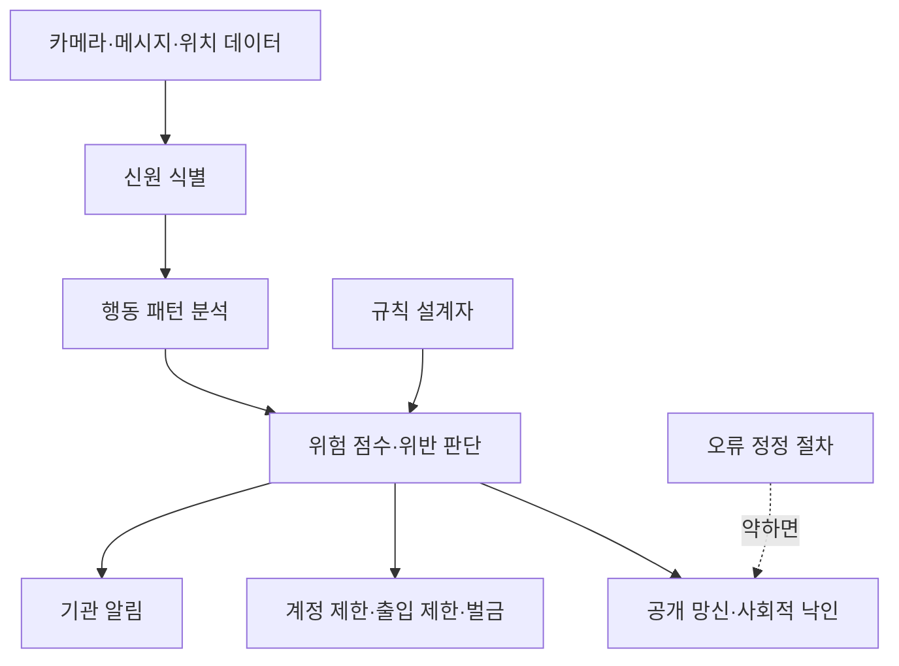

> 한 줄 요약: AI 감시는 카메라 수가 늘어나는 문제를 넘어, 검색 가능한 행동 데이터와 자동 집행이 결합되는 문제다. 쟁점은 보안 효과만이 아니라 누가 규칙을 만들고, 그 규칙이 틀렸을 때 누가 되돌릴 수 있느냐다.

## 무슨 일이 있었나

2026년 7월 10일, Bruce Schneier와 Jon Penney는 AI 감시가 민주주의와 사회 변화에 미칠 영향을 다룬 글을 공개했다. 글의 문제의식은 분명하다. AI 기반 감시 시스템이 공공장소의 얼굴, 이동, 행동, 온라인 활동까지 연결하면 위반 탐지와 처벌이 거의 실시간에 가까워질 수 있다는 것이다.

확인된 사실과 예측은 나눠서 봐야 한다.

| 구분 | 내용 |
| --- | --- |
| 확인된 사례 | 중국은 대규모 감시 카메라와 얼굴 인식 인프라를 운용하고 있으며, 채무 문제로 블랙리스트에 오른 시민의 얼굴과 신상 일부가 전광판에 표시된 사례가 소개됐다. |
| 확인된 흐름 | 미국 국토안보부(DHS)가 이민자, 시위자, 언론인, 법률 참관인 등을 대상으로 AI 기반 감시 활용을 늘리고 있다는 보고가 언급됐다. |
| 기술 변화 | AI 영상 감시는 사전에 정한 객체 검색을 넘어, 자연어로 행동 패턴을 묻고 영상에서 답을 찾는 방향으로 가고 있다. |
| 정책 사례 | EU에서는 아동 성착취물 탐지를 명분으로 민간 기업의 메시지 스캔 권한을 둘러싼 Chat Control 논쟁이 이어지고 있다. |
| 아직 추정인 부분 | 모든 위반이 즉시 개인 기록에 붙고 자동 벌금으로 이어지는 사회는 현재의 보편적 현실이 아니라, 저자들이 경고하는 확장 시나리오다. |

AI 감시 논쟁이 커지는 이유는 카메라 한 대가 더 설치됐기 때문이 아니다. 카메라, 얼굴 인식, 위치 기록, 메시지 스캔, 데이터베이스, 자동 판단이 하나의 운영 체계로 묶일 때 시민의 행동 반경이 달라질 수 있기 때문이다.

기존 감시가 사후 조회에 가까웠다면, AI 감시는 실시간 질의와 자동 분류에 가까워진다. Financial Times 사례를 인용한 보조 글에서는 정보기관이 영상에 대해 두 사람이 가방을 주고받는 장면, 하루에 여러 번 옷을 갈아입은 사람, 특정 장소를 반복해서 지난 차량처럼 행동 기반 질문을 던질 수 있다고 설명한다. 감시의 단위가 사물에서 행동으로 옮겨가는 셈이다.

## 왜 사람들이 반응했나

첫 번째 불편함은 감시의 목적이 쉽게 넓어진다는 점이다. 속도위반 카메라는 특정 도로, 특정 규칙, 특정 행위에 묶여 있다. 하지만 AI 감시가 행동 검색으로 넘어가면 규칙은 훨씬 유연해진다.

유연하다는 말이 꼭 좋은 뜻은 아니다. 오늘은 폭력 범죄 탐지에 쓰인 기준이 내일은 시위 참여자 식별에 쓰일 수 있다. 그다음에는 회사가 원치 않는 고객 분류나 특정 생활양식에 대한 점수화로 번질 수도 있다.

두 번째는 사적 기업과 공권력의 경계가 흐려진다는 점이다. EU Chat Control 논쟁도 여기와 맞닿아 있다. 아동 보호라는 목적은 강력하지만, 민간 플랫폼이 개인 메시지와 이메일, 사진을 스캔할 수 있는 법적 근거가 생기면 다른 목적의 탐지로 확장될 수 있다는 우려가 따라온다.

이 논쟁에서 사람들은 프라이버시만 말하지 않는다. 사적 대화의 기본값이 검열 가능한 상태가 되는지, 암호화된 대화가 예외로 남을 수 있는지, 탐지 오류가 났을 때 누가 소명 절차를 제공하는지를 묻는다.

세 번째는 데이터 분류가 곧 권한 행사가 된다는 점이다. Madison Square Garden 사례는 공공기관이 아니어도 감시와 분류가 충분히 민감해질 수 있음을 보여준다. 내부 데이터베이스에 유명인과 방문객이 위험 점수, DO NOT HOST 같은 라벨로 관리되고, 일부 항목에는 LGBTQIA 같은 민감한 분류가 붙었다는 보도는 감시의 목적이 보안에서 평판 관리와 출입 통제로 번질 수 있음을 보여준다.

이런 사례가 개발자 커뮤니티에서도 논의되는 이유는 분명하다. 모델 정확도, 벡터 검색, 얼굴 인식 성능만의 문제가 아니기 때문이다. 시스템을 만든 순간부터 데이터 보존 기간, 접근 권한, 감사 로그, 이의제기 절차, 오탐 비용이 제품 요구사항이 된다.

현업에서 비슷한 고민을 하다 보면 기능 요청은 보통 단순하게 들어온다. 이상 행동을 찾아주세요, 위험 고객을 표시해주세요, 부정 사용자를 자동 차단해주세요. 그런데 실제 설계 단계로 내려가면 질문이 바뀐다.

- 이상 행동의 기준은 누가 정하는가
- 모델 점수만으로 조치를 취할 수 있는가
- 사람이 검토하기 전까지 어떤 불이익을 막을 것인가
- 로그는 얼마나 보관하고 누가 볼 수 있는가
- 사용자는 자신이 분류된 사실을 알 수 있는가
- 틀린 분류를 되돌리는 절차가 있는가

AI 감시 논쟁은 단순한 기술 찬반이 아니다. 자동화된 판단이 사람의 권리, 이동, 발언, 평판에 닿을 때 제품 책임이 어디까지 가야 하느냐의 문제다.

## 내가 보는 핵심

이번 이슈의 핵심은 감시의 정확도가 아니라 감시의 마찰 비용이다. 과거에는 사람을 감시하려면 인력, 시간, 예산이 필요했다. 그래서 감시는 선택적으로 이루어졌고, 그 선택 과정 자체가 어느 정도의 마찰로 작동했다.

AI가 들어오면 그 마찰이 낮아진다. 이미 수집된 영상과 로그에 자연어 질문을 던지고, 후보자를 정렬하고, 위험 점수를 매기고, 자동 알림을 보낼 수 있다. 기술이 좋아질수록 감시를 하지 않을 이유를 설명하는 쪽이 더 어려워질 수 있다.

이 지점에서 chilling effect, 즉 위축 효과가 나온다. 사람들은 실제로 처벌받지 않아도, 기록될 수 있고 해석될 수 있고 언젠가 불이익으로 돌아올 수 있다고 느끼면 행동을 줄인다. 글에서 든 동성 관계와 대마초 인식 변화의 예시는 이 논점을 설명하기 위한 것이다. 사회적 규범은 처음부터 합법과 정상의 영역에 있던 행동만으로 바뀌지 않는다.

조금 불편한 행동, 아직 합의되지 않은 표현, 다수가 싫어하는 실험이 남아 있어야 규범도 바뀐다. AI 감시가 모든 이탈을 기록하고 점수화하면 사회는 더 질서정연해질 수 있다. 대신 바뀔 여지를 잃을 수 있다.

실무 관점에서 더 까다로운 문제는 시스템이 중립적으로 보이기 쉽다는 점이다. 대시보드에는 점수와 라벨만 보인다. 하지만 그 뒤에는 데이터 수집 범위, 학습 데이터 편향, 정책 담당자의 가정, 운영자의 해석, 예외 처리 부재가 숨어 있다.

서킷 브레이커(Circuit Breaker)가 필요한 것도 이 때문이다. 위험 점수가 일정 기준을 넘었다고 바로 계정 정지, 출입 금지, 신고, 벌금으로 이어지면 시스템은 빠르지만 위험하다. 특히 개인에게 불이익을 주는 자동화라면 중간에 사람이 개입하거나, 최소한 조치 강도를 단계화해야 한다.

예를 들면 이런 구분이 필요하다.

| 단계 | 허용 가능한 자동화 | 반드시 따져야 할 조건 |
| --- | --- | --- |
| 탐지 | 후보 이벤트 표시 | 오탐률, 편향, 데이터 출처 |
| 분류 | 위험도 점수화 | 점수 산식 설명 가능성, 감사 로그 |
| 조치 | 알림·제한·신고 | 사람 검토, 이의제기, 피해 복구 |
| 보존 | 사건 기록 저장 | 보관 기간, 삭제권, 접근 통제 |

많은 조직이 탐지 시스템을 만들면서 조치 시스템까지 함께 만든다. 이때 흔한 함정은 낮은 확률의 오탐을 평균으로만 보는 것이다. 사용자 입장에서는 0.1%의 오탐도 자신에게 걸리면 100%의 사건이다.

## 앞으로 볼 기준

앞으로 AI 감시 뉴스를 볼 때는 기술 성능보다 범위를 먼저 봐야 한다. 어떤 데이터가 들어가고, 어떤 사람에게 적용되며, 어떤 조치로 이어지는지가 중요하다. 얼굴 인식 정확도가 99%라는 문장보다, 틀렸을 때 누가 어떤 피해를 입는지가 더 실질적인 질문이다.

다음 다섯 가지를 체크하면 과장과 실제 위험을 구분하기 쉽다.

- 적용 범위: 공공장소인지, 사적 공간인지, 온라인 대화까지 포함하는지
- 식별 방식: 익명 통계인지, 개인 신원과 연결되는지
- 조치 강도: 단순 알림인지, 벌금·출입 제한·계정 정지로 이어지는지
- 검토 절차: 자동 판단 전에 사람이 개입하는지
- 복구 가능성: 잘못 분류된 사람이 기록 삭제와 정정을 요구할 수 있는지

정책 담당자에게는 금지와 허용의 선이 필요하고, 개발자에게는 기본 설계 원칙이 필요하다. 수집 최소화, 목적 제한, 짧은 보존 기간, 권한 분리, 감사 로그, 설명 가능한 조치, 이의제기 절차는 부가 기능이 아니다. 감시 시스템에서는 이 요소들이 제품의 핵심 기능이다.

보안과 공공 안전을 이유로 한 감시가 전부 나쁘다는 말은 설득력이 약하다. 실제 범죄 탐지와 피해자 보호에 필요한 영역은 있다. 다만 그 필요가 모든 데이터 수집과 모든 자동 조치를 정당화하지는 않는다.

AI 감시가 만드는 큰 변화는 사람들이 잡히는 방식이 아니라, 잡힐 수 있다고 느끼며 스스로 행동을 줄이는 방식일 수 있다. 그래서 이 논쟁은 카메라 설치 대수의 문제가 아니다. 사회가 어느 정도의 불확실성, 실수, 일탈, 반대를 견딜 것인지에 대한 선택이다.

## 참고 자료

- [선정 글감] [AI Surveillance and Social Progress](https://www.schneier.com/blog/archives/2026/07/ai-surveillance-and-social-progress.html) — Schneier on Security
- [관련] [The Realities of AI Video Surveillance](https://www.schneier.com/blog/archives/2026/06/the-realities-of-ai-video-surveillance.html) — Schneier on Security
- [관련] [A Majority of European Lawmakers Voted Against Letting Big Tech Read Our Messages. They’re Going to Anyway](https://www.wired.com/story/a-majority-of-european-lawmakers-voted-against-letting-big-tech-read-our-messages-theyre-going-to-anyway/) — WIRED Security
- [관련] [Madison Square Garden Kept a List of Gay Celebrities](https://www.wired.com/story/madison-square-garden-celebrity-database-surveillance/) — WIRED Security