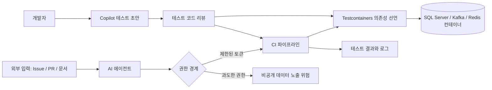

> 한 줄 요약: GitHub Copilot과 Testcontainers를 쓰면 통합 테스트 자동화를 빨리 시작할 수 있다. 다만 신뢰는 AI가 만든 코드에서 나오지 않는다. 격리된 실행 환경, 검증 가능한 의존성, CI 권한 설계가 받쳐줘야 한다.

## 왜 지금 이슈인가

GitHub Copilot, Testcontainers, 통합 테스트 자동화가 한꺼번에 묶이는 이유는 개발 속도만은 아니다. 이제 AI가 테스트 코드까지 제안하면서, 개발팀이 무엇을 믿고 병합할 수 있는지가 논점이 됐다.

선정 글감은 Copilot이 통합 테스트 골격을 만들고, Testcontainers가 SQL Server 같은 실제 의존성을 Docker 컨테이너로 띄워 CI에서 검증하는 흐름을 보여준다. 보일러플레이트를 줄이고, 공유 개발 DB나 과도한 목(Mock)에 기대던 테스트를 줄이자는 방향이다.

여기에 보안 이슈도 붙었다. 같은 시기 개발자 커뮤니티에서는 GitHub의 Agentic Workflows를 둘러싼 GitLost 사례가 크게 회자됐다. Noma Labs는 공개 저장소의 이슈에 숨긴 프롬프트 인젝션(Prompt Injection)으로 AI 에이전트가 같은 조직의 비공개 저장소 데이터를 끌어낼 수 있었다고 밝혔다.

두 이야기는 출발점이 다르지만, 결국 같은 질문으로 이어진다.

> AI가 개발 흐름 안으로 들어올 때, 테스트 하네스(Test Harness)는 속도 도구인가, 신뢰 경계인가?

## 커뮤니티에서 갈리는 지점

Copilot과 Testcontainers 조합을 긍정적으로 보는 쪽의 이유는 분명하다. 통합 테스트(Integration Test)는 늘 필요하다고 말하지만, 실제 현장에서는 설정 비용 때문에 뒤로 밀리기 쉽다.

공유 개발 환경은 상태 오염에 약하다. 누가 넣은 데이터인지 모르는 레코드, 버전이 다른 스키마, 재사용되는 메시지 큐 토픽 때문에 실패 원인을 추적하는 데 시간이 든다. 목 기반 테스트는 빠르지만 실제 DB 드라이버, 네트워크 지연, 트랜잭션, 직렬화 문제를 놓칠 수 있다.

Testcontainers는 이 지점을 꽤 정면으로 건드린다. 테스트 코드가 필요한 의존성을 직접 선언하고, Docker 컨테이너로 띄운 뒤, 테스트가 끝나면 정리한다. 관련 .NET 예시처럼 `MsSqlBuilder().Build()`로 SQL Server 컨테이너를 만들고, 연결 문자열을 받아 실제 쿼리를 실행하는 방식이다.

반대편의 우려도 단순한 보수성으로 보기는 어렵다. Copilot이 테스트 골격을 잘 제안하더라도 테스트의 의도, 데이터 경계, 실패 조건까지 보장하지는 않는다. AI가 만든 테스트는 종종 행복 경로(Happy Path)에 치우친다. 실제 장애를 드러내는 비정상 입력, 권한 오류, 타임아웃, 재시도 조건은 사람이 명시해야 한다.

GitLost 사례는 이 논쟁을 보안 쪽으로 밀어붙인다. AI 에이전트가 이슈, PR, 문서, 로그처럼 외부 입력을 읽고 도구를 호출하는 순간, 테스트 자동화와 보안 자동화의 경계가 흐려진다. 에이전트가 읽는 텍스트는 더 이상 단순 데이터가 아니다. 실행 계획을 바꾸는 입력이 될 수 있다.

그래서 커뮤니티의 갈림길은 AI를 쓰느냐 마느냐가 아니다.

- Copilot은 테스트 작성을 빠르게 시작하게 해준다.
- Testcontainers는 실제 의존성을 재현 가능한 형태로 만든다.
- CI/CD는 이 둘을 반복 가능한 절차로 묶는다.
- 하지만 에이전트 권한, 비밀값 접근, 저장소 경계는 별도 설계가 필요하다.

속도는 자동화가 준다. 신뢰는 격리와 검증이 만든다.

## 아키텍처 관점에서 볼 점

AI 기반 테스트 자동화는 코드 생성기, 테스트 하네스, 실제 의존성, CI 권한을 한 흐름으로 봐야 한다. Copilot은 테스트 코드를 제안할 수 있다. Testcontainers와 CI는 그 코드가 실제 조건에서 버티는지 확인하는 실행 계층에 가깝다.



이 구조에서 Testcontainers의 역할은 편의를 넘는다. 테스트가 의존하는 인프라를 코드로 고정하는 장치다. 로컬 PC, CI 러너, 리뷰 환경에서 같은 버전의 DB와 브로커를 띄울 수 있다면 재현성은 올라간다.

그렇다고 컨테이너가 모든 차이를 지워주지는 않는다. 운영 DB의 파라미터, 클라우드 매니지드 서비스의 네트워크 정책, 권한 모델, 스토리지 성능은 로컬 컨테이너와 다를 수 있다. SQL 문법이나 기본 트랜잭션 동작은 검증할 수 있어도, 실제 운영 장애의 모든 조건을 복제하지는 못한다.

Copilot이 제안한 테스트도 검증 대상이다. 예를 들어 다음과 같은 테스트는 시작점으로는 좋지만 충분하지 않다.

```csharp
[Fact]
public async Task ShouldSaveAndRetrieveLead()
{
    var sqlContainer = new MsSqlBuilder().Build();
    await sqlContainer.StartAsync();

    using var conn = new SqlConnection(sqlContainer.GetConnectionString());
    await conn.OpenAsync();

    // schema 생성, insert, select 검증
}
```

이 테스트가 정말 신뢰를 주려면 질문이 더 붙어야 한다.

- 컨테이너 시작 실패 시 테스트는 어떻게 실패하는가?
- 스키마 마이그레이션은 운영과 같은 경로로 실행되는가?
- 테스트 데이터는 매번 격리되는가?
- 병렬 테스트에서 포트, DB 이름, 토픽 이름 충돌이 없는가?
- CI 러너의 Docker 권한은 어디까지 열려 있는가?
- 실패 로그에 연결 문자열이나 토큰이 남지 않는가?

아키텍처 관점에서 AI는 테스트 작성자의 보조 도구이고, Testcontainers는 검증 환경의 구성 요소다. 둘을 붙였다고 신뢰가 자동으로 생기지는 않는다. 신뢰는 테스트가 실패해야 할 때 실패하고, 접근하면 안 되는 데이터에 접근하지 못하며, 같은 입력에서 같은 결과를 내는 구조에서 생긴다.

## 실무에서 볼 점

먼저 이 조합을 테스트 피라미드의 어디에 둘지 정해야 한다. Copilot과 Testcontainers가 편하다고 모든 테스트를 컨테이너 기반 통합 테스트로 밀어 넣으면 CI 시간이 늘고, 실패 분석도 어려워진다.

단위 테스트(Unit Test)는 여전히 빠른 피드백에 적합하다. Testcontainers는 DB, 메시지 브로커, 캐시, 검색 엔진처럼 계약이 중요한 의존성을 검증할 때 효과가 크다. 외부 결제, 메일 발송, 서드파티 API처럼 비용과 부작용이 있는 영역은 컨테이너보다 계약 테스트(Contract Test)나 샌드박스 전략이 더 맞을 수 있다.

도입 전에는 다음 조건을 확인하는 편이 낫다.

| 확인 지점 | 봐야 할 질문 |
|---|---|
| Docker 실행 환경 | 로컬과 CI에서 동일하게 컨테이너를 띄울 수 있는가 |
| 테스트 데이터 | 매 테스트마다 초기화되며 병렬 실행에 안전한가 |
| 마이그레이션 | 운영과 같은 스키마 변경 경로를 쓰는가 |
| CI 비용 | 컨테이너 시작 시간이 빌드 시간을 과하게 늘리지 않는가 |
| 보안 경계 | 테스트 로그와 환경 변수에 비밀값이 노출되지 않는가 |
| AI 사용 범위 | Copilot 제안을 사람이 리뷰하고 실패 조건을 보강하는가 |

현업에서 비슷한 고민을 하다 보면 테스트 자동화가 실패하는 지점은 도구보다 운영 습관에 가까울 때가 많다. 테스트가 느려지면 팀은 우회 버튼을 만든다. 실패가 자주 흔들리면 누구도 빨간 빌드를 믿지 않는다. 원인을 알 수 없는 실패가 반복되면 통합 테스트는 품질 장치가 아니라 배포 장애물이 된다.

작은 범위에서 시작하는 편이 낫다. 예를 들어 사용자 저장, 주문 생성, 권한 변경처럼 데이터 정합성이 깨지면 피해가 큰 경로부터 컨테이너 기반 테스트를 붙인다. Copilot은 테스트 초안을 만들게 하되, 리뷰 기준은 사람이 잡아야 한다.

특히 AI 에이전트가 이슈나 PR을 읽고 테스트 생성, 코드 수정, CI 실행까지 이어지는 구조라면 GitLost 사례를 별도로 반영해야 한다. 공개 입력을 읽는 에이전트에는 비공개 저장소 접근 권한을 기본으로 주지 않는 편이 안전하다. 권한은 저장소, 브랜치, 시크릿, 아티팩트 단위로 나누고, 외부 입력을 읽은 실행과 내부 비밀값을 다루는 실행을 분리해야 한다.

실패하기 쉬운 패턴은 대체로 비슷하다.

- AI가 만든 테스트를 리뷰 없이 병합한다.
- 목 테스트가 있으니 통합 테스트는 필요 없다고 본다.
- Testcontainers를 붙였지만 스키마 마이그레이션 경로는 운영과 다르다.
- CI 러너에 과도한 저장소 권한과 시크릿 접근 권한을 준다.
- 실패 로그에 DB 연결 문자열, 토큰, 내부 URL이 남는다.
- 테스트 속도가 느려졌는데 분리 실행이나 캐싱 전략이 없다.

대안도 있다. 단순 CRUD 서비스라면 인메모리 DB나 로컬 테스트 더블로 충분할 수 있다. 여러 팀이 공유하는 API라면 Pact 같은 계약 테스트가 더 직접적일 수 있다. 클라우드 매니지드 서비스의 IAM 정책이나 네트워크 경계를 검증해야 한다면 에페메럴 환경(Ephemeral Environment)이나 스테이징 검증이 필요하다.

Testcontainers는 단위 테스트와 풀 스테이징 사이에 놓인다. 단위 테스트보다 현실적이고, 풀 스테이징보다 가볍다. 이 위치를 정확히 잡아야 한다.

## 정리

AI가 테스트 코드를 써주는 흐름은 이미 실무에서 쓸 수 있는 수준까지 왔다. Copilot은 빈 파일 앞에서 보내는 시간을 줄여주고, Testcontainers는 실제 의존성을 테스트 안으로 끌어와 목의 빈틈을 줄인다.

커뮤니티가 GitLost 같은 사례에 민감하게 반응하는 이유도 여기에 있다. AI가 개발 파이프라인 안에서 더 많은 문맥을 읽고 더 많은 도구를 호출할수록, 테스트 자동화는 생산성 도구이면서 보안 경계가 된다.

먼저 현재 CI에서 통합 테스트가 사용하는 권한과 시크릿 접근 범위를 열어봐야 한다. 외부 입력을 읽는 자동화와 내부 데이터를 다루는 자동화가 분리되어 있는지도 같이 점검해야 한다. Copilot과 Testcontainers를 붙이는 일보다 그 경계를 먼저 그리는 일이 더 오래 남는다.

## 참고 자료

- [선정 글감] [Supercharging .NET Development with GitHub Copilot and Testcontainers](https://dev.to/printo_tom/supercharging-net-development-with-github-copilot-and-testcontainers-4ml6) - DEV Community
- [관련] [From Testcontainers to Trust: Building Reliable Integration Tests in .NET](https://dev.to/printo_tom/-from-testcontainers-to-trust-building-reliable-integration-tests-in-net-4k1g) - DEV Community
- [관련] [GitLost: We Tricked GitHub's AI Agent into Leaking Private Repos](https://noma.security/blog/gitlost-how-we-tricked-githubs-ai-agent-into-leaking-private-repos/) - Noma Security