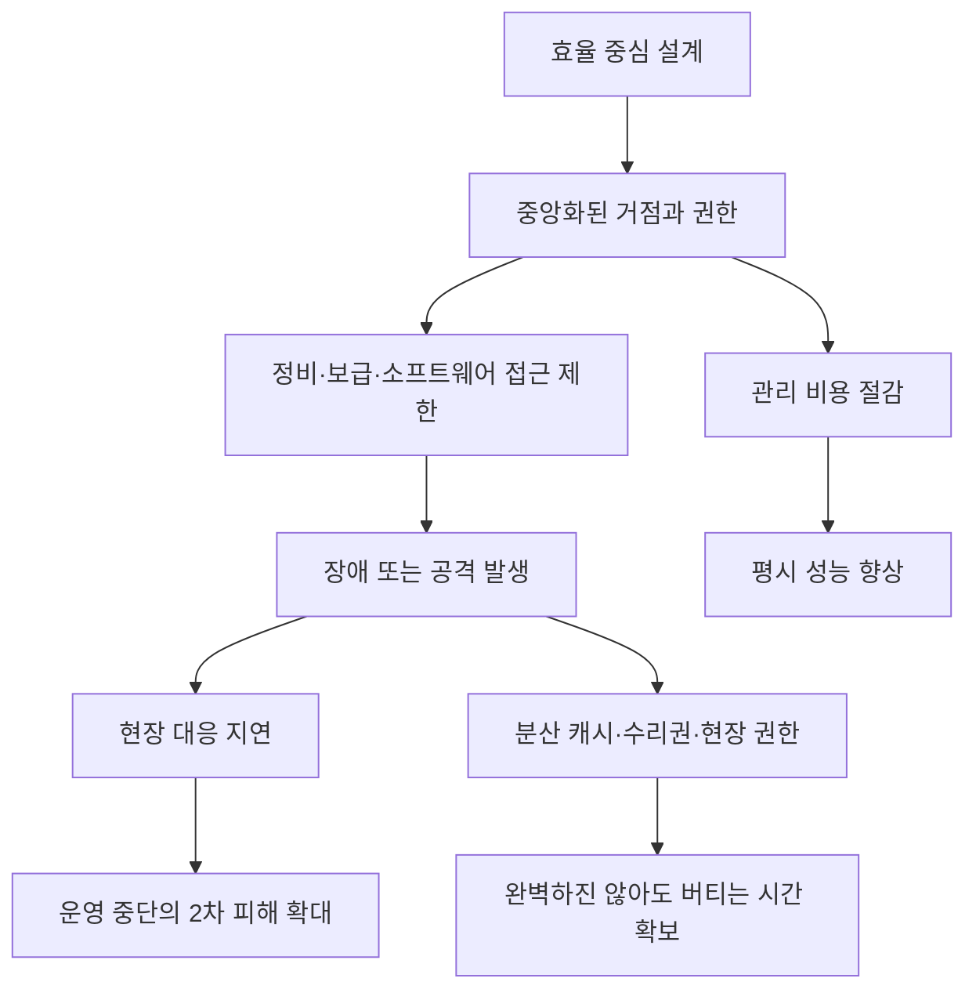

> 한 줄 요약: 군수망, 수리권, 물 공급 사이버 훈련은 서로 다른 뉴스처럼 보이지만 같은 질문을 던진다. 핵심 시스템을 효율 중심으로 잠그고 중앙화했을 때, 장애와 공격이 오면 누가 고칠 수 있는가.

## 무슨 일이 있었나

2026년 6월 3일, 미 육군사관학교 현대전연구소(MWI)에 Jonathan Buckland의 글이 올라왔다. 요지는 분명하다. 미 육군의 군수 체계는 지난 20년 동안 비교적 안전한 보급선, 계약업체 지원, 고정 전진기지에 맞춰 최적화됐고, 동급 경쟁국과의 대규모 전쟁에서는 그 효율성이 약점이 될 수 있다는 것이다.

이 글은 군수를 단순한 후방 업무로 보지 않는다. 연료(Class III), 탄약(Class V), 정비, 보급 거점, 수송 차량, 전자기 신호 관리가 모두 공격 표면이 된다고 본다. 우크라이나 전쟁에서 드론, 정밀타격, 상시 감시가 후방과 전방의 경계를 흐린 사례도 함께 다룬다.

확인된 사실은 이렇다. 러시아의 2022년 키이우 북부 장거리 차량 행렬은 연료, 정비, 이동로 문제로 멈춰 섰고, 우크라이나는 HIMARS 같은 장거리 정밀타격으로 러시아 탄약고와 철도 허브를 압박했다. MWI 글은 이 흐름을 미 육군 보급 구조에 대한 경고로 읽는다.

아직 추정에 가까운 부분도 있다. 다음 대규모 전쟁에서 미 육군 군수망이 실제로 어느 정도까지 무너질지, 자율 보급 차량이나 분산 캐시가 실전에서 얼마나 버틸지는 검증된 결과가 아니다. 다만 이 글이 커뮤니티에서 반응을 얻은 이유는 예측의 정확성보다 문제를 짚은 방향에 있다. 눈에 보이는 무기보다 보이지 않는 유지 능력이 전장의 승패를 가를 수 있다는 이야기이기 때문이다.

비슷한 질문은 다른 영역에서도 나온다. AP가 보도한 John Deere와 미국 FTC 합의는 농기계 소유자가 장비를 직접 수리하거나 독립 정비소를 이용할 권리를 다룬다. FTC와 애리조나, 일리노이, 미시간, 미네소타, 위스콘신 주 법무장관들은 2025년 1월 Deere를 상대로 반독점 소송을 제기했다. 쟁점은 농민과 독립 정비소가 필요한 소프트웨어와 수리 수단에 접근할 수 있느냐였다.

WIRED가 다룬 물 공급 사이버 워게임도 같은 축에 놓인다. 기사 속 시뮬레이션은 중국 연계 해킹 조직 Volt Typhoon을 가정하고, 미국 수천 개 수도 시설이 동시에 영향을 받을 때 어떤 2차 피해가 생기는지 다뤘다. 물이 끊기면 병원, 냉장 물류, 의약품 제조, 데이터센터 냉각까지 연쇄적으로 흔들린다.

세 뉴스의 표면은 다르다. 군대, 농기계, 수도 시설이다. 하지만 밑바닥 질문은 같다. 시스템이 멈췄을 때 현장에 있는 사람이 고칠 수 있는가, 아니면 중앙 권한과 공급망이 돌아올 때까지 기다려야 하는가.

## 왜 사람들이 반응했나

Hacker News에서 MWI 글에 댓글이 많이 붙은 배경은 군사사 자체보다 현실감이다. 개발자 커뮤니티는 보급망이라는 단어를 보면 의존성, 배포, 운영, 장애 대응을 떠올리기 쉽다. 겉으로는 전쟁 이야기지만, 구조는 클라우드 장애나 SaaS 잠금, 제조 장비 수리권 문제와 닮아 있다.

먼저 신뢰의 문제다. 중앙 시스템은 평시에는 편하다. 한 곳에서 관리하고, 표준 절차를 강제하고, 품질을 통제할 수 있다. 하지만 그 한 곳이 공격받거나 접근 불가능해지면 전체 조직이 같이 느려진다.

John Deere 수리권 논쟁도 여기에 붙는다. 농민 입장에서는 트랙터가 멈춘 순간부터 비용이 발생한다. 파종기나 수확기에 장비가 서면 몇 시간의 지연도 손실로 이어질 수 있다. 그런데 소프트웨어 접근 권한이 제조사와 공인 딜러에만 있으면, 소유자는 자기 장비 앞에서도 대기자가 된다.

다음은 권한의 문제다. 누가 고칠 수 있는가라는 질문은 단순한 소비자 권리 논쟁이 아니다. 시스템 운영에서 현장 권한을 얼마나 줄 것인가의 문제다. 중앙 통제는 오용과 품질 저하를 막을 수 있지만, 현장 대응력을 깎는다.

군수망도 마찬가지다. 보급 거점이 크고 절차가 정교할수록 평시 효율은 좋아진다. 그러나 드론과 정밀타격이 상시 감시하는 환경에서는 큰 거점이 곧 큰 표적이 된다. MWI 글이 말하는 분산형, 이동형, 저신호 보급망은 효율을 일부 포기하고 생존성을 사는 선택이다.

비용 계산도 문제다. 평시 회계에서는 여분의 부품, 중복 경로, 독립 정비 역량, 지역별 캐시가 낭비처럼 보인다. 사용하지 않는 자산이기 때문이다. 하지만 공격이나 장애가 발생하면 그 낭비처럼 보이던 것이 복구 시간 목표(RTO)를 낮추는 완충재가 된다.

WIRED의 수도 시설 워게임은 이 착시를 선명하게 보여준다. 물 공급 시스템은 수도꼭지만의 문제가 아니다. 병원 HVAC, 식품 냉장, 의약품 생산, 데이터센터 냉각이 뒤따라 흔들린다. 핵심 인프라의 장애 비용은 해당 산업 안에서만 계산하면 늘 과소평가된다.

규제 리스크도 있다. Deere 합의는 수리권이 더 이상 소비자 운동의 구호에만 머물지 않는다는 신호다. 소프트웨어로 물리 장비를 잠그는 방식이 경쟁 제한으로 해석될 수 있고, 독립 정비 생태계를 막는 구조가 법적 문제로 번질 수 있다. 제조사, 플랫폼, 클라우드 사업자 모두 이 흐름을 남의 일로 보기 어렵다.

마지막은 사용성의 문제다. 현장 사용자는 비상시에 완전한 기능보다 당장 필요한 기능을 원한다. 농기계는 일단 움직여야 하고, 군수 차량은 연료를 옮겨야 하며, 수도 시설은 완벽한 중앙 관제 없이도 최소 공급을 유지해야 한다. 반대로 공급자나 중앙 조직은 안전한 절차와 승인된 도구를 선호한다. 이 간극이 커뮤니티의 논쟁을 만든다.

## 내가 보는 핵심

이번 묶음의 핵심은 중앙화가 틀렸다는 말이 아니다. 중앙화는 많은 경우 더 안전하고 싸고 빠르다. 문제는 중앙화된 구조를 평시 효율 지표로만 평가할 때 생긴다.

이런 상황에서는 질문을 바꿔야 한다. 이 시스템이 얼마나 잘 돌아가느냐가 아니라, 일부가 끊겼을 때 얼마나 덜 망가지느냐를 봐야 한다. 군수망이라면 보급 거점 하나가 타격받아도 전방이 며칠을 버틸 수 있는가. 농기계라면 제조사 서버나 딜러 일정과 무관하게 필수 정비를 할 수 있는가. 수도 시설이라면 중앙 관제가 흔들려도 지역 운영자가 수동 절차로 안전 상태를 유지할 수 있는가.

이 관점에서 보면 수리권은 권리 담론이면서 동시에 복원력 설계다. 독립 정비소, 공개 진단 도구, 예비 부품 접근, 문서화된 수동 절차는 모두 장애 격리 장치다. 보안에서는 공격 표면을 넓힌다는 반론이 가능하다. 아무에게나 정비 권한을 주면 악용될 수 있고, 인증되지 않은 수리가 안전 문제를 만들 수도 있다.

그 반론은 가볍지 않다. 그래서 좋은 답은 완전 개방과 완전 잠금 사이에 있다. 예를 들어 권한 등급을 나누고, 진단 로그를 남기고, 안전 관련 기능과 일반 정비 기능을 분리하고, 오프라인 비상 모드를 제한적으로 제공하는 식이다. 핵심은 제조사나 중앙 조직이 사라져도 현장이 아무것도 못 하는 상태를 만들지 않는 것이다.

군수망의 분산 캐시도 같은 논리다. 모든 탄약과 연료를 큰 보급기지에 모아두면 관리가 쉽다. 하지만 감시와 타격도 쉬워진다. 반대로 작은 거점을 흩어두면 관리와 재고 추적이 어려워지고 손실 위험도 늘어난다. 그래도 전장이 투명해진다면, 관리 편의보다 생존성이 우선되는 구간이 생긴다.

현업에서 비슷한 고민을 하다 보면 장애 대응 문서가 실제 복구 능력과 다르다는 사실을 자주 보게 된다. 문서에는 대체 경로가 있지만 권한자가 휴가 중이면 실행되지 않는다. 백업은 있지만 복원 연습을 안 해서 시간이 얼마나 걸릴지 모른다. 온프레미스 폴백이 있지만 인증 서버가 클라우드에만 있어 로그인부터 막힌다.

이런 실패는 기술 부족보다 운영 상상력 부족에 가깝다. 우리는 정상 경로를 자동화하는 데 익숙하지만, 비정상 경로를 살아 있게 유지하는 데는 인색하다. 전쟁, 농기계 수리, 수도 시설 사이버 공격은 같은 말을 한다. 비상 경로는 사건이 터진 뒤 만들 수 없다.

## 앞으로 볼 기준

앞으로 비슷한 뉴스를 볼 때 먼저 볼 것은 소유권이 아니라 조작 가능성이다. 사용자가 돈을 내고 샀는가보다, 고장 났을 때 진단하고 우회하고 복구할 권한이 있는가가 더 실무적인 질문이다. 물리 장비도 소프트웨어에 묶이는 순간 플랫폼 정책의 영향을 받는다.

그다음은 중앙 의존성의 위치다. 제조사 서버, 공인 딜러 네트워크, 단일 클라우드 리전, 중앙 보급기지, 단일 인증 체계가 어디에 있는지 확인해야 한다. 평소에는 보이지 않던 의존성이 장애 시나리오에서는 병목이 된다.

오프라인 모드도 중요하다. 네트워크가 끊겨도 필수 기능이 동작하는가. 외부 API가 죽어도 현장 운영자가 최소한의 안전 조치를 할 수 있는가. GPS가 막히거나 통신이 감청되는 환경에서도 위치, 재고, 정비 상태를 다룰 수 있는가.

권한 위임은 미리 설계해야 한다. 비상 권한을 누구에게, 어떤 범위로, 어떤 로그와 책임 아래 줄 것인지 정해둬야 한다. 권한을 전혀 주지 않으면 복구가 늦고, 무제한으로 주면 보안과 안전이 무너진다. 이 균형은 정책 문구보다 제품 구조와 운영 훈련에 더 많이 좌우된다.

비용 계산 방식도 달라져야 한다. 평시 비용만 보면 분산 재고, 독립 정비, 예비 경로, 수동 절차 훈련은 손해처럼 보인다. 하지만 중단 비용을 포함하면 계산이 달라진다. 특히 물, 전력, 의료, 물류, 농업, 국방처럼 다른 시스템을 떠받치는 영역에서는 장애 비용이 바깥으로 번진다.

이번 이슈를 군사 칼럼 하나로 읽으면 좋은 글 하나를 읽고 끝난다. 하지만 John Deere 수리권 합의와 수도 시설 워게임까지 함께 놓으면 그림이 달라진다. 현대 시스템의 취약점은 최첨단 부품이 없어서가 아니라, 고장 난 순간 현장이 할 수 있는 일이 너무 적다는 데서 자주 드러난다.

앞으로 플랫폼과 인프라를 볼 때 던질 질문은 단순하다. 이 시스템은 평시에 얼마나 효율적인가. 그리고 약한 지점이 공격받았을 때, 현장은 자기 손으로 얼마나 오래 버틸 수 있는가.

## 참고 자료

- [선정 글감] [The glass backbone: Why the Army's logistics will break in the next war](https://mwi.westpoint.edu/the-glass-backbone-why-the-armys-logistics-will-break-in-the-next-war/) — Modern War Institute
- [관련] [John Deere owners will get the right to repair equipment under FTC settlement](https://apnews.com/article/john-deere-right-to-repair-agriculture-equipment-cb7514ffedb95c130a976af661f2bc02) — AP News
- [관련] [What Happens if China Hacks the US Water Supply? I Went to a Secret War Game to Find Out](https://www.wired.com/story/what-happens-if-china-hacks-the-us-water-supply-war-game-volt-typhoon/) — WIRED Security